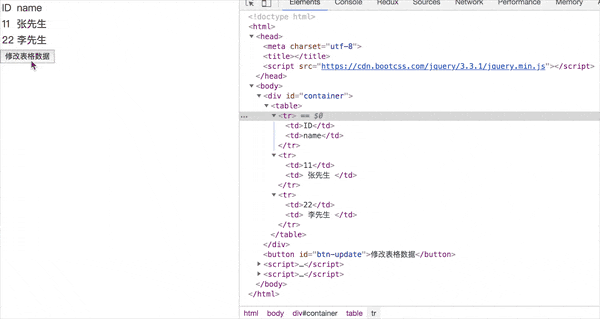
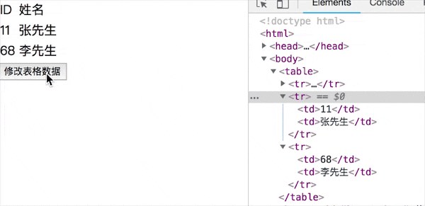

# 虚拟DOM

几个问题：
1. virtualDom是什么？为什么会存在vdom?
2. virtualDom如何应用，核心API有哪些？
3. diff算法的理解


#### virtualDom是什么？为什么会存在vdom?

> 虚拟Dom是用JS来模拟DOM结构，为什么会使用vdom是因为在浏览器里对DOM的操作是非常耗性能的，因此，对DOM的对比操作放在JS层来做，是为了提高效率。

举一个对表格操作的示例：

将以下数据以表格形式展示，数据修改表格也随之改动。

```js
var data = [
    {
        id: 1,
        name: '张先生'
    },
    {
        id: 2,
        name: '李先生'
    }
]
```

Jquery操作DOM实现

```html
<!DOCTYPE html>
<html>
<head>
    <meta charset="utf-8" />
    <title></title>
    <script src="https://cdn.bootcss.com/jquery/3.3.1/jquery.min.js"></script>
</head>
<body>
    <div id="container"></div>
    <button id="btn-update">修改表格数据</button>
    <script>
        // 数据
        var data = [
            {
                id: 11,
                name: '张先生'
            },
            {
                id: 22,
                name: '李先生'
            }
        ]

    </script>
    <script>
        // 渲染函数
        function render(data) {
            var container = $('#container');

            // 清空容器内容
            container.html('');

            // 拼接table
            var $table = $('<table>');
                $table.append($('<tr><td>ID</td><td>name</td></tr>'));
            
            for (var item of data) {
                $table.append($('<tr><td>' + item.id + '</td><td> ' + item.name + ' </td></tr>'));
            }

            // 渲染到页面
            container.append($table);
        }

        // 单击修改数据
        $('#btn-update').click(function() {
            data[1].id = Math.ceil(Math.random() * 100);

            // 在此渲染
            render(data);
        });

        // 初始化渲染
        render(data);
    </script>
</body>
</html>
```

运行结果

修改数据源之后，可以看到容器清空了重新进行了DOM渲染，只有id=22的表格变动了，其它是没变化了，但是还是全部进行了渲染，项目越复杂，影响将会越严重，解决办法可以看下面的vdom。

 

#### virtualDom如何应用，核心API有哪些？

> [snabbdom](https://github.com/snabbdom/snabbdom)是一个开源的vDom库，Vue2.0的实现也是参考了snabbdom库。

##### virtualDom应用流程:

1. 加载snabbdom模块
2. 初始化snabbdom模块，得到patch函数
3. 创建一个空的容器
4. 通过h函数创建一个虚拟DOM节点
5. patch函数有两种情况会对第一个参数进行判断是否为vnode
    * 一种是初始化的时候渲染将虚拟DOM节点渲染在一个空的容器里
    * 另外一种方法是，创建一个新的虚拟DOM节点，将其与已有的虚拟DOM进行对比，经过复杂的运算只对修改的部分进行更新


##### 核心API:

```h('标签名', {}, ['...子元素...']) ```，第一个参数标签名、第二个参数属性、第三个参数可以为一个数组表示为多个子元素。

```h('标签名', {}, '...') ```，第三个参数为一个字符串，表示只有一个子元素。

```patch(container, vnode)```，用于初次渲染

```patch(vnode, newVnode)```，用于再次渲染

看一个官方例子：

```js
var snabbdom = require('snabbdom');
// 初始化snabbdom得到patch函数
var patch = snabbdom.init([ // Init patch function with chosen modules
  require('snabbdom/modules/class').default, // makes it easy to toggle classes
  require('snabbdom/modules/props').default, // for setting properties on DOM elements
  require('snabbdom/modules/style').default, // handles styling on elements with support for animations
  require('snabbdom/modules/eventlisteners').default, // attaches event listeners
]);
var h = require('snabbdom/h').default; // helper function for creating vnodes

// 创建一个容器
var container = document.getElementById('container');

// h函数，创建一个虚拟DOM节点
var vnode = h('div#container.two.classes', {on: {click: someFn}}, [
  h('span', {style: {fontWeight: 'bold'}}, 'This is bold'),
  ' and this is just normal text',
  h('a', {props: {href: '/foo'}}, 'I\'ll take you places!')
]);

// patch的使用有两种方法，一种是初始化的时候渲染将虚拟DOM节点渲染在一个空的容器里
// Patch into empty DOM element – this modifies the DOM as a side effect
patch(container, vnode);

var newVnode = h('div#container.two.classes', {on: {click: anotherEventHandler}}, [
  h('span', {style: {fontWeight: 'normal', fontStyle: 'italic'}}, 'This is now italic type'),
  ' and this is still just normal text',
  h('a', {props: {href: '/bar'}}, 'I\'ll take you places!')
]);

// patch的另外一种方法是，创建一个新的虚拟DOM节点，将其与已有的虚拟DOM进行对比，经过复杂的运算只对修改的部分进行更新
// Second `patch` invocation
patch(vnode, newVnode); // Snabbdom efficiently updates the old view to the new state
```

基于上面例子采用```snabbdom```进行重写

```html
<!DOCTYPE html>
<html>
<head>
    <meta charset="utf-8" />
    <title></title>
    <script src="https://cdn.bootcss.com/snabbdom/0.7.3/snabbdom.js"></script>
    <script src="https://cdn.bootcss.com/snabbdom/0.7.3/snabbdom-class.js"></script>
    <script src="https://cdn.bootcss.com/snabbdom/0.7.3/snabbdom-props.js"></script>
    <script src="https://cdn.bootcss.com/snabbdom/0.7.3/snabbdom-style.js"></script>
    <script src="https://cdn.bootcss.com/snabbdom/0.7.3/snabbdom-eventlisteners.js"></script>
    <script src="https://cdn.bootcss.com/snabbdom/0.7.3/h.js"></script>
</head>
<body>
    <div id="container"></div>
    <button id="btn-update">修改表格数据</button>
    <script>
        // 数据
        var data = [
            { id: 11, name: '张先生'},
            { id: 22, name: '李先生'}
        ]

        // 表头
        data.unshift({ id: 'ID', name: '姓名' });
    </script>
    <script>
        var container = document.getElementById('container');
        var btnUpdate = document.getElementById('btn-update');
        var snabbdom = window.snabbdom;

        // 定义path函数
        var patch = snabbdom.init([
            'snabbdom-class',
            'snabbdom-props',
            'snabbdom-style',
            'snabbdom-eventlisteners'
        ])

        // 定义h函数
        var h = snabbdom.h;

        // 定义vnode
        var vnode;

        // 渲染函数
        function render(data) {
            var newVnode = h('table', {}, data.map(function(item) {
                var tds = [];

                for (var k in item) {
                    tds.push(h('td', {}, item[k].toString()));
                }

                return h('tr', {}, tds);
            }));

            if (vnode) {
                // re-render
                patch(vnode, newVnode);
            } else {
                // 初次渲染
                patch(container, newVnode);
            }

            // 每次更新，vnode进行重新赋值
            vnode = newVnode;
        }

        // 初次渲染
        render(data)

        // 修改数据在次渲染
        btnUpdate.addEventListener('click', function() {
            data[2].id = Math.ceil(Math.random() * 100);

            render(data);
        })
    </script>
</body>
</html>
```

运行效果如下：

 

看以上运行效果，只对姓名是李先生的id那列进行了修改，可以回头看下Jquery操作的例子，这次只对我们修改部分进行了替换，并不是整个DOM重新渲染。

#### diff算法

在浏览器里Dom操作是昂贵的，因此尽量减少对Dom的操作，找出Dom更新的节点进行更新，其它部分不更新，那么找出Dom更新节点的过程就需要用到diff算法。

在Linux里面使用diff可以比较两个文件的不同之处参见语法: ``` diff 文件1 文件2 ```，因此diff算法并不是React或Vue等提出的，在我们身边应用已久。

diff实现，patch(container, vnode) path(vnode, newVnode)

核心逻辑，createElement和updateChildren