# 数据结构知否知否系列之 — 线性表篇（顺序表、链表）

线性表是由 n 个数据元素组成的有限序列，也是最基本、最简单、最常用的一种数据结构。

## 快速导航

- [认识线性表](#认识线性表)
- [顺序表](#顺序表)
- [链表](#链表)
    - [单向链表](#单向链表)
    - [双向链表](#双向链表)
    - [循环链表](#循环链表)

## 认识线性表

根据线性表的定义，可得出几个关键词：**n 个数据元素**、**有限序列**，也就是说它是有长度限制的且元素之间是有序的，在多个元素之间，第一个元素无前驱，最后一个元素无后继，中间元素有且只有一个前驱和后继。

举一个与大家都息息相关的十二生肖例子，以“子（鼠）” 开头，“亥（猪）”结尾，其中间的每个生肖也都有其前驱和后继，图例如下所示：


下面再介绍一个**复杂的线性表，其一个元素由多个数据项构成**，例如，我们的班级名单，含学生的学号、姓名、年龄、性别等信息，图例如下所示：


**线性表两种存储结构**

线性表有两种存储结构，一种为顺序结构存储，称为**顺序表**；另一种为链式形式存储，称为**链表**，链表根据指针域的不同，链表分为单向链表、双向链表、循环链表等。详细的内容会在后面展开讲解。

## 顺序表

顺序表是在计算机内存中以数组的形式保存的线性表，是指用一组地址连续的存储单元依次存储数据元素的线性结构。

在线性表里顺序表相对更容易些，因此也先从顺序表讲起，通过实现编码的方式带着大家从零开始实现一个顺序表，网上很多教程大多都是以 C 语言为例子，其实现思想都是相通的，这里采用 JavaScript 编码实现。

**实现步骤**

1. Constructor(capacity): 初始化顺序表内存空间，设定顺序表的容量
2. isEmpty(): 检查顺序表是否为空，是否有元素
3. isOverflow(): 检查顺序表空间是否已满
4. getElement(i): 返回顺序表中第 i 个数据元素的值
5. locateElement(e): 返回顺序表中第 1 个与 e 满足关系的元素，不存在，则返回值为 -1
6. priorElement(e): 在顺序表中返回指定元素的前驱
7. nextElement(e): 在顺序表中返回指定元素的后继
8. listInsert(i, e): 在顺序表中第 i 个位置之前插入新的数据元素 e
9. listDelete(i): 删除顺序表的第 i 个数据元素，并返回其值
10. clear(): 清空顺序表元素，内存空间还是保留的
11. destroy(): 销毁顺序表，同时内存也要回收（通常高级语言都会有自动回收机制，在 C 语言中这时就需要手动回收）
12. traversing(): 遍历输出顺序表元素

**初始化顺序表空间**

在构造函数的 constructor 里进行声明，传入 capacity 初始化顺序表空间同时初始化顺序表的元素长度（length）为 0。

```js
/**
 * 
 * @param { Number } capacity 栈空间容量
 */
constructor(capacity) {
    if (!capacity) {
        throw new Error('The capacity field is required!');
    }

    this.capacity = capacity;
    this.list = new Array(capacity);
    this.length = 0; // 初始化顺序表元素长度
}
```

**顺序表是否为空检查**

定义 isEmpty() 方法返回顺序表是否为空，根据 length 顺序表元素进行判断。

```js
isEmpty() {
    return this.length === 0 ? true : false;
}
```

**顺序表是否溢出检查**

定义 isOverflow() 方法返回顺序表空间是否溢出，根据顺序表元素长度和初始化的空间容量进行判断。

```js
isOverflow() {
    return this.length === this.capacity;
}
```

**查找指定位置元素**

返回顺序表中第 i 个数据元素的值

```js
getElement(i) {
    if (i < 0 || i > this.length) {
        return false;
    }

    return this.list[i];
}
```

**查找元素的第一个位置索引**

返回顺序表中第 1 个与 e 满足关系的元素，存在则返回其索引值；不存在，则返回值为 -1

```js
locateElement(e) {
    for (let i=0; i<this.length; i++) {
        if (this.list[i] === e) {
            return i;
        }
    }

    return -1;
}
```

**在顺序表中返回指定元素的前驱**

这里就用到了上面定义的 locateElement 函数，先找到元素对应的索引位置，如果前驱就取前一个位置，后继就取后一个位置，在这之前先校验当前元素的索引位置是否存在合法。

```js
priorElement(e) {
    const i = this.locateElement(e);

    if (i === -1) {
        return false;
    }

    if (i === 0) { // 没有前驱
        return false;
    }

    return this.list[i - 1]; // 返回前驱（即前一个元素）
}
```

**在顺序表中返回指定元素的后继**

```js
nextElement(e) {
    const i = this.locateElement(e);

    if (i === -1) {
        return false;
    }

    if (i === this.length - 1) { // 为最后一个元素，没有后继
        return false;
    }

    return this.list[i + 1]; // 返回后继（即后 一个元素）
}
```

**插入元素**

在顺序表中第 i 个位置之前插入新的数据元素 e，在插入之前先进行元素位置后移，插入之后顺序表元素的长度要加 1。

举个例子，我们去火车站取票，恰逢人多大家都在排队，突然来一个美女或者帅哥对你说我的车次马上要开车了，你可能同意了，此时你的位置及你后面的童鞋就要后移一位了，也许你会听到一些声音，怎么回事呀？怎么插队了呀，其实后面的人有的也不清楚什么原因 “233”，看一个图


算法实现如下：

```js
listInsert(i, e) {
    if (i < 0 || i > this.length) {
        return false; // 不合法的 i 值
    }

    for (let k=this.length; k>=i; k--) { // 元素位置后移 1 位
        this.list[k + 1] = this.list[k];
    }

    this.list[i] = e;
    this.length++;

    return true;
}
```

**删除元素**

删除顺序表的第 i 个数据元素，并返回其值，与插入相反，需要将删除位置之后的元素进行前移，最后将顺序表元素长度减 1。

同样以火车站取票的例子说明，如果大家都正在排队取票，突然你前面一个妹子有急事临时走了，那么你及你后面的童鞋就要前进一步，图例如下所示：


算法实现如下：

```js
 listDelete(i) {
    if (i < 0 || i >= this.length) {
        return false; // 不合法的 i 值
    }

    const e = this.list[i];

    for (let j=i+1; j<this.length; j++) { // 元素位置前移 1 位
        this.list[j - 1] = this.list[j];
    }

    this.length--;

    return e;
}
```

**清除顺序表元素**

这里有几种实现，你也可以把顺序表的空间进行初始化，或者把 length 栈位置设为 0 也可。

```js
clear() {
    this.length = 0;
}
```

**顺序表销毁**

在一些高级语言中都会有垃圾回收机制，例如 JS 中只要当前对象不再持有引用，下次垃圾回收来临时将会被回收。不清楚的可以看看我之前写的 [Node.js 内存管理和 V8 垃圾回收机制](https://mp.weixin.qq.com/s?__biz=MzIyNDU2NTc5Mw==&mid=2247483715&idx=1&sn=00600d07ce4fd2b465d6cc7692d050f0&chksm=e80c4e0ddf7bc71bf22dca61b945eb4ed6dae9b4a3ec8d437ff37212740e276965b7597de413&token=1574280773&lang=zh_CN#rd) 

```js
destroy() {
    this.list = null;
}
```

**顺序表元素遍历**

定义 traversing() 方法对顺序表的元素进行遍历输出。

```js
traversing(isBottom = false){
    const arr = [];

    for (let i=0; i < this.length; i++) {
        arr.push(this.list[i])
    }

    console.log(arr.join('|'));
}
```

**做一些测试**

做下测试分别看下插入、删除、遍历等操作，其它的功能大家在练习的过程中可自行实践。

```js
const [e1, e2, e3, e4, e5] = [3, 6, 1, 8, 7];
const list = new SequenceTable(10);
list.listInsert(0, e1);
list.listInsert(1, e2);
list.listInsert(2, e3);
list.listInsert(3, e4);
list.listInsert(1, e5);
list.traversing(); // 3|7|6|1|8

console.log(list.priorElement(3) ? '有前驱' : '无前驱'); // 无前驱
console.log(list.priorElement(6) ? '有前驱' : '无前驱'); // 有前驱
console.log(list.nextElement(3) ? '有后继' : '无后继'); // 有后继
console.log(list.nextElement(8) ? '有后继' : '无后继'); // 无后继

list.listDelete(0); // 3
list.traversing(); // 7|6|1|8
```

顺序表的运行机制源码地址如下：

```
https://github.com/Q-Angelo/project-training/tree/master/algorithm/sequence-table.js
```

**顺序表优缺点总结**

插入、删除元素如果是在最后一个位置时间复杂度为 O(1)，如果是在第一个（或其它非最后一个）位置，此时时间复杂度为 O(1)，就要移动所有的元素向后或向前，时间复杂度为 O(n)，当顺序表的长度越大，插入和删除操作可能就需要大量的移动操作。

对于存取操作，可以快速存取顺序表中任意位置元素，时间复杂度为 O(1)。

## 链表

链表（Linked list）是一种常见的基础数据结构，是一种线性表，但是并不会按线性的顺序存储数据，而是在每一个节点里存到下一个节点的指针(Pointer)。由于不必须按顺序存储，**链表在插入的时候可以达到O(1)的复杂度**，比另一种线性表顺序表快得多，但是**链表查找一个节点或者访问特定编号的节点则需要O(n)的时间，而顺序表相应的时间复杂度分别是O(logn)和O(1)**。

使用链表结构可以克服数组链表需要预先知道数据大小的缺点，链表结构可以充分利用计算机内存空间，实现灵活的内存动态管理。但是链表失去了数组随机读取的优点，同时链表由于增加了结点的指针域，空间开销比较大。

### 单向链表

链表中最简单的一种是单向链表，它包含两个域，一个信息域和一个指针域。这个链接指向列表中的下一个节点，而最后一个节点则指向一个空值，图例如下：

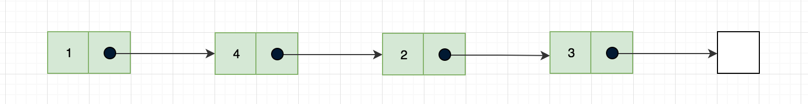

除了单向链表之外还有双向链表、循环链表，在学习这些之前先从单向链表开始，因此，这里会完整讲解单向链表的实现，其它的几种后续都会在这个基础之上进行改造。

**单向链表实现步骤**

1. Constructor(): 构造函数，初始化
2. isEmpty(): 检查链表是否为空，是否有元素
3. length(): 获取链表长度
4. getElement(i): 返回链表中第 i 个数据元素的值
5. locateElement(e): 返回链表中第 1 个与 e 满足关系的元素，不存在，则返回值为 -1
6. priorElement(e): 在链表中返回指定元素的前驱
7. nextElement(e): 在链表中返回指定元素的后继
8. insertTail(e): 链表尾部插入元素
9. insert(i, e): 在链表中第 i 个位置之前插入新的数据元素 e
10. delete(i): 删除链表的第 i 个数据元素，并返回其值
11. traversing(): 遍历输出链表元素

**初始化链表**

在构造函数的 constructor 里进行声明，无需传入参数，分别对以下几个属性和方法做了声明：

* node: 定义 node 方法，它包含一个 element 属性，即添加到列表的值，及另一个 next 属性，指向列表中下一个节点项的指针
* length: 链表元素长度
* head: 在 head 变量中存储第一个节点的引用

当我们实例化一个 SingleList 对象时 head 指向为 null 及 length 默认等于 0，代码示例如下：

```js
class SingleList {
    constructor() {
        this.node = function(element) {
            return {
                element,
                next: null, 
            }
        };

        this.length = 0;
        this.head = null;
    }
}
```

**链表是否为空检查**

定义 isEmpty() 方法返回链表是否为空，根据链表的 length 进行判断。

```js
isEmpty() {
    return this.length === 0 ? true : false;
}
```

**返回链表长度**

同样使用链表的 length 即可

```js
length() {
    return this.length;
}
```

**链表尾部插入元素**

链表 SingleList 尾部增加元素，需要考虑两种情况：一种是链表（head）为空，直接赋值添加第一个元素，另一种情况就是链表不为空，找到链表最后一个节点在其尾部增加新的节点（node）即可。

第一种情况，假设我们插入一个元素 1，此时由于链表为空，就会走到（行 {2}）代码处，示意图如下：

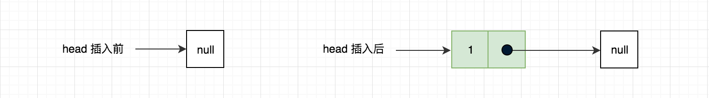

第二种情况，假设我们再插入一个元素 2，此时链表头部 head 指向不为空，走到（行 {3}）代码处，通过 while 循环直到找到最后一个节点，也就是当 current.next = null 时说明已经达到链表尾部了，接下来我们要做的就是将 current.next 指向想要添加到链表的节点，示意图如下：

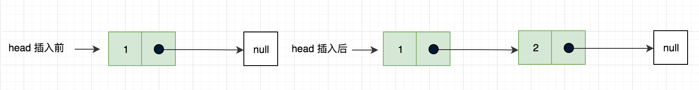

算法实现如下：

```js
insertTail(e) {
    let node = this.node(e); // {1}
    let current;

    if (this.head === null) { // 列表中还没有元素 {2}
        this.head = node;
    } else { // {3}
        current = this.head;

        while (current.next) { // 下个节点存在
            current = current.next;
        }

        current.next = node;
    }

    this.length++;
}
```

**链表指定位置插入元素**

实现链表的 insert 方法，在任意位置插入数据，同样分为两种情况，以下一一进行介绍。

如果是链表的第一个位置，很简单看代码块（行 {1}）处，将 node.next 设置为 current（链表中的第一个元素），此时的 node 就是我们想要的值，接下来将 node 的引用改为 head（**node、head 这两个变量此时在堆内存中的地址是相同的**），示意图如下所示：

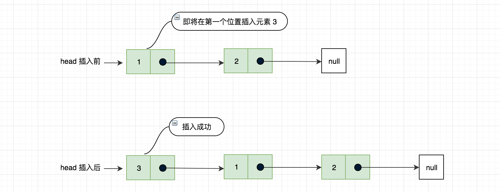

如果要插入的元素不是链表第一个位置，通过 for 循环，从链表的第一个位置开始循环，定位到要插入的目标位置，for 循环中的变量 previous（行 {3}）是对想要插入新元素位置之前的一个对象引用，current（行 {4}）是对想要插入新元素位置之后的一个对象引用，清楚这个关系之后开始链接，我们本次要插入的节点 node.next 与 current（行 {5}）进行链接，之后 previous.next 指向 node（行 {6}）。

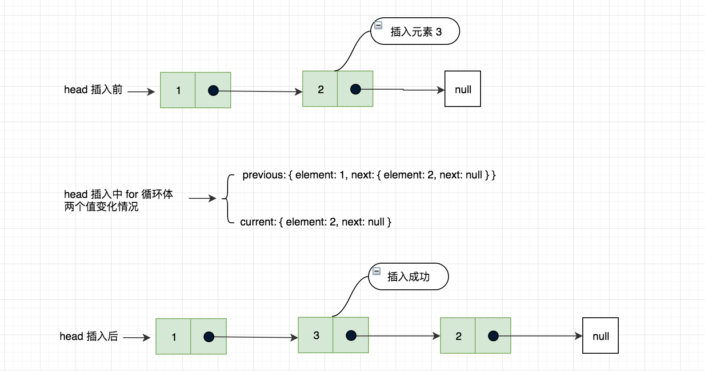

算法实现如下：

```js
/**
 * 在任意位置插入元素
 * @param { Number } i 插入的元素位置
 * @param { * } e 插入的元素
 */
insert(i, e) {
    if (i < 0 || i > this.length) {
        return false;
    }
    
    let node = this.node(e);
    let current = this.head;
    let previous;

    if (i === 0) { // {1}
        node.next = current;
        this.head = node;
    } else { // {2}
        for (let k=0; k<i; k++) {
            previous = current; // {3}
            current = current.next; // 保存当前节点的下一个节点 {4}
        }

        node.next = current; // {5}
        previous.next = node; // 注意，这块涉及到对象的引用关系 {6}
    }

    this.length++;
    return true;
}
```

**移除指定位置的元素**

定义 delete(i) 方法实现移除任意位置的元素，同样也有两种情况，第一种就是移除第一个元素（行 {1}）处，第二种就是移除第一个元素以外的任一元素，通过 for 循环，从链表的第一个位置开始循环，定位到要删除的目标位置，for 循环中的变量 previous（行 {2}）是对想要删除元素位置之前的一个对象引用，current（行 {3}）是对想要删除元素位置之后的一个对象引用，要从列表中移除元素，需要做的就是将 previous.next 与 current.next 进行链接，那么当前元素会被丢弃于计算机内存中，等待垃圾回收器回收处理。

> 关于内存管理和垃圾回收机制的知识可参考文章 [Node.js 内存管理和 V8 垃圾回收机制](https://mp.weixin.qq.com/s/sA1YNQXib67A4RVUHQ6vGw)

通过一张图，来看下删除一个元素的过程：

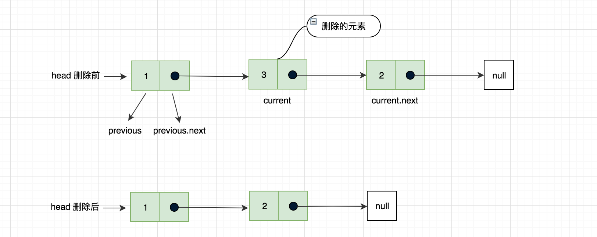

算法实现如下：

```js
delete(i) {
    // 要删除的元素位置不能超过链表的最后一位
    if (i < 0 || i >= this.length) {
        return false;
    }

    let current = this.head;
    let previous;

    if (i === 0) { // {1}
        this.head = current.next;
    } else {
        for (let k=0; k<i; k++) {
            previous = current; // {2}
            current = current.next; // {3}
        }

        previous.next = current.next;
    }

    this.length--;
    return current.element;
}
```

**获取指定位置元素**

定义 getElement(i) 方法获取指定位置元素，类似于 delete 方法可做参考，在锁定位置目标后，返回当前的元素即可 previous.element。

```js
getElement(i) {
    if (i < 0 || i >= this.length) {
        return false;
    }

    let current = this.head;
    let previous;

    for (let k=0; k<=i; k++) {
        previous = current
        current = current.next;
    }

    return previous.element;
}
```

**查找元素的第一个位置索引**

返回链表中第 1 个与 e 满足关系的元素，存在则返回其索引值；不存在，则返回值为 -1

```js
locateElement(e) {
    let current = this.head;
    let index = 0;

    while (current.next) { // 下个节点存在
        if (index === 0) {
            if (current.element === e) {
                return index;
            }
        }

        current = current.next;
        index++;

        if (current.element === e) {
            return index;
        }
    }

    return -1;
}
```

**在链表中返回指定元素的前驱**

如果是第一个元素，是没有前驱的直接返回 false，否则的话，需要遍历链表，定位到目标元素返回其前驱即当前元素的上一个元素，如果在链表中没有找到，则返回 false。

```js
priorElement(e) {
    let current = this.head;
    let previous;

    if (current.element === e) { // 第 0 个节点
        return false; // 没有前驱
    } else {
        while (current.next) { // 下个节点存在
            previous = current;
            current = current.next;

            if (current.element === e) {
                return previous.element;
            }
        }
    }

    return false;
}
```

**在链表中返回指定元素的后继**

```js
nextElement(e) {
    let current = this.head;

    while (current.next) { // 下个节点存在
        if (current.element === e) {
            return current.next.element;
        }

        current = current.next;
    }

    return false;
}
```

**链表元素遍历**

定义 traversing() 方法对链表的元素进行遍历输出，主要是将 elment 转为字符串拼接输出。

```js
traversing(){
    //console.log(JSON.stringify(this.head));
    let current = this.head,
    string = '';

    while (current) {
        string += current.element + ' ';
        current = current.next;
    }

    console.log(string);

    return string;
}
```

**单向链表与顺序表优缺点比较**
* **查找**：单向链表时间复杂度为 O(n)；顺序表时间复杂度为 O(1)
* **插入与删除**：单向链表时间复杂度为 O(1)；顺序表需要移动元素时间复杂度为 O(n)
* **空间性能**：单向链表无需预先分配存储空间；顺序表需要预先分配内存空间，大了浪费，小了易溢出

单向链表源码地址如下：

```
https://github.com/Q-Angelo/project-training/tree/master/algorithm/single-list.js
```

### 双向链表

双向链表也叫双链表。与单向链表的区别是双向链表中不仅有指向后一个节点的指针，还有指向前一个节点的指针。这样可以从任何一个节点访问前一个节点，当然也可以访问后一个节点，以至整个链表。

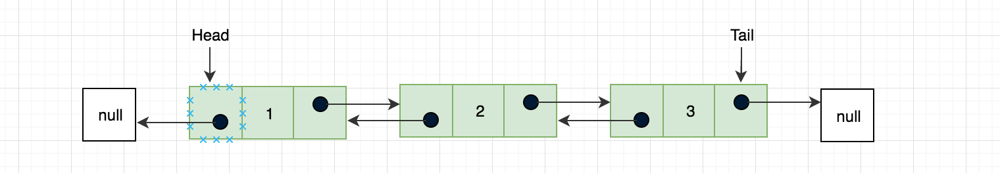

双向链表是基于单向链表的扩展，很多操作与单向链表还是相同的，在构造函数中我们要增加 prev 指向前一个元素的指针和 tail 用来保存最后一个元素的引用，可以从尾到头反向查找，重点修改插入、删除方法。

**修改初始化链表**

```js
constructor() {
    this.node = function(element) {
        return {
            element,
            next: null, 
            prev: null, // 新增
        }
    };

    this.length = 0;
    this.head = null;
    this.tail = null; // 新增
}
```

**修改链表指定位置插入元素**

在双向链表中我们需要控制 prev 和 next 两个指针，比单向链表要复杂些，这里可能会出现三种情况：

***情况一：链表头部添加***

如果是在链表的第一个位置插入元素，当 head 头部指针为 null 时，将 head 和 tail 都指向 node 节点即可，如果 head 头部节点不为空，将 node.next 的下一个元素为 current，那么同样 current 的上个元素就为 node（current.prev = node），node 就为第一个元素且 prev（node.prev = null）为空，最后我们将 head 指向 node。

假设我们当前链表仅有一个元素 b，我们要在第一个位置插入元素 a，图例如下：

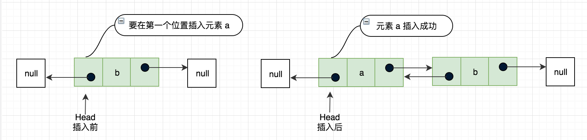

***情况二：链表尾部添加***

这又是一种特殊的情况链表尾部添加，这时候我们要改变 current 的指向为 tail（引用最后一个元素），开始链接把 current 的 next 指向我们要添加的节点 node，同样 node 的上个节点 prev 就为 current，最后我们将 tail 指向 node。

继续上面的例子，我们在链表尾部在增加一个元素 d

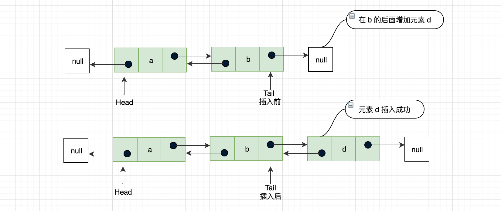

***情况三：非链表头部、尾部的任意位置添加***

这个和单向链表插入那块是一样的思路，不清楚的，在回头去看下，只不过增加了节点的向前一个元素的引用，current.prev 指向 node，node.prev 指向 previous。

继续上面的例子，在元素 d 的位置插入元素 c，那么 d 就会变成 c 的下一个元素，图例如下：

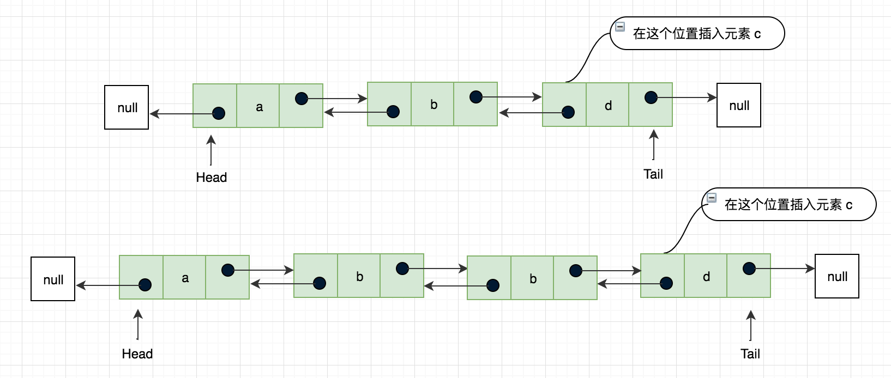

算法实现如下：

```js
insert(i, e) {
    if (i < 0 || i > this.length) {
        return false;
    }
    
    let node = this.node(e);
    let current = this.head;
    let previous;

    if (i === 0) { // 有修改
        if (current) {
            node.next = current;
            current.prev = node;
            this.head = node;
        } else {
            this.head = this.tail = node;
        }
    } else if (i === this.length) { // 新增加
        current = this.tail;
        current.next = node;
        node.prev = current;
        this.tail = node;
    } else {
        for (let k=0; k<i; k++) {
            previous = current;
            current = current.next; // 保存当前节点的下一个节点
        }

        node.next = current;
        previous.next = node; // 注意，这块涉及到对象的引用关系

        current.prev = node; // 新增加
        node.prev = previous; // 新增加
    }

    this.length++;
    return true;
}
```

**移除链表元素**

双向链表中移除元素同插入一样，需要考虑三种情况，下面分别看下各自实现：

***情况一：链表头部移除***

current 是链表中第一个元素的引用，对于移除第一个元素，我们让 head = current 的下一个元素，即 current.next，这在单向链表中就已经完成了，但是双向链表我们还要修改节点的上一个指针域，再次判断当前链表长度是否等于 1，如果仅有一个元素，删除之后链表就为空了，那么 tail 也要置为 null，如果不是一个元素，将 head 的 prev 设置为 null，图例如下所示：

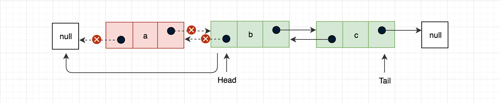

***情况二：链表尾部移除***

改变 current 的指向为 tail（引用最后一个元素），在这是 tail 的引用为 current 的上个元素，即最后一个元素的前一个元素，最后再将 tail 的下一个元素 next 设置为 null，图例如下所示：

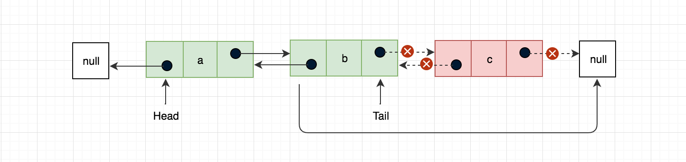

***情况三：链表尾部移除***

这个和单向链表删除那块是一样的思路，不清楚的，在回头去看下，只增加了 current.next.prev = previous 当前节点的下一个节点的 prev 指针域等于当前节点的上一个节点 previous，图例如下所示：

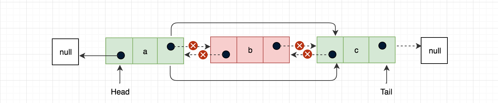

算法实现如下：

```js
delete(i) {
    // 要删除的元素位置不能超过链表的最后一位
    if (i < 0 || i >= this.length) {
        return false;
    }

    let current = this.head;
    let previous;

    if (i === 0) {
        this.head = current.next;

        if (this.length === 1) {
            this.tail = null; 
        } else {
            this.head.prev = null;
        }
    } else if (i === this.length -1) {
        current = this.tail;
        this.tail = current.prev;
        this.tail.next = null;
    } else {
        for (let k=0; k<i; k++) {
            previous = current;
            current = current.next;
        }

        previous.next = current.next;
        current.next.prev = previous; // 新增加
    }

    this.length--;
    return current.element;
}
```

双向链表源码地址如下：

```
https://github.com/Q-Angelo/project-training/tree/master/algorithm/doubly-linked-list.js
```

### 循环链表

在单向链表和双向链表中，如果一个节点没有前驱或后继该节点的指针域就指向为 null，循环链表中最后一个节点 tail.next 不会指向 null 而是指向第一个节点 head，同样双向引用中 head.prev 也会指向 tail 元素，如下图所示：

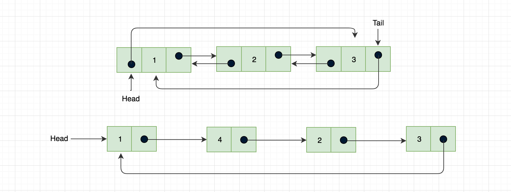

**可以看出循环链表可以将整个链表形成一个环，既可以向单向链表那样只有单向引用，也可以向双向链表那样拥有双向引用。**

以下基于单向链表一节的代码进行改造

**尾部插入元素**

对于环形链表的节点插入与单向链表的方式不同，如果当前节点为空，当前节点的 next 值不指向为 null，指向 head。如果头部节点不为空，遍历到尾部节点，注意这里不能在用 current.next 为空进行判断了，否则会进入死循环，我们需要判断当前节点的下个节点是否等于头部节点，算法实现如下所示：

```js
insertTail(e) {
    let node = this.node(e);
    let current;

    if (this.head === null) { // 列表中还没有元素
        this.head = node;
        node.next = this.head; // 新增
    } else {
        current = this.head;

        while (current.next !== this.head) { // 下个节点存在
            current = current.next;
        }

        current.next = node;
        node.next = this.head; // 新增，尾节点指向头节点
    }

    this.length++;
}

```
**链表任意位置插入元素**

实现同链表尾部插入相似，注意：将新节点插入在原链表头部之前，首先，要将新节点的指针指向原链表头节点，并遍历整个链表找到链表尾部，将链表尾部指针指向新增节点，图例如下：

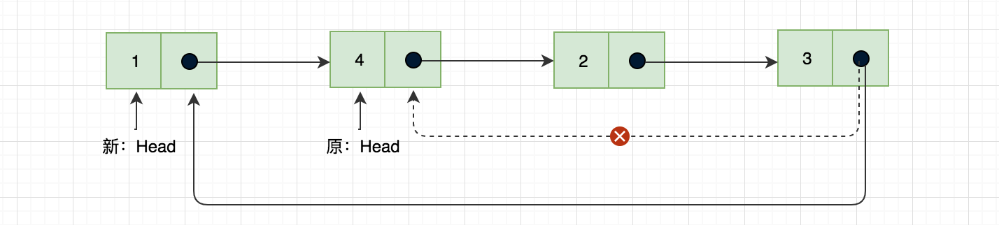

算法实现如下所示：

```js
insert(i, e) {
    if (i < 0 || i > this.length) {
        return false;
    }
    
    let node = this.node(e);
    let current = this.head;
    let previous;

    if (i === 0) {
        if (this.head === null) { // 新增
            this.head = node;
            node.next = this.head;
        } else {
            node.next = current;
            const lastElement = this.getNodeAt(this.length - 1);
            this.head = node;
            // 新增，更新最后一个元素的头部引用
            lastElement.next = this.head
        }
    } else {
        for (let k=0; k<i; k++) {
            previous = current;
            current = current.next; // 保存当前节点的下一个节
        }

        node.next = current;
        previous.next = node; // 注意，这块涉及到对象的引用关系
    }

    this.length++;
    return true;
}
```

**移除指定位置元素**

与之前不同的是，如果删除第一个节点，先判断链表在仅有一个节点的情况下直接将 head 置为 null，否则不仅仅只有一个节点的情况下，首先将链表头指针移动到下一个节点，同时将最后一个节点的指针指向新的链表头部


算法实现如下所示：

```js
delete(i) {
    // 要删除的元素位置不能超过链表的最后一位
    if (i < 0 || i >= this.length) {
        return false;
    }

    let current = this.head;
    let previous;

    if (i === 0) {
        if (this.length === 1) {
            this.head = null;
        } else {
            const lastElement = this.getNodeAt(this.length - 1);
            this.head = current.next;
            lastElement.next = this.head;
            current = lastElement;
        }
    } else {
        for (let k=0; k<i; k++) {
            previous = current;
            current = current.next;
        }

        previous.next = current.next;
    }

    this.length--;
    return current.element;
}
```

最后在遍历的时候也要注意，不能在根据 current.next 是否为空来判断链表是否结束，可以根据链表元素长度或者 current.next 是否等于头节点来判断，本节源码实现链接如下所示：

```
https://github.com/Q-Angelo/project-training/tree/master/algorithm/circular-linked-list.js
```

## 总结

本节主要讲解的是线性表，从顺序表->单向链表->双向链表->循环链表，这个过程也是循序渐进的，前两个讲的很详细，双向链表与循环链表通过与前两个不同的地方进行比较针对性的进行了讲解，另外学习线性表也是学习其它数据结构的基础，数据结构特别是涉及到一些实现算法的时候，有时候并不是看一遍就能理解的，总之**多实践**、**多思考**。

## Reference

* [https://zh.wikipedia.org/wiki/线性表](https://zh.wikipedia.org/wiki/线性表)
* [学习JavaScript数据结构与算法（第2版）](https://book.douban.com/subject/27129352/)
* [大话数据结构](https://book.douban.com/subject/6424904/)