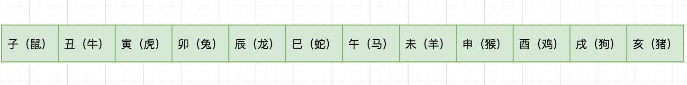
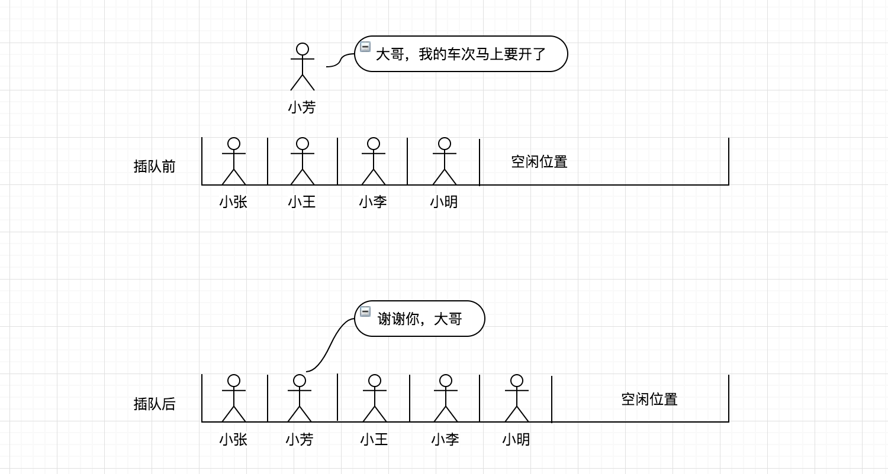
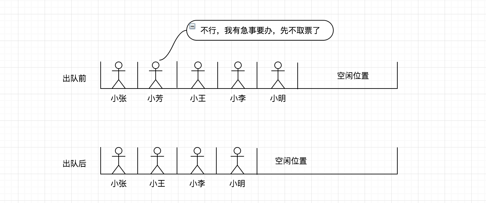

# 数据结构知否知否系列之 — 线性表（顺序表与链表）篇

线性表是由 n 个数据元素组成的有限序列，也是最基本、最简单、最常用的一种数据结构。

## 认识线性表

根据线性表的定义，可得出几个关键词：**n 个数据元素**、**有限序列**，也就是说它是有长度限制的且元素之间是有序的，在多个元素之间，第一个元素无前驱，最后一个元素无后继，中间元素有且只有一个前驱和后继。

举一个与大家都息息相关的十二生肖例子，以“子（鼠）” 开头，“亥（猪）”结尾，其中间的每个生肖也都有其前驱和后继，图例如下所示：



下面再介绍一个**复杂的线性表，其一个元素由多个数据项构成**，例如，我们的班级名单，含学生的学号、姓名、年龄、性别等信息，图例如下所示：


**线性表两种存储结构**

线性表有两种存储结构，一种为顺序结构存储，称为**顺序表**；另一种为链式形式存储，称为**链表**，链表根据指针域的不同，链表分为单向链表、双向链表、循环链表等。详细的内容会在后面展开讲解。

## 顺序表

顺序表是在计算机内存中以数组的形式保存的线性表，是指用一组地址连续的存储单元依次存储数据元素的线性结构。

在线性表里顺序表相对更容易些，因此也先从顺序表讲起，通过实现编码的方式带着大家从零开始实现一个顺序表，网上很多教程大多都是以 C 语言为例子，其实现思想都是相通的，这里采用 JavaScript 编码实现。

**实现步骤**

1. Constructor(capacity): 初始化顺序表内存空间，设定顺序表的容量
2. isEmpty(): 检查顺序表是否为空，是否有元素
3. isOverflow(): 检查顺序表空间是否已满
4. getElement(i): 返回顺序表中第 i 个数据元素的值
5. locateElement(e): 返回顺序表中第 1 个与 e 满足关系的元素，不存在，则返回值为 -1
6. priorElement(e): 在顺序表中返回指定元素的前驱
7. nextElement(e): 在顺序表中返回指定元素的后继
8. listInsert(i, e): 在顺序表中第 i 个位置之前插入新的数据元素 e
9. listDelete(i): 删除顺序表的第 i 个数据元素，并返回其值
10. clear(): 清空顺序表元素，内存空间还是保留的
11. destroy(): 销毁顺序表，同时内存也要回收（通常高级语言都会有自动回收机制，在 C 语言中这时就需要手动回收）
12. traversing(): 遍历输出顺序表元素

**初始化顺序表空间**

在构造函数的 constructor 里进行声明，传入 capacity 初始化顺序表空间同时初始化顺序表的元素长度（length）为 0。

```js
/**
 * 
 * @param { Number } capacity 栈空间容量
 */
constructor(capacity) {
    if (!capacity) {
        throw new Error('The capacity field is required!');
    }

    this.capacity = capacity;
    this.list = new Array(capacity);
    this.length = 0; // 初始化顺序表元素长度
}
```

**顺序表是否为空检查**

定义 isEmpty() 方法返回顺序表是否为空，根据 length 顺序表元素进行判断。

```js
isEmpty() {
    return this.length === 0 ? true : false;
}
```

**顺序表是否溢出检查**

定义 isOverflow() 方法返回顺序表空间是否溢出，根据顺序表元素长度和初始化的空间容量进行判断。

```js
isOverflow() {
    return this.length === this.capacity;
}
```

**查找指定位置元素**

返回顺序表中第 i 个数据元素的值

```js
getElement(i) {
    if (i < 0 || i > this.length) {
        return false;
    }

    return this.list[i];
}
```

**查找元素的第一个位置索引**

返回顺序表中第 1 个与 e 满足关系的元素，存在则返回其索引值；不存在，则返回值为 -1

```js
locateElement(e) {
    for (let i=0; i<this.length; i++) {
        if (this.list[i] === e) {
            return i;
        }
    }

    return -1;
}
```

**在顺序表中返回指定元素的前驱**

这里就用到了上面定义的 locateElement 函数，先找到元素对应的索引位置，如果前驱就取前一个位置，后继就取后一个位置，在这之前先校验当前元素的索引位置是否存在合法。

```js
priorElement(e) {
    const i = this.locateElement(e);

    if (i === -1) {
        return false;
    }

    if (i === 0) { // 没有前驱
        return false;
    }

    return this.list[i - 1]; // 返回前驱（即前一个元素）
}
```

**在顺序表中返回指定元素的后继**

```js
nextElement(e) {
    const i = this.locateElement(e);

    if (i === -1) {
        return false;
    }

    if (i === this.length - 1) { // 为最后一个元素，没有后继
        return false;
    }

    return this.list[i + 1]; // 返回后继（即后 一个元素）
}
```

**插入元素**

在顺序表中第 i 个位置之前插入新的数据元素 e，在插入之前先进行元素位置后移，插入之后顺序表元素的长度要加 1。

举个例子，我们去火车站取票，恰逢人多大家都在排队，突然来一个美女或者帅哥对你说我的车次马上要开车了，你可能同意了，此时你的位置及你后面的童鞋就要后移一位了，也许你会听到一些声音，怎么回事呀？怎么插队了呀，其实后面的人有的也不清楚什么原因 “233”，看一个图



算法实现如下：

```js
listInsert(i, e) {
    if (i < 0 || i > this.length) {
        return false; // 不合法的 i 值
    }

    for (let k=this.length; k>=i; k--) { // 元素位置后移 1 位
        this.list[k + 1] = this.list[k];
    }

    this.list[i] = e;
    this.length++;

    return true;
}
```

**删除元素**

删除顺序表的第 i 个数据元素，并返回其值，与插入相反，需要将删除位置之后的元素进行前移，最后将顺序表元素长度减 1。

同样以火车站取票的例子说明，如果大家都正在排队取票，突然你前面一个妹子有急事临时走了，那么你及你后面的童鞋就要前进一步，图例如下所示：



算法实现如下：

```js
 listDelete(i) {
    if (i < 0 || i >= this.length) {
        return false; // 不合法的 i 值
    }

    const e = this.list[i];

    for (let j=i+1; j<this.length; j++) { // 元素位置前移 1 位
        this.list[j - 1] = this.list[j];
    }

    this.length--;

    return e;
}
```

**清除顺序表元素**

这里有几种实现，你也可以把顺序表的空间进行初始化，或者把 length 栈位置设为 0 也可。

```js
clear() {
    this.length = 0;
}
```

**顺序表销毁**

在一些高级语言中都会有垃圾回收机制，例如 JS 中只要当前对象不再持有引用，下次垃圾回收来临时将会被回收。不清楚的可以看看我之前写的 [Node.js 内存管理和 V8 垃圾回收机制](https://mp.weixin.qq.com/s?__biz=MzIyNDU2NTc5Mw==&mid=2247483715&idx=1&sn=00600d07ce4fd2b465d6cc7692d050f0&chksm=e80c4e0ddf7bc71bf22dca61b945eb4ed6dae9b4a3ec8d437ff37212740e276965b7597de413&token=1574280773&lang=zh_CN#rd) 

```js
destroy() {
    this.list = null;
}
```

**顺序表元素遍历**

定义 traversing() 方法对顺序表的元素进行遍历输出。

```js
traversing(isBottom = false){
    const arr = [];

    for (let i=0; i < this.length; i++) {
        arr.push(this.list[i])
    }

    console.log(arr.join('|'));
}
```

**做一些测试**

做下测试分别看下插入、删除、遍历等操作，其它的功能大家在练习的过程中可自行实践。

```js
const [e1, e2, e3, e4, e5] = [3, 6, 1, 8, 7];
const list = new SequenceTable(10);
list.listInsert(0, e1);
list.listInsert(1, e2);
list.listInsert(2, e3);
list.listInsert(3, e4);
list.listInsert(1, e5);
list.traversing(); // 3|7|6|1|8

console.log(list.priorElement(3) ? '有前驱' : '无前驱'); // 无前驱
console.log(list.priorElement(6) ? '有前驱' : '无前驱'); // 有前驱
console.log(list.nextElement(3) ? '有后继' : '无后继'); // 有后继
console.log(list.nextElement(8) ? '有后继' : '无后继'); // 无后继

list.listDelete(0); // 3
list.traversing(); // 7|6|1|8
```

顺序表的运行机制源码地址如下：

```
https://github.com/Q-Angelo/project-training/tree/master/algorithm/sequence-table.js
```

**顺序表优缺点总结**

插入、删除元素如果是在最后一个位置时间复杂度为 O(1)，如果是在第一个（或其它非最后一个）位置，此时时间复杂度为 O(1)，就要移动所有的元素向后或向前，时间复杂度为 O(n)，当顺序表的长度越大，插入和删除操作可能就需要大量的移动操作。

对于存取操作，可以快速存取顺序表中任意位置元素，时间复杂度为 O(1)。

## 链表

链表（Linked list）是一种常见的基础数据结构，是一种线性表，但是并不会按线性的顺序存储数据，而是在每一个节点里存到下一个节点的指针(Pointer)。由于不必须按顺序存储，链表在插入的时候可以达到O(1)的复杂度，比另一种线性表顺序表快得多，但是查找一个节点或者访问特定编号的节点则需要O(n)的时间，而顺序表相应的时间复杂度分别是O(logn)和O(1)。

使用链表结构可以克服数组链表需要预先知道数据大小的缺点，链表结构可以充分利用计算机内存空间，实现灵活的内存动态管理。但是链表失去了数组随机读取的优点，同时链表由于增加了结点的指针域，空间开销比较大。


## 单链表


## Reference

* [https://zh.wikipedia.org/wiki/线性表](https://zh.wikipedia.org/wiki/线性表)