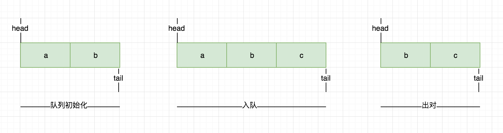
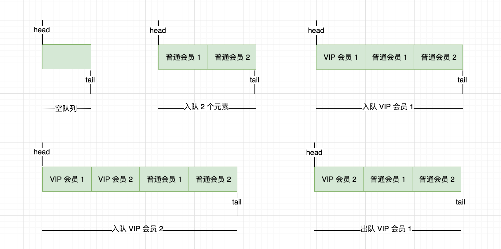
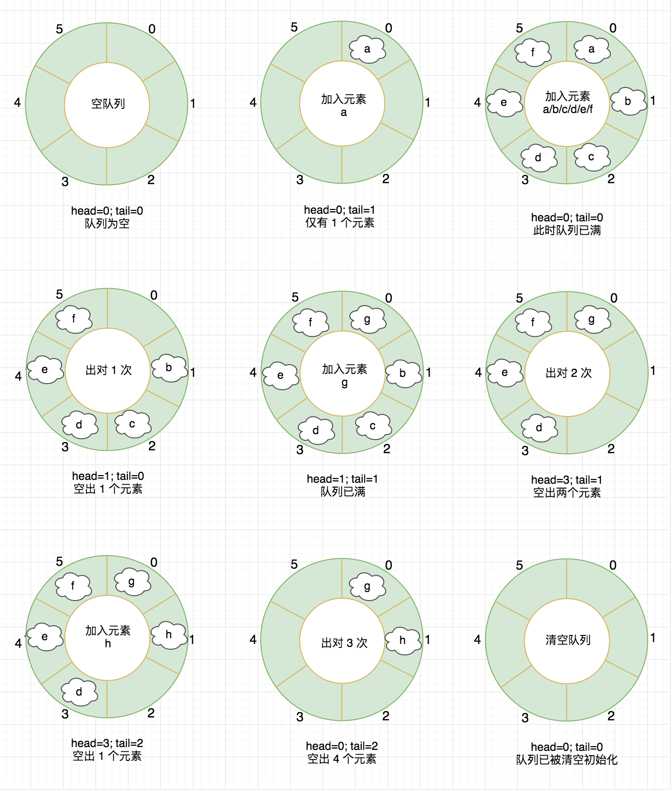

# 数据结构知否知否系列之 — 队列篇

队列，英文 First In First Out 简称 FIFO，遵从先进先出的原则，与 “栈” 相反，在队列的尾部添加元素，在队列的头部删除元素，如果队列中没有元素就称为空队列。

队列对应到生活场景中有很多例子，例如，我们去火车站窗口购票总要排队，先排队的人先购票，有新的人来了则在队尾排队等待前面的完成了依次购票。另外我们的订单超时队列、活动抢购先到先得等等，队列在生活中应用很广泛。

## JavaScript 数组实现队列

JavaScript 中提供的数组功能即可实现一个简单的队列，使用起来也很方便，熟悉相关 API 即可，下面我们来看下基于 JS 数组的入队、出队过程实现。



以上图片展示了队列的初始化、入队、出队过程，下面我们采用 JavaScript 原型链的方式实现。

**初始化队列**

初始化一个存储队列中元素的数据结构，如果未传入默认赋值空数组，传入需先校验类型是否正确。

```js
function QueueStudy(elements) {
    if (elements && !(elements instanceof Array)) {
        throw new Error('必须为数组格式！');
    }

    this.elements = elements || [];
}
```

**队列添加元素**

实现一个 enQueue 方法，向队列添加元素，注意只能是队列尾部添加，使用 JavaScript 数组中的 push 方法。

```js
QueueStudy.prototype.enQueue = function(element) {
    this.elements.push(element);
}
```

**队列移除元素**

实现一个 deQueue 方法，向队列头部弹出元素，使用 JavaScript 数组中的 shift 方法。

```js
QueueStudy.prototype.deQueue = function() {
    return this.elements.shift();
}
```

通过 JavaScript 数组实现是很简单的，源码参见 [https://github.com/Q-Angelo/project-training/tree/master/algorithm/queue-js.js](https://github.com/Q-Angelo/project-training/tree/master/algorithm/queue-js.js)

## 优先队列

优先队列，元素的添加、删除是基于优先级进行的。一个现实的例子就是机场登机的顺序。头等舱和商务舱乘客的优先级要高于经济舱乘客。在有些国家，老年人和孕妇（或带小孩的妇女）登机时也享有高于其他乘客的优先级。

优先队列对应到我们生活场景中也有很多例子，例如我们去银行办理业务，一般都会排号先到的先办理，但是呢，还会有 VIP 会员优先办理，又或者去火车站窗口上购票也会有提示军人可以优先办理等等

**实现步骤**

核心实现继 JavaScript 数组实现队列的例子，对入队函数进行改造如下所示：

* 声明 queueElement 对象，包含了要添加到队列的元素
* 如果队列为空直接入队
* 如果找到一个比 priority 优先级大的元素，插入新元素，这里使用到了 JS 数组中的 splice 方法
* 最后如果队列中的所有元素的优先级都小于 priority，则直接在队列尾部入队
* 另外打印输出的方法也做了简单修改

**代码示例**

```js
PriorityQueue.prototype.enQueue = function(element, priority) {
    const queueElement = { element, priority };

    if (this.isEmpty()) {
        return this.elements.push(queueElement);
    }

    let added = false;
    for (let i=0; i < this.elements.length; i++) {
        if (priority < this.elements[i]['priority']) {
            added = true;
            this.elements.splice(i, 0, queueElement)
            break;
        }
    }

    if (!added) {
        this.elements.push(queueElement);
    }
}

PriorityQueue.prototype.print = function() {
    console.log(this.elements.map(item => item.element).join(' | '));
}
```

**运行测试**

```js
const queue = new PriorityQueue();
queue.enQueue('普通会员1', 5);
queue.enQueue('普通会员2', 10);
queue.print() // 普通会员1 | 普通会员2
queue.enQueue('VIP会员1', 3);
queue.print() // VIP会员1 | 普通会员1 | 普通会员2
queue.enQueue('VIP会员2', 3);
queue.print() // VIP会员1 | VIP会员2 | 普通会员1 | 普通会员2
queue.deQueue();
queue.print() // VIP会员2 | 普通会员1 | 普通会员2
```

**图例展示**

下面以图例的形式展示以上优先队列程序的运行过程



以上是将优先级最小的元素放置于队列前面，称之为最小优先队列，最大优先队列的实现则反之。源码参见 [https://github.com/Q-Angelo/project-training/tree/master/algorithm/queue-priority.js](https://github.com/Q-Angelo/project-training/tree/master/algorithm/queue-priority.js)

## 循环队列

循环队列有些地方也称之为**环形队列**，其本身是一种环形结构的队列，相较于普通队列有个好处是第一个元素出队之后，剩下元素无需依次向前移位，充分利用了向量空间，在以下介绍中给出了完整的实现过程。

在设计环形队列时即可顺时针也可逆时针两个方向进行实现，在入队时可根据 (tail % capacity) 规则，进行队尾添加元素，tail 表示队尾的指针，capacity 表示容量，出队同样以（head % capacity）规则操作，head 表示队头指针，下面以长度为 6 的队列进行图文形式说明下实现过程。



**ES6 实现循环队列**

以下采用 EcameScript 6 的 Class 写法，实现一个环形队列，需要做哪些点呢？以下列出需要实现的功能点：

* 创建队列，初始化队列空间
* 检查队列是否为空
* 检查队列是否溢出
* 入队
* 出队
* 队列长度
* 清空队列
* 销毁队列，内存空间也将释放
* 队列遍历输出

```js
const Init = Symbol('QueueStudy#Init');

class QueueStudy {
    constructor (capacity) {
        if (!capacity) {
            throw new Error('The capacity field is required!');
        }

        this.capacity = capacity; // 初始化容量
        this[Init]();
    }

    /**
     * 清空队列，内存保留
     */
    clear() {
        this[Init]()
    }

    [Init]() {
        this.queue = new Array(this.capacity); // 初始化队列内存空间
        this.queueLen = 0; // 初始化队列元素
        this.head = 0; // 队头
        this.tail = 0; // 尾部
    }

    /**
     * 队列是否为空
     */
    isEmpty() {
        return this.queueLen === 0 ? true : false;
    }

    /**
     * 队列是否溢出
     */
    isOverflow() {
        return this.queueLen === this.capacity
    }

    /**
     * 入队
     */
    enQueue(element) {
        if (this.isOverflow()) {
            return false;
        }

        this.queue[this.tail] = element;
        this.tail++;
        this.tail = this.tail % this.capacity;
        this.queueLen++;
        return true;
    }

    /**
     * 出队
     */
    deQueue() {
        if (this.isEmpty()) {
            throw new Error('队列为空');
        } else {
            const element = this.queue[this.head];
            this.head++; // 队头位置移动
            this.head = this.head % this.capacity;
            this.queueLen--;
            return element;
        }
    }

    /**
     * 队列长度
     */
    len() {
        return this.queueLen;
    }

    /**
     * 销毁队列，内存回收
     */
    destroy() {
        this.queue = null;
    }

    /**
     * 队列元素遍历
     */
    traversing() {
        console.log('------------traversing start------------');
        
        for (let i=this.head; i<this.queueLen + this.head; i++) {
            console.log(this.queue[i % this.capacity]);
        }
        console.log('------------traversing end------------\n');
    }
}
```

**运行测试**

```js
const q1 = new QueueStudy(6);

q1.enQueue('a');
q1.traversing();
q1.enQueue('b');
q1.enQueue('c');
q1.enQueue('d');
q1.enQueue('e');
q1.enQueue('f');
q1.traversing();
console.log('出队: ', q1.deQueue());
q1.enQueue('g');
q1.traversing();
console.log('出队: ', q1.deQueue());
console.log('出队: ', q1.deQueue());
q1.enQueue('h');
console.log('出队: ', q1.deQueue());
console.log('出队: ', q1.deQueue());
console.log('出队: ', q1.deQueue());
q1.traversing();
q1.clear();
q1.traversing();
```


源码参见 [https://github.com/Q-Angelo/project-training/tree/master/algorithm/queue-ring.js](https://github.com/Q-Angelo/project-training/tree/master/algorithm/queue-ring.js)

## 总结

以上就是队列的讲解，最开始讲解了在 JavaScript 中如何应用队列，同时也使用 JavaScript 数组提供的 API 功能实现了优先队列，最后介绍了从零开始如何实现一个环形队列，这个是重点，通过环形队列这个例子也可以帮助大家理解队列的基本实现机制是怎么样的，对环形队列这块不理解的建议多看几遍，总之多动手、多实践。

推荐我在学习数据结构中看的两本书 [学习JavaScript数据结构与算法（第2版）](https://book.douban.com/subject/27129352/)、[图解数据结构使用 Python](https://book.douban.com/subject/30204082/) 当然也不乏有其它更好的资源，供大家学习参考。
