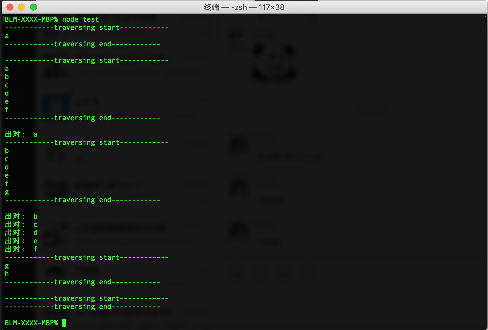

# 常见数据结构 —— 队列

队列，英文 First In First Out 简称 FIFO，遵从先进先出的原则，与 “栈” 相反，在队列的尾部添加元素，在队列的头部删除元素，如果队列中没有元素就称为空队列。

队列对应到生活场景中有很多例子，例如，我们去火车站窗口购票总要排队，先排队的人先购票，有新的人来了则在对尾排队等待前面的完成了依次购票。另外我们的订单超时队列、活动抢购先到先得等等，队列在生活中应用很广泛。

## 循环队列

循环队列有些地方也称之为**环形队列**，其本身是一种环形结构的队列，相较于普通队列有个好处是第一个元素出队之后，剩下元素无需依次向前移位。

在设计环形队列时即可顺时针也可逆时针两个方向进行实现，在入队时可根据 (tail % capacity) 规则，进行队尾添加元素，tail 表示队尾的指针，capacity 表示容量，出对同样以（head % capacity）规则操作，head 表示对头指针，下面以长度为 6 的队列进行图文形式说明下实现过程。


**ES6 实现循环队列**

以下采用 EcameScript 6 的 Class 写法，实现一个队列，需要做哪些点呢？以下列出需要实现的功能点：

* 创建队列，初始化队列空间
* 检查队列是否为空
* 检查对列是否溢出
* 入队
* 出队
* 队列长度
* 清空队列
* 销毁队列，内存空间也将释放
* 队列遍历输出

```js
const Init = Symbol('QueueStudy#Init');

class QueueStudy {
    constructor (capacity) {
        if (!capacity) {
            throw new Error('The capacity field is required!');
        }

        this.capacity = capacity; // 初始化容量
        this[Init]();
    }

    /**
     * 清空队列，内存保留
     */
    clear() {
        this[Init]()
    }

    [Init]() {
        this.queue = new Array(this.capacity); // 初始化队列内存空间
        this.queueLen = 0; // 初始化队列元素
        this.head = 0; // 队头
        this.tail = 0; // 尾部
    }

    /**
     * 队列是否为空
     */
    isEmpty() {
        return this.queueLen === 0 ? true : false;
    }

    /**
     * 对列是否溢出
     */
    isOverflow() {
        return this.queueLen === this.capacity
    }

    /**
     * 入队
     */
    enQueue(element) {
        if (this.isOverflow()) {
            return false;
        }

        this.queue[this.tail] = element;
        this.tail++;
        this.tail = this.tail % this.capacity;
        this.queueLen++;
        return true;
    }

    /**
     * 出队
     */
    deQueue() {
        if (this.isEmpty()) {
            throw new Error('队列为空');
        } else {
            const element = this.queue[this.head];
            this.head++; // 队头位置移动
            this.head = this.head % this.capacity;
            this.queueLen--;
            return element;
        }
    }

    /**
     * 队列长度
     */
    len() {
        return this.queueLen;
    }

    /**
     * 销毁队列，内存回收
     */
    destroy() {
        this.queue = null;
    }

    /**
     * 队列元素遍历
     */
    traversing() {
        console.log('------------traversing start------------');
        
        for (let i=this.head; i<this.queueLen + this.head; i++) {
            console.log(this.queue[i % this.capacity]);
        }
        console.log('------------traversing end------------\n');
    }
}
```

**运行测试**

```js
const q1 = new QueueStudy(6);

q1.enQueue('a');
q1.traversing();
q1.enQueue('b');
q1.enQueue('c');
q1.enQueue('d');
q1.enQueue('e');
q1.enQueue('f');
q1.traversing();
console.log('出对: ', q1.deQueue());
q1.enQueue('g');
q1.traversing();
console.log('出对: ', q1.deQueue());
console.log('出对: ', q1.deQueue());
q1.enQueue('h');
console.log('出对: ', q1.deQueue());
console.log('出对: ', q1.deQueue());
console.log('出对: ', q1.deQueue());
q1.traversing();
q1.clear();
q1.traversing();
```

