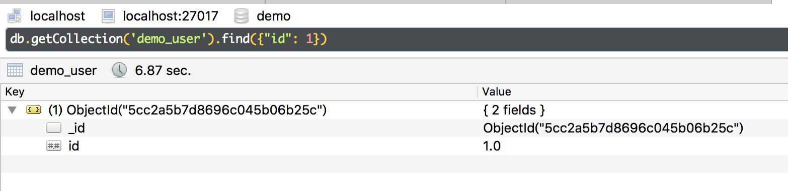
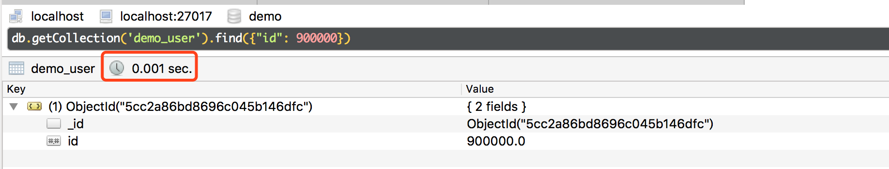
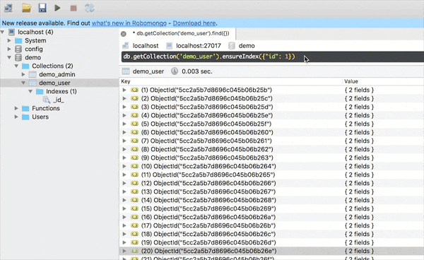
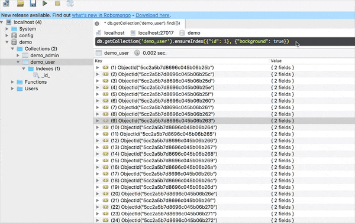

# MongoDB索引

> 在MongoDB中通过建立索引可以进行高效的查询，如果没有索引MongoDB 将会扫描整个集合与查询的条件进行匹配，这对于性能会造成很大的消耗。

## 快速导航
- [Mongodb 索引类型](#Mongodb索引类型)
- [索引属性](#索引属性)
- [索引创建技巧](#索引创建技巧)

## 面试指南

* ``` 生产环境如何正确创建索引？ ```，参考：[#](#索引创建技巧)

## Mongodb索引类型

> MongoDB提供了不同的索引类型支持在不同的业务场景进行查询

#### 1. _id索引

> 绝大多数集合默认建立索引，对于每个插入的数据，MongoDB都会生成一条唯一的_id字段。

例如新创建一个集合时
```shell
db.demo_admin2.insert({x:1})
db.demo_admin2.getIndexes() # 查看集合索引，可看到_id索引
```

#### 2. 单键索引
> 是最普通的索引，单键索引不会自动创建
	
例如一条记录形式为：{x:1,y:2,z:3}，只要在x字段上建立索引之后，就可以用x为条件进行查询
	
```shell
db.demo_admin2.ensureIndex({x:1}) # 创建索引
db.demo_admin2.find({x:1}); # 使用索引查询
```

#### 3. 多键索引

> 多键索引与单键索引区别在于多键索引的值具有多个记录，是一个数组
	
```shell
db.demo_admin2.insert({x:[1,2,3,4]})
```

#### 4. 复合索引

当查询条件为多个时，需要建立复合索引，复合索引创建的最佳方式为 ESR 原则或 ER、ES：
* E：Equal 精确匹配的字段放最前面，颗粒度最少的
* S：Sort 排序条件放中间
* R：Range 范围匹配的字段放最后
	
插入记录`{'x':1,'y':2,'z':3}`  
```
db.demo_admin2.insert({'x':1,'y':4,'z':3});
```

创建索引  
```
db.demo_3.ensureIndex({x:1, y:1, z:1}) # 1升序，-1降序
```

查询  
```
db.demo_admin2.find({x:1, y: {$gte: 2}}).sort({z:1})
```

#### 5. 过期索引

> 指在一段时间后会过期的索引，此索引过一段时间会过期，索引过期后，相应的数据会被删除，适合存储一些在一段时间之后会失效的数据，比如用户登录信息，这样就不需要用到session了。 

***5.1 创建过期索引***

> 建立索引的时候需要多用一个参数，指定索引的有效时间——expireAfterSeconds，单位为秒
	
如下示例为`time`字段创建过期索引
	
```
db.demo_3.ensureIndex({time:1},{expireAfterSeconds:10})
```

***5.2 过期索引限制***
  * 过期索引字段值必须是指定的时间类型，必须是ISODate或ISODate数组，不能使用时间戳，否则不能被自动删除。

  * 如果指定了ISODate数组，则按照最小的时间进行删除。 过期索引不能是复合索引。
  
  * 删除时间不是精确的，删除过程是由后台程序每60s跑一次，而且删除也需要一些时间，所以存在误差。

```
db.demo_3.ensureIndex({time:1},{expireAfterSeconds:30}
db.demo_3.insert({time:new Date()});
```

#### 6. 全文索引
 
> 在mongodb中每个集合只允许创建一个索引，因此不用担心存在多个索引造成冲突的问题。

***6.1 全文索引创建***

> 全文索引创建方法与创建单键索引、复合索引类似。value换成'text'，$**匹配集合下所有

为一个字段创建全文索引
```			
db.articles.ensureIndex({key:"text"})
```

为多个字段创建全文索引
```
db.articles.ensureIndex({key_1:"text"},{key_2:"text"})
```
		
为集合中所有的字段创建全文索引
```
db.articles.ensureIndex({"$**":"text"})
```
		
***6.2 实例***
			
建立索引
```
db.article.ensureIndex({"article":"text"})
db.articles.find({$text:{$search:"coffee"}})
db.articles.find({$text:{$search:"aa bb cc"}}) # 包含aa或bb或cc的数据
db.articles.find({$text:{$search:"aa bb -cc"}}) # 同时包含aa、bb且不包含cc的数据
db.articles.find({$text:{$search:"\"aa\" \"bb\" \"cc\""}})# 同时包含aa、bb、cc的数据(用""包裹起来，引号需要用反斜杠\转义)
```

***6.3 mongodb相似度查询***

`$meta`操作符：`{score:{$meta:'textScore'}}`

查询结果的相似度，搜索出的结果会多出一个score字段，这个得分越高，相关度越高。

```	
db.article.find({$text:{$search:"aa bb ff"}},{score:{$meta:"textScore"}})
```

加上.sort方法可排序
```
db.article.find({$text:{$search:"aa bb ff"}},{score:{$meta:"textScore"}}).sort({score:{$meta:"textScore"}})
```

***6.4 全局索引的限制***
1. 每次查询，只能指定一个`$text`查询
2. `$text`查询不能出现在`$nor`查询中
3. 查询中如果包含了`$text`, `hint`不再起作用
4. MongoDB全文索引还不支持中文

#### 7.地理位置索引

* 2d索引，用于存储和查找平面上的点
* 2dsphere索引，用于存储和查找球面上的点

## 索引属性

***1.索引属性name***

> MongoDB会自动的创建，规则是key_1 或者 key_-1  1或者-1代表排序方向，一般影响不大，长度一般有限制125字节
```
db.collection.ensureIndex({indexValue},{name: key})
```
		
为了见名知意我们可以自己来命名
```
db.demo_3.ensureIndex({x:1,y:1,z:1,n:1},{name:'xyz-name'});
```

删除索引
```
db.demo_3.dropIndex(indexName)
```

***2. 索引属性unique唯一性指定***

>类似关系型数据库字段的唯一约束
```
db.demo_3.ensureIndex({m:1,n:1},{unique:true})
```

## 索引创建技巧

对于线上正在运行的项目，因为业务需求需要查询数据而增加索引，要避免直接以前台方式来创建，否则就要踩坑了，另外还要注意对于报表信息这些需求，则可以单独建立索引。

建立500万条数据，分别用来测试建立索引和未建立索引的差别，只有在大量数据下才有效果，以下的示例中的时间消耗值，各电脑配置的不同在不同电脑上测试也会有不同的差别。

- **建立测试数据**

```js
> for(var i=0; i<5000000; i++) db.demo_user.insert({id: i})
WriteResult({ "nInserted" : 1 })
```

- **未建立索引情况数据查询**

> 在未建立索引的情况下，执行数据查询的时间消耗在6秒多。



- **建立索引情况查询数据**

```js
db.getCollection('demo_user').ensureIndex({"id": 1}) # 建立索引
```

下图为建立索引的情况，在数据查询中仅用了0.001秒，可见建立索引的重要的性。




## Index 导致的库级锁

这是一个很坑爹的事情，MongoDB 没有像 MySql、Oracle 拥有行级粒度锁概念，在 MongoDB中 只有库级粒度锁概念，意味这当你在生产环境中不小心触发了一个写锁的操作时其它的业务也会受影响。

MongoDB中建立索引就是一个触发写锁的过程，通常数据量越大建立的索引占用的写锁时间就会越长，MongoDB中建立索引的两种方式。

- **前台创建（错误）**

```js
db.getCollection('demo_user').ensureIndex({"id": 1}) # 建立索引
```



以上当我对 demo_user 这个集合执行建立索引命令之后，立即打开控制台对 demo_admin 这个集合执行查询操作，发现已经阻塞了，一直在等待索引创建完成。

- **后台创建（推荐）**

```js
db.getCollection('demo_user').ensureIndex({"id": 1}, {background: 1}) # 建立索引
```



以上当我对 demo_user 这个集合执行建立索引命令之后，立即打开控制台对 demo_admin 这个集合执行查询操作，这次一切正常没有在发生阻塞，因此生产环境，也推荐大家使用后台方式创建。

## 针对报表场景单独建立索引

针对报表、BI 数据分析的可以在复制集中单独的建立专属节点创建索引。

* 设置专属从节点节点的 priority 属性为 0，也就是永远不会被选举为主节点
* 关闭该节点已单机模式启动
* 创建索引
* 再次关闭该节点以复制集模式启动
* 此时只有该节点拥有这些索引，且会同步主节点的数据。

## 推荐阅读

- **[MongoDB Indexes](https://docs.mongodb.com/manual/indexes/)**

