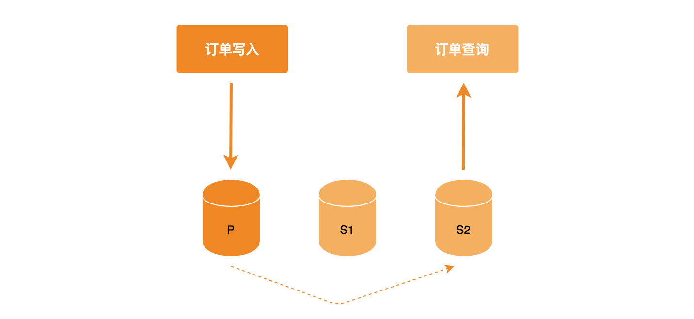

# MongoDB 事务 —— 基础篇

MongoDB 单文档原生支持原子性，也具有事务的特性，但是我们说起事务，通常是指在多文档中的实现，因此，MongoDB 在 4.0 版本支持了多文档事务，4.0 对应于复制集的多表、多行，后续又在 4.2 版本支持了分片集的多表、多行事务操作。

## 事务四大特性

* 原子性（Atomicity）：事务必须是原子工作单元，对于其数据修改，要么全执行，要么全不执行。类似于 Redis 中我通常使用 Lua 脚本来实现多条命令操作的原子性。

* 一致性（Consistency）：事务在完成时，必须使所有的数据都保持一致状态。

* 隔离性（Isolation）：由并发事务所做的修改必须与任何其他并发事务所作的修改隔离（简而言之：一个事务执行过程中不应受其它事务影响）。

* 持久性（Durability）：事务完成之后，对于系统的影响是永久性的。

## MongoDB 对事务四大特性的支持

原子性：MongoDB 单表、单文档原生支持，但是我们说事务通常是指多文档下的实践，MongoDB 4.0 支持复制集多表、多行，MongoDB 4.2 支持了分片集群多表、多行。

一致性：可使用 writeConcern、readConcern 的结合来完用，下文有示例介绍。

隔离性：MongoDB readConcern 支持隔离性的各级别。

持久性：Journal 和 Replication，Journal 是指先把数据写入日志文件，再提交至数据文件，当服务器宕机时可在日志文件进行恢复，在这基础之上 MongoDB 会将数据写入其它节点，持久性相比其它数据库更高级些。

## Read Concern/Write Concern/Read Preference

在事务操作中会分别使用到 readConcern、writeConcern、readPreference 这几个选项，用于控制 Session 的行为，下面分别予以介绍。

### 事务和 Write Concern

事务使用事务级别的 writeConcern 来提交写操作，决定一个事务的写入成功与否要看 writeConcern 选项设置了几个节点，默认情况下为 1。

#### 几个选项值：

* **w:0** 设置为 0 无需关注写入成功与否。
* **w:1 ～ 任意节点数** 自定义节点数设置，复制集中不得大于最大节点数。默认情况下为 1，表示写入到 Primary 节点就开始往客户端发送确认写入成功。
* **w:"majority"** 大多数节点成功原则，例如一个复制集 3 个节点，2 个节点成功就认为本次写入成功。
* **w:"all"** 所以节点都成功，才认为写入成功。
* **j:true** 默认情况 j:false，写操作到达内存算作完成。如果设置为 j:true，写操作只有到达 journal 文件才算成功。
* **wtimeout: <millseconds>** 写入超时实践

#### 设置示例：

```js
writeConcern: {
    w:"majority" // 大多数原则
    j:true,
    wtimeout: 5000,
}
```

JavaScript 使用示例：

```js
db.user.insert({name: "Jack"}, {writeConcern: {w: "majority"}})
```

#### 建议

对于重要数据可以应用 w:"majority" 设置，普通数据 w:1 设置则可以保证性能最佳，w 设置的节点数越多，等待的延迟也就越大，如果 w 等于总节点数，一旦其中某个节点出现故障就会导致整个写入失败，也是有风险的。

[docs.mongodb.com/manual/reference/write-concern/?spm=a2c4e.10696291.0.0.68d519a4ob3Yya](https://docs.mongodb.com/manual/reference/write-concern/?spm=a2c4e.10696291.0.0.68d519a4ob3Yya)

### 事务和 Read Preference

在一个事务操作中使用事务级别的 readPreference 来决定读取时从哪个节点读取。可方便的实现读写分离、就近读取策略。

#### 可选值以下 5 个：

* **primary** 只从主节点读取，默认值。
* **primaryPreferred** 优先选择主节点，不可用时选择从节点 
* **secondary** 只在从节点读取
* **secondaryPreferred** 优先在从节点读取，从节点不可用时选择主节点。 
* **nearest** 选择附近节点

#### 场景选择

* primary/primaryPreferred：适合于数据实时性要求较高的场景，例如，订单创建完毕直接跳转到订单详情，如果选择从节点读取，可能会造成主节点数据写入之后，从节点还未复制的情况，因为复制过程是一个异步的操作。
* secondary/secondaryPreferred：适应用于数据实时性要求不高的场景，例如，报表数据、历史订单。还可以减轻对主节点的压力。

#### 使用示例

* 链接字符串配置：
```
mongodb://mongodb0.example.com:27017,mongodb1.example.com:27017,mongodb2.example.com:27017/admin?replicaSet=myRepl&readPreference=secondary
```

* Mongo Shell：
```js
db.collection.find({}).readPref( "secondary")
```

测试时可借助 db.fsyncUnlock() 对从节点锁定，仅主节点写入数据。

[docs.mongodb.com/manual/core/read-preference/#replica-set-read-preference](https://docs.mongodb.com/manual/core/read-preference/#replica-set-read-preference)

### 事务和 Read Concern

MongoDB 3.2 引入了 readConcern 来决定读取的策略，但是与 readPreference 不同，readPreference 决定从哪个节点读取，readConcern 决定该节点的哪些数据是可读的。主要保证事务中的隔离性，避免脏读。

#### 可选值

* available：读取所有可用的数据。
* local：仅读取当前分片的数据。
* majority：读取在大多数节点上提交完成的数据。
* snapshot：读取最近快照中的数据。
* linearizable：线性读，比 majority 更安全但是性能也更消耗，可能会非常慢，建议配合 maxTimeMS 使用

#### 更新配置项

在启动 Mongod 实例时，指定 --enableMajorityReadConcern 选项或在配置文件中配置

```
enableMajorityReadConcern=true
```

重新启动实例，Mongo shell 登陆实例，使用 ```db._adminCommand( {getCmdLineOpts: 1})``` 查看配置，可以看到在复制集中会多出一个配置，说明配置成功。

```
{
...
"parsed" : {
    "replication" : {
        "enableMajorityReadConcern" : true, // 变化之处
        "oplogSizeMB" : 1024,
        "replSet" : "May"
    },
},
}
```

#### 使用示例

```js
db.user.find().readConcern("majority")

// maxTimeMS 确保操作不会无限期地阻塞
db.user.find().readConcern("linearizable").maxTimeMS(10000) 
```

#### 事务的四个隔离级别

* 未提交读（Read uncommitted）
* 提交读（Read committed）
* 可重复读（Repeatable reads）
* 可序列化（Serializable）

详细内容可参考 [深入分析事务的隔离级别](http://www.hollischuang.com/archives/943)

#### readConcern 总结

MongoDB 的 **readConcern 默认情况下是脏读（readConcer=local）**，例如，用户在主节点读取一条数据之后，该节点未将数据同步至其它从节点，就因为异常挂掉了，待主节点恢复之后，将未同步至其它节点的数据进行回滚，就出现了脏读。

readConcern 级别的 majority 可以保证读到的数据已经落入到大多数节点。所以说保证了事务的隔离性的提交读，所谓隔离性也是指事务内的操作，事务外是看不见的，在**事务隔离级别中为提交读（readConcer=majority）**。

readConcern 的 **snapshot 属性对应事务隔离级别的可重复读**，例如，当开启事务先读取一条数据，之后在事务外对该数据进行修改，如果此时事务内在查询一次该数据可保证重复读，也就是不会读取到事务外修改的数据，例如下例琐事

```js
var session = db.getMongo().startSession();
session.startTransaction({readConcern: { level: 'snapshot' },writeConcern: { w: 'majority' }});

var coll = session.getDatabase('test').getCollection('user');
coll.find({name: 'Jack'}) // { age: 12 } 事务内
db.coll.update({name: 'Jack'}, {$set: {age: 18}}) // 事务外操作
db.coll.find({name: 'Jack'}) // { age: 18 } 事务外操作
coll.find({name: 'Jack'}) // { age: 12 } 事务内
```

**readConcern 的 snapshot 是事务隔离级别中的最高级别，可以保证不会出现脏读、不可重复读、幻读，仅在多文档事务中生效**。

#### readConcern 参考

* [docs.mongodb.com/manual/reference/read-concern/](https://docs.mongodb.com/manual/reference/read-concern/)
* [MongoDB readConcern 原理解析](https://yq.aliyun.com/articles/60553?spm=a2c4e.11155435.0.0.21623312JJZa8i)

## 读写分离实践

一个典型的应用场景是用户写入订单数据（数据写入 Primary），立即调用查询接口，由于采用读写分离模式，链接字符串设置 readPreference=secondaryPreferred 订单写入主节点之后并不能保证数据立即同步到从节点，若此时直接由从节点读取数据， 偶尔会出现订单数据无法找到，用户就会感觉很奇怪，明明下了订单，却又查找不到，造成一些异常订单。




一种导致下单之后再次查找丢失订单的的写法如下：

```
db.order.insert({"id": "123456789"})
db.order.find({"id": "123456789"}).readPref("secondaryPreferred")
```

**解决方法一：**

设置 readPreference=primary，将复制集的节点读取由从节点转换为主节点。

这种方式一个缺点是数据量大了之后会增加主节点的压力，也就没有了主从分离的模式。

**解决方法二：**

使用 **writeConcern、readConcern 组合**来解决，即保证读写分离模式，也**保证了数据的一致性**。

```js
// 写入时保证大多数节点写入成功
db.order.insert({"id": "123456789"}, {writeConern: {w: "majority"}})

// 读取时保证这条数据已在大多数节点存在
db.order.find({"id": "123456789"}).readPref("secondaryPreferred").readConcern("majority")
```

本文是对 MogoDB 事务的一个初步了解，Read Concern/Write Concern/Read Preference 这些在后续事务实践中都会应用，希望大家可以事先进行一个了解，在接下来的一篇文章中，我会介绍 MongoDB 的事务应该如何应用，同时结合 Node.js 进行实践说明，欢迎关注！

## Reference

* [http://mongoing.com/archives/5476](http://mongoing.com/archives/5476)
* [https://docs.mongodb.com/manual/core/transactions/](https://docs.mongodb.com/manual/core/transactions/)