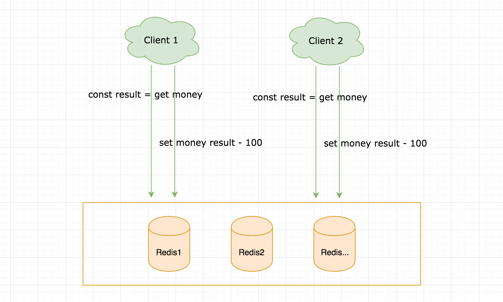
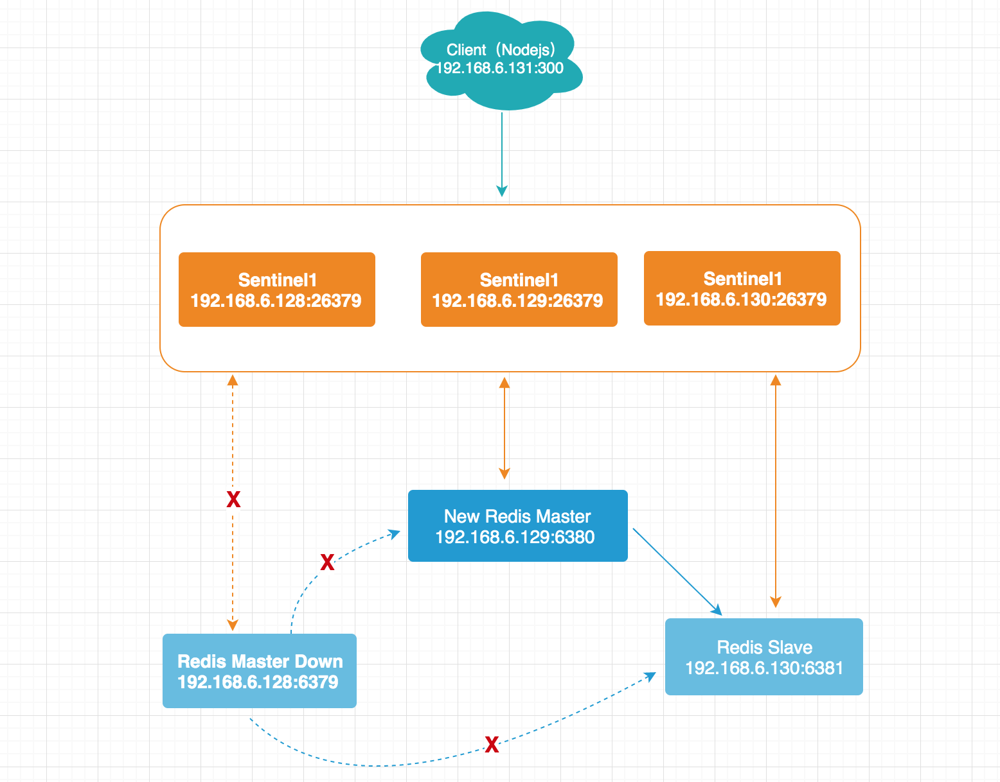
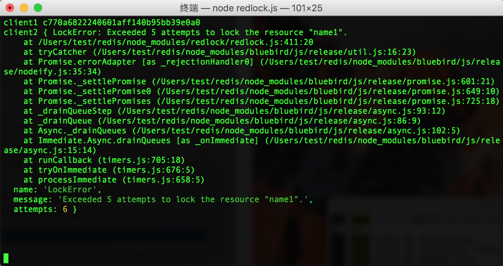

# Node.js 中实践 Redis 分布式锁

在一些分布式环境下、多线程并发编程中，如果对同一资源进行读写操作，避免不了的一个就是资源竞争问题，通过引入分布式锁这一概念，可以解决数据一致性问题。

## 认识线程、进程、分布式锁

**线程锁**：单线程编程模式下请求是顺序的，一个好处是不需要考虑线程安全、资源竞争问题，因此当你进行 Node.js 编程时，也不会去考虑线程安全问题。那么多线程编程模式下，例如 Java 你可能很熟悉一个词 synchronized，通常也是 Java 中解决并发编程最简单的一种方式，synchronized 可以保证在同一时刻仅有一个线程去执行某个方法或某块代码。

**进程锁**：一个服务部署于一台服务器，同时开启多个进程，Node.js 编程中为了利用操作系统资源，根据 CPU 的核心数可以开启多进程模式，这个时候如果对一个共享资源操作还是会遇到资源竞争问题，另外每一个进程都是相互独立的，拥有自己独立的内存空间。关于进程锁通过 Java 中的 synchronized 也很难去解决，synchronized 仅局限于在同一个 JVM 中有效。

**分布式锁**：一个服务无论是单线程还是多进程模式，当多机部署、处于分布式环境下对同一共享资源进行操作还是会面临同样的问题。此时就要去引入一个概念分布式锁。如下图所示，由于先读数据在通过业务逻辑修改之后进行 SET 操作，这并不是一个原子操作，当多个客户端对同一资源进行先读后写操作就会引发并发问题，这时就要引入分布式锁去解决，通常也是一个很广泛的解决方案。



## 基于 Redis 的分布式锁实现思路

实现分布式锁的方式有很多：数据库、Redis、Zookeeper。这里主要介绍的是通过 Redis 来实现一个分布式锁，至少要保证三个特性：安全性、死锁、容错。

**安全性**：所谓一个萝卜一个坑，第一点要做的是上锁，在任意时刻要保证仅有一个客户端持有该锁。

**死锁**：造成死锁可能是由于某种原因，本该释放的锁没有被释放，因此在上锁的时候可以同步的设置过期时间，如果由于客户端自己的原因没有被释放，也要保证锁能够自动释放。

**容错**：容错是在多节点的模式下需要考虑的，只要能保证 N/2+1 节点可用，客户端就可以成功获取、释放锁。

## Redis 单实例分布式锁实现

在 Redis 的单节点实例下实现一个简单的分布式锁，这里会借助一些简单的 Lua 脚本来实现原子性，不了解可以参考之前的文章 [Node.js 中实践 Redis Lua 脚本](https://mp.weixin.qq.com/s/kfgiVkKZofLh6qiqUd48Cw)

### 上锁

上锁的第一步就是先通过 setnx 命令占坑，为了防止死锁，通常在占坑之后还会设置一个过期时间 expire，如下所示：

```
setnx key value
expire key seconds
```

以上命令不是一个原子性操作，所谓原子性操作是指命令在执行过程中并不会被其它的线程或者请求打断，以上如果 setnx 执行成功之后，出现网络闪断 expire 命令便不会得到执行，会导致死锁出现。

也许你会想到使用事物来解决，但是事物有个特点，要么成功要么失败，都是一口气执行完成的，在我们上面的例子中，expire 是需要先根据 setnx 的结果来判断是否需要进行设置，显然事物在这里是行不通的，社区也有很多库来解决这个问题，现在 Redis 官方 2.8 版本之后支持 set 命令传入 setnx、expire 扩展参数，这样就可以一条命令一口气执行，避免了上面的问题，如下所示：

* value：建议设置为一个随机值，在释放锁的时候会进一步讲解
* EX seconds：设置的过期时间
* PX milliseconds：也是设置过期时间，单位不一样
* NX|XX：NX 同 setnx 效果是一样的

```bash
set key value [EX seconds] [PX milliseconds] [NX|XX]
```

### 释放锁

释放锁的过程就是将原本占有的坑给删除掉，但是也并不能仅仅使用 del key 删除掉就万事大吉了，这样很容易删除掉别人的锁，为什么呢？举一个例子客户端 A 获取到一把 key = name1 的锁（2 秒中），紧接着处理自己的业务逻辑，但是在业务逻辑处理这块阻塞了耗时超过了锁的时间，锁是会自动被释放的，这期间该资源又被客户端 B 获取了 key = name1 的锁，那么客户端 A 在自己的业务处理结束之后直接使用 del key 命令删除会把客户端 B 的锁给释放掉了，所以释放锁的时候要做到仅释放自己占有的锁。

加锁的过程中建议把 value 设置为一个随机值，主要是为了更安全的释放锁，在 del key 之前先判断这个 key 存在且 value 等于自己指定的值才执行删除操作。判断和删除不是一个原子性的操作，此处仍需借助 Lua 脚本实现。

```lua
if redis.call("get",KEYS[1]) == ARGV[1] then
    return redis.call("del",KEYS[1])
else
    return 0
end
```

### Redis 单实例分布式锁 Node.js 实践

使用 Node.js 的 Redis 客户端为 ioredis，npm install ioredis -S 先安装该包。

**初始化自定义 RedisLock**

```js
class RedisLock {
    /**
     * 初始化 RedisLock
     * @param {*} client 
     * @param {*} options 
     */
    constructor (client, options={}) {
        if (!client) {
            throw new Error('client 不存在');
        }

        if (client.status !== 'connecting') {
            throw new Error('client 未正常链接');
        }

        this.lockLeaseTime = options.lockLeaseTime || 2; // 默认锁过期时间 2 秒
        this.lockTimeout = options.lockTimeout || 5; // 默认锁超时时间 5 秒
        this.expiryMode = options.expiryMode || 'EX';
        this.setMode = options.setMode || 'NX';
        this.client = client;
    }
}
```

**上锁**

通过 set 命令传入 setnx、expire 扩展参数开始上锁占坑，上锁成功返回，上锁失败进行重试，在 lockTimeout 指定时间内仍未获取到锁，则获取锁失败。

```js
class RedisLock {
    
    /**
     * 上锁
     * @param {*} key 
     * @param {*} val 
     * @param {*} expire 
     */
    async lock(key, val, expire) {
        const start = Date.now();
        const self = this;

        return (async function intranetLock() {
            try {
                const result = await self.client.set(key, val, self.expiryMode, expire || self.lockLeaseTime, self.setMode);
        
                // 上锁成功
                if (result === 'OK') {
                    console.log(`${key} ${val} 上锁成功`);
                    return true;
                }

                // 锁超时
                if (Math.floor((Date.now() - start) / 1000) > self.lockTimeout) {
                    console.log(`${key} ${val} 上锁重试超时结束`);
                    return false;
                }

                // 循环等待重试
                console.log(`${key} ${val} 等待重试`);
                await sleep(3000);
                console.log(`${key} ${val} 开始重试`);

                return intranetLock();
            } catch(err) {
                throw new Error(err);
            }
        })();
    }
}
```

**释放锁**

释放锁通过 redis.eval(script) 执行我们定义的 redis lua 脚本。

```js
class RedisLock {
    /**
     * 释放锁
     * @param {*} key 
     * @param {*} val 
     */
    async unLock(key, val) {
        const self = this;
        const script = "if redis.call('get',KEYS[1]) == ARGV[1] then" +
        "   return redis.call('del',KEYS[1]) " +
        "else" +
        "   return 0 " +
        "end";

        try {
            const result = await self.client.eval(script, 1, key, val);

            if (result === 1) {
                return true;
            }
            
            return false;
        } catch(err) {
            throw new Error(err);
        }
    }
}
```

**测试**

这里使用了 uuid 来生成唯一 ID，这个随机数 id 只要保证唯一不管用哪种方式都可。

```js
const Redis = require("ioredis");
const redis = new Redis(6379, "127.0.0.1");
const uuidv1 = require('uuid/v1');
const redisLock = new RedisLock(redis);

function sleep(time) {
    return new Promise((resolve) => {
        setTimeout(function() {
            resolve();
        }, time || 1000);
    });
}

async function test(key) {
    try {
        const id = uuidv1();
        await redisLock.lock(key, id, 20);
        await sleep(3000);
        
        const unLock = await redisLock.unLock(key, id);
        console.log('unLock: ', key, id, unLock);
    } catch (err) {
        console.log('上锁失败', err);
    }  
}

test('name1');
test('name1');
```

同时调用了两次 test 方法进行上锁，只有第一个是成功的，第二个 name1 26e02970-0532-11ea-b978-2160dffafa30 上锁的时候发现 key = name1 已被占坑，开始重试，由于以上测试中设置了 3 秒钟之后自动释放锁，name1 26e02970-0532-11ea-b978-2160dffafa30 在经过两次重试之后上锁成功。

```bash
name1 26e00260-0532-11ea-b978-2160dffafa30 上锁成功
name1 26e02970-0532-11ea-b978-2160dffafa30 等待重试
name1 26e02970-0532-11ea-b978-2160dffafa30 开始重试
name1 26e02970-0532-11ea-b978-2160dffafa30 等待重试
unLock:  name1 26e00260-0532-11ea-b978-2160dffafa30 true
name1 26e02970-0532-11ea-b978-2160dffafa30 开始重试
name1 26e02970-0532-11ea-b978-2160dffafa30 上锁成功
unLock:  name1 26e02970-0532-11ea-b978-2160dffafa30 true
```

**源码地址**

```
https://github.com/Q-Angelo/project-training/tree/master/redis/lock/redislock.js
```

## Redlock 算法

以上是使用 Node.js 对 Redis 分布式锁的一个简单实现，在单实例中是可用的，当我们对 Redis 节点做一个扩展，在 Sentinel、Redis Cluster 下会怎么样呢？

以下是一个 Redis Sentinel 的故障自动转移示例图，假设我们客户端 A 在主节点 192.168.6.128 获取到锁之后，主节点还未来得及同步信息到从节点就挂掉了，这时候 Sentinel 会选举另外一个从节点做为主节点，那么客户端 B 此时也来申请相同的锁，就会出现同样一把锁被多个客户端持有，对数据的最终一致性有很高的要求还是不行的。



### Redlock 介绍

鉴于这些问题，Redis 官网 [redis.io/topics/distlock](redis.io/topics/distlock) 提供了一个**使用 Redis 实现分布式锁的规范算法 Redlock**，中文翻译版参考 [http://redis.cn/topics/distlock.html](http://redis.cn/topics/distlock.html)

Redlock 在上述文档也有描述，这里简单做个总结：Redlock 在 Redis 单实例或多实例中提供了强有力的保障，本身具备容错能力，它会从 N 个实例使用相同的 key、随机值尝试 ```set key value [EX seconds] [PX milliseconds] [NX|XX]``` 命令去获取锁，在有效时间内至少 N/2+1 个 Redis 实例取到锁，此时就认为取锁成功，否则取锁失败，失败情况下客户端应该在所有的 Redis 实例上进行解锁。

### Node.js 中应用 Redlock

[github.com/mike-marcacci/node-redlock](github.com/mike-marcacci/node-redlock) 是 Node.js 版的 Redlock 实现，使用起来也很简单，开始之前先安装 ioredis、redlock 包。

```
npm i ioredis -S
npm i redlock -S
```

**编码**

```js
const Redis = require("ioredis");
const client1 = new Redis(6379, "127.0.0.1");
const Redlock = require('redlock');
const redlock = new Redlock([client1], {
    retryDelay: 200, // time in ms
    retryCount: 5,
});

// 多个 Redis 实例
// const redlock = new Redlock(
//     [new Redis(6379, "127.0.0.1"), new Redis(6379, "127.0.0.2"), new Redis(6379, "127.0.0.3")],
// )

async function test(key, ttl, client) {
    try {
        const lock = await redlock.lock(key, ttl);

        console.log(client, lock.value);
        // do something ...

        // return lock.unlock();
    } catch(err) {
        console.error(client, err);
    }
}

test('name1', 10000, 'client1');
test('name1', 10000, 'client2');
```

**测试**

对同一个 key name1 两次上锁，由于 client1 先取到了锁，client2 无法获取锁，重试 5 次之后报错 LockError: Exceeded 5 attempts to lock the resource "name1".


