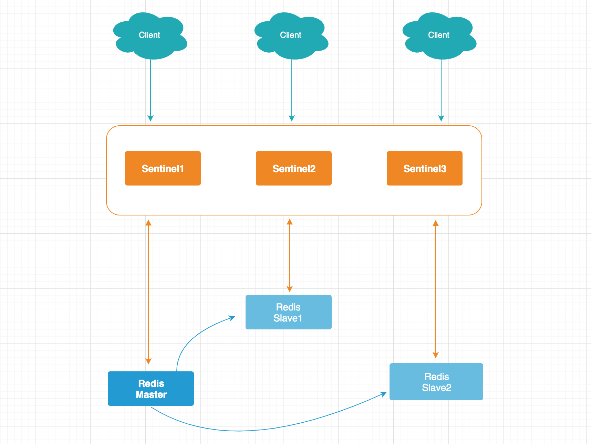
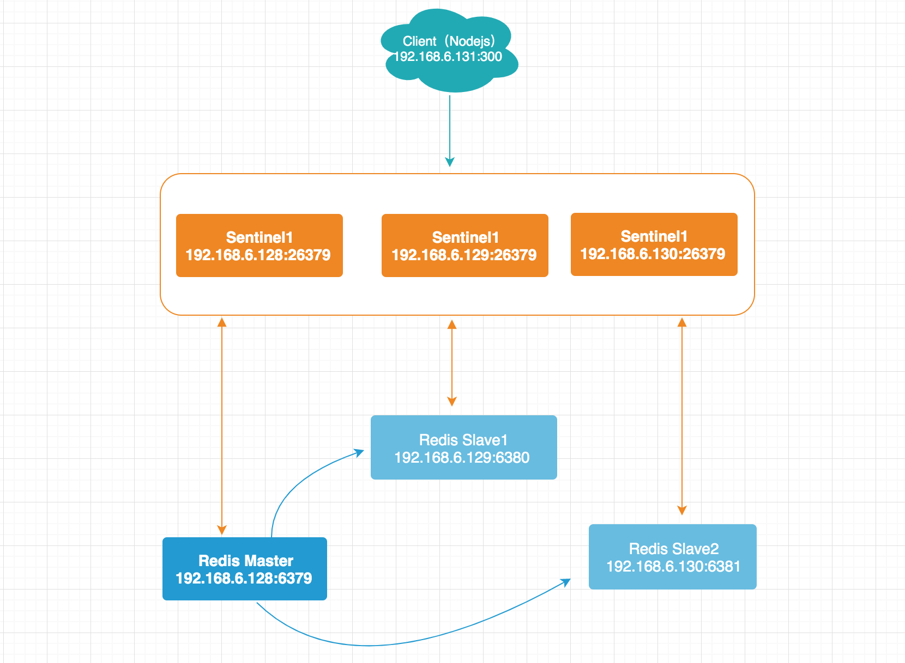
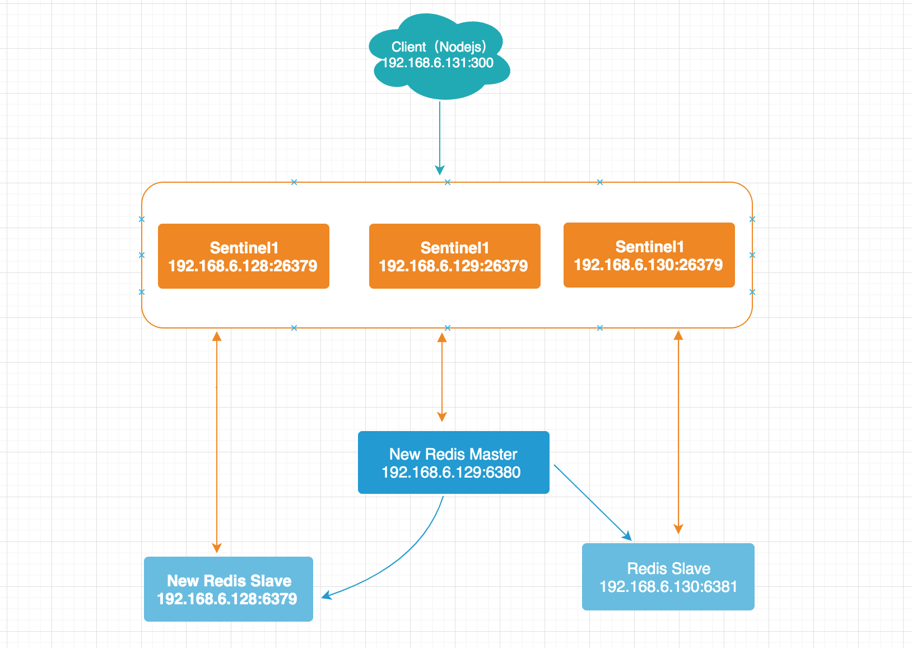

# Sentinel

在上节的 Redis 主从复制中，如果主节点发生故障，我们是希望从节点可以自动提升而不是人工来干预，Redis 提供的 Sentinel 功能就可实现此功能。

## Sentinel简介

Redis Sentinel 是一个分布式系统，类似于 Consul 集群，一般由 3 ～ 5 个节点组成，使用 Raft 算法实现领导者选举因为故障转移工作只需要一个 Sentinel 节点来完成，如下图所示，我们客户端部分直接和 Sentinel 集群交互，关于 Redis 主从节点的状态维护交由 Sentinel 去管理。



## Sentinel参数配置

```conf
port 6379 # 端口号
daemonize no # 是否为守护进程模式
pidfile /var/run/redis-sentinel.pid 
logfile "" # 日志文件
dir /tmp # 工作目录

# 监控的 Master 名称，默认为 mymaster 可以设置不同的名称监控多个 Master，
sentinel monitor mymaster 127.0.0.1 6379 2

# Sentinel 通过 ping 命令检查 Master 是否可用，默认 30 秒
sentinel down-after-milliseconds mymaster 30000

# 限制每次向新的主节点发起复制操作的从节点数量，默认为 1
sentinel parallel-syncs mymaster 1

# 故障转移超时时间，默认 3 分钟，超过这个实践认为故障转移失败
sentinel failover-timeout mymaster 180000
sentinel deny-scripts-reconfig yes
```

## Sentinel部署实践

在上节讲解的 Redis 主从复制一节，我们只用了一台机器，为了更好模拟生产环境，这里采用 3 台虚拟机进行实践，模拟故障转移。

以下为我们搭建好的示意图，客户端（Node.js 服务）通过链接 Sentinel 与各个 Redis 主从节点交互。



### 环境准备

Redis 安装目录 /data/soft/redis-5.0.5/

机器              |  模式  | 节点 | 配置文件
:----------------|:------|:-------|:---
 192.168.6.128    | Master | 6379 | redis-6379.conf
 192.168.6.129    | Slave1 | 6380 | redis-6380.conf
 192.168.6.130    | Slave2 | 6381 | redis-6381.conf
 192.168.6.128    | Sentinel1 | 26379 | sentinel-26379.conf
 192.168.6.129    | Sentinel2 | 26379 | sentinel-26379.conf
 192.168.6.130    | Sentinel3 | 26379 | sentinel-26379.conf

机器              |  客户端服务  | 端口 |
:----------------|:------|:-------|
 192.168.6.131    | node-sentinel-demo | 3000 |

### 配置Redis主从

在主从配置一节有讲解，当时是在一台虚拟机上完成的，现在采用多台虚拟机，区别不大，建议还是先看下主从复制一节助您更好理解本节内容

**redis-6379.conf**

```bash
$ cat redis.conf | grep -v "#" | grep -v "^$" > redis-6379.conf # 去掉了注释和空格
```

```conf
bind 192.168.6.128
port 6379
daemonize yes # 开启守护进程
pidfile /var/run/redis_6379.pid
logfile "6379.log"
# save 900 1
# save 300 10
# save 60 10000
dbfilename dump-6379.rdb
dir /data/soft/redis-5.0.5/data/
replica-read-only yes # 默认从节点仅是只读模式
```

**启动6379**

```
$ src/redis-server redis-6379.conf
```

**redis-6380.conf**

```bash
$ cat redis.conf | grep -v "#" | grep -v "^$" > redis-6380.conf # 去掉了注释和空格
```

```conf
# redis-6380.conf
# 修改以下内容
bind 192.168.6.129
port 6380
daemonize yes # 开启守护进程
pidfile /var/run/redis_6380.pid
logfile "6380.log"
# save 900 1
# save 300 10
# save 60 10000
dbfilename dump-6380.rdb
dir /data/soft/redis-5.0.5/data/
replicaof 192.168.6.128 6379 # 做为该地址端口的从节点
```

**启动6380**

```
$ src/redis-server redis-6380.conf
```

**redis-6381.conf**

```bash
$ cat redis.conf | grep -v "#" | grep -v "^$" > redis-6381.conf # 去掉了注释和空格
```

```conf
# redis-6381.conf
# 修改以下内容
bind 192.168.6.130
port 6381
daemonize yes # 开启守护进程
pidfile /var/run/redis_6381.pid
logfile "6381.log"
# save 900 1
# save 300 10
# save 60 10000
dbfilename dump-6381.rdb
dir /data/soft/redis-5.0.5/data/
replicaof 192.168.6.128 6379 # 做为该地址端口的从节点
```

**启动6381**

```
$ src/redis-server redis-6381.conf
```

**检查主从是否启动成功**

```bash
$ src/redis-cli -h 192.168.6.128 -p 6379 client list
id=3 addr=192.168.6.129:46818 fd=7 name= age=229 idle=0 flags=S db=0 sub=0 psub=0 multi=-1 qbuf=0 qbuf-free=0 obl=0 oll=0 omem=0 events=r cmd=replconf
id=6 addr=192.168.6.130:39904 fd=8 name= age=91 idle=1 flags=S db=0 sub=0 psub=0 multi=-1 qbuf=0 qbuf-free=0 obl=0 oll=0 omem=0 events=r cmd=replconf
id=8 addr=192.168.6.128:39582 fd=9 name= age=0 idle=0 flags=N db=0 sub=0 psub=0 multi=-1 qbuf=26 qbuf-free=32742 obl=0 oll=0 omem=0 events=r cmd=client
```

```bash
$ redis-cli -h 192.168.6.128 -p 6379 info replication
# Replication
role:master
connected_slaves:2
slave0:ip=192.168.6.129,port=6380,state=online,offset=364,lag=1
slave1:ip=192.168.6.130,port=6381,state=online,offset=364,lag=0
master_replid:f42c329990f416d2e7f62704bfa07ba231275cb0
master_replid2:0000000000000000000000000000000000000000
master_repl_offset:364
second_repl_offset:-1
repl_backlog_active:1
repl_backlog_size:1048576
repl_backlog_first_byte_offset:1
repl_backlog_histlen:364
```

### 配置Sentinel集群

Sentinel 集群建议至少 3 个节点且总数最好为奇数，保证了高可用和公平性。由于部署在不同虚拟机上所以端口都为 26379 这里我暂时没有改动，如果是同一台机器部署 则需要更改端口号。

**修改 Redis-Sentinel 配置**

在 192.168.6.128、192.168.6.129、192.168.6.130 三台机器上分别进行如下操作：

```
$ cat sentinel.conf | grep -v "#" | grep -v "^$" > sentinel-26379.conf
```

```conf
$ vim 

port 26379
daemonize no
pidfile /var/run/redis-sentinel.pid
logfile "26379.log"
dir /data/soft/redis-5.0.5/data/
sentinel monitor mymaster 127.0.0.1 6379 2
sentinel down-after-milliseconds mymaster 30000
sentinel parallel-syncs mymaster 1
sentinel failover-timeout mymaster 180000
sentinel deny-scripts-reconfig yes
```

**启动 Redis-Sentinel**

如下所示两种方式启动 Redis-Sentinel，需要在 Sentinel 对应的多台机器上执行以下两种方式的其中一种进行操作

```
$ src/redis-sentinel sentinel-26379.conf # 方法一
$ src/redis-server sentinel-26379.conf --sentinel # 方法二
```


**检查 Redis-Sentinel 集群状态**

如下所示三个 Sentinel 节点已成功开启

```
$ src/redis-cli -h 192.168.6.128 -p 26379 client list   
id=3 addr=192.168.6.130:46518 fd=16 name=sentinel-9929680e-cmd age=105 idle=1 flags=N db=0 sub=0 psub=0 multi=-1 qbuf=0 qbuf-free=0 obl=0 oll=0 omem=0 events=r cmd=publish
id=4 addr=192.168.6.129:51008 fd=17 name=sentinel-cf0d2de4-cmd age=105 idle=1 flags=N db=0 sub=0 psub=0 multi=-1 qbuf=0 qbuf-free=0 obl=0 oll=0 omem=0 events=r cmd=ping
id=6 addr=192.168.6.128:44044 fd=18 name= age=0 idle=0 flags=N db=0 sub=0 psub=0 multi=-1 qbuf=26 qbuf-free=32742 obl=0 oll=0 omem=0 events=r cmd=client
```

如下所示，展示了目前 Sentinel 所监控的主节点（192.168.6.128:6379）且该主节点有 2 个 Slave 节点还有 sentinels 节点数为 3

```
$ src/redis-cli -h 192.168.6.129 -p 26379 info sentinel
# Sentinel
sentinel_masters:1
sentinel_tilt:0
sentinel_running_scripts:0
sentinel_scripts_queue_length:0
sentinel_simulate_failure_flags:0
master0:name=mymaster,status=ok,address=192.168.6.128:6379,slaves=2,sentinels=3
```

至此 Sentinel 的服务端安装部署已经介绍完毕，接下来使用 Node.js 客户进行链接和故障转移演练实践

## Nodejs客户端链接

在看下客户端如何使用 Sentinel，这里以 Node.js 为例，客户端通过 Sentinel 发现主从节点地址，然后在通过这些地址建立相应的链接来进行数据存取操作，以下用的是 Node.js 的 ioredis 客户端，你需要先执行 ```npm install ioredis``` 命令进行安装

```js
const Redis = require('ioredis');
const redis = new Redis({
    sentinels:[
        { host: '192.168.6.128', port: 26379 },
        { host: '192.168.6.129', port: 26379 },
        { host: '192.168.6.130', port: 26379 },
    ],
    name: 'mymaster',
});

let count = 0;
setInterval(async function() {
    count++;
    const key = `k_${count}`;

    try {
        await redis.set(key, count);
        console.log(key, redis.get(key));
    } catch (err) {
        console.error(err);
    }
}, 1000)
```

## 故障转移演练

**主节点宕机**

192.168.6.128:6379 为我们最初设定的主节点，现在我们让主节点宕机来进行一次故障转移实战演练

```
$  ps -ef | grep redis-server

root       5080      1  0 20:04 ?        00:00:49 src/redis-server 192.168.6.128:6379
```

上面的 5080 为主节点的进程 id，执行 kill 命令使其断掉链接。

```
kill -9 5080
```

**观察客户端日志**

现在让我们在来看下上面写的 Node.js 客户端日志情况，如下所示：

```bash
k_1 1
k_2 2
k_3 3
[ioredis] Unhandled error event: Error: connect ECONNREFUSED 192.168.6.128:6379
    at Object._errnoException (util.js:1022:11)
    at _exceptionWithHostPort (util.js:1044:20)
    at TCPConnectWrap.afterConnect [as oncomplete] (net.js:1198:14)
[ioredis] Unhandled error event: Error: connect ECONNREFUSED 192.168.6.128:6379
    at Object._errnoException (util.js:1022:11)
    at _exceptionWithHostPort (util.js:1044:20)
    at TCPConnectWrap.afterConnect [as oncomplete] (net.js:1198:14)
... # 大概30秒之后恢复正常
```

**观察服务端从节点日志**

查看 6381 节点日志信息 tail -100 6381.log，在 33:01 秒链接被拒，在 33:31.546 时间点收到一条 user 请求该节点成为了 Master 节点，23:33:32.064 时间点向 6380 发送了一条请求使其成为从节点。

```
20945:S 29 Jun 2019 21:24:37.848 * Successful partial resynchronization with master.
20945:S 29 Jun 2019 21:24:37.848 * MASTER <-> REPLICA sync: Master accepted a Partial Resynchronization.
20945:S 29 Jun 2019 23:33:01.104 # Connection with master lost.
20945:S 29 Jun 2019 23:33:01.107 * Caching the disconnected master state.
20945:S 29 Jun 2019 23:33:01.524 * Connecting to MASTER 192.168.6.128:6379
20945:S 29 Jun 2019 23:33:01.527 * MASTER <-> REPLICA sync started
20945:S 29 Jun 2019 23:33:01.527 # Error condition on socket for SYNC: Connection refused
... 中间省略，一直在重连
20945:S 29 Jun 2019 23:33:30.884 * Connecting to MASTER 192.168.6.128:6379
20945:S 29 Jun 2019 23:33:30.885 * MASTER <-> REPLICA sync started
20945:S 29 Jun 2019 23:33:30.885 # Error condition on socket for SYNC: Connection refused
20945:M 29 Jun 2019 23:33:31.541 # Setting secondary replication ID to f42c329990f416d2e7f62704bfa07ba231275cb0, valid up to offset: 2106538. New replication ID is b456d532b1f700037e141d56cf294668d12634e3
20945:M 29 Jun 2019 23:33:31.541 * Discarding previously cached master state.
20945:M 29 Jun 2019 23:33:31.546 * MASTER MODE enabled (user request from 'id=6 addr=192.168.6.129:40770 fd=10 name=sentinel-cf0d2de4-cmd age=11529 idle=0 flags=x db=0 sub=0 psub=0 multi=3 qbuf=140 qbuf-free=32628 obl=36 oll=0 omem=0 events=r cmd=exec')
20945:M 29 Jun 2019 23:33:31.550 # CONFIG REWRITE executed with success.
20945:M 29 Jun 2019 23:33:32.064 * Replica 192.168.6.129:6380 asks for synchronization
20945:M 29 Jun 2019 23:33:32.064 * Partial resynchronization request from 192.168.6.129:6380 accepted. Sending 164 bytes of backlog starting from offset 2106538.
```

**Redis 主从状态验证**

让我们在最后做次验证，如下所示，192.168.6.130:6381 端口已成功晋升为 Master 节点，其从节点仅为1个 192.168.6.129:6380，因为 192.168.6.129:6379 端口已经被我们关闭了。

```
$ src/redis-cli -h 192.168.6.130 -p 6381 info replication
# Replication
role:master
connected_slaves:1
slave0:ip=192.168.6.129,port=6380,state=online,offset=2607904,lag=0
master_replid:b456d532b1f700037e141d56cf294668d12634e3
master_replid2:f42c329990f416d2e7f62704bfa07ba231275cb0
master_repl_offset:2607904
second_repl_offset:2106538
repl_backlog_active:1
repl_backlog_size:1048576
repl_backlog_first_byte_offset:1559329
repl_backlog_histlen:1048576
```

**当前节点状态如下所示**

如下图所示，主节点挂掉后，原先的主节点断开了与其从节点的复制，一个从节点被提升为新的主节点，其它从节点开始与新的主节点建立复制关系，在客户端这边是不受影响，它会通过 Sentinel 这个中间人进行处理不受影响。


**恢复 192.168.6.128:6379 节点**

执行命令 ```src/redis-server redis-6379.conf```，恢复 6379 节点，Sentinel 也会持续的监控我们已经挂掉的 6379 节点，恢复之后集群调整如下所示


