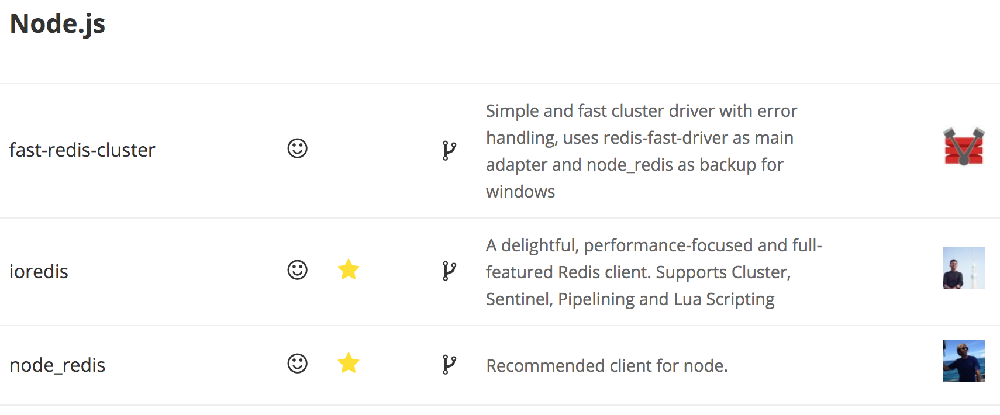
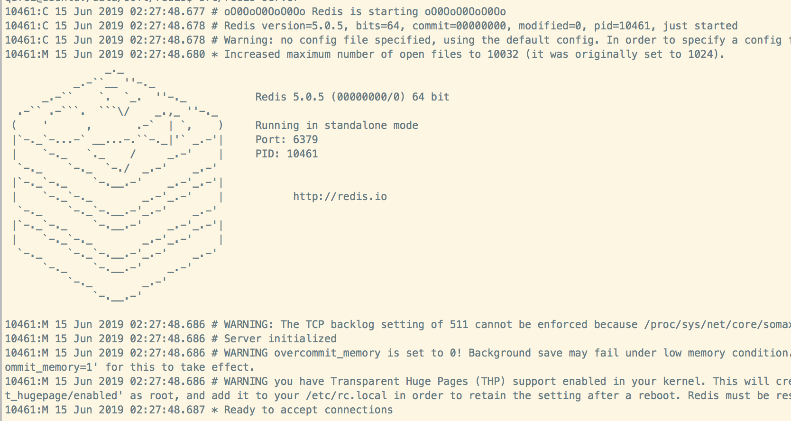

# Redis 基础入门篇

Redis 是一个免费开源、基于内存的高性能 Key-Value 数据库，据阅读排行榜网站 db-engines.com 统计，在 Key-value 存储的数据库中 Redis 依旧是最流行的。

## 为什么要使用 Redis？都有哪些好处？

毋庸置疑 Redis 的应用范围是很广泛的，Redis 具有速度快、数据持久化、丰富的数据类型、多语言支持和多功能等特性，下面分别了解下每种特性。

**速度快**

Redis 号称具有 10W OPS（每秒10万次读写）的能力，Redis 是基于单线程模型，将数据存在于内存中，采用 C 语言(距操作系统最近的语言) 50000 行代码（单机版的 23000 行）编写。

为什么单线程模型如此之快？取决于几个优点：基于内存、非阻塞IO、避免线程切换，这点和 Node.js 很相似，但是单线程需要注意由于一次只能运行一次命令，使用过程中要拒绝慢命令，例如 keys、flushall、flushdb、slow lua script、mutil/exec 等

**持久化**

Redis 之所以快还有一个原因是其基于内存模型，内存中进行数据存储一个典型的问题是断电后或者服务重启会造成数据丢失，那么针对这个问题 Redis 中提出了两种数据持久化策略，分别为 RDB 和 AOF 会将 Redis 在内存中保存的数据异步更新到磁盘中，实现数据的持久化功能，这在之后的一节中会单独进行介绍。

**丰富的数据类型**

Redis 支持丰富的数据类型，除了五个常见的的 String、HashTable、List、Set、Zset 之外 Redis 还新衍生了几个新的类型：`BitMaps`（位图）、`HyperLogLog`（超小内存唯一计数）、`GEO`（地理信息定位）

**多语言**

基于 `TCP` 的通信方式，支持 `Node.js`、`Python`、`Java`、`Ruby`、`Lua` 等，可以参考 Redis 官方介绍 [https://redis.io/clients](https://redis.io/clients) ，每门语言可能会有好多个客户端，该如何选择呢？可以参考以下两点：

* 首先可以选择标记有五角星 ⭐️ 的客户端
* 有笑脸 😊 标记的说明该客户端最近 6 个月是活跃的



**多功能**

Redis 提供了发布订阅、简单的事务功能、pipeline 提高客户端并发效率。另外在 Redis 中的所有单个命令操作都是原子性的，如果想对多个命令一起操作，可以借助 Lua 脚本（实现自定义命令，保证原子性）。

## Redis 与 Memcache 的区别？

可以选择 Redis 做缓存也可以使用 Memcache 有什么区别呢？从以下几个方面来看待：

**数据持久化**

Memcache 仅存于内存中不支持数据持久化，这样如果断电或服务重启都会造成数据丢失，而 Redis 提供了数据持久化的能力，可以分别通过 RDB 或 AOF 两种策略将数据持久化在硬盘中，服务重启或断电也不会造成数据丢失。

**数据类型**

Memcache 对数据类型的支持相对要简单、过于单一，Redis 的数据类型就显得很丰富，支持 String、HashTable、List、Set、Zset 还有最新的 BitMaps、HyperLogLog 等

**Value 大小**

在 Redis 中 Value 可以是字符串、二进制数据，例如，您可以在 Value 内存储 jpeg 图像，但是建议值不要大于 512 MB，这块可以在 Redis 官网看到，以下为原文：

```
Values can be strings (including binary data) of every kind, for instance you can store a jpeg image inside a value. A value can't be bigger than 512 MB.
```

Memcache 的最大 key 长度为 250 个字符，可以接受的 Value 存储数据大小为 1MB，这也是典型的 slab 最大值。

**网络 I/O 模型**

Redis 使用的单线程 I/O 多路复用模型，Memcache 使用的多线程、非阻塞式 I/O 模型。

**数据一致性**

Redis 基于单线程模型，保证了顺序一致性问题，如果有多个命令需要一起操作，也可以使用事物或者编写 Lua 脚本。Memcache 需要借助 CAS（Compare And Set）保证数据一致性，简单的理解就是在进行 set 操作时，加上初始值 Compare，如果初始值发生改变则不允许 set。

CAS 参考 [www.w3cschool.cn/architectroad/architectroad-solve-data-consistency-with-cas.html](https://www.w3cschool.cn/architectroad/architectroad-solve-data-consistency-with-cas.html)


## Redis 安装

Redis 支持 Mac 或者 Linux 系统上安装，对于 Windows 的同学，可以安装一个虚拟机进行学习。

> **Question**：
“为啥 windows 没法用 redis 需要安装虚拟机啊”
> 
> **Answer**: 
> 为啥没有 Windows，可以直接去官网 https://redis.io/download 看下，Redis 官网没有提供，Windows 下安装虚拟机是为了模拟 Linux 环境。  
> Github 上有一个微软提供的 Windows 版 Redis https://github.com/MicrosoftArchive/redis 且目前说明不再积极维护 “This project is no longer being actively maintained.”，如果你真的需要 Windows 版的 Redis 推荐 https://www.memurai.com/。  
> 最后，如果是 Windows 建议还是装个虚拟机吧，开发学习必备，省去很多烦恼。


**下载和编译**

```bash
$ wget http://download.redis.io/releases/redis-5.0.5.tar.gz # 下载 
$ tar xzf redis-5.0.5.tar.gz # 解压
$ # ln -s redis-5.0.5 redis
$ cd redis-5.0.5 # 执行了上面一步 此处 cd redis
$ make
```

**启动redis**

安装好后，在当前目录下有个src目录，控制台输入redis-server，启动redis

```bash
$ src/redis-server
$ src/redis-server --port 6380 # 指定端口号启动
```

看到以下界面，启动成功



**打开redis客户端**

```javascript
src/redis-cli -p 6380

//指定服务器地址和端口
src/redis-cli -h localhost -p 6380
```

**常用配置**

查看所有配置 ```config get *```，以下列举一些常用配置信息：

```shell
daemonize yes # 是否是守护进程(no|yes)
port 6380 # Redis对外端口号
dir "/usr/src/redis/data" # 常用工作目录
logfile "6380.log" # Redis系统日志
dbfilename "dump-7000.rdb" # rdb文件
cluster-enabled yes # 集群模式
cluster-config-file nodes-6380.conf # 集群本地配置文件
cluster-require-full-coverange no # 整个集群节点全部在线才提供服务（进行关闭）
```

## Nodejs 客户端

在 Node.js 中推荐客户端 [npmjs.com/package/ioredis](https://www.npmjs.com/package/ioredis) 

**安装**

```
$ npm install ioredis -S
```

**基础应用**

```js
var Redis = require("ioredis");
var redis = new Redis();

redis.set("foo", "bar");
redis.get("foo", function(err, result) {
  console.log(result);
});
redis.del("foo");

// Or using a promise if the last argument isn't a function
redis.get("foo").then(function(result) {
  console.log(result);
});

// Arguments to commands are flattened, so the following are the same:
redis.sadd("set", 1, 3, 5, 7);
redis.sadd("set", [1, 3, 5, 7]);

// All arguments are passed directly to the redis server:
redis.set("key", 100, "EX", 10);
```

## 阅读推荐

* [Redis 设计与实现](http://redisbook.com/index.html)
* [Redis 开发与运维](https://book.douban.com/subject/26971561/)
* [Redis CacheCloud](https://github.com/sohutv/cachecloud)
* [极客学院 Redis WIKI](http://wiki.jikexueyuan.com/list/redis/)
* [github.com/luin/ioredis](https://github.com/luin/ioredis)
