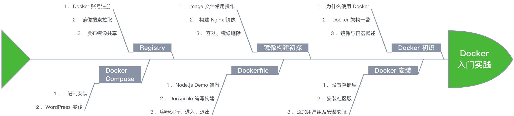
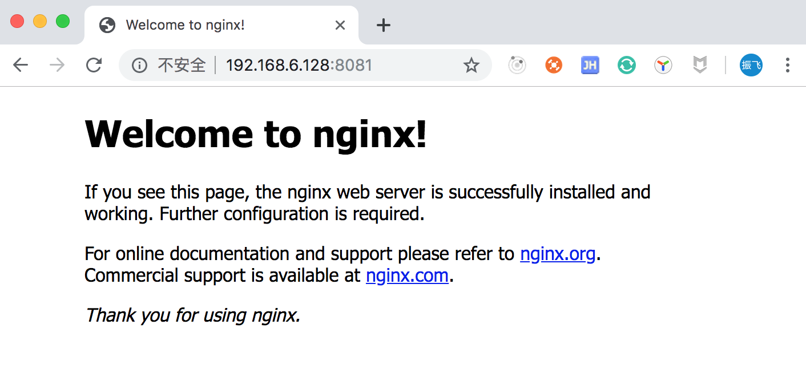
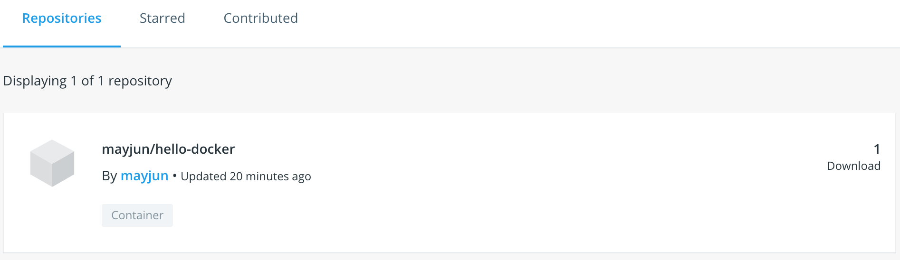

# Docker 入门到实践

Docker 自 2013 年发布至今一直备受关注，从招聘面试角度来看有些职位对于了解 Docker、K8S 这些也有一些加分项，同时学习 Docker 也是后续学习 K8S 的基础，但是对于 Docker 很多人也需并不了解，其实 Docker 也并没有那么难，本文从 Docker 入门到应用实践为大家进行讲解，中间也列举了很多实例，希望能帮助大家更好的理解。

## 快速导航

- [Docker 初识](#Docker初识)
- [Docker 安装](#Docker安装)
- [镜像构建初探](#镜像构建初探)
- [Dockerfile 实践](#Dockerfile实践)
- [Registry 实践](#Registry实践)
- [Docker Compose 实践](#DockerCompose实践)

**本篇 Docker 入门到实践路线图如下所示**



## Docker初识

#### 为什么要使用 Docker

Docker 可以将应用以集装箱的方式进行打包，通过镜像的方式可以实现在不同的环境下进行快速部署，在团队中还可实现一次打包，多次共享，使用 Docker 可以轻松的为任何应用创建一个轻量级的、可移植的、自给自足的容器。

例如，我们在本地将编译测试通过的程序打包成镜像，可以快速的在服务器环境中进行部署，有时也能解决不同的开发环境造成的问题 “明明我本地是好的，但是一到服务器就不行”。

为什么要使用 Docker？总结下来其有以下优点：

* 高效的利用系统资源（节约成本）
* 持续交付与部署（敏捷）
* 多平台的迁移更容易（可移植性）
* 容易的沙箱机制（安全性）

#### Docker 架构一瞥
 
中间部位为我们进行 Docker 操作的宿主机，其运行了一个 Docker daemon 的核心守护程序，负责构建、运行和分发 Docker 容器。

左边为 Docker 客户端，其与 Docker 守护进程进行通信，客户端会将 build、pull、run 命令发送到 Docker 守护进程进行执行。

右边为 Docler 注册表存储 Docker 镜像，是一个所有 Docker 用户共享 Docker 镜像的服务，Docker daemon 与之进行交互。


#### Docker 镜像与容器概述

参考 [https://docs.docker.com/engine/docker-overview/](https://docs.docker.com/engine/docker-overview/)

**什么是 Docker 镜像**

Docker 会把应用程序及依赖打包进镜像（Images）里，提供了容器运行时所需的程序、库、资源、配置等文件外，还包含了一些为运行时准备的一些配置参数（如匿名卷、环境变量、用户等），通过这个镜像文件可生成 Docker 容器。

例如：这个镜像文件包含了一个完整的 Ubuntu 系统，我们可以在 Ubuntu 镜像基础之上安装了 Redis、Mysql 等其它应用程序，可以回顾下 [Docker 架构一瞥](#Docker架构一瞥) 在 DOCKER_HOST 里面有个 images。

另外在制作好镜像文件之后可以拷贝到其它机器使用，它是通用的，镜像的制作可以基于 Dockerfile 构建后面会讲解。

**什么是 Docker 容器**

**容器是镜像的可运行实例**，你可以使用 Docker API 创建、启动、停止、移动或删除它，

在默认情况下，容器与其它容器及其主机是隔离的，拥有自己的独立进程空间、网络配置。

容器由其镜像以及在创建或启动容器时提供的任何配置选项定义。当容器被删除时，对其状态的任何未存储在持久存储中的更改都会消失。

## Docker安装

Docker 是一个开源的商业产品，提供了社区版（CE）和企业版（EE），以下也都是基于企业版进行介绍，我这里操作系统采用的 Linux 下 Ubuntu 系统，更多安装方式也可参照官网安装指南 [https://docs.docker.com/install/](https://docs.docker.com/install/)

#### 更改 docker 源

这个看情况，因为 Docker 的源在国外，国内访问速度可能会不稳定，有需要的可以按照以下步骤更换为国内源

* 编辑 /etc/docker/daemon.json 文件，输入 docker-cn 镜像源地址

```
$ sudo vim /etc/docker/daemon.json

{
  "registry-mirrors": ["https://registry.docker-cn.com"]
}
```

* 重启 Docker 服务

```
$ sudo service docker restart
```

#### 设置存储库

1. 更新 apt 软件包缓存

```bash
sudo apt-get update
```

2. 在机器上首次安装的需先设置 Docker 存储库，由于 apt 源使用 HTTPS 以确保软件下载过程中不被篡改。因此，我们首先需要添加使用 HTTPS 传输的软件包以及 CA 证书。

```bash
$ sudo apt-get install \
    apt-transport-https \
    ca-certificates \
    curl \
    gnupg-agent \
    software-properties-common
```

3. 添加 Docker 的官方 GPG 密钥

```bash
$ curl -fsSL https://download.docker.com/linux/ubuntu/gpg | sudo apt-key add -
```

4. 向 source.list 中添加 Docker 软件源

```bash
$ sudo add-apt-repository \
   "deb [arch=amd64] https://download.docker.com/linux/ubuntu \
   $(lsb_release -cs) \
   stable"
```

#### 安装 Docker EC（社区版）

1. 更新 apt 软件包缓存

```bash
sudo apt-get update
```

2. 安装

```shell
sudo apt-get install docker-ce docker-ce-cli containerd.io
```

执行以下命令使用脚本自动安装，这也是最简化的安装流程，它会检测你当前使用的 Linux 版本，选择合适的安装包进行安装，

```shell
sudo wget -qO- https://get.docker.com | sh
```

#### 添加 Docker 用户组

由于 Docker 操作需要拥有 root 权限，为避免每次都输入 sudo，可以把用户加入 Docker 用户组，执行以下命令

```shell
# https://docs.docker.com/install/linux/linux-postinstall/#manage-docker-as-a-non-root-user
$ sudo usermod -aG docker $USER
```

#### 验证

安装完成后，运行下面的命令，验证是否安装成功

```
$ docker -v
Docker version 19.03.2, build 6a30dfc
```

## 镜像构建初探

上面对 Docker 的镜像和容器做了简要概述，有个初步的了解之后，再来看下 Docker 镜像和容器的实践。

#### 抓取 image 文件到本地

hello-world 为镜像名字，docker image pull 为抓取镜像命令，Docker 官方提供的 image 文件都放在 library 默认组里，library/hello-world 也就为 image 文件的位置。

```bash
$ docker image pull hello-world
# 以下为抓取过程中的日志信息
Using default tag: latest
latest: Pulling from library/hello-world
1b930d010525: Pull complete 
Digest: sha256:451ce787d12369c5df2a32c85e5a03d52cbcef6eb3586dd03075f3034f10adcd
Status: Downloaded newer image for hello-world:latest
docker.io/library/hello-world:latest
```        

#### 查看 image 文件列表

image 文件抓取成功通过 docker images 或 docker image ls 命令查看当前都有哪些镜像

```bash
$ docker image ls
REPOSITORY          TAG                 IMAGE ID            CREATED             SIZE
hello-world         latest              fce289e99eb9        8 months ago        1.84kB
```

#### 运行 image 文件

执行 ```docker container run``` 命令会生成一个正在运行的容器实例，另外 ```docker container run``` 发现本地没有指定的 image 文件，其自身还有自动抓取 image 文件功能，就是上面讲解的 ```docker image pull``` 命令

```bash
$ docker container run hello-world

Hello from Docker!

# 以下内容省略
...
```

#### 查看容器列表

使用 ```docker ps``` 或 ```docker container ls``` 命令用来查看正在运行的容器列表，这个时候是没有正在运行的容器实例的，因为在以上 ```docker container run hello-world``` 命令执行之后 ```hello-world``` 就会停止，容器也会随着自动停止，但并不是所有的容器运行之后也都会停止的，例如 Nginx 后面会进行实践。

```
$ docker ps
```

通过 ```docker ps --all``` 或 ```docker container ls --all``` 命令可以查看所有的容器实例，包含已经停止的

```
$ docker ps --all
CONTAINER ID        IMAGE               COMMAND             CREATED             STATUS                      PORTS               NAMES
a662ec198a83        hello-world         "/hello"            10 minutes ago      Exited (0) 10 minutes ago                       exciting_wing
```

#### 构建一个 Nginx 镜像

以下命令会用 nginx 镜像启动一个容器，命名为 nginxserver，并映射到 8081 端口

```bash
$ docker container run --name nginxserver -d -p 8081:80 nginx
```

好了，我们现在就可以使用 http://localhost:8081/ 来访问这个 Nginx 服务器，由于我这里是在虚拟机上安装的 Docker 因此要使用我的虚拟机地址 http://192.168.6.128:8081/ 进行访问，同样如果你是在虚拟机、云服务器上安装的 Docker 也要使用相应的 ip 来访问，如果是在本机直接 localhost 就可以。以下为 Nginx 默认的欢迎页面。



再分别看下目前的 image 列表和正在运行的容器

```bash
$ docker images
REPOSITORY          TAG                 IMAGE ID            CREATED             SIZE
nginx               latest              5a3221f0137b        3 weeks ago         126MB
hello-world         latest              fce289e99eb9        8 months ago        1.84kB

$ docker ps
CONTAINER ID        IMAGE               COMMAND                  CREATED             STATUS              PORTS                  NAMES
b7bf26745b3f        nginx               "nginx -g 'daemon of…"   23 minutes ago      Up 23 minutes       0.0.0.0:8081->80/tcp   nginxserver
```

#### 终止容器

通过 ```docker container kill [containID]``` 命令终止正在运行的容器

```bash
# docker container kill [containID]
$ docker container kill b7bf26745b3f
```

#### 删除容器文件

上面的终止容器并不会删除容器文件，仅仅是容器停止运行，通过 docker ps --all 命令查看所有的容器列表

```bash
$ docker ps --all
CONTAINER ID        IMAGE               COMMAND                  CREATED             STATUS                            PORTS               NAMES
b7bf26745b3f        nginx               "nginx -g 'daemon of…"   29 minutes ago      Exited (137) About a minute ago                       nginxserver
a662ec198a83        hello-world         "/hello"                 49 minutes ago      Exited (0) 49 minutes ago                             exciting_wing
```

由于已经终止容器文件依然会占据着我们的磁盘空间，在不使用的情况可通过 ```docker container rm [containerID]``` 命令删除

```
$ docker container rm b7bf26745b3f a662ec198a83
```

执行以上命令之后，再使用 ```docker ps --all``` 命令，此时容器列表就为空了。

#### 删除镜像文件

同样删除一个镜像文件也很简单执行 ```docker rmi [imageID]``` 命令即可

```
$ docker rmi 5a3221f0137b fce289e99eb9
```

## Dockerfile实践

Dockerfile 是由一系列的参数、命令构成的可执行脚本，用来构建、定制 Docker 镜像。本节通过一个 Node.js 的简单项目为例，介绍下如何编写 Dockerfile 文件、如何在 Docker 容器里运行 Node.js 项目。

#### Nodejs项目准备

/usr/src/nodejs/hello-docker 目录下新建 app.js

```js
// /usr/src/nodejs/hello-docker/app.js
const http = require('http');
const PORT = 30010;

const server = http.createServer((req, res) => {
    res.end('Hello Docker');
})

server.listen(PORT, () => {
    console.log('Running on http://localhost:', PORT);
});
```

/usr/src/nodejs/hello-docker 目录下新建 package.json

```js
// /usr/src/nodejs/hello-docker/package.json
{ 
  "name": "hello-docker", 
  "version": "1.0.0",
  "description": "", 
  "author": "May",
  "main": "app.js",   
  "scripts": { 
    "start": "node app.js"
  },
  "dependencies": { 
    
  }
}
```

#### Dockerfile 编写

首先在项目根目录下创建 .dockerignore 文件，把不需要打包进 Docker Image 里的文件进行过滤

```shell
# /usr/src/nodejs/hello-docker/.dockerignore
.git
node_modules
```

**Dockerfile**

项目根目录下新建 Dockerfile 文件

```Dockerfile
# /usr/src/nodejs/hello-docker/Dockerfile

FROM node:10.0

# 在容器中创建一个目录
RUN mkdir -p /usr/src/nodejs/

# 定位到容器的工作目录
WORKDIR /usr/src/nodejs/

# RUN/COPY 是分层的，package.json 提前，只要没修改，就不会重新安装包
COPY package.json /usr/src/app/package.json
RUN cd /usr/src/app/
RUN npm i

# 把当前目录下的所有文件拷贝到 Image 的 /usr/src/nodejs/ 目录下
COPY . /usr/src/nodejs/


EXPOSE 30010
CMD npm start
```

* FROM：FROM 是构建镜像的基础源镜像，该 Image 文件继承官方的 node image
* RUN：后面跟的是在容器中执行的命令
* WORKDIR：容器的工作目录
* COPY：拷贝文件至容器的工作目录下，.dockerignore 指定的文件不会拷贝
* EXPOSE：将容器内的某个端口导出供外部访问
* CMD：Dockerfile 执行写一个 CMD 否则后面的会被覆盖，CMD 后面的命令是容器每次启动执行的命令，多个命令之间可以使用 && 链接，例如 CMD git pull && npm start 

#### 构建 hello-docker 镜像文件

Dockerfile 文件创建好之后，使用 ```docker image build``` 命令创建镜像文件，-t 参数用来指定镜像的文件名称，最后一个 **.** 也不要省略，表示 Dockerfile 文件的所在目录

```
$ docker image build -t hello-docker .
```

执行以上命令之后，我们来查看下新生成的镜像文件 hello-docker

```
$ docker images
REPOSITORY          TAG                 IMAGE ID            CREATED             SIZE
hello-docker        latest              6b1c2775591e        4 minutes ago       675MB
node                10.0                1c1272350058        16 months ago       675MB
```

#### 运行容器

镜像构建成功之后通过 docker container run 命令来生成一个容器，几个参数说明：

* -d：表明容器的运行模式在后台
* -p：端口映射，将本机的 30000 端口映射到容器的 30010 端口，这样在外网就可通过 30000 端口访问到我们的服务
* hello-docker：为我们的镜像名字

```
$ docker container run -d -p 30000:30010 hello-docker
```

执行以上命令之后通过 docker ps 查看我们刚刚运行的容器信息

```
$ docker ps
CONTAINER ID        IMAGE               COMMAND                  CREATED             STATUS              PORTS                      NAMES
c2891d477edf        hello-docker        "/bin/sh -c 'npm sta…"   15 seconds ago      Up 14 seconds       0.0.0.0:30000->30010/tcp   pedantic_mestorf
```

不出什么意外，此时我们的 Node.js 服务已经运行在 Docker 容器的虚拟环境里了，访问 ```curl http://localhost:30000``` 可以进行测试。

```
$ curl http://localhost:30000
Hello Docker
```

#### 检查日志

查看运行日志，“c2891d477edf” 为容器 ID

```bash
$ docker logs -f c2891d477edf

> hello-docker@1.0.0 start /usr/src/nodejs/hello-docker
> node app.js

Running on http://localhost: 30010
```

#### 容器进入退出

为了方便排查内部容器文件，可以通过 **docker exec -it c2891d477edf /bin/sh** 命令进入容器，c2891d477edf 为容器 ID

```bash
$ docker exec -it c2891d477edf /bin/sh
$ ls # 列出目录列表
Dockerfile  app.js  package-lock.json  package.json
```

由于我们已经启动了 hello-docker 这个服务，在容器里再次操作 node app.js 就会报端口冲突

```
$ node app
events.js:167
      throw er; // Unhandled 'error' event
      ^

Error: listen EADDRINUSE :::30010
```

**按下 Ctrl + d （或者输入 exit）退出容器**

## Registry实践

Registry 是一个注册服务器，是一个集中存放镜像仓库的地方，这里着重介绍下 Docker Hub，它是官方维护的一个公共仓库，我们的大部分需求也都可从这里下载。

#### 注册 Docker 账号

在开始之前你需要先去 Docker 官网注册一个账号 [https://hub.docker.com/](https://hub.docker.com/) 后续讲解发布镜像需要用到

#### 镜像搜索

使用 ```docker search 镜像名称``` 可以搜索你需要的镜像，搜索结果会根据 STARS 进行排序

```bash
$ docker search nginx
NAME                              DESCRIPTION                                     STARS               OFFICIAL            AUTOMATED
nginx                             Official build of Nginx.                        11935               [OK]                
jwilder/nginx-proxy               Automated Nginx reverse proxy for docker con…   1651                                    [OK]
richarvey/nginx-php-fpm           Container running Nginx + PHP-FPM capable of…   740                                     [OK]
...
```

#### 镜像拉取

搜索到需要的镜像后执行 docker pull 命令拉取镜像

```
$ docker pull nginx
```

#### 发布镜像实现共享

1. 登陆 Docker，已登陆的可以忽略这一步 

```
$ docker login
```

2. 为本地镜像打标签，tag 不写默认为 latest

```bash
# docker image tag [imageName] [username]/[repository]:[tag]
$ docker image tag hello-docker mayjun/hello-docker
```

3. 发布镜像文件

```bash
# docker image push [username]/[repository]:[tag]
$ docker image push mayjun/hello-docker
```

镜像发布成功之后，在自己的个人用户下也可以看到镜像信息



如果你想在别的机器上也使用这个镜像，直接 docker pull 拉取即可，实现镜像的共享。

## DockerCompose实践

Compose 是 Docker 官方开源的一个项目，可以管理多个 Docker 容器组成一个应用，例如 Web 服务，除了服务本身还有数据库、Redis、Nginx 等一系列相关联服务需要安装。

有个 Compose 的支持，我们只需要定义一个 YAML 格式的配置文件（```docker-compose.yml```），来编写一个项目所需要的多个容器配置及调用关系，通过简单的命令即可同时开始或者关闭这些容器。

#### 二进制安装

[https://github.com/docker/compose/releases](https://github.com/docker/compose/releases)

```bash
# compose 下载之后通过管道的方式输入至 /usr/local/bin/docker-compose
# uname -s 查找是什么系统，例如：Linux
# uname -m 查找是什么版本，例如：x86_64
$ curl -L https://github.com/docker/compose/releases/download/1.25.0-rc2/docker-compose-`uname -s`-`uname -m` -o /usr/local/bin/docker-compose

# 把这个文件变成可执行的
$ chmod +x /usr/local/bin/docker-compose
```

查看安装是否成功

```
$ docker-compose --version 
docker-compose version 1.25.0-rc2, build 661ac20e
```

#### Docker Compose 搭建 WordPress 个人博客

> WordPress 是一个免费开源的个人博客系统，使用的也是比较多的，并且也有 Docker 镜像，使用 Docker 部署还是非常简单的。

在 /usr/src/wordpress 目录下，建立 docker-compose.yml 配置文件，写入如下内容：

```yml
mysql:
    image: mysql:5.7
    environment:
     - MYSQL_ROOT_PASSWORD=123456
     - MYSQL_DATABASE=wordpress
web:
    image: wordpress
    links:
     - mysql
    environment:
     - WORDPRESS_DB_PASSWORD=123456
    ports:
     - "192.168.6.128:8080:80"
    working_dir: /var/www/html
    volumes:
     - wordpress:/var/www/html
```

启动容器，浏览器输入 http://192.168.6.128:8080 即可看到效果，可以亲自实践下

```bash
# -d 参数表示后台启动
$ docker-compose up -d 
```

关闭容器，执行以下命令需要在 docker-compose.yml 配置文件同级目录下

```
$ docker-compose stop
```

本文是作者 “五月君” 在实践 Docker 过程中的一些知识总结，刚开始也是从零开始的，如果你想学习 Docker 不知道该如何入手，可以参考本文，后续还会有 Docker 在应用程序中的实践分享，感兴趣的可以关注公众号 “Nodejs技术栈” Github: [https://github.com/Q-Angelo/Nodejs-Roadmap ](https://github.com/Q-Angelo/Nodejs-Roadmap ) 获取最新消息