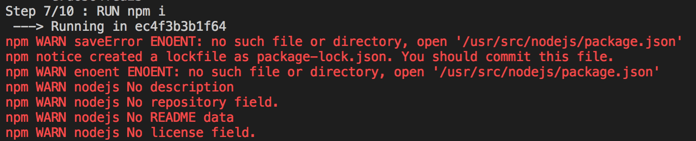

# Node.js 服务 Docker 容器化应用实践

本篇不会讲解 Docker 命令的使用、安装等，因为在之前一篇文章 [Docker 入门与实践]() 中也已经讲解的很详细了，不清楚的可以点击链接回头在重新看下，本篇重点是介绍 Node.js 项目如何进行 Docker 容器化及一些实践优化，还有一些常见的问题，当然如果还有其它使用上的问题也欢迎大家在评论区进行留言补充。

## Docker 化一个 Node.js 应用程序

在本篇开始我们先创建一个简单的 Node.js 应用，然后为这个应用创建一个 Docker 镜像，并构建和运行它

#### 创建 Node.js 项目

首先我们需要创建一个 app.js 开启一个 HTTP 服务，后面会借助 Docker 来运行这个程序

```js
const http = require('http');
const PORT = 30010;

const server = http.createServer((req, res) => {
    res.end('Hello Docker');
})

server.listen(PORT, () => {
    console.log('Running on http://localhost:', PORT, 'NODE_ENV', process.env.NODE_ENV);
});
```

然后我们创建一个 package.json 文件，这里是描述你的应用程序以及需要的依赖，写过 Node.js 的同学应该会很熟悉的，这里我在 scripts 里面增加了 ```npm run dev```、```npm run pro``` 两个命令，因为我想在这里介绍如何在构建时传入参数来动态设置环境变量。

```json
{ 
    "name": "hello-docker", 
    "version": "1.0.2",
    "description": "", 
    "author": "May",
    "main": "app.js",   
    "scripts": {
      "dev": "NODE_ENV=dev node app.js",
      "pro": "NODE_ENV=pro node app.js"
    }
}
```

#### Dockerfile 文件

这是一个 Dockerfile 文件所包含的信息，这些命令在 [Docker 入门与实践]() 中也有讲解过

```Dockerfile
FROM node:10.0-alpine

RUN apk --update add tzdata \
    && cp /usr/share/zoneinfo/Asia/Shanghai /etc/localtime \
    && echo "Asia/Shanghai" > /etc/timezone \
    && apk del tzdata

RUN mkdir -p /usr/src/nodejs/

WORKDIR /usr/src/nodejs/

# add npm package
COPY package.json /usr/src/nodejs/package.json
RUN cd /usr/src/nodejs/
RUN npm i

# copy code
COPY . /usr/src/nodejs/

EXPOSE 30010

CMD npm run dev
```

在 Dockerfile 的同级文件下创建一个 .dockerignore 文件，避免将你本地的调试文件、node_modules 等一些文件放入 Docker 容器中

```.dockerignore
.git
node_modules
npm-debug.log
```

此时通过以下命令即可构建一个 Docker 镜像

```
$ docker image build -t mayjun/hello-docker
```

再通过 docker run -d -p 30010:30010 mayjun/hello-docker 命令可运行一个 Docker 容器，但是有个疑问我是有生产和测试之分的，按照上面 ```CMD npm run dev``` 这样写死只能打包一种环境，当然你也可以在建一个文件来实现或者一些其它的方法。

#### 动态设置环境变量

为了解决上面的疑问，我的想法是在镜像构建时传入参数来动态设置环境变量，对 Dockerfile 文件做下修改，看以下实现：

```Dockerfile
EXPOSE 30010

ARG node_env # 新增加
ENV NODE_ENV=$node_env  # 新增加
CMD npm run ${NODE_ENV} # 修改
```

**下面对上面的代码做个解释**

* 通过 ARG 指令定义了一个变量，用户可以在构建时通过使用 --build-arg <varname>=<value> 标志的 docker build 命令将其传递给构建器 ```ARG node_env```
* 在 Dockerfile 中使用 ENV 引用这个变量 ```ENV NODE_ENV=$node_env```
* 这一步就是使用了 ```CMD npm run ${NODE_ENV}```

**剩下的就是在构建镜像时动态传入参数了**

```bash
$ docker image build --build-arg node_env=dev -t mayjun/hello-docker:1.0.2 . # 构建测试环境
$ docker image build --build-arg node_env=pro -t mayjun/hello-docker:1.0.2 . # 构建生产环境
```

**运行容器**

```bash
$ docker run -d -p 30010:30010 mayjun/hello-docker:1.0.2
$ docker ps
CONTAINER ID        IMAGE                       COMMAND                  CREATED             STATUS              PORTS                      NAMES
2bc6e62cd0e8        mayjun/hello-docker:1.0.2   "/bin/sh -c 'npm run…"   3 minutes ago       Up 3 minutes        0.0.0.0:30010->30010/tcp   elastic_bouman
```

**查看容器日志**

```$
docker logs -f 2bc6e62cd0e8

> hello-docker@1.0.0 dev /usr/src/nodejs
> NODE_ENV=dev node app.js

Running on http://localhost: 30010 NODE_ENV dev
```

我将以上代码打包成了镜像 mayjun/hello-docker:1.0.2，可以拉取查看 docker pull mayjun/hello-docker:1.0.2 

## Docker 与 Node.js 私有 NPM 包

如果你的项目中使用了私有 NPM 包，在 Dcoker 构建镜像过程中会出现 npm 私有包安装 404 的错误，如果是在容器外部我们可以 npm login 登陆拥有 NPM 私有包权限的账户，来解决这个问题，但是在 Docker 的时候是不能这样做的。

**创建身份验证令牌**

为了安装私有包我们需要 “**创建身份验证令牌**” 以便在持续集成环境、Docker 容器内部能访问我们的私有 NPM 包，如何创建可参考 [https://docs.npmjs.com/creating-and-viewing-authentication-tokens](https://docs.npmjs.com/creating-and-viewing-authentication-tokens)

**实现方法**

我们在创建 Dockerfile 文件过程中就需要增加以下两条命令：

```Dockerfile
# 528das62-e03e-4dc2-ba67-********** 这个 Token 就为你创建的身份验证令牌 token
RUN echo "//registry.npmjs.org/:_authToken=528das62-e03e-4dc2-ba67-**********" > /root/.npmrc
RUN cat /root/.npmrc
```

## Egg 框架 Docker 容器化

在 Egg 里面，如果是 ```egg-scripts start --daemon```，**去掉 --daemon** 直接 egg-scripts start 即可，否则 Docker 容器会无法启动。

看以下代码示例，修改下 package.json 即可，Dockerfile 文件同上面第一个 **Docker 化一个 Node.js 应用程序** 是一样的

**package.json**

```js
{
  "scripts": {
    "start": "egg-scripts start" // 去掉 --daemon
  }
}
```

也可参考 Egg Issues “docker容器不能run起来，请问有碰到的吗？” [https://github.com/eggjs/egg/issues/1543](https://github.com/eggjs/egg/issues/1543) 

## Docker 镜像体积与构建时间优化

如果一个镜像在不经过优化的情况下体积通常都是会很大的，以下也是在实践过程中做的几点优化。

#### RUN/COPY 分层

Dockerfile 中的每条指令都会创建一个镜像层，Dockerfile 指令或复制的项目文件在没有修改变动的情况下，每个镜像层是可以被复用和缓存的。

以下代码可在 mayjun/hello-docker:latest 镜像仓库找到，以下示例中，源码改变之后，不管 package.json 有没有改变的情况下都会重新安装 NPM 模块，这样显然是不好的，因此下面我们要改进

```Dockerfile
# ...

WORKDIR /usr/src/nodejs/hello-docker
COPY . /usr/src/nodejs/hello-docker

RUN npm install

# ...
```

改进之后的代码如下所示，我们让 package.json 提前，在 package.json 没有修改的情况下是不会重新安装 NPM 包的，也会减少部署的时间。

```Dockerfile
# ...

WORKDIR /usr/src/nodejs/

# add npm package
COPY package.json /usr/src/app/package.json
RUN cd /usr/src/app/
RUN npm i

# copy code
COPY . /usr/src/app/

# ...
```


#### Node.js Alpine 镜像优化

mayjun/hello-docker:1.0.0 这个镜像在 Docker 仓库也可搜索到，在未优化之前大约在 688MB

$ docker images
REPOSITORY            TAG                 IMAGE ID            CREATED             SIZE
mayjun/hello-docker   1.0.0               7217fb3e9daa        5 seconds ago       688MB

**使用 Alpine 优化**

Alpine 是一个很小的 Linux 发行版，想要大幅度减小镜像体积选择 Node.js 的 Alpine 版本也是最简单的，另外 -alpine 的时区默认不是国内的，需要 Dockerfile 配置时区。

```Dockerfile
FROM node:10.0-alpine

RUN apk --update add tzdata \
    && cp /usr/share/zoneinfo/Asia/Shanghai /etc/localtime \
    && echo "Asia/Shanghai" > /etc/timezone \
    && apk del tzdata

RUN echo "Asia/Shanghai" > /etc/timezone

RUN mkdir -p /usr/src/nodejs/

WORKDIR /usr/src/nodejs/

# add npm package
COPY package.json /usr/src/app/package.json
RUN cd /usr/src/app/
RUN npm i

# copy code
COPY . /usr/src/app/

EXPOSE 30010
CMD npm start
```

重新打包了一个版本 mayjun/hello-docker:1.1.0 再次查看下效果，可以看到镜像文件从 688MB 减少至 85.3MB，这个体积优化还是很大的

```bash
$ docker images
REPOSITORY            TAG                 IMAGE ID            CREATED             SIZE
mayjun/hello-docker   1.1.0               169e05b8197d        3 minutes ago       85.3MB
```

#### 生产环境不要打包 devDependencies 包

有些测试环境用的包，在进行生产环境打镜像时不要包含进去，也就是 package.json 文件 devDependencies 对象，通过在 npm i 之后指定 --production 参数过滤

改进如下所示：

```Dockerfile
FROM node:10.0-alpine

# 省略 ...

# add npm package
COPY package.json /usr/src/app/package.json
RUN cd /usr/src/app/
RUN npm i --production # 改变在这了

# 省略 ...
```

重新打包了一个版本 mayjun/hello-docker:1.2.0 再次查看下效果，可以看到镜像文件从 85.3MB 又减少至 72.3MB

```
$ docker images
REPOSITORY            TAG                 IMAGE ID            CREATED             SIZE
mayjun/hello-docker   1.2.0               f018aa578711        3 seconds ago       72.3MB
```

## 常见问题

**Question1**

以下命令在删除镜像的时候报如下错误：

```bash
$ docker rmi 6b1c2775591e
Error response from daemon: conflict: unable to delete 6b1c2775591e (must be forced) - image is referenced in multiple repositories
```

细心的你也许会发现镜像 ID 6b1c2775591e 同时指向了 hello-docker 和 mayjun/hello-docker 仓库，这也是造成删除失败的原因

```bash
$ docker images
REPOSITORY            TAG                 IMAGE ID            CREATED             SIZE
mysql                 5.7                 383867b75fd2        6 days ago          373MB
hello-docker          latest              6b1c2775591e        7 days ago          675MB
mayjun/hello-docker   latest              6b1c2775591e        7 days ago          675MB
```

指定 repository 和 tag 来删除，执行删除命令之后再次查看 mayjun/hello-docker 仓库就已经没有了

```
$ docker rmi mayjun/hello-docker
$ docker images                 
REPOSITORY          TAG                 IMAGE ID            CREATED             SIZE
mysql               5.7                 383867b75fd2        6 days ago          373MB
hello-docker        latest              6b1c2775591e        7 days ago          675MB
```

**Question2**

执行删除镜像命令报如下错误：

```bash
$ docker rmi 9be467fd1285
Error response from daemon: conflict: unable to delete 9be467fd1285 (cannot be forced) - image is being used by running container 1febfb05b850
```

根据提示是有正在运行的容器，需先停止容器、删除容器之后在删除镜像

```bash
$ docker container kill 1febfb05b850 # 停止容器
$ docker rm 1febfb05b850 # 删除容器
$ docker rmi 9be467fd1285 # 删除镜像
```

**Question3**

设定的工作目录（WORKDIR）要与下面的要保持一致

```bash
...
WORKDIR /usr/src/nodejs/

# add npm package
COPY package.json /usr/src/node/package.json # 目录不一致
RUN cd /usr/src/node/ # 目录不一致
RUN npm i
...
```

例如如以上配置因为工作目录与实际 COPY 的目录不一致，会导致报以下错误： 




再按照以下方式更改为一致即可

```bash
...
WORKDIR /usr/src/nodejs/

# add npm package
COPY package.json /usr/src/nodejs/package.json # 更改为一致
RUN cd /usr/src/nodejs/ # 更改为一致
RUN npm i
...
```

## Refenrce

* [https://docs.npmjs.com/about-authentication-tokens](https://docs.npmjs.com/about-authentication-tokens)
* [https://docs.npmjs.com/creating-and-viewing-authentication-tokens](https://docs.npmjs.com/creating-and-viewing-authentication-tokens)