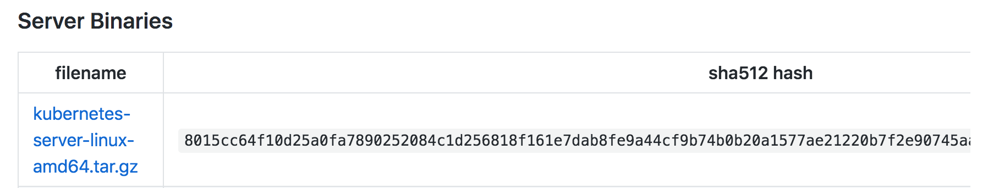
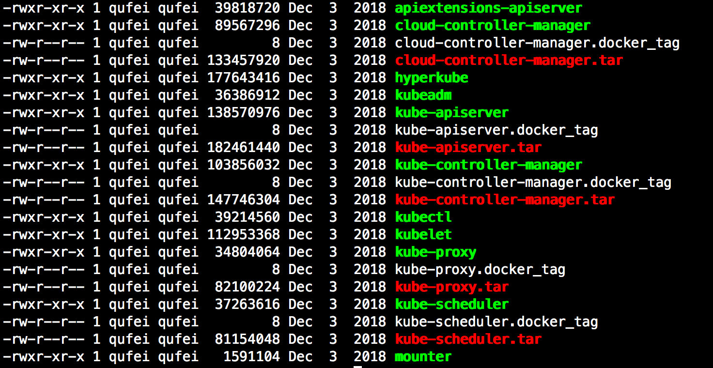

# kubernetes（K8S）二进制方式集群搭建

在 K8S 学习之前，集群搭建部分也能难倒一大片童鞋，这里采用二进制方式安装 Kubernetes 集群，难点是所有的步骤都要一步步走一遍，并且还易出错，但是同时好处是会对 K8S 的认识有一个整体的、更加深刻的理解。

## 搭建前准备工作

**机器准备**

机器              |  模式  | 节点名称  |
:----------------:|:------:|:-------:|
 192.168.6.128    | Master | k8s-master | 
 192.168.6.129    | Node | k8s-node1| 
 192.168.6.130    | Node | k8s-node2| 

**节点的组件分配**

主节点和 Node 节点分别要部署哪些组件，这里做个列举，后续在集群搭建过程中也都会一一讲到。

* **Master**：etcd，kube-apiserver，kube-controller-manager，kube-scheduler，kubelet

* **Node**：kubelet、docker、kube_proxy

**修改主机名与 IP 映射关系**

需要在 3 台机器上分别执行以下命令操作，修改主机名与 IP 之间的映射关系

```
$ sudo vim /etc/hosts
192.168.6.128 k8s-master
192.168.6.129 k8s-node1
192.168.6.130 k8s-node2
```
**安装 Docker**

需要在每台机器上安装 Docker，对 Docker 不熟悉的可参考之前写的文章 [Docker 入门到实践]() 中间有详细介绍对 Docker 的安装


## K8S证书和密钥创建

在网络通信中会存在一些不可信任的操作，例如信息可能会被第三方窃取、篡改。创建证书和密钥也是为了防范这种事情的发生，防止他人轻易入侵你的集群。对于网络安全业内也有一些成熟的方案，例如 **对称与非对称**、**SSL/TLS** 等。

这也是我们迈向集群搭建的第一步，先创建好各组件需要的证书和密钥

#### 安装 CFSSL

通过 [CFSSL https://github.com/cloudflare/cfssl](https://github.com/cloudflare/cfssl) 工具来生成 TLS 证书和密钥，这个需要在所有节点安装

```bash
# 下载
$ wget https://pkg.cfssl.org/R1.2/cfssl_linux-amd64 \
    https://pkg.cfssl.org/R1.2/cfssljson_linux-amd64 \
    https://pkg.cfssl.org/R1.2/cfssl-certinfo_linux-amd64

# 修改权限
$ chmod +x cfssl-certinfo_linux-amd64  cfssljson_linux-amd64  cfssl_linux-amd64

# 移动至 bin 目录
$ sudo mv cfssl_linux-amd64 /usr/local/bin/cfssl
$ sudo mv cfssljson_linux-amd64 /usr/local/bin/cfssljson
$ sudo mv cfssl-certinfo_linux-amd64 /usr/local/bin/cfssl-certinfo
```

**验证安装是否成功**

```bash
$ cfssl version
Version: 1.2.0
Revision: dev
Runtime: go1.6
```

#### 创建 CA 证书

创建 CA 配置文件、证书签名密钥，需要理解这里的根证书 CA 用来签名后续创建的其它证书（kubernetes、admin、kube-proxy...）

**创建 CA 配置文件**

```bash
# 创建证书存放目录
$ sudo mkdir /usr/src/kubernetes/ca

cd /usr/src/kubernetes/ca
cfssl print-defaults config > config.json
cfssl print-defaults csr > csr.json

cat > ca-config.json <<EOF
{
  "signing": {
    "default": {
      "expiry": "87600h"
    },
    "profiles": {
      "kubernetes": {
        "usages": [
            "signing",
            "key encipherment",
            "server auth",
            "client auth"
        ],
        "expiry": "87600h"
      }
    }
  }
}
EOF
```

**创建 CA 证书签名**

```bash
cat > ca-csr.json <<EOF
{
  "CN": "kubernetes",
  "key": {
    "algo": "rsa",
    "size": 2048
  },
  "names": [
    {
      "C": "CN",
      "ST": "ShangHai",
      "L": "ShangHai",
      "O": "k8s",
      "OU": "System"
    }
  ],
    "ca": {
       "expiry": "87600h"
    }
}
EOF
```

**生成 CA 证书和密钥**

此时就会多出两个文件 ```ca-key.pem  ca.pem``` 分别为新生成的密钥和证书

```bash
$ cfssl gencert -initca ca-csr.json | cfssljson -bare ca
$ ls
ca-config.json  ca.csr  ca-csr.json  ca-key.pem  ca.pem  config.json  csr.json
```

#### 创建 kubectl 管理员证书

kubectl 相当于系统管理，因此以下使用 admin 命名

```bash
# kubectl 证书存放目录
$ sudo mkdir /usr/src/kubernetes/ca/admin

# 创建 admin 证书签名存放文件
$ sudo vim admin-csr.json
{
  "CN": "admin",
  "hosts": [],
  "key": {
    "algo": "rsa",
    "size": 2048
  },
  "names": [
    {
      "C": "CN",
      "ST": "ShangHai",
      "L": "ShangHai",
      "O": "system:masters",
      "OU": "System"
    }
  ]
}
```
**生成 admin 证书和密钥**

使用根证书（ca.pem、ca-key.pem）签发 admin 证书

```bash
$ cfssl gencert \
    -ca=/usr/src/kubernetes/ca/ca.pem \
    -ca-key=/usr/src/kubernetes/ca/ca-key.pem \
    -config=/usr/src/kubernetes/ca/ca-config.json \
    -profile=kubernetes admin-csr.json | cfssljson -bare admin

$ ls
admin.csr  admin-csr.json  admin-key.pem  admin.pem
```

#### 创建 ETCD 证书


```bash
# etcd 证书存放目录
$ sudo mkdir /usr/src/kubernetes/ca/etcd

# 创建 etcd 证书签名存放文件
$ sudo vim etcd-csr.json
{
    "CN":"etcd",
    "hosts":[
        "127.0.0.1",
        "192.168.6.128",
        "192.168.6.129",
        "192.168.6.130"
    ],
    "key":{
        "algo":"rsa",
        "size":2048
    },
    "names":[
        {
            "C":"CN",
            "ST":"ShangHai",
            "L":"ShangHai",
            "O":"k8s"
        }
    ]
}
```

**生成 etcd 证书和密钥**

使用根证书（ca.pem、ca-key.pem）签发 etcd 证书

```bash
$ cfssl gencert \
    -ca=/usr/src/kubernetes/ca/ca.pem \
    -ca-key=/usr/src/kubernetes/ca/ca-key.pem \
    -config=/usr/src/kubernetes/ca/ca-config.json \
    -profile=kubernetes etcd-csr.json | cfssljson -bare etcd

$ ls
etcd.csr  etcd-csr.json  etcd-key.pem  etcd.pem
```

#### 创建 API-Server（kubernetes） 证书

kubernetes 集群的所有操作都是基于 kube-apiserver 这个组件进行的，显然这个也是核心，查资料大多数都是放在 kubernetes 目录下，你也可以自己定义名字，例如 api-server

```bash
# kubernetes 证书存放目录
$ sudo mkdir /usr/src/kubernetes/ca/kubernetes

# 创建 kubernetes 证书签名存放文件
$ sudo vim kubernetes-csr.json
{
    "CN": "kubernetes",
    "hosts": [
      "127.0.0.1",
      "192.168.6.128",
      "192.168.6.129",
      "192.168.6.130",
      "kubernetes"
    ],
    "key": {
        "algo": "rsa",
        "size": 2048
    },
    "names": [
        {
            "C": "CN",
            "ST": "ShangHai",
            "L": "ShangHai",
            "O": "k8s",
            "OU": "System"
        }
    ]
}
```

**生成 kubernetes 证书和密钥**

使用根证书（ca.pem、ca-key.pem）签发 kubernetes 证书

```bash
$ cfssl gencert \
    -ca=/usr/src/kubernetes/ca/ca.pem \
    -ca-key=/usr/src/kubernetes/ca/ca-key.pem \
    -config=/usr/src/kubernetes/ca/ca-config.json \
    -profile=kubernetes kubernetes-csr.json | cfssljson -bare kubernetes

$ ls
kubernetes.csr  kubernetes-csr.json  kubernetes-key.pem  kubernetes.pem
```

## kubectl命令行工具部署

#### 选择二进制文件

打开 [https://github.com/kubernetes/kubernetes/releases](https://github.com/kubernetes/kubernetes/releases) 选择相应的版本。从 “CHANGELOG-1.14.md” 进入二进制文件页，以 v1.14.6 为例，选择 Linux Server 版，如下所示：



注意，执行以下命令，这里是需要科学上网的，否则将无法下载，本处为大家提供了一个二进制包，可以直接在网盘下载，链接地址：[pan.baidu.com]()

```bash
$ wget https://dl.k8s.io/v1.14.6/kubernetes-server-linux-amd64.tar.gz #需要科学上网 
```

#### 部署二进制文件

如果是在百度网盘下载的二进制安装包，需要先通过 scp 命令从本地拷贝到服务器，如下所示：

```bash
# 三台机器都要同步
$ scp ${文件路径}/kubernetes-server-linux-amd64.tar.gz 用户名@192.168.6.128:/home/用户名
$ scp ${文件路径}/kubernetes-server-linux-amd64.tar.gz 用户名@192.168.6.129:/home/用户名
$ scp ${文件路径}/kubernetes-server-linux-amd64.tar.gz 用户名@192.168.6.130:/home/用户名
```

解压二进制安装包

```
$ tar -xvf kubernetes-server-linux-amd64.tar.gz
```

解压之后当前目录下会存在 kubernetes 目录，进入 kubernetes/server/bin 目录，看到如下文件列表，就已经解压成功了



此时，如果不是在系统的环境变量下，输入 kubectl vresion，会报如下错误，因为该命令并没有在全局

```
$ kubectl
kubectl: command not found
```

#### 环境变量设置

为了解决上面的问题将 kubernetes 的 bin 设置为全局，如果你是放在 /usr/local/bin 也就不需要做如下设置了

```bash
$ sudo vim /etc/profile

# 尾部增加如下命令，把路径替换为自己的

export PATH=$PATH:/home/用户名/kubernetes/server/bin
```

查看 kubectl 安装版本

```
$ kubectl version
Client Version: version.Info{Major:"1", Minor:"13", GitVersion:"v1.13.0", GitCommit:"ddf47ac13c1a9483ea035a79cd7c10005ff21a6d", GitTreeState:"clean", BuildDate:"2018-12-03T21:04:45Z", GoVersion:"go1.11.2", Compiler:"gc", Platform:"linux/amd64"}
```

#### 复制组件到 bin 目录

通过下面方式不用设置也可实现全局使用 kubectl 命令，另外一定要做这步，后续部署 kube-apiserver、kube-controller-manager、kube-scheduler 是需要的

```
$ cd kubernetes/server/bin
$ cp kube-scheduler kube-apiserver kube-controller-manager kubectl kubelet kube-proxy /usr/local/bin
```

#### 创建 kubectl kubeconfig 文件

1. **设置集群参数**

```bash
$ kubectl config set-cluster kubernetes \
  --certificate-authority=/usr/src/kubernetes/ca/ca.pem \
  --embed-certs=true \
  --server=https://192.168.6.128:6443
```

2. **设置客户端认证参数**

```bash
$ kubectl config set-credentials admin \
  --client-certificate=/usr/src/kubernetes/ca/admin/admin.pem \
  --embed-certs=true \
  --client-key=/usr/src/kubernetes/ca/admin/admin-key.pem
```

3. **设置上下文参数**

```bash
$ kubectl config set-context kubernetes \
  --cluster=kubernetes \
  --user=admin
```

4. **设置默认上下文**

```bash
kubectl config use-context kubernetes
```

经过以上 4 个步骤之后会生成一个 ~/.kube/config 文件，使用 **cat ~/.kube/config** 命令可查看


## ETCD部署

ETCD 类似于 Consul、ZK，常用于服务发现、注册、配置中心等，kubernetes 使用 ETCD 做为数据中心，用于存储节点信息、组件信息等。生产环境为了保证数据中心高可用，至少为 3 个节点，通常为 3～5 个节点。此处主要用于学习使用，仅建立一个单实例。

#### 下载 ETCD 二进制文件

浏览 [https://github.com/etcd-io/etcd/tags](https://github.com/etcd-io/etcd/tags) 选择更多的二进制版本文件

```bash
$ wget https://github.com/etcd-io/etcd/releases/download/v3.3.14/etcd-v3.3.14-linux-amd64.tar.gz
$ tar -xvf etcd-v3.3.14-linux-amd64.tar.gz
$ mv etcd-v3.3.14-linux-amd64/etcd* /usr/local/bin
```

#### 创建 etcd 的 systemd unit 文件

/lib/systemd/system/ 目录下创建 etcd.service 配置文件，解释一些核心配置参数

* WorkingDirectory：指定 etcd 的工作目录和数据目录为 /var/lib/etcd/，如果该目录不存在，启动前需先创建
* EnvironmentFile：指定环境环境变量文件（${ETCD_NAME} 变量设置的文件）
* --name ：指定节点名称（不要重复），当 --initial-cluster-state 值为 new 时， --name 的参数值必须位于 --initial-cluster 列表中；
* --listen-client-urls：监听的客户端 IP，一个是监听于本机的 127.0.0.1，另一个是监听于当前节点的 192.168.6.128
* --advertise-client-urls：建议的客户端 url 地址
* --cert-file：etcd server 与 client 通信时使用的证书
* --key-file：etcd server 与 client 通信时使用的密钥
* --peer-cert-file：etcd 与 peer 通信使用的证书
* --peer-key-file：etcd 与 peer 通信使用的密钥；
* --trusted-ca-file：签名 client 证书的 CA 证书，用于验证 client 证书
* --peer-trusted-ca-file ：签名 peer 证书的 CA 证书，用于验证 peer 证书；
* --initial-cluster-state new：决定了 --name 参数值
* --data-dir：存储数据的地址和 WorkingDirectory 定义的是同一个

```bash
[Unit]
Description=Etcd Server
After=network.target
After=network-online.target
Wants=network-online.target
Documentation=https://github.com/coreos

[Service]
Type=notify
WorkingDirectory=/var/lib/etcd/
EnvironmentFile=/etc/etcd/etcd.conf
ExecStart=/usr/local/bin/etcd \
  --name ${ETCD_NAME} \
  --listen-client-urls ${ETCD_LISTEN_CLIENT_URLS},http://127.0.0.1:2379 \
  --advertise-client-urls ${ETCD_ADVERTISE_CLIENT_URLS} \
  --cert-file=/usr/src/kubernetes/ca/etcd/etcd.pem \
  --key-file=/usr/src/kubernetes/ca/etcd/etcd-key.pem \
  --peer-cert-file=/usr/src/kubernetes/ca/etcd/etcd.pem \
  --peer-key-file=/usr/src/kubernetes/ca/etcd/etcd-key.pem \
  --trusted-ca-file=/usr/src/kubernetes/ca/ca.pem \
  --peer-trusted-ca-file=/usr/src/kubernetes/ca/ca.pem \
  --initial-advertise-peer-urls ${ETCD_INITIAL_ADVERTISE_PEER_URLS} \
  --listen-peer-urls ${ETCD_LISTEN_PEER_URLS} \
  
  # 以下注释掉的配置只有在 ETCD 为集群模式下才会使用
  #--initial-cluster-token ${ETCD_INITIAL_CLUSTER_TOKEN} \
  #--initial-cluster infra1=https://192.168.6.128:2380,infra2=https://192.168.6.129:2380,infra3=https://192.168.6.130:2380 \
  #--initial-cluster-state new \

  --data-dir=${ETCD_DATA_DIR}
Restart=on-failure
RestartSec=5
LimitNOFILE=65536

[Install]
WantedBy=multi-user.target
```

**设置 ETCD 环境变量文件**

```bash
$ vim /etc/etcd/etcd.conf
ETCD_NAME=ETCD Server
ETCD_DATA_DIR="/var/lib/etcd"
ETCD_LISTEN_PEER_URLS="https://192.168.6.128:2380"
ETCD_LISTEN_CLIENT_URLS="https://192.168.6.128:2379"

#[cluster]
ETCD_INITIAL_ADVERTISE_PEER_URLS="https://192.168.6.128:2380"
# ETCD_INITIAL_CLUSTER_TOKEN="etcd-cluster"
ETCD_ADVERTISE_CLIENT_URLS="https://192.168.6.128:2379"
```

**启动 ETCD 服务**

```bash
$ service etcd start

# 查看服务日志
journalctl -f -u etcd.service
```

**验证 ETCD 是否成功**

```
$ ETCDCTL_API=3 etcdctl \
  --endpoints=https://192.168.6.128:2379  \
  --cacert=/usr/src/kubernetes/ca/ca.pem \
  --cert=/usr/src/kubernetes/ca/etcd/etcd.pem \
  --key=/usr/src/kubernetes/ca/etcd/etcd-key.pem \
  endpoint health
```

返回以下响应，ETCD 就已经搭建成功了

```
https://192.168.6.128:2379 is healthy: successfully committed proposal: took = 59.751468ms
```

## Master 三大组件 kube-apiserver 部署

APIServer 负责对外提供 RESTful 的 kubernetes API 的服务，它是系统管理指令的统一接口，任何对资源的增删该查都要交给 APIServer 处理后再交给 etcd。

#### 配置文件

目录 ```/usr/lib/systemd/system/``` 新建配置文件 ```kube-apiserver.service``` 配置信息可参考 [官方：kube-apiserver 配置详解](https://kubernetes.io/zh/docs/reference/command-line-tools-reference/kube-apiserver/)

**生成 Token 认证文件**

```
$ head -c 16 /dev/urandom | od -An -t x | tr -d ' '
28b965fd841a996434a7a16237e4fa1a
$ echo "28b965fd841a996434a7a16237e4fa1a,kubelet-bootstrap,10001,\"system:kubelet-bootstrap\"" > /usr/src/kubernetes/ca/kubernetes/token.csv
```

**部分配置详解**

* admission-control：控制资源进入集群的准入控制插件的顺序列
* service-cluster-ip-range：CIDR表示的IP范围
* service-node-port-range：服务端口范围
* enable-swagger-ui：在 apiserver 的 /swagger-ui 路径启用 swagger ui
* allow-privileged：如果为 true, 将允许特权容器
* audit-log-path：如果设置该值，所有到 apiserver 的请求都将会被记录到这个文件。'-'表示记录到标准输出
* kubelet-https：为 kubelet 启用 https（默认值true）
* bind-address：监听--seure-port的IP地址。被关联的接口必须能够被集群其它节点和CLI/web客户端访问。如果为空，则将使用所有接口（0.0.0.0）。（默认值0.0.0.0）

**vim /usr/lib/systemd/system/kube-apiserver.service**

```bash
[Unit]
Description=Kubernetes API Service
Documentation=https://github.com/GoogleCloudPlatform/kubernetes
After=network.target
After=etcd.service

[Service]
ExecStart=/usr/local/bin/kube-apiserver \
  --admission-control=NamespaceLifecycle,NodeRestriction,LimitRanger,ServiceAccount,DefaultStorageClass,ResourceQuota \
  --bind-address=192.168.6.128 \
  --authorization-mode=Node,RBAC \
  --runtime-config=api/all \
  --enable-bootstrap-token-auth \
  --token-auth-file=/usr/src/kubernetes/ca/kubernetes/token.csv \
  --service-cluster-ip-range=10.68.0.0/16 \
  --service-node-port-range=1-32767 \
  --tls-cert-file=/usr/src/kubernetes/ca/kubernetes/kubernetes.pem \
  --tls-private-key-file=/usr/src/kubernetes/ca/kubernetes/kubernetes-key.pem \
  --client-ca-file=/usr/src/kubernetes/ca/ca.pem \
  --kubelet-client-certificate=/usr/src/kubernetes/ca/kubernetes/kubernetes.pem \
  --kubelet-https=true \
  --kubelet-client-key=/usr/src/kubernetes/ca/kubernetes/kubernetes-key.pem \
  --service-account-key-file=/usr/src/kubernetes/ca/ca-key.pem \
  --etcd-cafile=/usr/src/kubernetes/ca/ca.pem \
  --etcd-certfile=/usr/src/kubernetes/ca/kubernetes/kubernetes.pem \
  --etcd-keyfile=/usr/src/kubernetes/ca/kubernetes/kubernetes-key.pem \
  --etcd-servers=https://192.168.6.128:2379 \
  --enable-swagger-ui=true \
  --allow-privileged=true \
  --audit-log-maxage=30 \
  --audit-log-maxbackup=3 \
  --audit-log-maxsize=100 \
  --audit-log-path=/var/log/kube-apiserver-audit.log \
  --event-ttl=1h \
  --v=2
Restart=on-failure
Type=notify
LimitNOFILE=65536

[Install]
WantedBy=multi-user.target
```

**启动 Kube Apiserver 服务**

```bash
$ cd /usr/lib/systemd/system/
$ systemctl daemon-reload
$ systemctl enable kube-apiserver.service

# 执行以下步骤如果出现启动错误，根据 "systemctl status kube-apiserver.service 或 journalctl -xe 找到 Error 的地方进行排查
$ service kube-apiserver start
```

**检查 Kube Apiserver 服务**

```
$ systemctl status kube-apiserver
● kube-apiserver.service - Kubernetes API Service
   Loaded: loaded (/usr/lib/systemd/system/kube-apiserver.service; enabled; vendor preset: enabled)
   Active: active (running) since Fri 2019-09-20 03:08:26 PDT; 1min 48s ago
     Docs: https://github.com/GoogleCloudPlatform/kubernetes
 Main PID: 34393 (kube-apiserver)
    Tasks: 8
   Memory: 194.1M
      CPU: 11.863s
   CGroup: /system.slice/kube-apiserver.service
           └─34393 /usr/local/bin/kube-apiserver --admission-control=NamespaceLifecycle,NodeRestriction,LimitRanger,ServiceAccount,DefaultStorageClass,ResourceQuota --bind-address=192.168.6.128 

Sep 20 03:08:29 ubuntu kube-apiserver[34393]: I0920 03:08:29.922993   34393 controller.go:606] quota admission added evaluator for: rolebindings.rbac.authorization.k8s.io
Sep 20 03:08:29 ubuntu kube-apiserver[34393]: I0920 03:08:29.929755   34393 storage_rbac.go:284] created rolebinding.rbac.authorization.k8s.io/system:controller:bootstrap-signer in kube-public
Sep 20 03:08:29 ubuntu kube-apiserver[34393]: I0920 03:08:29.971198   34393 storage_rbac.go:284] created rolebinding.rbac.authorization.k8s.io/system::extension-apiserver-authentication-reader i
Sep 20 03:08:30 ubuntu kube-apiserver[34393]: I0920 03:08:30.014130   34393 storage_rbac.go:284] created rolebinding.rbac.authorization.k8s.io/system::leader-locking-kube-controller-manager in k
Sep 20 03:08:30 ubuntu kube-apiserver[34393]: I0920 03:08:30.049138   34393 storage_rbac.go:284] created rolebinding.rbac.authorization.k8s.io/system::leader-locking-kube-scheduler in kube-syste
Sep 20 03:08:30 ubuntu kube-apiserver[34393]: I0920 03:08:30.094243   34393 storage_rbac.go:284] created rolebinding.rbac.authorization.k8s.io/system:controller:bootstrap-signer in kube-system
Sep 20 03:08:30 ubuntu kube-apiserver[34393]: I0920 03:08:30.130311   34393 storage_rbac.go:284] created rolebinding.rbac.authorization.k8s.io/system:controller:cloud-provider in kube-system
Sep 20 03:08:30 ubuntu kube-apiserver[34393]: I0920 03:08:30.173883   34393 storage_rbac.go:284] created rolebinding.rbac.authorization.k8s.io/system:controller:token-cleaner in kube-system
Sep 20 03:08:30 ubuntu kube-apiserver[34393]: W0920 03:08:30.280703   34393 lease.go:222] Resetting endpoints for master service "kubernetes" to [192.168.6.128]
Sep 20 03:08:30 ubuntu kube-apiserver[34393]: I0920 03:08:30.328625   34393 controller.go:606] quota admission added evaluator for: endpoints
```

## Master 三大组件 kube-controller-manager 部署

**配置文件**

目录 /usr/lib/systemd/system/ 新建配置文件 kube-controller-manager.service 配置信息可参考 [官方：kube-controller-manager 配置详解](https://kubernetes.io/docs/reference/command-line-tools-reference/kube-controller-manager/)

**配置讲解**

**vim /usr/lib/systemd/system/kube-controller-manager.service**

```bash
[Unit]
Description=Kubernetes Controller Manager
Documentation=https://github.com/GoogleCloudPlatform/kubernetes
[Service]
ExecStart=/usr/local/bin/kube-controller-manager \
  --address=127.0.0.1 \
  --master=http://127.0.0.1:8080 \
  --allocate-node-cidrs=true \
  --service-cluster-ip-range=10.68.0.0/16 \
  --cluster-cidr=172.20.0.0/16 \
  --cluster-name=kubernetes \
  --leader-elect=true \
  --cluster-signing-cert-file=/usr/src/kubernetes/ca/ca.pem \
  --cluster-signing-key-file=/usr/src/kubernetes/ca/ca-key.pem \
  --service-account-private-key-file=/usr/src/kubernetes/ca/ca-key.pem \
  --root-ca-file=/usr/src/kubernetes/ca/ca.pem \
  --v=2
Restart=on-failure
RestartSec=5
[Install]
WantedBy=multi-user.target
```

**启动 Kube kube-controller-manager 服务**

```bash
$ cd /usr/lib/systemd/system/
$ systemctl daemon-reload # 修改配置重启的时候用
$ systemctl enable kube-controller-manager.service
$ service kube-controller-manager start
```

**检查 Kube kube-controller-manager 服务**

```
$ systemctl status kube-controller-manager
● kube-controller-manager.service - Kubernetes Controller Manager
   Loaded: loaded (/usr/lib/systemd/system/kube-controller-manager.service; enabled; vendor preset: enabled)
   Active: active (running) since Fri 2019-09-20 22:37:21 PDT; 1min 39s ago
     Docs: https://github.com/GoogleCloudPlatform/kubernetes
 Main PID: 35904 (kube-controller)
    Tasks: 7
   Memory: 94.2M
      CPU: 3.194s
   CGroup: /system.slice/kube-controller-manager.service
```

## Master节点kube-proxy部署

[kube-proxy 配置详解](https://kubernetes.io/zh/docs/reference/command-line-tools-reference/kube-proxy/)


## 阅读推荐

以下有些虽不是用的二进制方式安装，有需要的也可以参考下

* [十分钟带你理解Kubernetes核心概念](http://www.dockone.io/article/932)
* [A Tutorial Introduction to Kubernetes](http://okigiveup.net/a-tutorial-introduction-to-kubernetes/)
* [https://www.cnblogs.com/along21/p/10303495.html](https://www.cnblogs.com/along21/p/10303495.html)
* [https://github.com/liuyi01/kubernetes-starter](https://github.com/liuyi01/kubernetes-starter)
* [https://www.jianshu.com/p/8067912667f1](https://www.jianshu.com/p/8067912667f1)
* [https://github.com/easzlab/kubeasz](https://github.com/easzlab/kubeasz)
* [https://github.com/kubesphere](https://github.com/kubesphere/kubesphere/blob/master/README_zh.md)
* [https://www.cnblogs.com/lion.net/p/10408512.html](https://www.cnblogs.com/lion.net/p/10408512.html)
* [Kubernetes中文指南/云原生应用架构实践手册](https://jimmysong.io/kubernetes-handbook/)