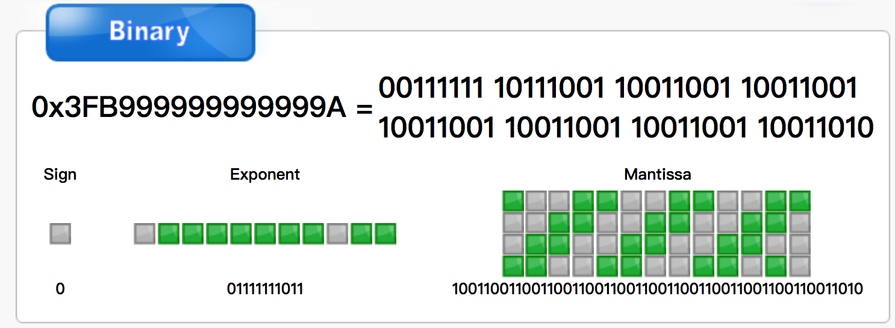

# JavaScript 浮点数之迷：0.1 + 0.2 为什么不等于 0.3？


“0.1 + 0.2 = ?” 这个问题，你要是问小学生，他也许会立马告诉你 0.3。但是在计算机的世界里就没有这么简单了，做为一名程序开发者在你面试时如果有人这样问你，小心陷阱喽！

你可能在哪里见过 “0.1 + 0.2 = 0.30000000000000004” 但是知道这背后真正的原理吗？是只有 JavaScript 中存在吗？带着这些疑问本文将重点梳理这背后的原理及浮点数在计算机中的存储机制。

## 通过本文你能学到什么？

* 浮点数先修知识，更好的帮你理解本文知识
* IEEE 754 标准是什么？
* 0.1 在 IEEE 754 标准中是如何存储的？
* 0.1 + 0.2 等于多少？
* 只有 JavaScript 中存在吗？

## 先修知识

以下是一些基础的，可能被你所忽略的知识，了解它很有用，因为这些基础知识在我们的下文讲解中都会应用到，如果你已掌握了它，可以跳过本节。

> **1.** 计算机的内部是如何存储的？一个浮点数 float a = 1 会存储成 1.0 吗？

计算机内部都是采用二进制进行表示，即 **0 1** 编码组成。在计算机中是没有 1.0 的，它只认 **0 1** 编码。

> **2.** 1bit 可以存储多少个整数？8bit 可以存储多少个整数？

N 个 bit 可以存储的整数是 2 的 N 次方个。8bit 为 2 的 8 次方（$2^{8}=256$）。

> **3.** 了解下科学计数法，下文讲解会用到

在日常生活中遇到一个比较的大的数字，例如全国总人口数、每秒光速等，在物理上用这些大数表达很不方便，通常可以采用科学计数法表达。

**以下为 10 进制科学计数法表达式，底数为 10 ，其中 1≤|a|<10，n 为整数**

$$
a*10^n
$$

例如，0.1 的科学计数法表示为 $0.1 = 1 * 10^{-1}$。（一个数的 -1 次方等于该数的倒数，例如 $10^{-1}$ = $\frac{10}{1}$）

**在 IEEE 754 标准中也类似，只不过它是以一个二进制数来表示，底数为 2**，以下为 0.1 的二进制表达式：

$$
1.10011001100110011(0011 无限循环) *  2^{-4}
$$

> **4.** 十进制小数如何转二进制？

十进制小数转二进制，小数部分，乘 2 取整数，若乘之后的小数部分不为 0，继续乘以 2 直到小数部分为 0 ，将取出的整数正向排序。

例如： 0.1 转二进制

```
0.1 * 2 = 0.2 --------------- 取整数 0，小数 0.2
0.2 * 2 = 0.4 --------------- 取整数 0，小数 0.4
0.4 * 2 = 0.8 --------------- 取整数 0，小数 0.8
0.8 * 2 = 1.6 --------------- 取整数 1，小数 0.6
0.6 * 2 = 1.2 --------------- 取整数 1，小数 0.2
0.2 * 2 = 0.4 --------------- 取整数 0，小数 0.4
0.4 * 2 = 0.8 --------------- 取整数 0，小数 0.8
0.8 * 2 = 1.6 --------------- 取整数 1，小数 0.6
0.6 * 2 = 1.2 --------------- 取整数 1，小数 0.2
...
```

最终 0.1 的二进制表示为 0.00110011... 后面将会 0011 无限循环，因此**二进制无法精确的保存类似 0.1 这样的小数**。那这样无限循环也不是办法，又该保存多少位呢？也就有了我们接下来要重点讲解的 IEEE 754 标准。

## IEEE 754

**IEEE 754 是 IEEE 二进制浮点数算术标准的简称**，在这之前各家计算机公司的各型号计算机，有着千差万别的浮点数表示方式，这对数据交换、计算机协同工作造成了极大不便，该标准的出现则解决了这一乱象，目前已成为业界通用的浮点数运算标准。


IEEE 754 常用的两种浮点数值的表示方式为：单精确度（32位）、双精确度（64位）。例如， C 语言中的 float 通常是指 IEEE 单精确度，而 double 是指双精确度。

### 双精确度（64位）

> 这里重点讲解下双精确度（64位）（JS 中使用），单精确度（32 位）同理。

在 JavaScript 中不论小数还是整数只有一种数据类型表示，这就是 Number 类型，其遵循 IEEE 754 标准，使用双精度浮点数（double）64 位（8 字节）来存储一个浮点数（所以在 **JS 中 1 === 1.0**）。**其中能够真正决定数字精度的是尾部，即 $2^{53-1}$**

#### 64Bits 分为以下 3 个部分：

* sign bit（S，符号）：用来表示正负号，**0 为 正 1 为 负**（1 bit）
* exponent（E，指数）：用来表示次方数（11 bits）
* mantissa（M，尾数）：用来表示精确度 **1 <= M < 2**（53 bits）


#### 二进制数公式 V

根据 IEEE 754 标准，任意二进制数 V 都可用如下公式表示：

$$
V = (-1)^s * M * 2^{E}
$$

#### 符号 S

符号位的作用是什么？你可能会有此疑惑，在计算机中一切万物都以二进制表示，那么二进制中又以 **0 1** 存储，你可能想用负号（-）表示负数，对不起这是不支持的，为了表示负数通常把最高位当作符号位来表示，这个符号位就表示了正负数，0 表示正数（+），1 表示负数（-）。

顺便抛出几个问题

> **1.** 计算机的世界中是否有减法？1 - 1 是如何实现的？

> **2.** 十进制数 1 的二进制为 0000 0001，-1 对应的二进制是什么？用 1000 0001 表示 -1 对吗？

#### 尾数 M

IEEE 754 规定，在计算机内部保存 M 时，默认这个数的第一位总是 1，因此可以被舍去，只保存后面部分，这样可以节省 1 位有效数字，对于双精度 64 位浮点数，M 为 52 位，将第一位的 1 舍去，可以保存的有效数字为 52 + 1 = 53 位。

在双精确度浮点数下二进制数公式 V 演变如下所示：

$$
V = (-1)^s * M + 1 * 2^{E}
$$

#### 指数 E

E 为一个无符号整数，在双精度浮点数中 E 为 11 位，取值范围为 $2^{11} = 2048$，即表示的范围为 0 ~ 2047。

**中间值：** 由于科学计数法中的 E 是可以出现负数的，IEEE 754 标准规定**指数偏移值的固定值**为 $2^{e-1}-1$，以双精度浮点数为例：$2^{11-1}-1=1023$，这个固定值也可以理解为中间值。同理单精度浮点数为 $2^{8-1}-1=127$。

**正负范围:** 双精确度 64 位减去中间值 1023，负数为 [0, 1022] 正数为 [1024, 1025]。

双精确度浮点数下二进制数公式 V 最终演变如下所示：

$$
V = (-1)^s * M + 1 * 2^{E + 1023}
$$

## 0.1 在 IEEE 754 标准中是如何存储的？

### **1. “0.1” 转为二进制**

不知道怎么转换的，参考上面 **先修知识** 的 **十进制小数转二进制**

```
0.000110011001100110011(0011) // 0011 将会无限循环
```

### **2. 二进制浮点数的科学计数法表示**

任何一个数都可以用科学计数法表示，0.1 的二进制科学计数法表示如下所示：

$$
1.10011001100110011(0011 无限循环) *  2^{-4}
$$

以上结果类似于十进制科学计数法表示：

$$
0.0001234567 = 1.234567 * 10^{-4}
$$

### **3. IEEE 754 存储**

0.1 的二进制表示如下所示：

$$
1.1001100110011001100110011001100110011001100110011001*2^{-4}
$$

**3.1 符号位**

由于 0.1 为整数，所以符号位 S = 0

**3.2 指数位**

E = -4，实际存储为 -4 + 1023 = 1019，二进制为 1111111011，E 为 11 位，最终为 01111111011

**3.3 尾数位**

在 IEEE 754 中，循环位就不能在无限循环下去了，在双精确度 64 位下最多存储的有效整数位数为 52 位，会采用 **就近舍入（round to nearest）模式（进一舍零）** 进行存储

```
11001100110011001100110011001100110011001100110011001 // M 舍去首位的 1，得到如下
1001100110011001100110011001100110011001100110011001 // 0 舍 1 入，得到如下
1001100110011001100110011001100110011001100110011010 // 最终存储
```

**3.4 最终存储结果**

```
0	01111111011	1001100110011001100110011001100110011001100110011010
```



[binaryconvert.com/convert_double.html?decimal=048046049](http://binaryconvert.com/convert_double.html?decimal=048046049)

## 0.1 + 0.2 等于多少？

上面我们讲解了浮点数 0.1 采用 IEEE 754 标准的存储过程，0.2 也同理，可以自己推理下，0.1、0.2 对应的二进制分别如下所示：

```
S  E            M
0  01111111011  1001100110011001100110011001100110011001100110011010 // 0.1
0  01111111100  1001100110011001100110011001100110011001100110011010 // 0.2
```

### 浮点数运算三步骤

* 对阶
* 求和
* 规格化

### 对阶

浮点数加减首先要判断两数的**指数位**是否相同（小数点位置是否对齐），若两数指数位不同，需要对阶保证指数位相同。

对阶时遵守**小阶向大阶看齐原则**，尾数向右移位，每移动一位，指数位加 1 直到指数位相同，即完成对阶。

本示例，0.1 的阶码为 -4 小于 0.2 的阶码 -3，故对 0.1 做移码操作

```
// 0.1 移动之前
0  01111111011  1001100110011001100110011001100110011001100110011010 

// 0.1 右移 1 位之后尾数最高位空出一位，（0 舍 1 入，此处舍去末尾 0）
0  01111111100   100110011001100110011001100110011001100110011001101(0) 

// 0.1 右移 1 位完成
0  01111111100  1100110011001100110011001100110011001100110011001101
```

尾数右移 1 位之后最高位空出来了，如何填补呢？涉及两个概念：

* 逻辑右移：最高位永远补 0
* 算术右移：不改变最高位值，是 1 补 1，是 0 补 0，尾数部分我们是有隐藏掉最高位是 1 的，不明白的再看看上面 **3.3 尾数位** 有讲解舍去 M 位 1。


### 尾数求和

两个尾数直接求和

```
  0  01111111100   1100110011001100110011001100110011001100110011001101 // 0.1 
+ 0  01111111100   1001100110011001100110011001100110011001100110011010 // 0.2
= 0  01111111100 100110011001100110011001100110011001100110011001100111 // 产生进位，待处理
```

或者以下方式：

```
  0.1100110011001100110011001100110011001100110011001101
+ 1.1001100110011001100110011001100110011001100110011010
 10.0110011001100110011001100110011001100110011001100111
```

### 规格化和舍入

由于产生进位，阶码需要 + 1，对应的十进制为 1021，此时阶码为 1021 - 1023（64 位中间值）= -2，此时符号位、指数位如下所示：

```
  S  E
= 0  01111111101
```

尾部进位 2 位，去除最高位默认的 1，因最低位为 1 需进行舍入操作（在二进制中是以 0 结尾的），舍入的方法就是在最低有效位上加 1，若为 0 则直接舍去，若为 1 继续加 1

```
  100110011001100110011001100110011001100110011001100111 // + 1
=  00110011001100110011001100110011001100110011001101000 // 去除最高位默认的 1
=  00110011001100110011001100110011001100110011001101000 // 最后一位 0 舍去
=  0011001100110011001100110011001100110011001100110100  // 尾数最后结果      
```

IEEE 754 中最终存储如下：

```
0  01111111101 0011001100110011001100110011001100110011001100110100
```

最高位为 1，得到的二进制数如下所示：

```
2^-2 * 1.0011001100110011001100110011001100110011001100110100
```

转换为十进制如下所示：

```
0.30000000000000004
```

## 只有 JavaScript 中存在吗？

这显然不是的，这在大多数语言中基本上都会存在此问题（大都是基于 IEEE 754 标准），让我们看下 0.1 + 0.2 在一些常用语言中的运算结果。

**JavaScript**

推荐一个用于任意精度十进制和非十进制算术的 JavaScript 库 [github.com/MikeMcl/bignumber.js](https://github.com/MikeMcl/bignumber.js)

```js
console.log(.1 + .2); // 0.30000000000000004

// bignumber.js 解决方案
const BigNumber = require('bignumber.js');
const x = new BigNumber(0.1);
const y = 0.2

console.log(parseFloat(x.plus(y)));
```

**Python**

Python2 的 print 语句会将 0.30000000000000004 转换为字符串并将其缩短为 “0.3”，可以使用 print(repr(.1 + .2)) 获取所需要的浮点数运算结果。这一问题在 Python3 中已修复。

```python
# Python2
print(.1 + .2) # 0.3
print(repr(.1 + .2)) # 0.30000000000000004

# Python3
print(.1 + .2) # 0.30000000000000004
```

**Java**

Java 中使用了 BigDecimal 类内置了对任意精度数字的支持。

```java
System.out.println(.1 + .2); // 0.30000000000000004

System.out.println(.1F + .2F); // 0.3
```

## 总结

推算 0.1 + 0.2 为什么不等于 0.3 这个过程是乏味和有趣并存的，因为它很难理解，但是一旦你掌握了它，能让你更深刻的认识到其中的存储、运算机制，从而理解结果为什么是 0.30000000000000004。

最后做个总结，由于计算机底层存储都是基于二进制的，需要事先由十进制转换为二进制存储与运算，这整个转换过程中，类似于 0.1、0.2 这样的数是无穷尽的，无法用二进制数精确表示。JavaScript 采用的是 IEEE 754 双精确度标准，能够有效存储的位数为 52 位，所以就需要做舍入操作，这无可避免的会引起精度丢失。另外我们在 0.1 与 0.2 相加做对阶、求和、舍入过程中也会产生精度的丢失。

## Reference

* [0.30000000000000004.com/](http://0.30000000000000004.com/)
* [www.cnblogs.com/yilang/p/11277201.html](https://www.cnblogs.com/yilang/p/11277201.html)
* [www.ruanyifeng.com/blog/2010/06/ieee_floating-point_representation.html](http://www.ruanyifeng.com/blog/2010/06/ieee_floating-point_representation.html)