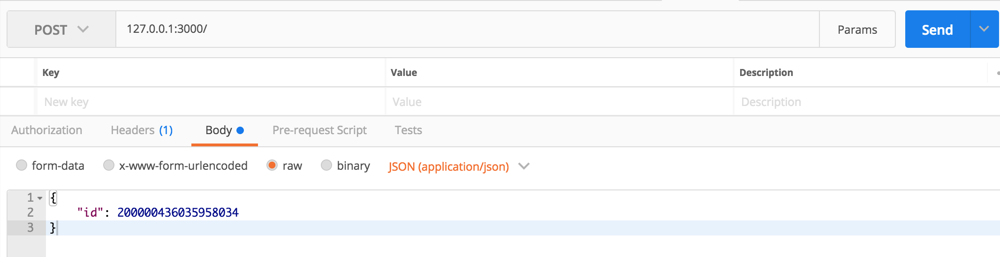

# JavaScript 浮点数之迷：大数危机


在 JavaScript 中浮点数运算时经常出现 0.1+0.2=0.30000000000000004 这样的问题，除了这个问题之外还有一个不容忽视的**大数危机（大数处理丢失精度问题）**，也是近期遇到的一些问题，做下梳理同时理解下背后产生的原因和解决方案。

## JavaScript 最大安全整数

在开始本节之前，希望你能事先了解一些 JavaScript 浮点数的相关知识，在上篇文章 [JavaScript 浮点数之迷：0.1 + 0.2 为什么不等于 0.3？]() 中很好的介绍了浮点数的存储原理、为什么会产生精度丢失（建议事先阅读下）。

IEEE 754 双精确度浮点数（Double 64 Bits）中尾数部分是用来存储整数的有效位数，为 52 位，加上省略的一位 1 可以保存的实际数值为 $[-(2^{53}-1), 2^{53}]$。

```js 
Math.pow(2, 53) // 9007199254740992

Number.MAX_SAFE_INTEGER // 最大安全整数 9007199254740991 
Number.MIN_SAFE_INTEGER // 最小安全整数 -9007199254740991 
```

只要不超过 JavaScript 中最大安全整数和最小安全整数范围都是安全的。

## 大数处理精度丢失问题复现

**例一**

当你在 Chrome 的控制台或者 Node.js 运行环境里执行以下代码后会出现以下结果，What？为什么我定义的 200000436035958034 却被转义为了 200000436035958050，在了解了 JavaScript 浮点数存储原理之后，应该明白此时已经触发了 JavaScript 的最大安全整数范围。

```js
const num = 200000436035958034;
console.log(num); // 200000436035958050
```

**例二**

以下示例通过流读取传递的数据，保存在一个字符串 data 中，因为传递的是一个 application/json 协议的数据，我们需要对 data 反序列化为一个 obj 做业务处理。

```js
const http = require('http');

http.createServer((req, res) => {
    if (req.method === 'POST') {
        let data = '';
        req.on('data', chunk => {
            data += chunk;
        });

        req.on('end', () => {
            console.log('未 JSON 反序列化情况：', data);
            
            try {
                // 反序列化为 obj 对象，用来处理业务
                const obj = JSON.parse(data);
                console.log('经过 JSON 反序列化之后：', obj);

                res.setHeader("Content-Type", "application/json");
                res.end(data);
            } catch(e) {
                console.error(e);

                res.statusCode = 400;
                res.end("Invalid JSON");
            }
        });
    } else {
        res.end('OK');
    }
}).listen(3000)
```

运行上述程序之后在 POSTMAN 调用，200000436035958034 这个是一个大数值。



以下为输出结果，发现没有经过 JSON 序列化的一切正常，当程序执行 JSON.parse() 之后，又发生了精度问题，这又是为什么呢？JSON 转换和大数值精度之间又有什么猫腻呢？

```sh
未 JSON 反序列化情况： {
        "id": 200000436035958034
}
经过 JSON 反序列化之后： { id: 200000436035958050 }
```

这个问题也实际遇到过，发生的方式是调用第三方接口拿到的是一个大数值的参数，结果 JSON 之后就出现了类似问题，下面做下分析。

## JSON 序列化对大数值解析有什么猫腻？

先了解下 JSON 的数据格式标准，[Internet Engineering Task Force 7159](https://tools.ietf.org/html/rfc7159)，简称（IETF 7159），是一种轻量级的、基于文本与语言无关的数据交互格式，源自 ECMAScript 编程语言标准.

[https://www.rfc-editor.org/rfc/rfc7159.txt](https://www.rfc-editor.org/rfc/rfc7159.txt) 访问这个地址查看协议的相关内容。

我们本节需要关注的是 “**一个 JSON 的 Value 是什么呢？**” 上述协议中有规定必须为 **object, array, number, or string** 四个数据类型，也可以是 **false, null, true** 这三个值。

到此，也就揭开了这个谜底，JSON 在解析时对于其它类型的编码都会被默认转换掉。对应我们这个例子中的大数值会默认编码为 number 类型，这也是造成精度丢失的真正原因。

## 大数运算的解决方案

### 1. 常用方法转字符串

在前端后端交互中这是通常的一种方案，例如，对订单号的存储采用数值类型 Java 中的 long 类型表示的最大值为 2 的 64 次方，而 JS 中为 Number.MAX_SAFE_INTEGER (Math.pow(2, 53) - 1)，显然超过 JS 中能表示的最大安全值之外就要丢失精度了，最好的解法就是将订单号**由数值型转为字符串**返回给前端处理，这是再和一个供应商对接过程中实实在在遇到的一个坑。

### 2. 新的希望 BigInt

Bigint 是 JavaScript 中一个新的数据类型，可以用来操作超出 Number 最大安全范围的整数。

**创建 BigInt 方法一**

一种方法是在数字后面加上数字 n

```js
200000436035958034n; // 200000436035958034n
```

**创建 BigInt 方法二**

另一种方法是使用构造函数 BigInt()，还需要注意的是使用 BigInt 时最好还是使用字符串，否则还是会出现精度问题，看官方文档也提到了这块 [github.com/tc39/proposal-bigint#gotchas--exceptions](https://github.com/tc39/proposal-bigint#gotchas--exceptions) 称为疑难杂症

```js
BigInt('200000436035958034') // 200000436035958034n

// 注意要使用字符串否则还是会被转义
BigInt(200000436035958034) // 200000436035958048n 这不是一个正确的结果
```

**检测类型**

BigInt 是一个新的数据类型，因此它与 Number 并不是完全相等的，例如 1n 将不会全等于 1。

```js
typeof 200000436035958034n // bigint

1n === 1 // false
```

**运算**

BitInt 支持常见的运算符，但是永远不要与 Number 混合使用，请始终保持一致。

```js
// 正确
200000436035958034n + 1n // 200000436035958035n

// 错误
200000436035958034n + 1
                                ^

TypeError: Cannot mix BigInt and other types, use explicit conversions
```

**BigInt 转为字符串**

```js
String(200000436035958034n) // 200000436035958034

// 或者以下方式
(200000436035958034n).toString() // 200000436035958034
```

**与 JSON 的冲突**

使用 JSON.parse('{"id": 200000436035958034}') 来解析会造成精度丢失问题，既然现在有了一个 BigInt 出现，是否使用以下方式就可以正常解析呢？

```js
JSON.parse('{"id": 200000436035958034n}');
```

运行以上程序之后，会得到一个 ```SyntaxError: Unexpected token n in JSON at position 25``` 错误，最麻烦的就在这里，因为 JSON 是一个更为广泛的数据协议类型，影响面非常广泛，不是轻易能够变动的。

在 TC39 proposal-bigint 仓库中也有人提过这个问题 [github.comtc39/proposal-bigint/issues/24](https://github.com/tc39/proposal-bigint/issues/24) 截至目前，该提案并未被添加到 JSON 中，因为这将破坏 JSON 的格式，很可能导致无法解析。

**BigInt 的支持**

BigInt 提案目前已进入 Stage 4，已经在 Chrome，Node，Firefox，Babel 中发布，在 Node.js 中支持的版本为 12+。

**BigInt 总结**

我们使用 BigInt 做一些运算是没有问题的，但是和第三方接口交互，如果对 JSON 字符串做序列化遇到一些大数问题还是会出现精度丢失，显然这是由于与 JSON 的冲突导致的，下面给出第三种方案。

### 3. 第三方库

通过一些第三方库也可以解决，但是你可能会想为什么要这么曲折呢？转成字符串大家不都开开心心的吗，但是呢，有的时候你需要对接第三方接口，取到的数据就包含这种大数的情况，且遇到那种拒不改的，业务总归要完成吧！这里介绍第三种实现方案。

还拿我们上面 **大数处理精度丢失问题复现** 的第二个例子进行讲解，通过 json-bigint 这个库来解决。

知道了 JSON 规范与 JavaScript 之间的冲突问题之后，就不要直接使用 JSON.parse() 了，在接收数据流之后，先通过字符串方式进行解析，利用 json-bigint 这个库，会自动的将超过 2 的 53 次方类型的数值转为一个 BigInt 类型，再设置一个参数 ```storeAsString: true``` 会将 BigInt 自动转为字符串。

```js
const http = require('http');
const JSONbig = require('json-bigint')({ 'storeAsString': true});

http.createServer((req, res) => {
    if (req.method === 'POST') {
        let data = '';
        req.on('data', chunk => {
            data += chunk;
        });

        req.on('end', () => {
            try {
                // 使用第三方库进行 JSON 序列化
                const obj = JSONbig.parse(data)
                console.log('经过 JSON 反序列化之后：', obj);

                res.setHeader("Content-Type", "application/json");
                res.end(data);
            } catch(e) {
                console.error(e);

                res.statusCode = 400;
                res.end("Invalid JSON");
            }
        });
    } else {
        res.end('OK');
    }
}).listen(3000)
```

再次验证会看到以下结果，这次是正确的，问题也已经完美解决了！

```sh
JSON 反序列化之后 id 值： { id: '200000436035958034' }
```

## 总结

本文提出了一些产生大数精度丢失的原因，同时又给出了几种解决方案，如遇到类似问题，都可参考。还是建议大家在系统设计时去遵循双精度浮点数的规范来做，在查找问题的过程中，有看到有些使用正则来匹配，个人角度还是不推荐的，一是正则本身就是一个耗时的操作，二操作起来还要查找一些匹配规律，一不小心可能会把返回结果中的所有数值都转为字符串，也是不可行的。

## Reference

[v8.dev/features/bigint](https://v8.dev/features/bigint)
[github.com/tc39/proposal-bigint](https://github.com/tc39/proposal-bigint)
[en.wikipedia.org/wiki/Double-precision_floating-point_format](https://en.wikipedia.org/wiki/Double-precision_floating-point_format)