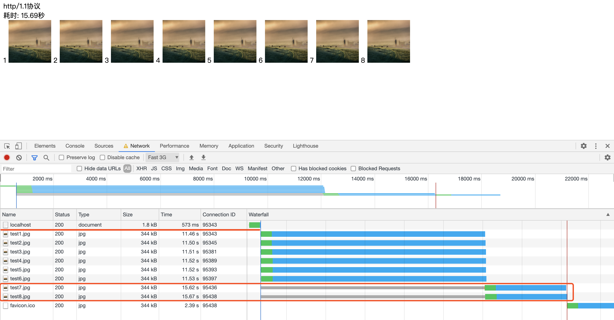
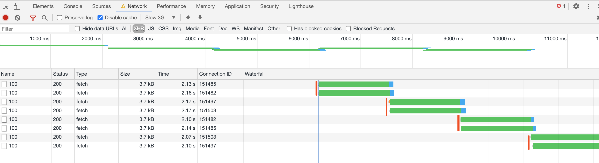

# 实现浏览器中的最大请求并发数控制


浏览器在我们日常工作、学习中经常会使用到，有时候遇到页面请求过多，页面卡顿需要好长一段时间才能加载完成，有没有想过这是什么原因？和我们本文将要讨论的并发数有什么关系？
## 探究 Chrome 浏览器并发请求数控制
如下代码示例，定义一个 HTML 并在页面打开时加载 8 张图片。

```html
<!-- connection.html -->
<html>
  <body>
    
    
    
    
    
    
    
    
  </body>
</html>
```

下面使用 Node.js 启动一个服务，当请求为 host:port/ 时响应上面定义的 html 文件，其它情况下则响应图片。示例中用到的图片示例，可自行定义。

```javascript
// connection.js
const http = require('http');
const fs = require('fs');
const port = 3010;
http.createServer((request, response) => {
  console.log('request url: ', request.url);
  const html = fs.readFileSync('./connection.html', 'utf-8');
  const img = fs.readFileSync('./test_img.jpg');
  if (request.url === '/') {
    response.writeHead(200, { 'Content-Type': 'text/html' });
    response.end(html);
  } else {
    response.writeHead(200, { 'Content-Type': 'image/jpg' });
    response.end(img);
  }
}).listen(port);
console.log('server listening on port ', port);
```

打开 Chrome 浏览器，在 Network 里调整网络为 3G 能更好的看到效果，运行上面的程序，如下所示：


运行的结果中有一个 ConnectionID 字段，这个表示了每次请求创建的链接，前 6 张图片是一次并发请求，第 7 张和第 8 张，刚开始阶段一直处于 Pending 状态，直到前面 6 个其中的任一个完成之后，才会去请求，这个时候就会产生响应等待，对用户表现就是页面一直在加载，如果是这种情况，原因则是请求太多后续的需要前面的完成才能进行。

在 Chrome 浏览器中允许的最大并发请求数目为 6，这个限制还有一个前提是**针对同一域名**的，超过这一限制的后续请求将会被阻塞。

以下是 Chrome 浏览器关于最大请求链接数的一段介绍和相关[代码](https://chromium.googlesource.com/chromium/src/+/65.0.3325.162/net/socket/client_socket_pool_manager.cc#44)，另外 Chrome 浏览器是不能修改这个值的，在源码里可以看到是固定写死的。

```c
https://chromium.googlesource.com/chromium/src/+/65.0.3325.162/net/socket/client_socket_pool_manager.cc#44
// Default to allow up to 6 connections per host. Experiment and tuning may
// try other values (greater than 0).  Too large may cause many problems, such
// as home routers blocking the connections!?!?  See http://crbug.com/12066.
int g_max_sockets_per_group[] = {
  6,  // NORMAL_SOCKET_POOL
  255 // WEBSOCKET_SOCKET_POOL
};
```

## 实现一个并发请求控制类
实现一个类似上面浏览器中的并发请求控制类，以下是我们实现的思路：

- 行 {1} 定义一个自己的并发请求控制类在实例化时设置 limit
- 行 {2} 为这个这个并发请求控制类实现一个 request 方法
- 行 {3} 在 request 里判断如果当前请求数大于设置的 limit 程序进入阻塞状态
- 行 {4} 在 request 请求里如果当前请求数小于设置的 limit，处理传入的请求
- 行 {5} 在处理传入的请求开始时要对当前请求数做加 1 操作
- 行 {6} 在处理传入的请求完成时判断如果阻塞队列有值，将最先进入到阻塞队列的请求从 Pending 变为 Fulfilled 这样就会开始处理传入的请求
```javascript

class RequestLimit {
  constructor (limit) {
    this.limit = Number(limit) || 2; // {1}
    this.blockQueue = [];
    this.currentReqNumber = 0;
  }

  /**
   * 请求
   * @param {*} req 
   */
  async request(req) { // {2}
    if (!req) {
      throw new Error('req is required.');
    }
    if (Object.prototype.toString.call(req) !== '[object Function]') {
      throw new Error('Req must be a function.');
    }
    if (this.currentReqNumber >= this.limit) { // {3}
      await new Promise(resolve => this.blockQueue.push(resolve)); // 阻塞队列增加一个 Pending 状态的 Promise
    } 

    return this._handlerReq(req); // {4}
  }

  /**
   * 内部方法处理请求
   * @param {*} req 
   */
  async _handlerReq(req) {
    this.currentReqNumber++; // {5}
    try {
      return await req();
    } catch (err) {
      return Promise.reject(err);
    } finally {
      this.currentReqNumber--;
      if (this.blockQueue.length) { // 每完成一个就从阻塞队列里剔除一个
        this.blockQueue[0](); // 将最先进入阻塞队列的 Promise 从 Pending 变为 Fulfilled
        this.blockQueue.shift();
      }
    }
  }
}
```
上述代码有一个重点是 this.block() 函数如何实现阻塞，这一块可以借助 Promise 实现，在 new Promise 时回调函数会给我们返回一个 resolve 函数，如果执行这个 resolve 函数，Promise 的状态会变更为 Fulfilled 所以我们这里不会立即执行，而是先保存到阻塞队列里，待前面的请求完成之后再从阻塞队列里取出，相当于执行了 resolve 函数，如果理解 Promise 源码实现的会好理解些。<br />
<br />创建一个 index.html 文件，在浏览器里测试下上述程序。
```javascript
<html>
  <body>
    <script src="https://cdn.bootcdn.net/ajax/libs/fetch/3.1.0/fetch.min.js"></script>
    <script src="./request-limit.js"></script>
    <script>
      const requestLimit = new RequestLimit(2);
      (async () => {
        for (let i=0; i<8; i++) {
          requestLimit.request(() => fetch("http://q.qlogo.cn/qqapp/100312990/DE1931D5330620DBD07FB4A5422917B6/100"));
        }
      })()
    </script>
  </body>
</html>
```
限制最大请求并发数为 2 借助 Chrome 浏览器瀑布流的方式可以很清晰的看到请求的结果。



上述代码地址：
```
https://github.com/qufei1993/examples
```

## 总结
本文一开通过示例演示了在 Chrome 浏览器中的并发请求控制，在同一个域名的情况下 Chrome 浏览器允许的最大请求并发数为 6 当然其它浏览器都会有，只是每个浏览器的限制是不同的，当我们了解到这个规则之后在日常的工作中，也要尽可能的减少页面一些无谓的请求。

在本文的第二个部分自己实现了一个 RequestLimit 类，来模拟实现类似浏览器中的并发请求数控制，代码部分也很精简，有什么不理解的欢迎留言和我讨论。