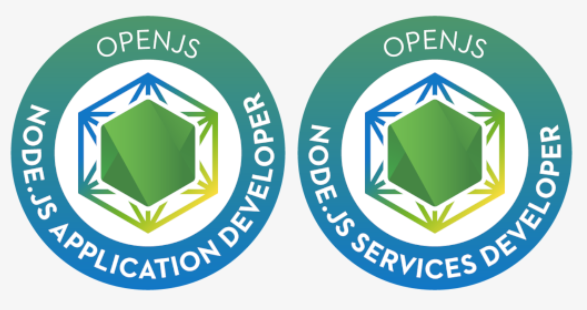

# 重磅 | OpenJS 基金会推出 Node.js 专业认证考试

2019 年 10 月 22 日 OpenJS 基金会启动了新的专业认证计划，以支持 Node.js 开发的未来，两个认证程序分别为 OpenJS Node.js 应用程序开发（JSNAD）和 OpenJS Node.js 的服务开发（JSNSD）认证。

## 来自于 Node.js 界专业人士的看法

**OpenJS 基金会执行董事 Robin Ginn 表示**：“OpenJS Node.js 专业认证计划旨在帮助开发人员证明他们在现实环境中的 Node.js 水平，并为他们提供将这些技术带入各自组织的知识，考试提供了一个由 Node.js 社区的专业从业人员开发的框架，该框架为经验丰富的开发人员说明了各种技能。我们很高兴通过 OpenJS Foundation 提供这些认证，这是展示 Node.js 关键功能的一种清晰与供应商无关的方式。”

**TELUS 首席架构师 Luca Maraschi 表示**：“作为服务于数百万加拿大客户的领先电信公司，熟练的技术人才管道对于我们在 TELUS 上持续取得成功至关重要。鉴于我们在这些证书的 alpha 测试中所扮演的角色，我们有信心它们将突出 Node.js 开发人员的正确技能，我们很高兴能够使用这些程序来确保我们的开发人员社区继续蓬勃发展。”

**OpenJS 基金会董事会主席 Todd Moore 表示**：“这些考试的到来对 OpenJS 基金会而言是令人振奋的一步，因为它代表了我们支持社区内开发人员的另一种方式，我们希望这些测试能够在市场上出售，并希望由不同的 Node.js 开发人员参加这些考试，获得认证并展示他们对这项关键技术的了解。”

**NearForm 首席执行官兼创始人 CianÓMaidín 表示**：“获得认证是Node.js 项目的一个重要里程碑。我们现在拥有正式的材料和考试，将支持下一波在企业中采用 Node.js 的浪潮。我们为所有合作伙伴为实现这一目标所做的工作感到自豪。”

**NodeSource 首席执行官 Russ Whitman 表示**：“我们再兴奋不过了，很高兴看到这个重要的计划付诸实践，并为能创造机会来使开发人员能够通过认证来验证自己的技能而感到自豪。在基金会的支持下，在 NodeSource 和主要社区成员的支持下，我们希望这能促进 Node.js 的使用以及能为正在开发的出色产品提供更好的服务。” 

## OpenJS Node.js 应用程序开发认证

OpenJS Node.js 应用程序开发人员认证非常适合具有至少两年使用 Node.js 经验的 Node.js 开发人员。是为希望展示与 Node.js 的能力而创建任何类型的应用程序的人员而设计的，重点是对 Node.js 核心 API 的了解。

**JSNAD Domains & Competencies**

- Buffer and Streams – 11%
    - Node.js Buffer API’s
    - Incremental Processing
    - Transforming Data
    - Connecting Streams
- Control flow – 12%
    - Managing asynchronous operations
    - Control flow abstractions
- Child Processes – 8%
    - Spawning or Executing child processes
    - Child process configuration
- Diagnostics – 6%
    - Debugging Node.js
    - Basic performance analysis
- Error Handling – 8%
    - Common patterns
    - Handling errors in various scenarios
- Node.js CLI – 4%
    - Node executable command line flags
- Events – 11%
    - The event system
    - Building event emitters
    - Consuming event emitters
- File System – 8%
    - Input/output
    - Watching
- JavaScript Prerequisites – 7%
    - Language fundamentals
    - Scoped to core language features introduced since - EcmaScript 1 and still heavily used today
- Module system – 7%
    - CommonJS Module System only
- Process/Operating System – 6%
    - Controlling the process
    - Getting system data
- Package.json – 6%
    - Package configuration
    - Dependency management
- Unit Testing – 6%
    - Using assertions
    - Testing synchronous code
    - Testing asynchronous code

## OpenJS Node.js 的服务开发认证

OpenJS Node.js 服务开发人员认证适用于具有至少两年使用 Node.js 创建 RESTful 服务器和微服务经验的 Node.js 开发人员。特别强调安全性实践。

**JSNSD Domains & Competencies v1.0**

- Servers and Services – 70%
    - Implementing public facing web servers
    - Creating RESTful HTTP services
    - Consuming other HTTP services
    - Knowledge of HTTP verbs and status codes
    - Processing user input

- Security – 30%
    - Protecting against malicious input
    - Attack mitigation

## 关于考试

该考试是一项基于性能的在线、托管式测试，需要在远程桌面 Linux 环境中实施多种解决方案。在此环境中，Visual Studio Code 和 Vim 均作为编辑器包含在内。

本次考试含有模拟在职场景的项目，考生有两个小时的时间来完成测试。

考生可以分别购买、安排和参加每项考试，并根据通过的考试获得独立且可验证的证书。 考生可以选择参加其中一项或两项考试。 认证持续三年，可续签。

费用为 300 美元，如果第一次不成功，还有第二次免费重考机会。

## 关于 OpenJS 基金会 

OpenJS 基金会致力于通过提供一个中立的组织来托管和维持项目，以及为整个社区的利益共同资助活动，来支持 JavaScript 生态系统和 Web 技术的健康发展。OpenJS Foundation 由 32 个开源 JavaScript 项目组成，包括 Appium、Dojo、jQuery、Node.js 和 Webpack 等，并得到 30 个公司和最终用户成员的支持，其中包括 GoDaddy、Google、IBM、Intel、Joyent 和 Microsoft 等。这些成员认识到 JavaScript 生态系统的相互联系的性质，以及为代表重要共享价值的项目提供中心位置的重要性。 

## Reference

* [https://openjsf.org/blog/2019/10/22/openjs-foundation-launches-new-professional-certification-program-to-support-the-future-of-node-js-development/](https://openjsf.org/blog/2019/10/22/openjs-foundation-launches-new-professional-certification-program-to-support-the-future-of-node-js-development/)
* [https://training.linuxfoundation.org/certification/jsnad/](https://training.linuxfoundation.org/certification/jsnad/)
* [https://training.linuxfoundation.org/certification/jsnsd](https://training.linuxfoundation.org/certification/jsnsd)

**作者简介**：五月君，Nodejs Developer，慕课网认证作者，热爱技术、喜欢分享的 90 后青年，欢迎关注 [Nodejs技术栈](https://nodejsred.oss-cn-shanghai.aliyuncs.com/node_roadmap_wx.jpg?x-oss-process=style/may) 和 Github 开源项目 [https://www.nodejs.red](https://www.nodejs.red)