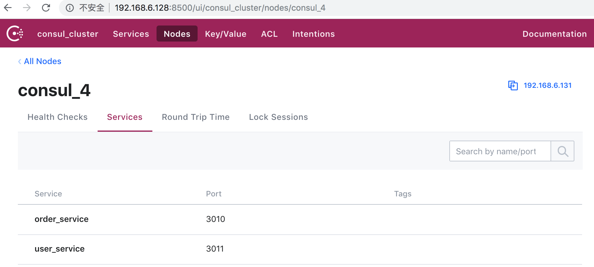
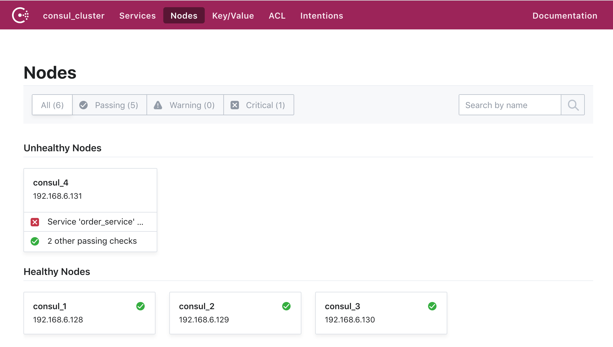
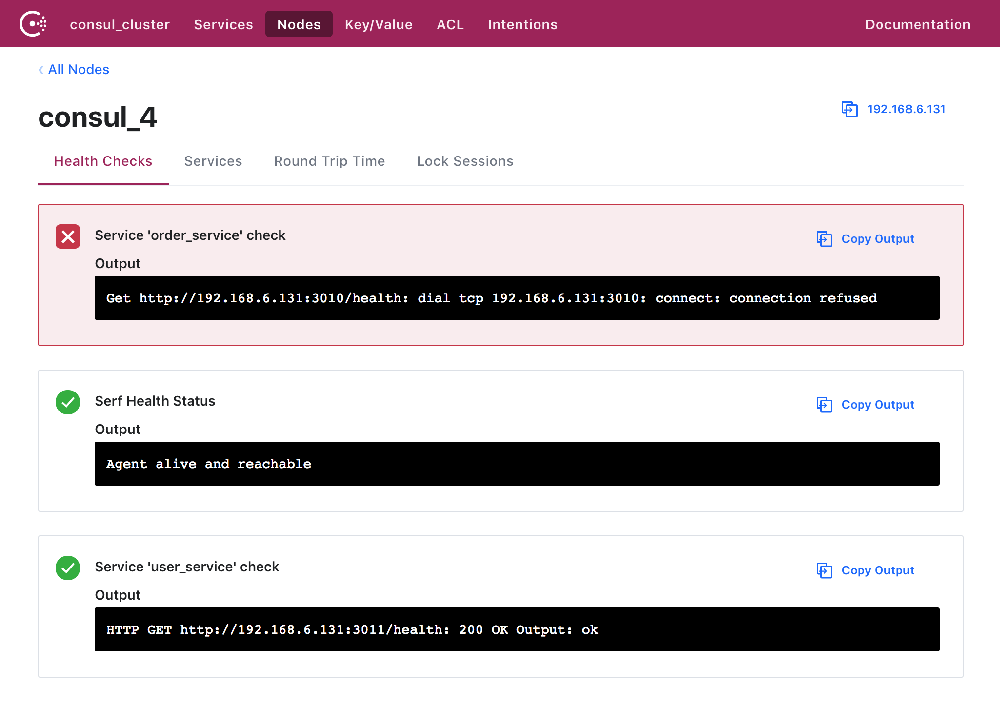
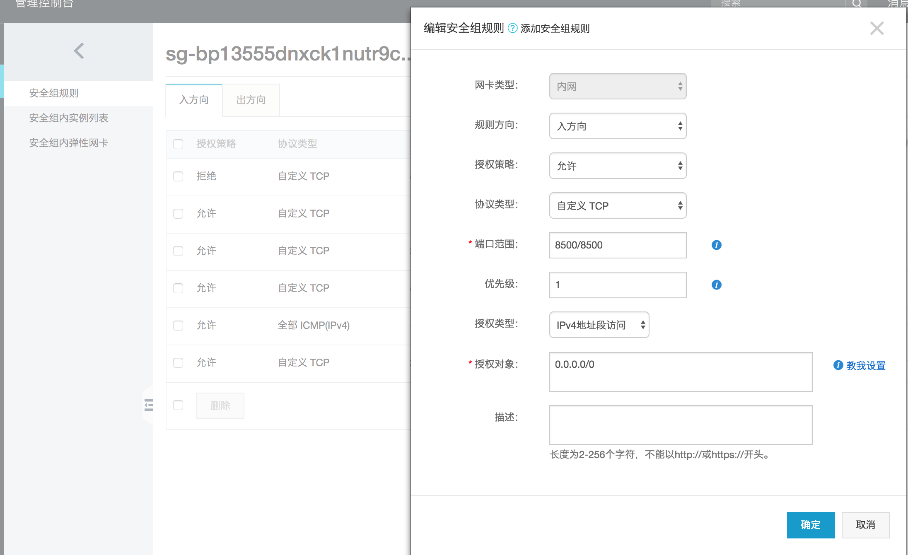

# Consul

Consul 是 HashiCorp 公司提出的一款分布式服务治理工具，提供了服务注册与发现、健康检查、配置中心功能。

## 快速导航

- [Consul 入门](#Consul入门)
    - [使用 Consul 解决了哪些问题](#使用consul解决了哪些问题)
    - [Consul 的四大核心特性](#Consul的四大核心特性)
    - [Consul 架构](#consul架构)
    - [安装](#consul安装)
    - [Agent](#ConsulAgent)
    - [简单的服务注册](#简单的服务注册)
    - [ConsulTemplate](#ConsulTemplate)
- [集群搭建](#集群搭建)
    - [集群准备工作](#集群准备工作)
    - [Server 端部署](#Server端部署)
    - [Server 端集群建立](#Server端集群建立)
    - [Client 端部署](#Client端部署)
    - [管理工具中查看](#管理工具中查看)
- [服务注册与发现](#服务注册与发现)
    - [服务注册与发现准备工作](#服务注册与发现准备工作)
    - [服务注册](#服务注册)
    - [服务发现](#服务发现)
- [客户端集成]
    - [Node.js 集成 Consul 配置中心](#Nodejs集成Consul配置中心)
    - [Spring Boot 集成 Consul 配置中心](#SpringBoot集成Consul配置中心)
- [题汇总篇](#问题总结)
    - [启动报错](#启动报错)
    - [查看集群成员报错](#查看集群成员报错)
    - [关于开启 Consul Web 可视化界面的一些问题](#关于开启ConsulWeb可视化界面的一些问题)

## Consul入门

### 使用consul解决了哪些问题

* 是否在为不同环境来维护不同项目配置而发愁
* 是否有因为配置的更改，导致代码还要进行修改、发布，因为客流量大了还要规避开高峰期等到半夜来发布
* 微服务架构下，应用的分解，业务系统与服务系统之间的调用管理

以上只是列举的笔者曾经遇到的几点问题，当然问题还不止于这些，下面介绍的Consul可以有效解决这些问题，当然还有一些其它的优点，让我们一起期待下文的Consul的讲解。

### Consul的四大核心特性:

* 服务发现：可以方便的实现服务注册，通过DNS或者HTTP应用程序可以很容易的找到他所依赖的服务.
* Key/Value存储：使用Key/Value进行数据存储。
* 多数据中心：Consul支持开箱即用的多数据中心。这意味着用户不需要担心建立额外的抽象层让业务扩展到多个区域
* 健康检查：可以对指定服务进行健康检查例如，Response Status是否为200，避免将流量转发到不健康的服务上。

### consul架构

图片来自官网 [Consul Architecture](https://www.consul.io/docs/internals/architecture.html)


上图很好的展示了Consul对于多数据中心的支持，另外在两个数据中心之间只有Service层可以相互通信。

Consul是一个分布式高可用的系统，一个发现和配置服务的工具。客户端可以利用它提供的API注册和发现服务，及监控检测功能实现服务的高可用，深入的架构描述具体细节，可以参考官网[Consul Architecture](https://www.consul.io/docs/internals/architecture.html)，下面开始进入实战操作部分。

### consul安装

本处主要以linux来讲解，其他操作平台见官网[Download Consul](https://www.consul.io/downloads.html)

下载 ``` wget https://releases.hashicorp.com/consul/1.4.0/consul_1.4.0_linux_amd64.zip ```

解压 ```unzip consul_1.4.0_linux_amd64.zip``` 得到目录```consul```  
复制 ```consul```到你的系统的任何一个地方，如果你想使用命令行直接访问，确保复制的目录在你的PATH里 ```cp consul /usr/local/bin/```

验证consul是否安装成功，出现以下窗口则安装成功

```
[root@iZbp1isjfk2rw8fpnxx8wgZ ~]# consul
Usage: consul [--version] [--help] <command> [<args>]

Available commands are:
    acl            Interact with Consul's ACLs
    agent          Runs a Consul agent
    catalog        Interact with the catalog
    connect        Interact with Consul Connect
    debug          Records a debugging archive for operators
    event          Fire a new event
    exec           Executes a command on Consul nodes
    force-leave    Forces a member of the cluster to enter the "left" state
    info           Provides debugging information for operators.
    intention      Interact with Connect service intentions
    join           Tell Consul agent to join cluster
    keygen         Generates a new encryption key
    keyring        Manages gossip layer encryption keys
    kv             Interact with the key-value store
    leave          Gracefully leaves the Consul cluster and shuts down
    lock           Execute a command holding a lock
    maint          Controls node or service maintenance mode
    members        Lists the members of a Consul cluster
    monitor        Stream logs from a Consul agent
    operator       Provides cluster-level tools for Consul operators
    reload         Triggers the agent to reload configuration files
    rtt            Estimates network round trip time between nodes
    services       Interact with services
    snapshot       Saves, restores and inspects snapshots of Consul server state
    validate       Validate config files/directories
    version        Prints the Consul version
    watch          Watch for changes in Consul
```

### ConsulAgent

执行``` consul agent -dev ```，启动开发模式，这个模式会快速启动一个单节点的Consul。注意，这个模式不能数据持久化，因此，不能用于生产环境

#### 启动命令简介：

* ```-server```：定义agent运行在server模式，每个数据中心的Server建议在3～5个避免失败情况下数据的丢失
* ```-client```：定义agent运行在client模式
* ```bootstrap-expect```：server模式下，集群要求的最低数量，当低于这个数量，集群失效
* ```-bootstrap-expect```：在一个datacenter中期望提供的server节点数目，当该值提供的时候，consul一直等到达到指定sever数目的时候才会引导整个集群
* ```-bind```：节点的ip地址一般是```0.0.0.0```或云服务内网地址，用于被集群中的其他节点所访问
* ```-node```：指定节点在集群中的唯一名称，默认为机器的hostname
* ```-config-dir```：配置文件目录，里面所有以.json结尾的文件都会被加载
* ```data-dir```：data存放的目录，consul数据同步机制
* 更多可选参数参考[Consul Command-line Options](https://www.consul.io/docs/agent/options.html)

#### Start Agent

```bash
[root@iZbp1isjfk2rw8fpnxx8wgZ ~]# consul agent -dev
==> Starting Consul agent...
==> Consul agent running!
           Version: 'v1.4.0'
           Node ID: '9e05f4d6-56c1-e57c-c726-15d9ab1c0dd5'
         Node name: 'iZbp1isjfk2rw8fpnxx8wgZ'
        Datacenter: 'dc1' (Segment: '<all>')
            Server: true (Bootstrap: false)
       Client Addr: [127.0.0.1] (HTTP: 8500, HTTPS: -1, gRPC: 8502, DNS: 8600)
      Cluster Addr: 127.0.0.1 (LAN: 8301, WAN: 8302)
           Encrypt: Gossip: false, TLS-Outgoing: false, TLS-Incoming: false

==> Log data will now stream in as it occurs:
```

看下 consul agent 输出的几个重要信息：

* Node name：代理的唯一名称，默认是机器的hostname，可以通过```-node```标志自定义，例如：```consul agent -dev -node myNode ```
* Datacenter：数据中心，Consul支持多个数据中心，为了有效的工作，每个节点必须被配置且上报到数据中心，```-datacenter```标志用来设置数据中心，对于单一的DC配置，这个代理默认为```dc1```
* Server：表示代理是以服务器还是客户端的模式来运行。
* Client Addr：用于代理的客户端接口地址。
* Cluster Addr：用于集群中的Consul代理之间通信的地址和端口集，改地址必须可供其它节点访问。

#### 查看集群成员(Members)

打开一个新终端执行```consul members```，可以看到集群的成员。


* Node：节点名称
* Address：节点地址
* Status：alive表示节点为健康状态
* Type：节点的运行模式（Server）

#### 查看最近历史日志

``` consul monitor ```显示最近历史日志，默认显示的日志级别为info可以根据```-log-level```进行设置

* ```-log-level```: debug，还有```"debug","info", "warn", "error"```

#### Stop Agent

Agent两种停止方式：```gracefully```或```forcefully```
```gracefully```方式停止，则是发送中断信号到Agent进程两种方法：```Ctrl+C```、```kill -INT consul_pid```

### 服务注册

Consul服务搭建好之后，通过```提供服务定义```或```HTTP API```注册一个服务，通用的模式是通过提供服务定义的方式，下文还会介绍怎么应用Consul进行```健康检查```

#### 提供服务定义方式服务注册

创建目录```/etc/consul.d```(.d 后缀意思是这个路径包含了一组配置文件），Consul会载入该目录下的所有文件。

例如我现在有个测试服务test01端口为3010

``` sudo mkdir /etc/consul.d/test01.json ```

```json
{
    "service":{
        "name":"test01",
        "tags":[
            "",
            ""
        ],
        "address":"127.0.0.1",
        "port":3010,
        "enable_tag_override": false,
        "check":{
            "deregisterCriticalServiceAfter":"90m",
            "http":"http://127.0.0.1:3010/health",
            "interval":"10s"
        }
    }
}
```

服务定义配置文件含义：

* name：服务名
* tags：服务的tag，自定义，可以根据这个tag来区分同一个服务名的服务
* address：服务注册到consul的IP，服务发现，发现的就是这个IP
* port：服务注册consul的PORT，发现的就是这个PORT
* enable_tag_override：标签是否允许覆盖
* check：健康检查部分
    * deregisterCriticalServiceAfter
    * http：指定健康检查的URL，调用后只要返回20X，consul都认为是健康的
    * interval：健康检查间隔时间，每隔10s，调用一次上面的URL


重启Agent设置配置目录

```
consul agent -dev -config-dir /etc/consul.d
```

看以下运行结果：

启动之后控制台输出了```Synced service "test01"```，意思是Agent从配置文件中载入了服务定义，且成功注册到服务目录，另外右边的服务test01也收到了健康检查接口调用


#### 采用HTTP API服务注册

调用```/v1/agent/service/register```接口进行注册，请求Method为PUT方式

请求Body值为```服务定义```中的service值，看一下示例：

```bash
curl -X PUT \
  http://127.0.0.1:8301/v1/agent/service/register \
  -H 'cache-control: no-cache' \
  -H 'content-type: application/json' \
  -H 'postman-token: 6b672c02-350f-3d1c-7793-1a0d9e800fc9' \
  -d '{
	"id": "test01",
    "name":"test01",
    "tags":[
        "",
        ""
    ],
    "address":"127.0.0.1",
    "port":3010,
    "check":{
        "deregisterCriticalServiceAfter":"90m",
        "http":"http://127.0.0.1:3010/health",
        "interval":"10s"
    }
}'
```


### ConsulTemplate

Consul Template是Consul的一个UI扩展工具，方便的在Web页面进行操作。
``` Github: https://github.com/hashicorp/consul-template```

#### 快速启动

这是最简单快速的启动方式，在启动consul时直接启动webui界面，跟上-ui参数参考以下示例，端口默认为8500，如果使用阿里云请注意安全组是否开启。

```
consul agent -server -bootstrap -ui -data-dir=/data/soft/consul_1.4/consul-data -bind=0.0.0.0 -client=0.0.0.0  -node=120.27.239.212
```

## 集群搭建

至少3台机器，因为在异常处理中，如果出现Leader挂了，只要有超过一半的Server还处于活跃状态，consul就会重新选举新的Leader，保证集群可以正常工作。

### 集群准备工作

测试用建议本地搭建几台虚拟机用于调试，这里的虚拟机分别为3台Server模式，1台Client模式，共以下4台：

* 192.168.6.128 Server模式（初始设置为Leader）

* 192.168.6.129 Server模式

* 192.168.6.130 Server模式

* 192.168.6.131 Client模式

下载相应平台版本的Consul解压copy至```/usr/local/bin/```（系统的环境变量）目录，这里以1.4.0版本为例，具体安装参照[上篇-consul下载安装指南]()。

创建 ```/usr/src/consul```目录，存放Consul的启动配置文件```consul_config.json```：

```json
{
    "datacenter": "consul_cluster",
    "node_name": "consul_1",
    "server": true,
    "bootstrap_expect": 3,
    "data_dir": "/usr/src/consul/data",
    "log_level": "DEBUG",
    "enable_syslog": true,
    "enable_script_checks": true,
    "bind_addr": "192.168.6.128",
    "client_addr": "192.168.6.128",
}
```

* node_name：节点名称，等同于-node
* data_dir：数据存放目录
* enable_syslog：consul日志写入系统的syslog目录是否启用
* enable_script_checks：是否启用监控检测脚本
* bind_addr：等同于-bind
* client_addr：等同于-client

### Server端部署

* 部署第一台192.168.6.128

注意：在第一台启动的时候加上-ui，只初始化一次，在其它2个节点进行相同操作，但是配置文件中的```node_name```、```bind_addr```、```client_addr```要进行更改，每台机器保持唯一。

```
$ sudo consul agent -ui -config-file=/usr/src/consul/consul_config.json
```

命令 ```-config-file：``` 加载启动的配置文件

* 部署第二台192.168.6.129

修改```/usr/src/consul/consul_config.json```：
```json
{
    "datacenter": "consul_cluster",
    "node_name": "consul_2",
    "server": true,
    "bootstrap_expect": 3,
    "data_dir": "/usr/src/consul/data",
    "log_level": "DEBUG",
    "enable_syslog": true,
    "enable_script_checks": true,
    "bind_addr": "192.168.6.129",
    "client_addr": "192.168.6.129",
}
```

执行命令启动命令

```
$ sudo consul agent -config-file=/usr/src/consul/consul_config.json
```

* 部署第三台192.168.6.130

修改```/usr/src/consul/consul_config.json```：
```json
{
    "datacenter": "consul_cluster",
    "node_name": "consul_3",
    "server": true,
    "bootstrap_expect": 3,
    "data_dir": "/usr/src/consul/data",
    "log_level": "DEBUG",
    "enable_syslog": true,
    "enable_script_checks": true,
    "bind_addr": "192.168.6.130",
    "client_addr": "192.168.6.130"
}
```
执行命令启动命令

```
$ sudo consul agent -config-file=/usr/src/consul/consul_config.json
```

截止目前服务端已经全部启动，但是还没有加入集群，因此还只是单节点的集群，可以在某台机器上查看成员情况：

注意：直接使用```consul members```会报错，原因见[#]()

```
$ consul members --http-addr 192.168.6.128:8500
Node      Address             Status  Type    Build  Protocol  DC              Segment
consul_1  192.168.6.128:8301  alive   server  1.4.0  2         consul_cluster  <all>
```

### Server端集群建立

每个Consul Agent之后，都是相对独立的并不知道其它节点的存在，现在我们要做的是加入集群，将上面创建的consul_2、consul_3加入到同一个集群consul_1中。

* 第二台192.168.6.129加入到consul_1中

```
$ consul join --http-addr 192.168.6.129:8500 192.168.6.128
Successfully joined cluster by contacting 1 nodes. # 成功返回的消息
```

* 第三台192.168.6.130加入到consul_1中

```
$ consul join --http-addr 192.168.6.130:8500 192.168.6.128
```

目前服务端的集群已经创建完毕，可以看下我们目前的集群成员情况：

```
consul members --http-addr 192.168.6.128:8500
Node      Address             Status  Type    Build  Protocol  DC              Segment
consul_1  192.168.6.128:8301  alive   server  1.4.0  2         consul_cluster  <all>
consul_2  192.168.6.129:8301  alive   server  1.4.0  2         consul_cluster  <all>
consul_3  192.168.6.130:8301  alive   server  1.4.0  2         consul_cluster  <all>
```

* 通过HTTP API的方式查看集群leader

```
$ curl 192.168.6.128:8500/v1/status/leader

"192.168.6.128:8300"
```

* 通过HTTP API的方式查看集群成员
```
$ curl 192.168.6.128:8500/v1/status/peers 

["192.168.6.129:8300","192.168.6.130:8300","192.168.6.128:8300"]
```

### Client端部署

现在开始客户端的部署，方式同服务端有不同

修改```/usr/src/consul/consul_config.json```：
```js
{
    "datacenter": "consul_cluster",
    "node_name": "consul_4",
    //"server": true, 不指定为服务端，默认走客户端
    // "bootstrap_expect": 3, 只在server模式有效
    "data_dir": "/usr/src/consul/data",
    "log_level": "DEBUG",
    "enable_syslog": true,
    "enable_script_checks": true,
    "bind_addr": "192.168.6.131",
    "client_addr": "192.168.6.131"
}
```

执行启动命令：

通过-join参数也可以加入一个已经启动的集群

```
$ sudo consul agent -config-file=/usr/src/consul/consul_config.json -join=192.168.6.128
```

在查看当前集群成员，可以看到为3个Server模式和1个Client模式

```
$ consul members --http-addr 192.168.6.128:8500
Node      Address             Status  Type    Build  Protocol  DC              Segment
consul_1  192.168.6.128:8301  alive   server  1.4.0  2         consul_cluster  <all>
consul_2  192.168.6.129:8301  alive   server  1.4.0  2         consul_cluster  <all>
consul_3  192.168.6.130:8301  alive   server  1.4.0  2         consul_cluster  <all>
consul_4  192.168.6.131:8301  alive   client  1.4.0  2         consul_cluster  <default>
```

### 管理工具中查看

在部署第一台192.168.6.128机器的时候，consul agent之后有跟一个-ui参数，这个是用于启动WebUI界面，这个是Consul本身所提供的Web可视化界面，浏览器输入[http://192.168.6.128:8500](http://192.168.6.128:8500)进行访问


## 服务注册与发现

在进行服务注册之前先确认集群是否建立，关于服务注册可以看上篇[]()的介绍，两种注册方式：一种是注册HTTP API、另一种是通过配置文件定义，下面讲解的是基于后者配置文件定义的形式，也是Consul官方所建议的方式。

### 服务注册与发现准备工作

以下是上节做Consul集群的时候列的机器列表，下面我们将192.168.6.131机器安装了Node服务，起了两个端口

机器              |  模式  | 节点名称
:----------------:|:------:|:-------:
 192.168.6.128    | Server | consul_1（初始设置为Leader）
 192.168.6.129    | Server | consul_2
 192.168.6.130    | Server | consul_3
 192.168.6.131    | Client | consul_4

* 服务一：order_service

```
$ curl http://192.168.6.131:3010/health
ok
```

* 服务二：user_service

```
$ curl http://192.168.6.131:3011/health
ok
```

### 服务注册

对order_service、user_service两个服务在consul_4节点上进行服务定义，配置中包含了服务的名称、地址、端口以及每10秒中对服务进行一次健康检查。

* 注册服务一：order_service

```order_service.json```

```json
{
    "service":{
        "name":"order_service",
        "address":"192.168.1.131",
        "port": 3010,
        "enable_tag_override": false,
        "check":{
            "deregisterCriticalServiceAfter":"90m",
            "http":"http://192.168.1.131:3010/health",
            "interval":"10s"
        }
    }
}
```

* 注册服务二：user_service

```user_service.json```

```json
{
    "service":{
        "name":"user_service",
        "address":"192.168.1.131",
        "port": 3011,
        "enable_tag_override": false,
        "check":{
            "deregisterCriticalServiceAfter":"90m",
            "http":"http://192.168.1.131:3011/health",
            "interval":"10s"
        }
    }
}
```

* 启动consul_4进行服务注册

Consul Agent启动过程中通过指定```-config-dir```参数可以定位到配置文件所在目录，且目录下文件为.json的都会被Consul Agent配置文件所读取。

```
$ sudo consul agent -config-file=/usr/src/consul/consul_config.json -join=192.168.6.128 -config-dir=/etc/consul.d
```

服务注册成功之后查看我们的Web管理界面，在consul_4中展示了我们上面定义的两个服务及端口号



下图为Web管理界面展示的健康检查情况，可以看到进行了接口请求，且响应状态为200，输出结果为ok。


## 客户端集成

### Nodejs集成Consul配置中心

```
todo://
```

### SpringBoot集成Consul配置中心

之前在 Spring Boot 系列文章中有写到与 Consul 的结合，参考文章 [Spring Boot 集成 Consul 配置中心](https://github.com/Q-Angelo/SpringBoot-Course/blob/master/chapter7/README.md)

### 服务发现

Consul服务发现支持H```TTP API```和```DNS```两种方式

* HTTP API

```
$ curl http://192.168.6.128:8500/v1/catalog/service/order_service?passing=true
```

执行命令之后返回Consul的注册信息、服务信息及健康检查信息，且指定passing=true，表示返回时过滤掉一些不健康的节点。


```json
[
    {
        "ID":"cf35869a-edba-5e1f-77e0-922b55ddfad4",
        "Node":"consul_4",
        "Address":"192.168.6.131",
        "Datacenter":"consul_cluster",
        "TaggedAddresses":{
            "lan":"192.168.6.131",
            "wan":"192.168.6.131"
        },
        "NodeMeta":{
            "consul-network-segment":""
        },
        "ServiceKind":"",
        "ServiceID":"order_service",
        "ServiceName":"order_service",
        "ServiceTags":[

        ],
        "ServiceAddress":"192.168.6.131",
        "ServiceWeights":{
            "Passing":1,
            "Warning":1
        },
        "ServiceMeta":{

        },
        "ServicePort":3010,
        "ServiceEnableTagOverride":false,
        "ServiceProxyDestination":"",
        "ServiceProxy":{

        },
        "ServiceConnect":{

        },
        "CreateIndex":3818,
        "ModifyIndex":3818
    }
]

```

* DNS方式

现在使用第二种DNS方式查询具体的服务，Consul提供了默认的名字```NAME.service.consul```，NAME代指注册的服务名称。

对于上面注册的两个Web服务对应域名分别为```order_service.service.consul```和```user_service.service.consul```，下面先对于```order_service.service.consul```进行服务查询

```
$ dig @192.168.6.128 -p 8600 order_service.service.consul        

; <<>> DiG 9.10.3-P4-Ubuntu <<>> @192.168.6.128 -p 8600 order_service.service.consul
; (1 server found)
;; global options: +cmd
;; Got answer:
;; ->>HEADER<<- opcode: QUERY, status: NOERROR, id: 31324
;; flags: qr aa rd; QUERY: 1, ANSWER: 1, AUTHORITY: 0, ADDITIONAL: 2
;; WARNING: recursion requested but not available

;; OPT PSEUDOSECTION:
; EDNS: version: 0, flags:; udp: 4096
;; QUESTION SECTION:
;order_service.service.consul.  IN      A

;; ANSWER SECTION:
order_service.service.consul. 0 IN      A       192.168.6.131

;; ADDITIONAL SECTION:
order_service.service.consul. 0 IN      TXT     "consul-network-segment="

;; Query time: 1 msec
;; SERVER: 192.168.6.128#8600(192.168.6.128)
;; WHEN: Thu Mar 28 16:55:27 PDT 2019
;; MSG SIZE  rcvd: 109
```

如上所示，```ANSWER SECTION:```一个A记录返回了一个服务所在的节点IP地址为：```192.168.6.131```

为了展示更详细的信息，在dig命令中我们可以加上```SRV```参数，可以返回服务所在的节点信息、端口号。

```
$ dig @192.168.6.128 -p 8600 order_service.service.consul SRV

; <<>> DiG 9.10.3-P4-Ubuntu <<>> @192.168.6.128 -p 8600 order_service.service.consul SRV
; (1 server found)
;; global options: +cmd
;; Got answer:
;; ->>HEADER<<- opcode: QUERY, status: NOERROR, id: 52707
;; flags: qr aa rd; QUERY: 1, ANSWER: 1, AUTHORITY: 0, ADDITIONAL: 3
;; WARNING: recursion requested but not available

;; OPT PSEUDOSECTION:
; EDNS: version: 0, flags:; udp: 4096
;; QUESTION SECTION:
;order_service.service.consul.  IN      SRV

;; ANSWER SECTION:
order_service.service.consul. 0 IN      SRV     1 1 3010 consul_4.node.consul_cluster.consul.

;; ADDITIONAL SECTION:
consul_4.node.consul_cluster.consul. 0 IN A     192.168.6.131
consul_4.node.consul_cluster.consul. 0 IN TXT   "consul-network-segment="

;; Query time: 1 msec
;; SERVER: 192.168.6.128#8600(192.168.6.128)
;; WHEN: Thu Mar 28 17:19:29 PDT 2019
;; MSG SIZE  rcvd: 164

```

如上所示，```ADDITIONAL SECTION:```一个A记录不止，返回了一个服务所在的节点IP地址为：```192.168.6.131```，还有节点名称及数据中心，在```ANSWER SECTION:```中还可以看到服务的端口号信息。

* 服务异常情况

现在我们来做些处理将consul_4节点上的order_service服务停掉，此时可以看到故障服务order_service已经不在当前结果列表页了，保证了客户端在服务发现过程中只能获取当前可用的服务节点。

```
$ dig @192.168.6.128 -p 8600 order_service.service.consul                      

; <<>> DiG 9.10.3-P4-Ubuntu <<>> @192.168.6.128 -p 8600 order_service.service.consul
; (1 server found)
;; global options: +cmd
;; Got answer:
;; ->>HEADER<<- opcode: QUERY, status: NXDOMAIN, id: 45049
;; flags: qr aa rd; QUERY: 1, ANSWER: 0, AUTHORITY: 1, ADDITIONAL: 1
;; WARNING: recursion requested but not available

;; OPT PSEUDOSECTION:
; EDNS: version: 0, flags:; udp: 4096
;; QUESTION SECTION:
;order_service.service.consul.  IN      A

;; AUTHORITY SECTION:
consul.                 0       IN      SOA     ns.consul. hostmaster.consul. 1553830680 3600 600 86400 0

;; Query time: 0 msec
;; SERVER: 192.168.6.128#8600(192.168.6.128)
;; WHEN: Thu Mar 28 20:38:00 PDT 2019
;; MSG SIZE  rcvd: 107
```

如上所示，已经没有了```ADDITIONAL SECTION:```区域信息。

再来看下在健康检查端，列出了不健康的节点consul_4，标注了哪些是健康状态和哪些是非正常状态的服务。



点击consul_4可以看到详细的健康检查信息结果，例如上面我们停掉的order_service服务返回链接被拒。




## 问题总结

### 启动报错

```html
$ consul agent -dev -config-dir /etc/consul.d
<span style="color:red">
==> Starting Consul agent...
==> Error starting agent: Failed to start Consul server: Failed to start RPC layer: listen tcp 127.0.0.1:8300: bind: address already in use
</span>
```

这个地址已经在使用了，说明你已经启动了。

命令```ps -ef | grep consul```查看使用情况

```shell
$ ps -ef | grep consul
root     16140     1  0 Jan20 ?        09:22:26 consul agent -dev
root     21018 19751  0 16:45 pts/0    00:00:00 grep --color=auto consul
```

如果想要关闭，执行命令```kill -9 consul_pid```强制杀死进程，第一个元素（上面的16140）就是进程id

### 查看集群成员报错

```
$ consul members
Error retrieving members: Get http://127.0.0.1:8500/v1/agent/members?segment=_all: dial tcp 127.0.0.1:8500: connect: connection refused
```

原因是由于在启动Consul时候绑定了IP地址，而默认的为127.0.0.1:8500，解决办法其实就是进行显示绑定，看以下用法：

```
$ consul members --http-addr 192.168.6.128:8500
Node      Address             Status  Type    Build  Protocol  DC              Segment
consul_1  192.168.6.128:8301  alive   server  1.4.0  2         consul_cluster  <all>
```

### 关于开启ConsulWeb可视化界面的一些问题

这是最简单快速的启动方式，在启动consul时直接启动webui界面，跟上-ui参数参考以下示例，端口默认为8500

```
consul agent -server -bootstrap -ui -data-dir=/data/soft/consul_1.4/consul-data -bind=0.0.0.0 -client=0.0.0.0  -node=120.27.239.212
```

如果阿里云或其他云厂商服务器，在开启了Web 可视化界面之后，但是浏览器输入 http://127.0.0.1:8500/ui 无法访问，可能是链接被拒等情况，如果使用阿里云请注意安全组是否开启。



如上所述，为阿里云服务器在安全组规则里做以上设置开启端口。