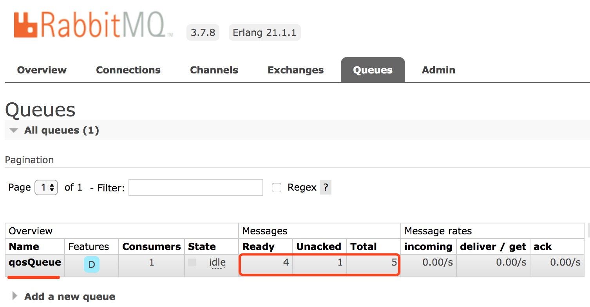
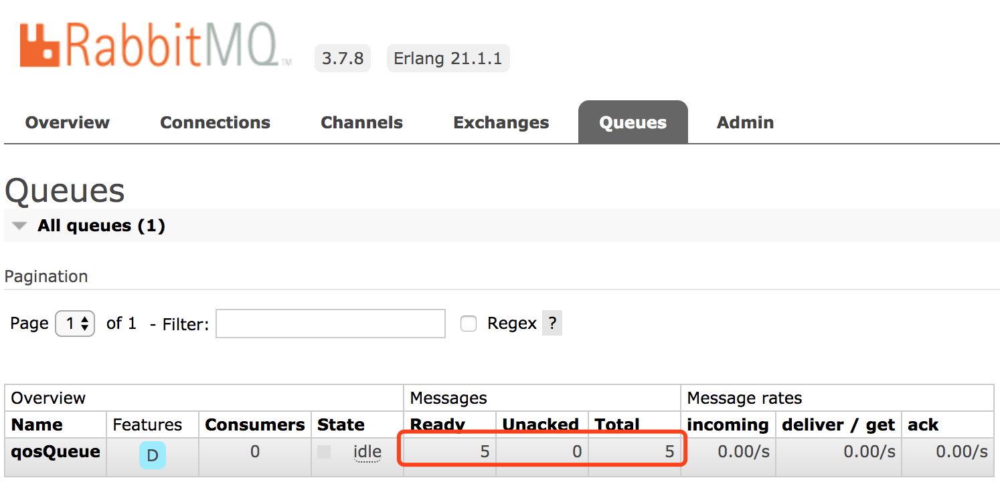
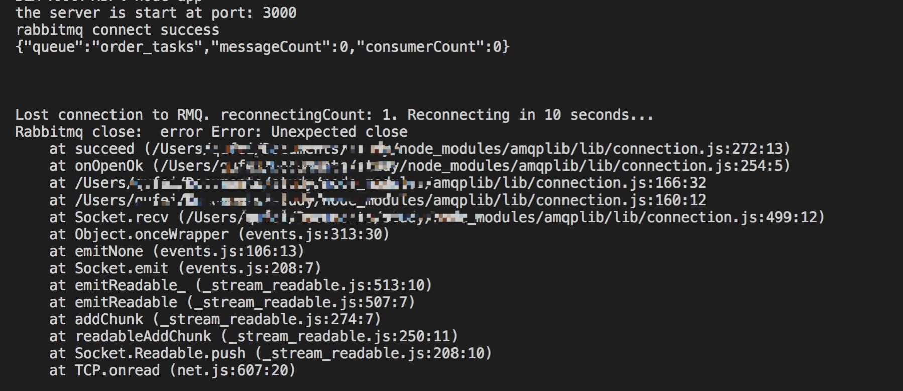

# RabbitMQ高级消息队列

## 快速导航
* [主流消息中间件简介](#主流消息中间件简介)
* [RabbitMQ安装](#安装)
    - `[RabbitMQ安装]` Mac版安装
    - `[RabbitMQ安装]` Linux系统（Ubuntu、CentOS）安装 
    - `[RabbitMQ安装]` 运行与启动 
* [RabbitMQ高级特性消费端限流策略实现](#RabbitMQ高级特性消费端限流策略实现)
    - `[QOS]` 业务场景
    - `[QOS]` RabbitMQ消费端限流机制
    - `[QOS]` 建立生产端
    - `[QOS]` 建立消费端
    - `[QOS]` RabbitMQ限流使用总结
* [RabbitMQ延迟队列实现定时任务](#RabbitMQ延迟队列实现定时任务)
    - `[DLX]` 死信队列
    - `[TTL]` 消息TTL的存活时间
    - `[Task]` Nodejs操作RabbitMQ实现延迟队列
* [一次RabbitMQ生产故障引发的服务重连限流思考](#一次RabbitMQ生产故障引发的服务重连限流思考)

## 主流消息中间件简介

* ```ActiveMQ```：Apache出品，早起很流行主要应用于中小企业，面对大量并发场景会有阻塞、消息堆积问题。
* ```Kafka```：是由Apache软件基金会开发的一个开源流处理平台，由Scala和Java编写，是一种高吞吐量的分布式发布订阅消息系统，支持单机每秒百万并发。最开始目的主要用于大数据方向日志收集、传输。0.8版本开始支持复制，不支持事物，因此对消息的重复、丢失、错误没有严格的要求。
* ```RocketMQ```：阿里开源的消息中间件，是一款低延迟、高可靠、可伸缩、易于使用的消息中间件，思路起源于Kafka。最大的问题商业版收费，有些功能不开放。
* ```RabbitMQ```：是一个由erlang（有着和原生Socket一样低的延迟）语言开发基于AMQP协议的开源消息队列系统。能保证消息的可靠性、稳定性、安全性。

## 安装

- ### Mac版安装

直接通过```HomeBrew```安装，执行以下命令

```brew install rabbitmq```

启动rabbitmq

进入安装目录 ```/usr/local/Cellar/rabbitmq/3.7.8``` 
启动 ```sbin/rabbitmq-server```

浏览器输入```http://localhost:15672/#/```，默认用户名密码：guest

- ### Linux系统安装

#### 安装依赖
```apt-get install build-essential openssl openssl-devel unixODBC unixODBC-devel make gcc gcc-c++ kernel-devel m4 ncurses-devel tk tc xz lsof```

#### 获取安装包

rabbitmq和erlang安装包一定要对应，具体可以查看对应关系，官网有说明[RabbitMQ Erlang Version Requirements](http://www.rabbitmq.com/which-erlang.html)

- ***获取erlang安装包***

```sudo wget http://www.rabbitmq.com/releases/erlang/erlang-18.3-1.el6.x86_64.rpm```

- ***获取socat安装包***

socat支持多协议，用于协议处理、端口转发，rabbitmq依赖于此。

``` sudo wget http://repo.iotti.biz/CentOS/7/x86_64/socat-1.7.3.2-5.el7.lux.x86_64.rpm ```

- ***获取rabbitmq-server安装包***
rabbitmq-server [```安装包列表```](http://www.rabbitmq.com/releases/rabbitmq-server/)
```sudo wget http://www.rabbitmq.com/releases/rabbitmq-server/v3.6.5/rabbitmq-server-3.6.5-1.noarch.rpm```


#### 安装

- **Centos rpm一键安装**

这里采用rpm一键安装，centos 执行命令 ```rpm -ivh erlang-18.3-1.el6.x86_64.rpm```，在```ubuntu```中不支持此命令```rpm```，使用```rpm```提示如下信息：

```bash
rpm: RPM should not be used directly install RPM packages, use Alien instead!
rpm: However assuming you know what you are doing...
error: Failed dependencies:
```

- **```ubuntu```系统rpm一键安装解决方案**
  1. 安装```alien```，执行命令```sudo apt-get install alien```
  2. 转换```rpm```包为```.deb```格式，执行命令```sudo alien package.rpm```其中```package.rpm```为你的包名
  3. 通过dpkg安装，```sudo dpkg -i package.deb```

- **以下顺序安装（以下是基于CentOS系统安装）**
```shell
rpm -ivh erlang-18.3-1.el6.x86_64.rpm
rpm -ivh socat-1.7.3.2-5.el7.lux.x86_64.rpm
rpm -ivh rabbitmq-server-3.6.5-1.noarch.rpm
```

- **修改配置文件**
```
vim /usr/lib/rabbitmq/lib/rabbitmq_server-3.6.5/ebin/rabbit.app
```

```js
{loopback_users, [<<"guest">>]}, // 修改为 {loopback_users, [guest]},
```

#### 运行与启动

- **开启rabbitmq**
```
rabbitmqctl start_app
```

- **开启管理插件**
```
rabbitmq-plugins enable rabbitmq_management
``` 

- **检查状态**
```shell
$ lsof  -i:5672 # 看到以下提示则开启成功
COMMAND  PID     USER   FD   TYPE DEVICE SIZE/OFF NODE NAME
beam    4678 rabbitmq   49u  IPv6 294158      0t0  TCP *:amqp (LISTEN)
```

- **开启管理通知台**
终端更多操作命令，以下有说明，浏览区输入```http://host:15672```打开管理控制台


- **几个端口区别说明**
    * `5672`：通信默认端口号
    * `15672`：管理控制台默认端口号
    * `25672`：集群通信端口号

`注意:` 阿里云ECS服务器如果出现RabbitMQ安装成功，外网不能访问是因为安全组的问题没有开放端口[解决方案](https://blog.csdn.net/lsq_401/article/details/79921221)

- ### 操作命令

|命令                         |   含义  |
|:---------------------------|:------|
|whereis rabbitmq        | 查看rabbitmq安装位置 |
|rabbitmqctl start_app   | 启动应用 |
| whereis erlang | 查看erlang安装位置
| rabbitmqctl start_app | 启动应用
| rabbitmqctl stop_app | 关闭应用
| rabbitmqctl status | 节点状态
| rabbitmqctl add_user username password | 添加用户
| rabbitmqctl list_users | 列出所有用户
| rabbitmqctl delete_user username | 删除用户
| rabbitmqctl add_vhost vhostpath | 创建虚拟主机
| rabbitmqctl list_vhosts| 列出所有虚拟主机
| rabbitmqctl list_queues | 查看所有队列
| rabbitmqctl -p vhostpath purge_queue blue | 清除队列里消息

## 交换机

- **Exchange**
用于接收消息，根据路由键转发消息绑定队列
* Name：交换机名称
* Type：交换机类型direct、topic、fanout、headers
    * direct：不需要Exchange进行绑定，根据RoutingKey匹配消息路由到指定的队列。
    * topic：生产者指定RoutingKey消息根据消费端指定的队列通过模糊匹配的方式进行相应转发，两种通配符模式：
        * `#`：可匹配一个或多个关键字
        * `*`：只能匹配一个关键字

* Durability：是否需要持久化
* Auto Delete：最后一个绑定到Exchange上的队列删除之后自动删除该Exchange
* Internal：当前Exchange是否应用于RabbitMQ内部使用，默认false。
* Arguments：扩展参数
    

## 生产者与消费者

1. 生产者发消息的时候必须要指定一个exchange，若不指定exchange（为空）会默认指向 `AMQP default` 交换机，`AMQP default`路由规则是根据routingKey和mq上有没有相同名字的队列进行匹配路由。

## RabbitMQ高级特性消费端限流策略实现

> 应用范围为服务访问量突然剧增，原因可能有多种外部的调用或内部的一些问题导致消息积压，对服务的访问超过服务所能处理的最大峰值，导致系统超时负载从而崩溃。

### 业务场景

举一些我们平常生活中的消费场景，例如：火车票、机票、门票等，通常来说这些服务在下单之后，后续的出票结果都是异步通知的，如果服务本身只支持每秒1000访问量，由于外部服务的原因突然访问量增加到每秒2000并发，这个时候服务接收者因为流量的剧增，超过了自己系统本身所能处理的最大峰值，如果没有对消息做限流措施，系统在这段时间内就会造成不可用，在生产环境这是一个很`严重`的问题，实际应用场景不止于这些，本文通过RabbitMQ来讲解如果对消费端做限流措施。

### 消费端限流机制

RabbitMQ提供了服务质量保证 (`QOS`) 功能，对channel（通道）预先设置一定的消息数目，每次发送的消息条数都是基于预先设置的数目，如果消费端一旦有未确认的消息，这时服务端将不会再发送新的消费消息，直到消费端将消息进行完全确认，注意：此时消费端不能设置自动签收，否则会无效。

在 `RabbitMQ v3.3.0` 之后，放宽了限制，除了对channel设置之外，还可以对每个消费者进行设置。

以下为 Node.js 开发语言 `amqplib` 库对于限流实现提供的接口方法 `prefetch`

```js
export interface Channel extends events.EventEmitter {
    prefetch(count: number, global?: boolean): Promise<Replies.Empty>;
    ...
}
```

**prefetch 参数说明**：

* number：每次推送给消费端 N 条消息数目，如果这 N 条消息没有被ack，生产端将不会再次推送直到这 N 条消息被消费。
* global：在哪个级别上做限制，ture 为 channel 上做限制，false 为消费端上做限制，默认为 false。


### 建立生产端

生产端没什么变化，和正常声明一样，关于源码参见[rabbitmq-prefetch（Node.js客户端版Demo）](https://github.com/Q-Angelo/project-training/tree/master/nodejs/rabbitmq-prefetch)

```js
const amqp = require('amqplib');

async function producer() {
    // 1. 创建链接对象
    const connection = await amqp.connect('amqp://localhost:5672');

    // 2. 获取通道
    const channel = await connection.createChannel();

    // 3. 声明参数
    const exchangeName = 'qosEx';
    const routingKey = 'qos.test001';
    const msg = 'Producer：';

    // 4. 声明交换机
    await channel.assertExchange(exchangeName, 'topic', { durable: true });
    
    for (let i=0; i<5; i++) {
        // 5. 发送消息
        await channel.publish(exchangeName, routingKey, Buffer.from(`${msg} 第${i}条消息`));
    }

    await channel.close();
}

producer();
```

### 建立消费端

```js
const amqp = require('amqplib');

async function consumer() {
    // 1. 创建链接对象
    const connection = await amqp.connect('amqp://localhost:5672');

    // 2. 获取通道
    const channel = await connection.createChannel();

    // 3. 声明参数
    const exchangeName = 'qosEx';
    const queueName = 'qosQueue';
    const routingKey = 'qos.#';

    // 4. 声明交换机、对列进行绑定
    await channel.assertExchange(exchangeName, 'topic', { durable: true });
    await channel.assertQueue(queueName);
    await channel.bindQueue(queueName, exchangeName, routingKey);
    
    // 5. 限流参数设置
    await channel.prefetch(1, false);

    // 6. 限流，noAck参数必须设置为false
    await channel.consume(queueName, msg => {
        console.log('Consumer：', msg.content.toString());

        // channel.ack(msg);
    }, { noAck: false });
}

consumer();
```

- **未确认消息情况测试**

在 consumer 中我们暂且将 `channel.ack(msg)` 注释掉，分别启动生产者和消费者，看看是什么情况？



如上图所示，总共5条消息按照预先设置的发送了一条消息，因为我将 `channel.ack(msg)` 注释掉了，服务端在未得到 ack 确认，将不会在发送剩下已 Ready 消息。

- **确认消息测试**

修改 consumer 代码，打开确认消息注释，重新启动消费端进行测试

```js
await channel.consume(queueName, msg => {
    console.log('Consumer：', msg.content.toString());

    channel.ack(msg); // 打开注释
}, { noAck: false });
```



如上图所示，Unacked 为0，消息已全部消费成功。

### RabbitMQ限流使用总结

限流在我们的实际工作中还是很有意义的，在使用上生产端没有变化，重点在消费端，着重看以下两点：

* 限流情况 ack 不能设置自动签收，修改 `{ noAck: false }`
* 增加限流参数设置 `channel.prefetch(1, false)`

**源码地址**：[rabbitmq-prefetch（Node.js客户端版Demo）](https://github.com/Q-Angelo/project-training/tree/master/nodejs/rabbitmq-prefetch)

## RabbitMQ幂等性实现

### 业界常见幂等解决方案

* 利用数据库主键设置唯一id
* Redis的原子性功能实现

## RabbitMQ延迟队列实现定时任务

> 实际业务中对于定时任务的需求是不可避免的，例如，订单超时自动取消、每天定时拉取数据等，在Node.js中系统层面提供了setTimeout、setInterval两个API或通过node-schedule这种第三方库来实现。

> 通过这种方式实现对于简单的定时任务是ok的，过于复杂的、可用性要求较高的系统就会存在以下缺点。

- **存在的一些问题**
    1. 消耗系统内存，如果定时任务很多，长时间得不到释放，将会一直占用系统进程耗费内存。
    2. 单线程如何保障出现系统崩溃后之前的定时任务不受影响？多进程集群模式下一致性的保证？
    3. setTimeout、setInterval会存在时间误差，对于时间精度要求较高的是不行的。

- **RabbitMQ TTL+DLX 实现定时任务**

RabbitMQ本身是不支持的，可以通过它提供的两个特性[Time-To-Live and Expiration](https://www.rabbitmq.com/ttl.html#per-queue-message-ttl)、[Dead Letter Exchanges](https://www.rabbitmq.com/dlx.html)来实现，通过以下泳道图可以看到一个消息从发布到消费的整个过程。


### 死信队列

死信队列全称 Dead-Letter-Exchange 简称 DLX 是 RabbitMQ 中交换器的一种类型，消息在一段时间之后没有被消费就会变成死信被重新 publish 到另一个 DLX 交换器队列中，因此称为死信队列。

- **死信队列产生几种情况**
    * 消息被拒绝
    * 消息TTL过期
    * 队列达到最大长度

- **设置DLX的两个参数：**
    * `deadLetterExchange`: 设置DLX，当正常队列的消息成为死信后会被路由到DLX中
    * `deadLetterRoutingKey`: 设置DLX指定的路由键

**`注意`**：Dead-Letter-Exchange也是一种普通的Exchange

### 消息TTL

消息的TTL指的是消息的存活时间，RabbitMQ支持消息、队列两种方式设置TTL，分别如下：

- **消息设置TTL**：对消息的设置是在发送时进行TTL设置，通过`x-message-ttl` 或` expiration` 字段设置，单位为毫秒，代表消息的过期时间，每条消息的TTL可不同。

- **队列设置TTL**：对队列的设置是在消息入队列时计算，通过 `x-expires` 设置，队列中的所有消息都有相同的过期时间，当超过了队列的超时设置，消息会自动的清除。

**`注意`**：如果以上两种方式都做了设置，消息的TTL则以两者之中最小的那个为准。

### Nodejs操作RabbitMQ实现延迟队列

推荐采用 [amqplib](https://github.com/squaremo/amqp.node)库，一个Node.js实现的RabbitMQ客户端。

- **初始化RabbitMQ**

`rabbitmq.js`

```js
// npm install amqplib
const amqp = require('amqplib');

let connection = null;

module.exports = {
    connection,

    init: () => amqp.connect('amqp://localhost:5672').then(conn => {
        connection = conn;

        console.log('rabbitmq connect success');

        return connection;
    })
}
```

- **生产者**

```js
/**
 * 路由一个死信队列
 * @param { Object } connnection 
 */
async function producerDLX(connnection) {
    const testExchange = 'testEx';
    const testQueue = 'testQu';
    const testExchangeDLX = 'testExDLX';
    const testRoutingKeyDLX = 'testRoutingKeyDLX';
    
    const ch = await connnection.createChannel();
    await ch.assertExchange(testExchange, 'direct', { durable: true });
    const queueResult = await ch.assertQueue(testQueue, {
        exclusive: false,
        deadLetterExchange: testExchangeDLX,
        deadLetterRoutingKey: testRoutingKeyDLX,
    });
    await ch.bindQueue(queueResult.queue, testExchange);
    const msg = 'hello world!';
    console.log('producer msg：', msg);
    await ch.sendToQueue(queueResult.queue, new Buffer(msg), {
        expiration: '10000'
    });
    
    ch.close();
}
```

- **消费者**

`consumer.js`

```js
const rabbitmq = require('./rabbitmq.js');

/**
 * 消费一个死信队列
 * @param { Object } connnection 
 */
async function consumerDLX(connnection) {
    const testExchangeDLX = 'testExDLX';
    const testRoutingKeyDLX = 'testRoutingKeyDLX';
    const testQueueDLX = 'testQueueDLX';

    const ch = await connnection.createChannel();
    await ch.assertExchange(testExchangeDLX, 'direct', { durable: true });
    const queueResult = await ch.assertQueue(testQueueDLX, {
        exclusive: false,
    });
    await ch.bindQueue(queueResult.queue, testExchangeDLX, testRoutingKeyDLX);
    await ch.consume(queueResult.queue, msg => {
        console.log('consumer msg：', msg.content.toString());
    }, { noAck: true });
}

// 消费消息
rabbitmq.init().then(connection => consumerDLX(connection));

```

- **运行查看**

分别执行消费者和生产者，可以看到 producer 在44秒发布了消息，consumer 是在54秒接收到的消息，实现了定时10秒种执行

```shell
$ node consumer # 执行消费者
[2019-05-07T08:45:23.099] [INFO] default - rabbitmq connect success
[2019-05-07T08:45:54.562] [INFO] default - consumer msg： hello world!
```

```shell
$ node producer # 执行生产者
[2019-05-07T08:45:43.973] [INFO] default - rabbitmq connect success
[2019-05-07T08:45:44.000] [INFO] default - producer msg： hello world!
```

- **管理控制台查看**

testQu 队列为我们定义的正常队列消息过期，会变成死信，会被路由到 testQueueDLX 队列，形成一个死信队列。


- **注意问题**

> 一个队列里的某个消息即使比同队列中的其它消息提前过期，也不会优先进入到死信队列，只有当过期的消息到了队列的顶端，才会被真正的丢弃或者进入死信队列。

- **源码地址**：[RabbitMQ延迟队列实现定时任务（Node.js客户端版Demo）](https://github.com/Q-Angelo/project-training/tree/master/nodejs/rabbitmq-timed-task)


## 一次RabbitMQ生产故障引发的服务重连限流思考

原由是生产环境 RabbitMQ 消息中间件因为某些原因出现了故障导致当时一些相关的服务短时间不可用，后来 RabbitMQ 修复之后，按理来说服务是要正常恢复的，但是一些潜在问题出现了，因为一些老服务很少受到关注，当人工发现的时候消息已经堆积了几百万条，造成堆积原因是这些服务做为消费方没有重连机制，但是生产端是有的导致生产端一直写消息，消费端不能消费从而导致消息堆积。

这个时候也许你会想到我去把服务重启下就可以了，是的，重启之后可以让消费端这边的服务正常工作，但是请不要忽略一点，如果这个时候你的队列里堆积了很多消息，且服务也没有做限流措施，请谨慎操作，否则可能又是一常灾难。总结起来本次需要做的两点就是服务重连、服务限流，也是以下要讲的两个点

### 建立服务重连机制

以下我建立了 rabbitmq.js 文件主要做以下功能：

* 初始化 Rabbitmq connection
* 通过监听 error、close 事件获取异常消息，进行重连
* isConnection 字段是为了防止建立多个连接（kill -9 processId 会同时触发 error、close 两个事件）
* 建立重连机制，每隔 10 秒钟重试一次
* 统计重连次数，这个可以设置一个阀值做为监控报警
* 链接成功之后初始化我们的消费端

```js
// rabbitmq.js
const amqp = require('amqplib');
const consumer = require('./consumer');

let connection = null;
let isConnection = false;
let reconnectingCount = 0;
const init = () => amqp.connect('amqp://localhost:5672').then(conn => {
    connection = conn;
    conn.on('error', function(err) {
        reconnecting(err, 'error');
    });
    conn.on('close', function(err) {
        reconnecting(err, 'close');
    });

    console.log('rabbitmq connect success');
    isConnection = false;
    consumer.run(connection); // 开启消费者
    return connection;
}).catch(err => {
    isConnection = false;
    reconnecting(err, 'catch')
});

/**
 * 重连
 * @param { Object } err 
 */
const reconnecting = (err, event) => {
    // 已有连接在其它不作处理
    if (!isConnection) {
        isConnection = true;
        reconnectingCount++;
        console.error(`Lost connection to RMQ. reconnectingCount: ${reconnectingCount}. Reconnecting in 10 seconds...`);
        console.error('Rabbitmq close: ', event, err);
        
        return setTimeout(init, 10 * 1000);
    }
}

module.exports = {
    init,
    connection: () => {
        return connection;
    },
}
```

实现方式可以有多种，在 qmqplib 库的 issue [How to reestablish connection after a failure?](https://github.com/squaremo/amqp.node/issues/153) 也有人提到过这个问题，可以参考下。

### 消费端限流机制

和正常建立消费端一样，要实现限流操作需要借助 prefetch 方法，这是 Rabbitmq 提供的服务质量保证 ( QOS) 功能，详细内容参见我的另一篇文章 [Node.js 结合RabbitMQ 高级特性 Prefetch 实现消费端限流策略](https://mp.weixin.qq.com/s?__biz=MzIyNDU2NTc5Mw==&mid=2247483674&idx=1&sn=6431884f33901e2c3d7e403b6dbdccae&chksm=e80c4e54df7bc742241094b3e76e82d2921a6642e661c33cfc74aa0e5402432f6fe0005bf110&token=1815813703&lang=zh_CN#rd)

```js
// consumer.js
async function consumer ({
    exchange,
    queue,
    routingKey,
    connection,
}, cb) {
    const ch = await connection.createChannel();
    await ch.assertExchange(exchange, 'direct', { durable: true });
    const queueResult = await ch.assertQueue(queue, {
        exclusive: false,
    });

    console.info('%j', queueResult);

    await ch.bindQueue(queueResult.queue, exchange, routingKey);
    await ch.prefetch(1, false);
    await ch.consume(queueResult.queue, msg => {
        cb(msg, ch);
    }, { noAck: false });
}

module.exports = {
    run: (connection) => { 
        consumer({
            exchange: 'task',
            queue: 'order_tasks',
            routingKey: 'order_task',
            connection,
        }, async function(msg, ch) {
            const data = msg.content.toString();
            console.info(`${(new Date()).getMinutes()}:${(new Date()).getSeconds()} consumer msg：%j`, data);
        
            return setTimeout(function () {
                try {
                    ch.ack(msg);
                } catch (err) {
                    console.error('消息 Ack Error：', err)
                }
            }, 5000);
        })
    }
}
```

注意在 ack 时如果当前有消息正在消费且暴力退出（kill -9 processId）的情况，会报 ```IllegalOperationError: Channel closed``` 错误，需要 try catch 捕获。

### 建立生产端

同样的和正常建立生产者是没有区别的，示例如下：

```js
// producer.js
const rabbitMQ = require('./rabbitmq');

async function producer({
    exchange,
    routingKey,
}) {
    // 获取链接
    const connection = await rabbitMQ.connection();

    if (!connection) {
        console.error('链接不存在！');
        return;
    }

    try {
        // 获取通道
        const channel = await connection.createChannel();

        // 声明交换机
        await channel.assertExchange(exchange, 'direct', { durable: true });
        
        for (let i=0; i<5; i++) {
            const msg = `第${i}条消息`;
            console.log('Producer：', msg);

            // 发送消息
            await channel.publish(exchange, routingKey, Buffer.from(msg));
        }

        await channel.close();
    } catch (err) {
        console.error('生产消息 Error：', err);
    }
}

module.exports = {
    run: () => {
        producer({
            exchange: 'task',
            routingKey: 'order_task'
        })
    }
}
```

### 重连限流测试

**开启一个 HTTP 接口用于后续测试**

* 提供了生产消息接口：127.0.0.1:3000/producer
* 初始化 RabbitMQ

```js
const http = require('http');
const producer = require('./producer');
const rabbitmq = require('./rabbitmq');

http.createServer((req, res) => {
    if (req.url === '/producer') {
        producer.run();
    }

    res.end('ok!');
}).listen(3000, () => {
    rabbitmq.init();
    console.log('the server is start at port:', 3000);
});
```

这里假设你的 MQ 已经开启，如果不知道怎么开启的参见，[RabbitMQ高级消息队列安装篇](https://www.nodejs.red/#/microservice/rabbitmq-base)

```bash
$ node app
the server is start at port: 3000
rabbitmq connect success
{"queue":"order_tasks","messageCount":0,"consumerCount":0}
```

**连接异常测试**

ps -ef | grep 5672 找到进程 id，kill -9 26179 暴力退出，如下所示



**正常情况下测试**

curl http://127.0.0.1:3000/producer 如下所示，每次仅消费 1 条消息待消息确认后在推送下一条，5 分钟间隔时间为 setTimeout 设置的延迟。

```bash
Producer： 第0条消息
Producer： 第1条消息
Producer： 第2条消息
Producer： 第3条消息
Producer： 第4条消息
32:12 consumer msg："第0条消息"
32:17 consumer msg："第1条消息"
32:22 consumer msg："第2条消息"
32:27 consumer msg："第3条消息"
32:32 consumer msg："第4条消息"
```

[本节源码 Github 地址](https://github.com/Q-Angelo/project-training/tree/master/rabbitmq/reconnection)

以上就是本文对服务重连、服务限流的实践，文中对于生产者如果出现链接终断情况，没有做消息保存这样消息是会丢失的所以牵扯到另外一个内容高可用性，关于 RabbitMQ 消息的高可用性将会在下一节进行讲解。欢迎关注微信公众号 “Nodejs技术栈”、Github [https://www.nodejs.red](https://www.nodejs.red) 获取最新消息。