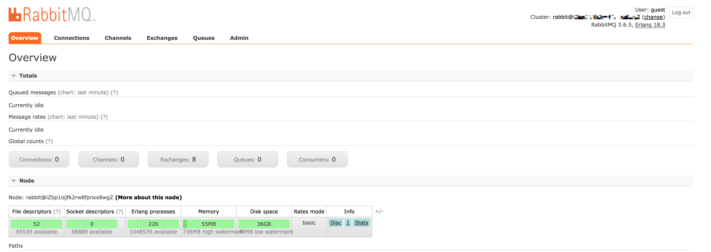
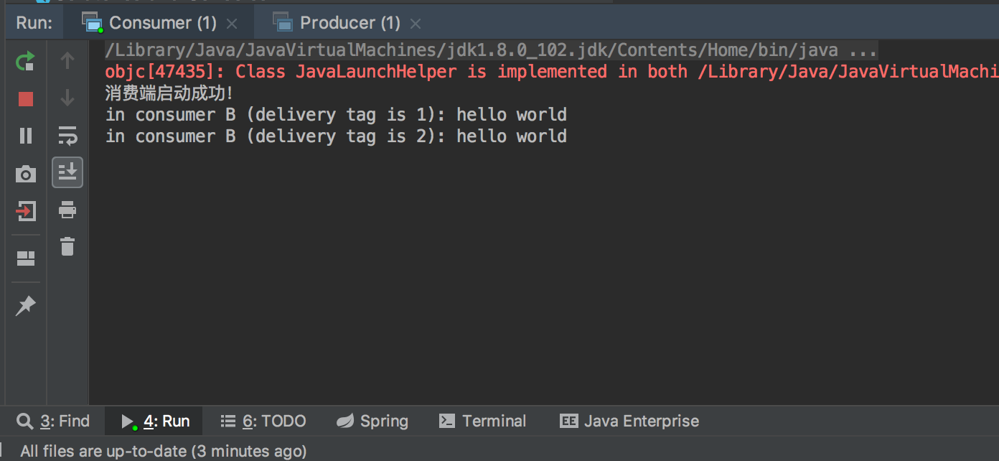

# 消息中间件 RabbitMQ 入门篇

RabbitMQ 是一套开源（MPL）的消息队列服务软件，是由 LShift 提供的一个 Advanced Message Queuing Protocol (AMQP) 的开源实现，由以高性能、健壮以及可伸缩性出名的 Erlang 写成。

**通过本篇能学到什么？**

* 为什么要使用 RabbitMQ？
* RabbitMQ 应用场景？
* MQ 的空间与时间解耦是什么？
* 常用的主流消息中间件都有哪些？
* 如何安装、启动一个 RabbitMQ 服务？
* 如何构建一个简单的生产者与消费者模型？

## 为什么要使用 RabbitMQ？

近两年谈的很多的一个概念**微服务**，在一个大型业务系统架构中，会被拆分成很多小的业务系统，这些业务系统之间如何建立通信呢？大家熟知的 HTTP、RPC 可以实现不同系统、不同语言之间的通信，除了这些往往还会使用消息队列（RabbitMQ、ActiveMQ、Kafafa 等）将这些系统链接起来，达到各系**统间的解耦**。

另外，在后端使用 Node.js 哪怕开发一个稍微大点的系统，消息队列这些知识也是值得你去关注学习的。例如，生产端我可以使用 Node.js 生产一些数据放到队列中，另一段完全可以根据需要我使用 Python 或者其它语言去实现。

## RabbitMQ 应用场景

**1. 同步转异步**

在项目中对于一些没必要同步处理的，可以借助 MQ 进行异步处理，例如，我们的短信发送就可以通过 MQ 队列来做。

**2. 应用解耦**

例如商城业务场景中，订单系统与库存系统，下单的同步可能也要去减少库存，将原本耦合在一块的逻辑可以通过消息队列进行，订单系统发布消息，库存系统订阅消息，这样的好处是一般库存系统出现问题也不会影响到订单系统。

**3. 流量削峰**

流量削峰在一些营销活动、秒杀活动场景中应用还是比较广泛的，如果短时间流量过大，可以通过设置阀值丢弃掉一部分消息或者根据服务的承受能力设置处理消息限制，也就是限流，之后也会单独进行讲解。

## MQ 的空间与时间解耦

从空间上来看，消息的生产者无需提前知道消费者的存在，反之消费者亦是，两者之间得到了解耦，不会强依赖，从而实现**空间上的解耦**。

从时间上来看，消息的生产者只负责生产数据将数据放入队列，之后无需关心消费者什么时间去消费，消费则可以根据自己的业务需要来选择实时消费还是延迟消费，两者都拥有了自己的生命周期，从而实现了**时间上的解耦**。

## 主流消息中间件一览

* **ActiveMQ**：Apache 出品，早起很流行主要应用于中小企业，面对大量并发场景会有阻塞、消息堆积问题。
* **Kafka**：是由 Apache 软件基金会开发的一个开源流处理平台，由 Scala 和 Java 编写，是一种高吞吐量的分布式发布订阅消息系统，支持单机每秒百万并发。最开始目的主要用于大数据方向日志收集、传输。0.8 版本开始支持复制，不支持事物，因此对消息的重复、丢失、错误没有严格的要求。
* **RocketMQ**：阿里开源的消息中间件，是一款低延迟、高可靠、可伸缩、易于使用的消息中间件，思路起源于 Kafka。最大的问题商业版收费，有些功能不开放。
* **RabbitMQ**：是一个由 erlang（有着和原生 Socket 一样低的延迟）语言开发基于 AMQP 协议的开源消息队列系统。能保证消息的可靠性、稳定性、安全性。

## 安装指南

### Mac 安装

直接通过 ```HomeBrew``` 安装，执行以下命令

```
brew install rabbitmq
```

启动 rabbitmq 

```bash
# 进入安装目录
$ /usr/local/Cellar/rabbitmq/3.7.8

# 启动
$ sbin/rabbitmq-server
```

浏览器输入 ```http://localhost:15672/#/``` 默认用户名密码 guest

### Linux系统安装

#### 安装依赖

```
apt-get install build-essential openssl openssl-devel unixODBC unixODBC-devel make gcc gcc-c++ kernel-devel m4 ncurses-devel tk tc xz lsof
```

#### 获取安装包

**rabbitmq 和 erlang 安装包一定要对应**，具体可以查看对应关系，官网有说明 [RabbitMQ Erlang Version Requirements](http://www.rabbitmq.com/which-erlang.html)

- 获取 erlang 安装包

```
sudo wget http://www.rabbitmq.com/releases/erlang/erlang-18.3-1.el6.x86_64.rpm
```

- 获取 socat 安装包

socat 支持多协议，用于协议处理、端口转发，rabbitmq 依赖于此。

```
sudo wget http://repo.iotti.biz/CentOS/7/x86_64/socat-1.7.3.2-5.el7.lux.x86_64.rpm
```

- 获取 rabbitmq-server 安装包

rabbitmq-server [安装包列表](http://www.rabbitmq.com/releases/rabbitmq-server/)

```
sudo wget http://www.rabbitmq.com/releases/rabbitmq-server/v3.6.5/rabbitmq-server-3.6.5-1.noarch.rpm
```

#### centos 系统 rpm 方式一键安装

```
rpm -ivh erlang-18.3-1.el6.x86_64.rpm
rpm -ivh socat-1.7.3.2-5.el7.lux.x86_64.rpm
rpm -ivh rabbitmq-server-3.6.5-1.noarch.rpm
```

#### ubuntu 系统安装

在 ```ubuntu``` 中不支持 ```rpm``` 命令，会提示如下信息：

```
rpm: RPM should not be used directly install RPM packages, use Alien instead!
rpm: However assuming you know what you are doing...
error: Failed dependencies:
```

```ubuntu``` 系统 rpm 一键安装解决方案

1. 安装 ```alien```，执行命令 ```sudo apt-get install alien```
2. 转换 ```rpm``` 包为 ```.deb``` 格式，执行命令 ```sudo alien package.rpm``` 其中 ```package.rpm``` 为你的包名
3. 通过dpkg安装，```sudo dpkg -i package.deb```

#### 修改配置文件

```
vim /usr/lib/rabbitmq/lib/rabbitmq_server-3.6.5/ebin/rabbit.app
```

```js
{loopback_users, [<<"guest">>]}, // 修改为 {loopback_users, [guest]},
```

#### 运行与启动

- **开启 rabbitmq**

& 表示后台方式启动

```
rabbitmq-server start &
```

- **开启管理插件**

使用 rabbitmq-plugins list 命令，可查看 RabbitMQ 自带的插件

```
rabbitmq-plugins enable rabbitmq_management
``` 

- **检查状态**
```bash
$ lsof  -i:5672 # 看到以下提示则开启成功
COMMAND  PID     USER   FD   TYPE DEVICE SIZE/OFF NODE NAME
beam    4678 rabbitmq   49u  IPv6 294158      0t0  TCP *:amqp (LISTEN)
```

- **开启管理通知台**
终端更多操作命令，以下有说明，浏览区输入 ```http://host:15672``` 打开管理控制台



- **几个端口区别说明**
    * `5672`：通信默认端口号
    * `15672`：管理控制台默认端口号
    * `25672`：集群通信端口号

`注意:` 阿里云 ECS 服务器如果出现 RabbitMQ 安装成功，外网不能访问是因为安全组的问题没有开放端口 [解决方案](https://blog.csdn.net/lsq_401/article/details/79921221)

### 操作命令

以下列举一些在终端常用的操作命令

* whereis rabbitmq：查看 rabbitmq 安装位置
* rabbitmqctl start_app：启动应用
* whereis erlang：查看erlang安装位置
* rabbitmqctl start_app：启动应用
* rabbitmqctl stop_app：关闭应用
* rabbitmqctl status：节点状态
* rabbitmqctl add_user username password：添加用户
* rabbitmqctl list_users：列出所有用户
* rabbitmqctl delete_user username：删除用户
* rabbitmqctl add_vhost vhostpath：创建虚拟主机
* rabbitmqctl list_vhosts：列出所有虚拟主机
* rabbitmqctl list_queues：查看所有队列
* rabbitmqctl -p vhostpath purge_queue blue：清除队列里消息

## 构建一个简单的生产者与消费者模型

生产者-消费者模型是指一方生产数据一方消费数据。两者之间会有一个缓冲区做为中介，生产者把数据放入缓冲区，消费者从缓冲区取出数据。另外，生产者消费者模式也是是面向过程编程其中的一种设计模式。

### 构建生产者与消费者步骤

以下列举一下生产者与消费者模型在实现时的一些步骤，各语言在实现的过程中也都是大同小异的。

**生产者步骤**
- 创建链接工厂
- 通过链接工厂创建链接
- 通过链接创建通道（channel）
- 通过 channel 发送数据
- 关闭链接

**消费者步骤**
- 创建链接工厂
- 通过链接工厂创建链接
- 通过链接创建通道（channel）
- 声明一个队列
- 创建消费者
- 设置 channel

### Node.js 版本

**amqplib 客户端**

Github: [https://github.com/squaremo/amqp.node](https://github.com/squaremo/amqp.node)

```
$ npm install amqplib
```

**构建生产者**

生产者发消息的时候必须要指定一个 exchange，若不指定 exchange（为空）会默认指向 `AMQP default` 交换机，`AMQP default` 路由规则是根据 routingKey 和 mq 上有没有相同名字的队列进行匹配路由。

```js
const amqp = require('amqplib');

async function producer() {
    // 1. 创建链接对象
    const connection = await amqp.connect('amqp://localhost:5672');

    // 2. 获取通道
    const channel = await connection.createChannel();

    // 3. 声明参数
    const routingKey = 'helloworldQueue';
    const msg = 'hello world';

    for (let i=0; i<5; i++) {
        // 4. 发送消息
        await channel.publish('', routingKey, Buffer.from(`${msg} 第${i}条消息`));
    }

    // 5. 关闭链接
    await channel.close();
}

producer();
```

**构建消费者**

```js
const amqp = require('amqplib');

async function consumer() {
    // 1. 创建链接对象
    const connection = await amqp.connect('amqp://localhost:5672');

    // 2. 获取通道
    const channel = await connection.createChannel();

    // 3. 声明参数
    const queueName = 'helloworldQueue';

    // 4. 声明队列，交换机默认为 AMQP default
    await channel.assertQueue(queueName);

    // 5. 消费
    await channel.consume(queueName, msg => {
        console.log('Consumer：', msg.content.toString());
        channel.ack(msg);
    });
}

consumer();
```

**Node.js 示例代码**

```
源码地址如下：
https://github.com/Q-Angelo/project-training/tree/master/rabbitmq/helloworld
```

### Java 版本

**添加 maven 依赖**

在 ```Spring Boot``` 项目的 ```pom.xml``` 文件中引入 ```amqp-client``` 启动器

```xml
<dependency>
    <groupId>com.rabbitmq</groupId>
    <artifactId>amqp-client</artifactId>
    <version>5.6.0</version>
</dependency>
```

**构建生产者**

```java
package com.may.rabbitmq.helloworld;

import com.rabbitmq.client.Channel;
import com.rabbitmq.client.Connection;
import com.rabbitmq.client.ConnectionFactory;

public class Producer {
    public static void main(String[] args) throws Exception {
        // 1. 创建链接工厂
        ConnectionFactory connectionFactory = new ConnectionFactory();
        connectionFactory.setHost("127.0.0.1");
        connectionFactory.setPort(5672);
        connectionFactory.setVirtualHost("/");

        // 2. 通过链接工厂创建链接
        Connection connection = connectionFactory.newConnection();

        // 3. 通过链接创建通道（channel）
        Channel channel = connection.createChannel();

        // 4. 通过 channel 发送数据
        // exchange：交换机，如果不传默认为 AMQP default
        channel.basicPublish("", "helloworldQueue", null, "hello world".getBytes());

        // 5. 关闭链接
        channel.close();
        connection.close();
    }
}
```

**构建消费者**

```java
package com.may.rabbitmq.helloworld;

import com.rabbitmq.client.*;

import java.io.IOException;
import java.util.concurrent.TimeUnit;

public class Consumer {
    public static void main(String[] args) throws Exception {
        // 1. 创建链接工厂
        ConnectionFactory connectionFactory = new ConnectionFactory();
        connectionFactory.setHost("127.0.0.1");
        connectionFactory.setPort(5672);
        connectionFactory.setVirtualHost("/");

        // 2. 通过链接工厂创建链接
        Connection connection = connectionFactory.newConnection();

        // 3. 通过链接创建通道（channel）
        Channel channel = connection.createChannel();

        // 4. 声明一个队列
        String queueName = "helloworldQueue";
        channel.queueDeclare(queueName, true, false, false, null);

        // 5. 创建消费者
        // springboot 从 1.5.9 升级到 2.0.0，QueueingConsumer 报错（Cannot resolve symbol 'QueueingConsumer'）没有这个类，改为使用 DefaultConsumer
        DefaultConsumer consumer = new DefaultConsumer(channel) {
            @Override
            public void handleDelivery(String consumerTag, Envelope envelope, AMQP.BasicProperties properties, byte[] body) throws IOException {
                super.handleDelivery(consumerTag, envelope, properties, body);

                String message = new String(body, "UTF-8");
                System.out.printf("in consumer B (delivery tag is %d): %s\n", envelope.getDeliveryTag(), message);
                // System.out.printf("d%: s%\n", envelope.getDeliveryTag(), message);

                try {
                    TimeUnit.MILLISECONDS.sleep(200);
                } catch (InterruptedException e) {

                }

                channel.basicAck(envelope.getDeliveryTag(), false);
            }
        };


        // 6. 设置 channel
        channel.basicConsume(queueName, false, consumer);

        System.out.println("消费端启动成功！");
    }
}
```

**运行测试**



**Java 示例代码**

```
小项目大思想 — SpringBoot 实战系列
https://github.com/Q-Angelo/SpringBoot-Course

源码地址如下：
https://github.com/Q-Angelo/SpringBoot-Course/tree/master/chapter8/chapter8-1
```

在上面的这个 **生产者-消费者** 例子中，也需你会感到疑惑生产者和消费者之间的消息是如何进行匹配传递的？在之后的一节 **RabbitMQ 的交换机详解** 中会介绍，它们是如何进行消息的匹配投递工作。

## 总结

通过本文学习，希望你能掌握什么场景下会应用到 MQ、可以自己尝试下安装一下 MQ 服务并构建一个简单的生产者-消费者模型。因为它很重要，通常也是互联网企业必备的基础组件之一，因此后续也打算写一个系列文章，包含不同交换机的消息投递机制、限流、延迟队列、重试、高可用设计等等，敬请关注本公众号 “Nodejs技术栈” 获取最新消息。