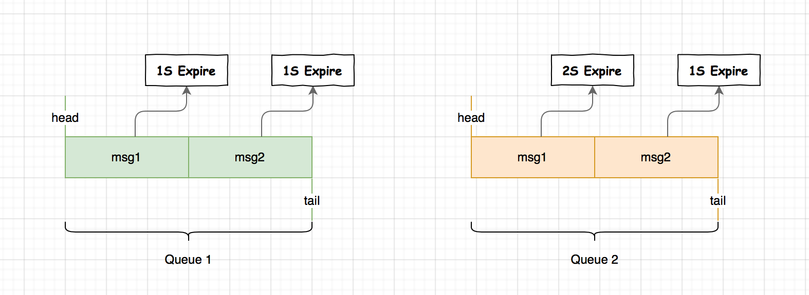
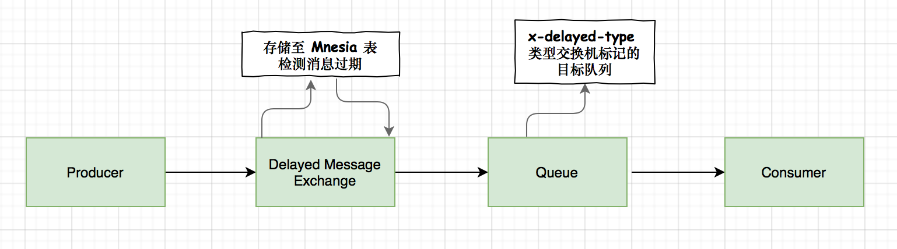
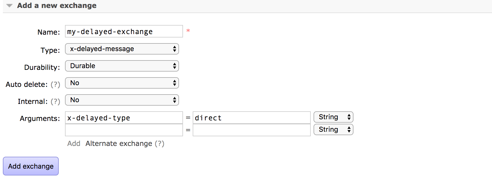
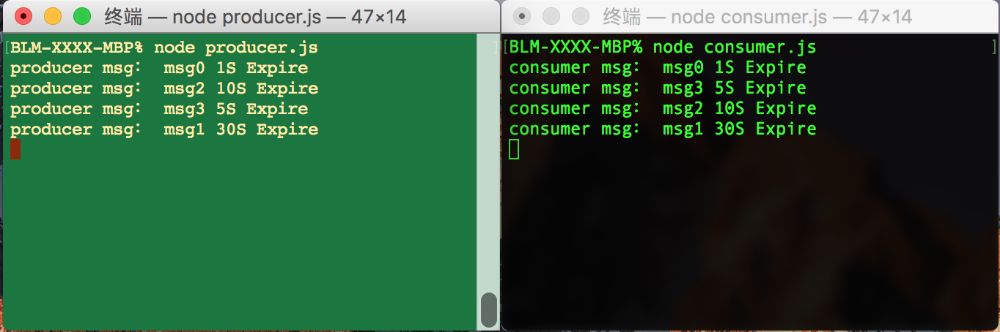

# Delayed Message 插件实现 RabbitMQ 延迟队列

延迟队列是为了存放那些延迟执行的消息，待消息过期之后消费端从队列里拿出来执行。

## DLX + TTL 方式存在的时序问题

对于延迟队列不管是 AMQP 协议或者 RabbitMQ 本身是不支持的，之前有介绍过如何使用 RabbitMQ 死信队列（DLX） + TTL 的方式来模拟实现延迟队列，这也是通常的一种做法，可参见我的另一篇文章 [利用 RabbitMQ 死信队列和 TTL 实现定时任务](https://mp.weixin.qq.com/s/MO9Cg7mrpMfjMyX1UXau0Q)。

今天我想说的是这种方式会存在一个时序问题，看下图：



左侧队列 queue1 分别两条消息 msg1、msg2 过期时间都为 1s，输出顺序为 msg1、msg2 是没问题的

右侧队列 queue2 分别两条消息 msg1、msg2 注意问题来了，msg2 的消息过期时间为 1S 而 msg1 的消息过期为 2S，你可能想谁先过期就谁先消费呗，显然不是这样的，因为这是**在同一个队列，必须前一个消费，第二个才能消费**，所以就出现了**时序问题**。

如果你的消息过期时间是有规律的，例如，有的 1S、有的 2S，那么我们可以以时间为维度设计为两个队列，如下所示：


上面我们将 1S 过期的消息拆分为队列 queue_1s，2S 过期的消息拆分为队列 queue_2s，事情得到进一步解决。如果此时消息的过期时间不确定或者消息过期时间维度过多，在消费端我们就要去监听多个消息队列且对于消息过期时间不确定的也是很难去设计的。

针对消息无序的不妨看下以下解决方案。

## Delayed Message 插件

> 这里要感谢 @神奇的包子，掘金(juejin.im/user/5bfc1b9d6fb9a049b347a9e2) 提出的 Delayed Message 插件方案。

这里将使用的是一个 RabbitMQ 延迟消息插件 [rabbitmq-delayed-message-exchange](https://github.com/rabbitmq/rabbitmq-delayed-message-exchange)，目前维护在 RabbitMQ 插件社区，我们可以声明 x-delayed-message 类型的 Exchange，消息发送时指定消息头 x-delay 以毫秒为单位将消息进行延迟投递。



### 实现原理

上面使用 DLX + TTL 的模式，消息首先会路由到一个正常的队列，根据设置的 TTL 进入死信队列，与之不同的是**通过 x-delayed-message 声明的交换机，它的消息在发布之后不会立即进入队列，先将消息保存至 Mnesia**（一个分布式数据库管理系统，适合于电信和其它需要持续运行和具备软实时特性的 Erlang 应用。目前资料介绍的不是很多）

这个插件将会尝试确认消息是否过期，首先要确保消息的延迟范围是 Delay > 0, Delay =< ?ERL_MAX_T（在 Erlang 中可以被设置的范围为 (2^32)-1 毫秒），如果消息过期通过 x-delayed-type 类型标记的交换机投递至目标队列，整个消息的投递过程也就完成了。

### 插件安装

根据你的 RabbitMQ 版本来安装相应插件版本，RabbitMQ [community-plugins](www.rabbitmq.com/community-plugins.html) 上面有版本对应信息可参考。

注意：需要 RabbitMQ 3.5.3 和更高版本。

```sh
# 注意要下载至你的 RabbitMQ 服务器的 plugins 目录下，例如：/usr/local/rabbitmq/plugins

wget https://dl.bintray.com/rabbitmq/community-plugins/3.6.x/rabbitmq_delayed_message_exchange/rabbitmq_delayed_message_exchange-20171215-3.6.x.zip

# 解压
unzip rabbitmq_delayed_message_exchange-20171215-3.6.x.zip

# 解压之后得到如下文件
rabbitmq_delayed_message_exchange-20171215-3.6.x.ez
```

### 启用插件

使用 rabbitmq-plugins enable 命令启用插件，启动成功会看到如下提示：

```
$ rabbitmq-plugins enable rabbitmq_delayed_message_exchange
The following plugins have been enabled:
  rabbitmq_delayed_message_exchange

Applying plugin configuration to rabbit@xxxxxxxx... started 1 plugin.
```

### 管理控制台声明 x-delayed-message 交换机

在开始代码之前先打开 RabbitMQ 的管理 UI 界面，声明一个 x-delayed-message 类型的交换机，否则你会遇到下面的错误：

```
Error: Channel closed by server: 406 (PRECONDITION-FAILED) with message "PRECONDITION_FAILED - Invalid argument, 'x-delayed-type' must be an existing exchange type"
```

这个问题困扰我了一会儿，详情可见 Github Issues [rabbitmq-delayed-message-exchange/issues/19](https://github.com/rabbitmq/rabbitmq-delayed-message-exchange/issues/19)，正确操作如下图所示：



### Nodejs 代码实践

上面准备工作完成了，开始我们的代码实践吧，官方没有提供 Nodejs 示例，只提供了 Java 示例，对于一个写过 Spring Boot 项目的 Nodeer 这不是问题（此处，兄得你有点飘了啊 /:xx）其实如果有时间能多了解点些，你会发现还是有益的。

#### 构建生产者

几个注意点：

* 交换机类型一定要设置为 x-delayed-message
* 设置 x-delayed-type 为 direct，当然也可以是 topic 等
* 发送消息时设置消息头 headers 的 x-delay 属性，即延迟时间，如果不设置消息将会立即投递

```js
const amqp = require('amqplib');

async function producer(msg, expiration) {
    try {
        const connection = await amqp.connect('amqp://localhost:5672');
        const exchange = 'my-delayed-exchange';
        const exchangeType = 'x-delayed-message'; // x-delayed-message 交换机的类型
        const routingKey = 'my-delayed-routingKey';
        
        const ch = await connection.createChannel();
        await ch.assertExchange(exchange, exchangeType, {
            durable: true,
            'x-delayed-type': 'direct'
        });
        
        console.log('producer msg：', msg);
        await ch.publish(exchange, routingKey, Buffer.from(msg), {
            headers: {
                'x-delay': expiration, // 一定要设置，否则无效
            }
        });

        ch.close();
    } catch(err) {
        console.log(err)
    }
}

producer('msg0 1S Expire', 1000) // 1S
producer('msg1 30S Expire', 1000 * 30) // 30S
producer('msg2 10S Expire', 1000 * 10) // 10S
producer('msg3 5S Expire', 1000 * 5) // 5S
```

#### 构建消费端

消费端改变不大，交换机声明处同生产者保持一样，设置交换机类型（x-delayed-message）和 x-delayed-type

```js
const amqp = require('amqplib');

async function consumer() {
    const exchange = 'my-delayed-exchange';
    const exchangeType = 'x-delayed-message';
    const routingKey = 'my-delayed-routingKey';
    const queueName = 'my-delayed-queue';

    try {
        const connection = await amqp.connect('amqp://localhost:5672');
        const ch = await connection.createChannel();

        await ch.assertExchange(exchange, exchangeType, {
            durable: true,
            'x-delayed-type': 'direct'
        });
        await ch.assertQueue(queueName);
        await ch.bindQueue(queueName, exchange, routingKey);
        await ch.consume(queueName, msg => {
                console.log('consumer msg：', msg.content.toString());
        }, { noAck: true });
    } catch(err) {
        console.log('Consumer Error: ', err);
    }
}

consumer()
```

以上示例源码地址：

```
https://github.com/Q-Angelo/project-training/tree/master/rabbitmq/rabbitmq-delayed-message-node
```

最后，让我们对以上程序做个测试，左侧窗口展示了生产端信息，右侧窗口展示了消费端信息，这次实现了同一个队列里不同过期时间的消息，可以按照我们预先设置的 TTL 时间顺序性消费，我们的目的达到了。



### 局限性

Delayed Message 插件实现 RabbitMQ 延迟队列这种方式也不完全是一个银弹，它将延迟消息存在于 Mnesia 表中，并且在当前节点上具有单个磁盘副本，它们将在节点重启之后幸存。

目前该插件的当前设计并不真正适合包含大量延迟消息（例如数十万或数百万）的场景，详情参见 [#/issues/72](https://github.com/rabbitmq/rabbitmq-delayed-message-exchange/issues/72) 另外该插件的一个可变性来源是依赖于 Erlang 计时器，在系统中使用了一定数量的长时间计时器之后，它们开始争用调度程序资源，并且时间漂移不断累积。

**插件的禁用要慎重**，以下方式可以实现将插件禁用，但是注意如果此时还有延迟消息未消费，那么禁掉此插件后所有的未消费的延迟消息将丢失。

```
rabbitmq-plugins disable rabbitmq_delayed_message_exchange
```

如果你采用了 Delayed Message 插件这种方式来实现，对于消息可用性要求较高的，在发现消息之前可以先落入 DB 打标记，消费之后将消息标记为已消费，中间可以加入定时任务做检测，这可以进一步保证你的消息的可靠性。

## 总结

经过一番实践测试、学习之后发现，**DLX + TTL** 和 **Delayed Message 插件**这两种 RabbitMQ 延迟消息解决方案都有一定的局限性。

如果你的消息 TTL 是相同的，使用 DLX + TTL 的这种方式是没问题的，对于我来说目前还是优选。

如果你的消息 TTL 过期值是可变的，可以尝试下使用 Delayed Message 插件，对于某些应用而言它可能很好用，对于那些可能会达到高容量延迟消息应用而言，则不是很好。

关于 RabbitMQ 延迟队列，如果你有更多其它实现，欢迎关注公众号 “Nodejs技术栈” 在后台取得我的联系方式进行讨论，我很期待。

## Reference

* [github.com/rabbitmq/rabbitmq-delayed-message-exchange](https://github.com/rabbitmq/rabbitmq-delayed-message-exchange)
* [www.rabbitmq.com/community-plugins.html](https://www.rabbitmq.com/community-plugins.html)