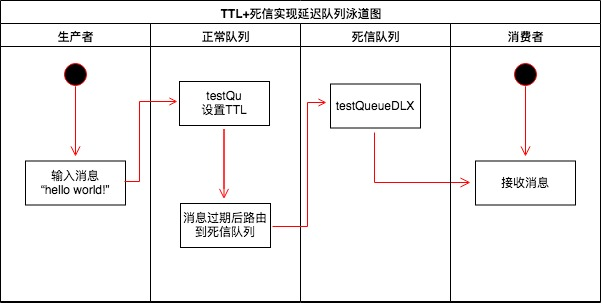
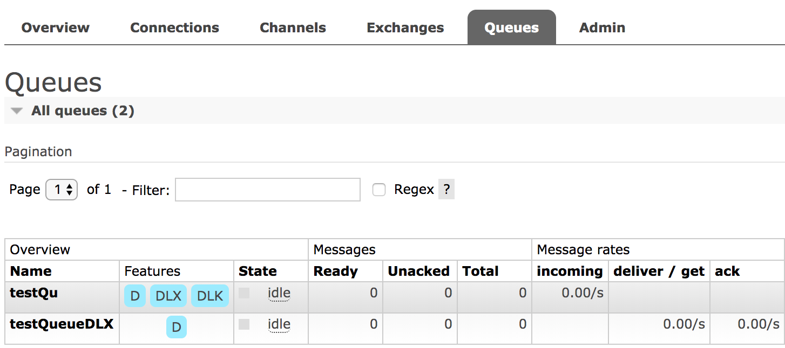

# 利用 RabbitMQ 死信队列和 TTL 实现定时任务

实际业务中对于定时任务的需求是不可避免的，例如，订单超时自动取消、每天定时拉取数据等，在 Node.js 中系统层面提供了 setTimeout、setInterval 两个 API 或通过 node-schedule 这种第三方库来实现。

通过这种方式实现对于简单的定时任务是 ok 的，过于复杂的、可用性要求较高的系统就会存在以下缺点。

## 存在的一些问题

* 消耗系统内存，如果定时任务很多，长时间得不到释放，将会一直占用系统进程耗费内存。
* 单线程如何保障出现系统崩溃后之前的定时任务不受影响？多进程集群模式下一致性的保证？
* setTimeout、setInterval 会存在时间误差，对于时间精度要求较高的是不行的。

## RabbitMQ TTL+DLX 实现定时任务

RabbitMQ 本身是不支持的，可以通过它提供的两个特性 [Time-To-Live and Expiration](https://www.rabbitmq.com/ttl.html#per-queue-message-ttl)、[Dead Letter Exchanges](https://www.rabbitmq.com/dlx.html) 来实现，通过以下泳道图可以看到一个消息从发布到消费的整个过程。



## 死信队列

死信队列全称 Dead-Letter-Exchange 简称 DLX 是 RabbitMQ 中交换器的一种类型，消息在一段时间之后没有被消费就会变成死信被重新 publish 到另一个 DLX 交换器队列中，因此称为死信队列。

- **死信队列产生几种情况**
    * 消息被拒绝
    * 消息 TTL 过期
    * 队列达到最大长度

- **设置DLX的两个参数：**
    * `deadLetterExchange`: 设置 DLX，当正常队列的消息成为死信后会被路由到 DLX 中
    * `deadLetterRoutingKey`: 设置 DLX 指定的路由键

**`注意`**：Dead-Letter-Exchange 也是一种普通的 Exchange

## 消息 TTL

消息的 TTL 指的是消息的存活时间，RabbitMQ 支持消息、队列两种方式设置 TTL，分别如下：

- **消息设置 TTL**：对消息的设置是在发送时进行 TTL 设置，通过 `x-message-ttl` 或` expiration` 字段设置，单位为毫秒，代表消息的过期时间，每条消息的 TTL 可不同。

- **队列设置 TTL**：对队列的设置是在消息入队列时计算，通过 `x-expires` 设置，队列中的所有消息都有相同的过期时间，当超过了队列的超时设置，消息会自动的清除。

**`注意`**：如果以上两种方式都做了设置，消息的 TTL 则以两者之中最小的那个为准。

## 延迟队列实现 Node.js 版

推荐采用 [amqplib](https://github.com/squaremo/amqp.node) 库，一个 Node.js 实现的 RabbitMQ 客户端。

**初始化 RabbitMQ**

```js
// rabbitmq.js
// npm install amqplib
const amqp = require('amqplib');

let connection = null;

module.exports = {
    connection,

    init: () => amqp.connect('amqp://localhost:5672').then(conn => {
        connection = conn;

        console.log('rabbitmq connect success');

        return connection;
    })
}
```

**生产者**

```js
/**
 * 路由一个死信队列
 * @param { Object } connnection 
 */
async function producerDLX(connnection) {
    const testExchange = 'testEx';
    const testQueue = 'testQu';
    const testExchangeDLX = 'testExDLX';
    const testRoutingKeyDLX = 'testRoutingKeyDLX';
    
    const ch = await connnection.createChannel();
    await ch.assertExchange(testExchange, 'direct', { durable: true });
    const queueResult = await ch.assertQueue(testQueue, {
        exclusive: false,
        deadLetterExchange: testExchangeDLX,
        deadLetterRoutingKey: testRoutingKeyDLX,
    });
    await ch.bindQueue(queueResult.queue, testExchange);
    const msg = 'hello world!';
    console.log('producer msg：', msg);
    await ch.sendToQueue(queueResult.queue, new Buffer(msg), {
        expiration: '10000'
    });
    
    ch.close();
}
```

**消费者**

```js
// consumer.js
const rabbitmq = require('./rabbitmq.js');

/**
 * 消费一个死信队列
 * @param { Object } connnection 
 */
async function consumerDLX(connnection) {
    const testExchangeDLX = 'testExDLX';
    const testRoutingKeyDLX = 'testRoutingKeyDLX';
    const testQueueDLX = 'testQueueDLX';

    const ch = await connnection.createChannel();
    await ch.assertExchange(testExchangeDLX, 'direct', { durable: true });
    const queueResult = await ch.assertQueue(testQueueDLX, {
        exclusive: false,
    });
    await ch.bindQueue(queueResult.queue, testExchangeDLX, testRoutingKeyDLX);
    await ch.consume(queueResult.queue, msg => {
        console.log('consumer msg：', msg.content.toString());
    }, { noAck: true });
}

// 消费消息
rabbitmq.init().then(connection => consumerDLX(connection));

```

**运行查看**

分别执行消费者和生产者，可以看到 producer 在 44 秒发布了消息，consumer 是在 54 秒接收到的消息，实现了定时 10 秒种执行

```bash
$ node consumer # 执行消费者
[2019-05-07T08:45:23.099] [INFO] default - rabbitmq connect success
[2019-05-07T08:45:54.562] [INFO] default - consumer msg： hello world!
```

```bash
$ node producer # 执行生产者
[2019-05-07T08:45:43.973] [INFO] default - rabbitmq connect success
[2019-05-07T08:45:44.000] [INFO] default - producer msg： hello world!
```

**管理控制台查看**

testQu 队列为我们定义的正常队列消息过期，会变成死信，会被路由到 testQueueDLX 队列，形成一个死信队列。



**注意问题**

一个队列里的某个消息即使比同队列中的其它消息提前过期，也不会优先进入到死信队列，只有当过期的消息到了队列的顶端，才会被真正的丢弃或者进入死信队列。

**源码地址**

```
https://github.com/Q-Angelo/project-training/tree/master/nodejs/rabbitmq-timed-task
```

## 延迟队列实现 Java 版

**构建生产者**

生产者主要变动为设置消息过期时间

```java
AMQP.BasicProperties basicProperties = new AMQP.BasicProperties.Builder()
        .deliveryMode(2)
        .contentEncoding("UTF-8")
        .expiration("5000") // 设置 5 秒中过期
        .build();

channel.basicPublish(dlxExchangeName, dlxRoutingKey, basicProperties, dlxMsg.getBytes());
```

**构建消费者**

核心代码变动如下，除了绑定一个正常的交换机、队列之外，还需在绑定一个死信的交换机、队列

```java
 public static void main(String[] args) throws Exception {
    ...

    // 定义正常交换机、队列等信息
    String dlxExchangeName = "dlx_exchange_name";
    String exchangeType = "direct";
    String dlxRoutingKey = "dlx_routingKey";
    String dlxQueueName = "dlx_queue";

    // 定义死信队列交换机、队列等信息
    String dlxTestExchangeName = "dlx_test_exchange_name";
    String dlxTestRoutingKey = "dlx_test_routingKey";
    String dlxTestQueueName = "dlx_test_queue";

    // 声明一个正常的交换机、队列和绑定关系
    channel.exchangeDeclare(dlxExchangeName, exchangeType, true, false, null);
    // 声明死信队列交换机
    Map<String, Object> arguments = new HashMap<String, Object>();
    arguments.put("x-dead-letter-exchange", dlxTestExchangeName);
    channel.queueDeclare(dlxQueueName, true, false, false, arguments);
    channel.queueBind(dlxQueueName, dlxExchangeName, dlxRoutingKey);


    // 死信队列的交换机、队列声明和绑定关系
    channel.exchangeDeclare(dlxTestExchangeName, "direct", true, false, null);
    channel.queueDeclare(dlxTestQueueName, true, false, false, null);
    channel.queueBind(dlxTestQueueName, dlxTestExchangeName, dlxRoutingKey);

    ...

    // 6. 设置 channel
    channel.basicConsume(dlxTestQueueName, true, consumer);

    System.out.println("消费端启动成功！");
}
```

**源码地址**

```
https://github.com/Q-Angelo/SpringBoot-Course/tree/master/chapter8/chapter8-1/src/main/java/com/may/rabbitmq/dlx/helloworld
```

## 总结

延迟队列在现实业务场景中，还是有很多实际用途的，订单的超时取消、重试等，都可以借助此来完成，通过本文希望你能掌握什么是延迟队列，在 RabbitMQ 中的实现主要是根据 TTL + 死信队列来完成的，本文最后采用了 Node.js 和 Java 分别进行了实践，希望能帮助到你。
