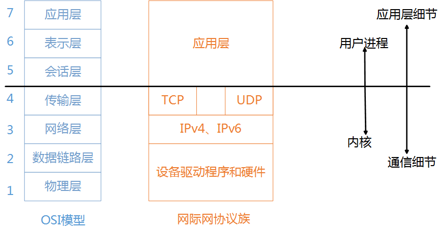
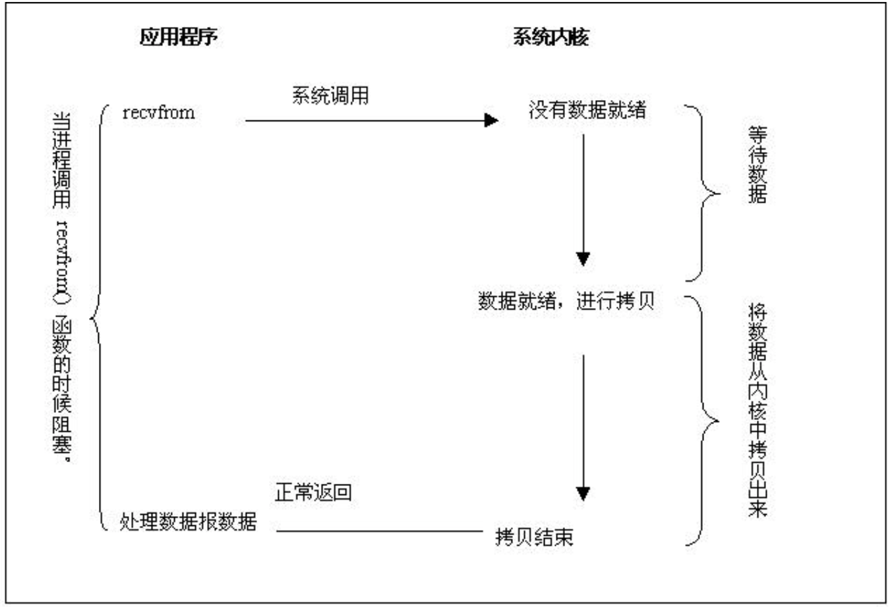
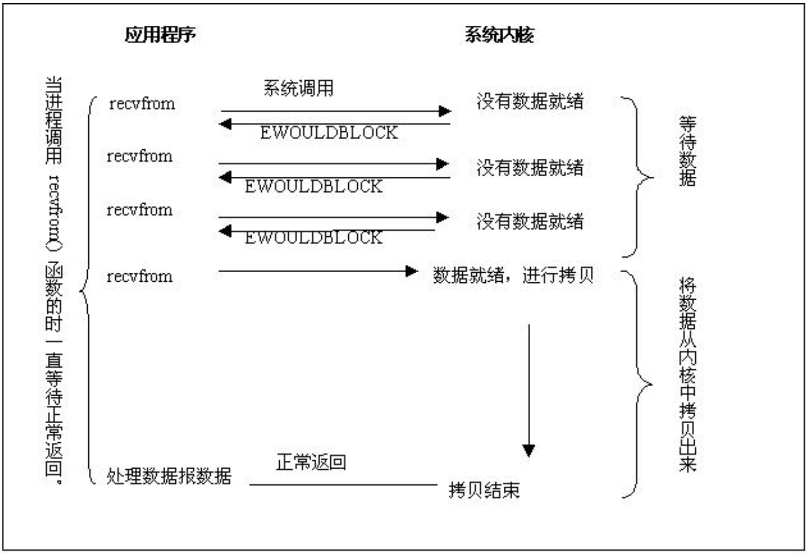
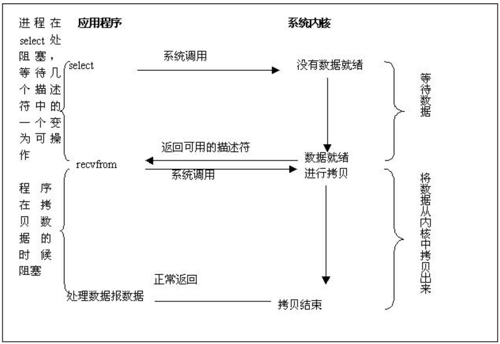
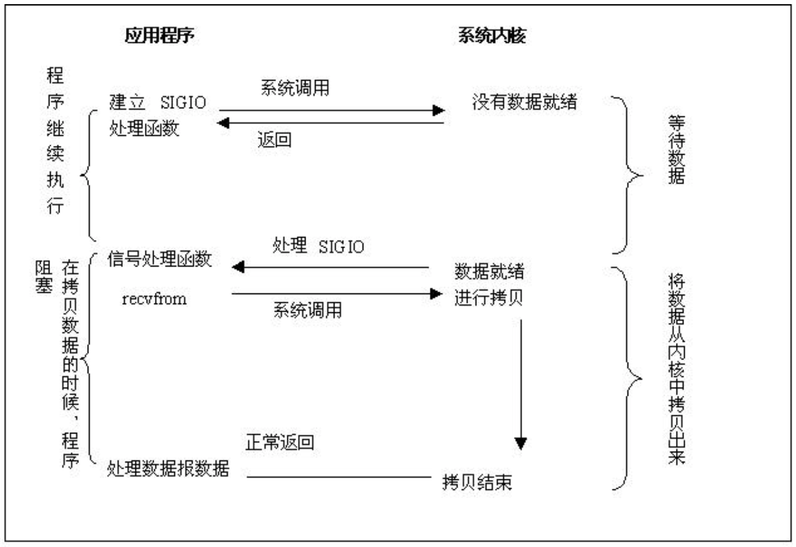
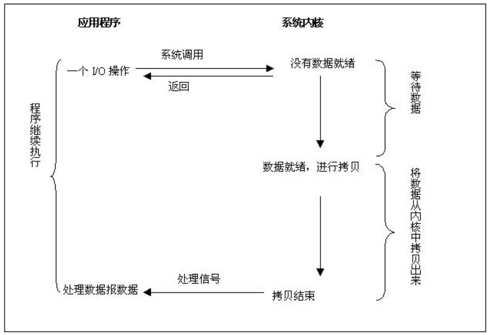

# I/O 

> 人生如同故事。重要的并不在有多长，而是在有多好。——塞涅卡

I/O 是 Input/Ouput 的缩写，即输入输出端口，是信息处理系统（例如计算机）与外部世界（可能是人类或另一信息处理系统）之间的通信。输入是系统接收的信号或数据，输出则是从其发送的信号或数据。
## 快速导航

- [了解 I/O 模型先修知识](#I/O先修知识)
    - 阻塞与非阻塞 I/O
    - 同步与异步 I/O
    - 用户空间与内核空间
- [操作系统 I/O 模型演进](#操作系统I/O模型演进)
    - 同步阻塞 IO
    - 同步非阻塞 IO
    - IO 多路复用
    - 信号驱动 IO
    - 异步 IO 模型
- [白话风格（小明与妹子的邂逅）讲解 I/O 模型的演进](白话风格讲解I/O模型的演进)
- [Select VS Epoll](#SelectVSEpoll)

## 面试指南

* ``` 什么是 I/O 多路复用？ ```，参考：[#](#IO-多路复用)
* ``` I/O 多路复用轮询技术 select 和 epoll 的区别？ ```，参考：[#](#Select-VS-Epoll)

## I/O 先修知识

I/O 也是一个很宽泛的词，每个设备都会有一个专用的 I/O 地址，用来处理自己的输入输出信息。对于服务端研发的童鞋相信 **网络 I/O**、**磁盘 I/O** 这些词，也需并不陌生，一次 API 接口调用、向磁盘写入日志信息，其实就是在跟 I/O 打交道。一次 I/O 操作分为**等待资源**、**使用资源**两个阶段，以下分别进行介绍。

### 阻塞与非阻塞 I/O

阻塞与非阻塞 I/O 是对于操作系统内核而言的，发生在**等待资源阶段**，根据发起 I/O 请求是否阻塞来判断。

**阻塞 I/O**：这种模式下一个用户进程在发起一个 I/O 操作之后，只有收到响应或者超时才可进行处理其它事情，否则 I/O 将会一直阻塞。以读取磁盘上的一段文件为例，系统内核在完成磁盘寻道、读取数据、复制数据道内存中之后，这个调用才算完成。阻塞的这段时间对 CPU 资源是浪费的。
**非阻塞 I/O**：这种模式下一个用户进程发起一个 I/O 操作之后，如果数据没有就绪，会立刻返回（标志数据资源不可用），此时 CPU 时间片可以用来做一些其它事情。

### 同步与异步 I/O

同步与异步 I/O 发生在**使用资源阶段**，根据实际 I/O 操作来判断。

**同步 I/O**：应用发送或接收数据后，如果不返回，继续等待（此处发生阻塞），直到数据成功或失败返回。
**异步 I/O**：应用发送或接收数据后立刻返回，数据写入 OS 缓存，由 OS 完成数据发送或接收，并返回成功或失败的信息给应用。Node.js 就是典型的异步编程例子。

### 用户空间与内核空间

操作系统为了支持多个应用同时运行，需要保证不同进程间相对独立、内核的安全，那就不能谁都能来操作了，因此操作系统将内存空间划分为用户空间、内核空间两部分。用户空间存放用户程序代码和数据，而内核空间存放内核代码和数据。

其实一直以来对于用户空间与内核空间的界限划分还是有点傻傻分不清的感觉，最近读到了一篇文章 [解读I/O多路复用技术](https://www.jianshu.com/p/db5da880154a)，上面有段描述，分别从 **OSI 七层模型图**和**网际网协议族**来看待用户空间与内核空间的分界线，此处引用下图片，总结性的说明下，更详细的推荐去作者网站看下原文讲解。

**OSI 七层模型与网际网协议族图**

可以看到这里以传输层做了边界划分，传输层之上为用户空间（Web 客户端、浏览器、FTP 这些都属于上三层），下四层为内核空间，例如传输层的 TCP、UDP 协议就对应到了内核空间。



## 操作系统 I/O 模型演进

操作系统的 I/O 模型分为：阻塞 I/O、非阻塞 I/O、I/O 复用、信号驱动 I/O、异步 I/O 五种，本节参考 Unix 网络编程一书，图片也引自本书中，以下分别进行介绍。

### 同步阻塞 IO

从应用程序开始系统调用->数据就绪进行拷贝->拷贝结束，这之间应用程序都处于等待状态，不能做其它事情，直到将数据拷贝到用户空间或出错才返回，我们称之为阻塞 I/O 模式。



### 同步非阻塞 IO

相比于同步阻塞 I/O 模式，同步非阻塞 I/O 在每次调用之后，如果数据没有就绪就会立即返回，之后重复调用来检查 I/O 操作是否就绪，这对 CPU 资源是一个极其浪费的操作，直到数据就绪将数据从内核拷贝到用户空间，返回成功指示给到应用程序。

Read：就是一种实现，通过重复轮询 I/O 来判断。



### IO 多路复用

链接（Socket）并发大的情况，上面两种就不适合了，前面一个处理不完，后面就只能干等，这里就用到了 I/O 多路复用技术，下图所示相比较前两种，分为了两步，先进行 select 数据就绪后，在调用 recvfrom 进行真正的 I/O 读写操作。它的高级之处还在于能够一个线程同时处理多个 Socket。



**什么是 I/O 多路复用？**

有必要先弄清这个概念，这里的 I/O 通常指网络 I/O，多路指多个 Socket 链接，复用指操作系统进行运算调度的最小单位**线程**。整体意思也就是多个网络 I/O 复用一个或少量的线程来处理 Socket。

**I/O 多路复用的四种实现**

> I/O 多路服用有多种实现模式：`select`、`poll`、`epoll`、`kqueue`

- **select**

通过轮询检查在文件描述符上设置的标识位来进行判断，select 的轮询相当于在数据库中查找一条记录没有建立索引，对所有的 socket 进行全部遍历，这对 CPU 是浪费的。另外 select 还有一个限制，对于单个进程所能打开的文件描述符最大只能是 1024，那么基于 select 的轮询技术最多也只能很好的处理 1000 并发的吞吐量，可以查看 [上一个10年，著名的C10K并发连接问题](http://www.52im.net/thread-566-1-1.html)

- **poll**

poll 和 select 在实现上没有本质的区别，相比较 select，poll 基于链表来实现，没有了最大链接 1024 的限制。但是当文件描述符多了之后，每次调用都会对链接进行线性遍历，性能还是十分低下的。

- **epoll**

是 linux 下效率最高的 I/O 事件通知机制，没有最大链接限制，通过 callbak 回调通知机制，不在是每次调用都对链接进行线性遍历，这样就不会随着文件描述符的增加导致效率下降。

在 1GB 内存的机器上能监听大约 10 万个端口，远超过 select 的 1024 限制，具体可以在服务器上查看 `cat /proc/sys/fs/file-max`

- **kqueue**

与 epoll 类似，仅存于 FreeBSD（一种类UNIX操作系统）。

### 信号驱动 IO

仅在 Unix 上支持，与 I/O 多路复用相比避免了 select 的阻塞轮询。应用程序进行系统调用后立即返回，处理其它事物，在数据就绪之后系统会发送一个 SIGIO 信号到应用程序，应用进程开始读取数据。



### 异步 IO 模型

异步 I/O 模型是目前最理想的一种形式，应用程序发起系统调用后无需等待直接返回当前调用状态，进行后续的其它任务，结果由内核完成 I/O 操作之后通过回调通知到我们的应用程序，中间没有阻塞过程。

在 Linux2.6 之后增加了异步 I/O 的实现方式 **`AIO`**，但是很少系统能够实现。



## 百话风格讲解 I/O 模型的演进

> 上面讲解了几种 I/O 模型的演进，如果不明白的，我们通过白话风格（小明与妹子的邂逅）讲解操作系统 I/O 模型是什么？之间的区别是什么？

**`故事标题`**：小明与妹子的邂逅  
**`情节情节`**：小明在校园一次文艺晚会上邂逅了一位妹子，在只得知妹子名字、手机号的情况下，经过几天的苦苦追寻，历经千山万水，终得美人归！  
**`演员介绍`**：男一号@小明、女一号@妹子、串场@门卫大爷  

1. **同步阻塞 I/O 模式**

小明电话相约妹子在校门口，然后小明很专一、不见到妹子不回家，期间没有做任何事情，一直在等待！

2. **同步非阻塞 I/O 模式**

小明电话相约妹子在校门口，妹子还没准备好（出门前化妆几小时。。。），这时候的小明很执着，每隔一会儿给妹子发个信息直到妹子准备好了。

3. **I/O 多路复用模式**
    1. ***select***
    小明电话相约妹子在校门口，委托门卫select大爷帮忙，select大爷很敬业每出去一个人都会进行询问，但是select大爷有个限制最多只能询问1024个。
    2. ***poll***
    poll类似于select功能，不同的是poll大爷没有1024限制，可以一直坚持，但是当poll大爷超过1024，询问的越来越多之后就显得越来越精疲力尽了。
    3. ***epoll***
    小明电话相约妹子在校门口，委托门卫epoll大爷帮忙，epoll大爷不在是每个询问，规定每个人出入校门必须带上学生证，这样opoll大爷就是知道哪个是小明的女神了，epoll大爷找到女神之后在电话通知小明。


4. **信号驱动 I/O 模式**

小明电话相约妹子在校门口，此时妹子回复说我还没准备好（出门前化妆几小时。。。），这个时候小明也没去，而是先去干其它事情了，等妹子准备好之后电话通知小明，我已经准备好了，小明这个时候才去校门口等着和妹子的约会。

5. **异步 I/O 模式**

小明告诉妹子我们在校园门口相约，之后小明没有在那干等了，而是先回宿舍休息会或者和朋友在打会球等等，妹子到校门口之后电话通知小明，我已经来啦。

## Select VS Epoll

> 如果问到轮询技术的实现一般也会考察 select 和 epoll 的区别?

**在操作方式上区别**

- select 采用了线性遍历来查找，链接多了之后可以想象一下在一个诺大的数组中每次通过遍历来锁定一个链接，是多么的消耗性能。

- epoll 则不需要遍历，采用的是回调机制，可以看作一个 HashTable，来锁定一个对象是很快的。

**文件描述符限制**

- 对于文件描述符（最大连接数）select 限制为 1024。
- epoll 则没有这个限制，通常在 1G 内存的机器上所能支持的连接数为 10W 左右。

**对于操作系统的支持**

从操作系统支持上来看，目前流行的高性能 Web 服务器 Nginx 是基于 epoll 来实现高并发，当然如果你的链接很小的情况下区别还是不大的 select 也能满足，如果是大流量、高并发情况epoll 目前还是首选模型。


## Reference

* [UNIX 网络编程](https://book.douban.com/subject/1500149/)
* [io优化](https://blog.csdn.net/gzh0222/article/details/9227393)
* [解读I/O多路复用技术](https://www.jianshu.com/p/db5da880154a)
