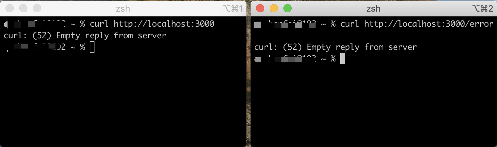
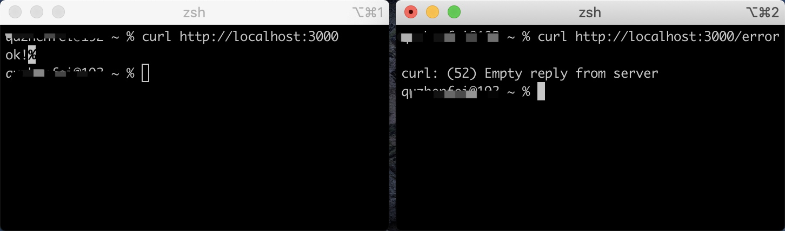

# Node.js 中出现未捕获异常如何处理？

Node.js 程序运行在单进程上，应用开发时一个难免遇到的问题就是异常处理，对于一些未捕获的异常处理起来，也不是一件容易的事情。

## 未捕获异常的程序

下面展示了一段简单的应用程序，如下所示：

```js
const http = require('http');
const PORT = 3000;
const server = http.createServer((req, res) => {
  if (req.url === '/error') {
    a.b;
    res.end('error');
  } else {
    setTimeout(() => res.end('ok!'), 1000 * 10);
  }
});

server.listen(PORT, () => console.log(`port is listening on ${PORT}.`));
```

运行以上程序，在右侧第二个窗口中执行了 /error 路由，因为没有定义 a 这个对象，则会引发错误。



进程崩溃退出之后导致整个应用程序也将崩溃，左侧是一个延迟的响应，也将无法正常工作。

这是一个头疼的问题，不要紧，下文我们将会学到一个优雅退出的方案。

## 进程崩溃优雅退出

关于错误捕获，Node.js 官网曾提供了一个模块 domain 来实现，但是现在已废弃了所以就不再考虑了。

之前在看 [CNPM](https://github.com/cnpm/cnpmjs.org) 这个项目时看到了以下关于错误退出的一段代码：

```js
// https://github.com/cnpm/cnpmjs.org/blob/master/worker.js#L18
graceful({
  server: [registry, web],
  error: function (err, throwErrorCount) {
    if (err.message) {
      err.message += ' (uncaughtException throw ' + throwErrorCount + ' times on pid:' + process.pid + ')';
    }
    console.error(err);
    console.error(err.stack);
    logger.error(err);
  }
});
```

上述使用的是 [graceful](https://github.com/node-modules/graceful) 这个模块，在 NPM 上可以找到。

### 实现一个 graceful.js

实现一个 graceful 函数，初始化加载时注册 uncaughtException、unhandledRejection 两个错误事件，分别监听未捕获的错误信息和未捕获的 Promise 错误信息。

```js
const http = require('http');

/**
 * graceful
 * @param { Number } options.killTimeout 超时时间
 * @param { Function } options.onError 产生错误信息会执行该回调函数
 * @param { Array } options.servers Http Server
 * @returns
 */
function graceful(options = {}) {
  options.killTimeout = options.killTimeout || 1000 * 30;
  options.onError = options.onError || function () {};
  options.servers= options.servers || [];
  process.on('uncaughtException', error => handleUncaughtException(error, options));
  process.on('unhandledRejection', error => handleUnhandledRejection(error, options));
}
```

handleUncaughtException、handleUnhandledRejection 分别接收相应的错误事件，执行应用传入的 onError() 将错误信息进行回传，最后调用 handleError()。

```js
const throwCount = {
  uncaughtException: 0,
  unhandledRejection: 0
};
function handleUncaughtException(error, options) {
  throwCount.uncaughtException += 1;
  options.onError(error, 'uncaughtException', throwCount.uncaughtException);

  if (throwCount.uncaughtException > 1) return;
  handleError(options);
};

function handleUnhandledRejection(error, options) {
  throwCount.unhandledRejection += 1;
  options.onError(error, 'unhandledRejection', throwCount.unhandledRejection);

  if (throwCount.unhandledRejection > 1) return;
  handleError(options);
}
```

HandleError 方法为核心实现，首先遍历应用传入的 servers，监听 request 事件，在未捕获错误触发之后，如果还有请求链接，则关闭当前请求的链接。

之后，执行 setTimeout 延迟退出，也就是最大可能的等待之前链接处理完成。

```js
function handleError(options) {
  const { servers, killTimeout } = options;
  // 关闭当前请求的链接
  for (const server of servers) {
    console.log('server instanceof http.Server: ', server instanceof http.Server);
    if (server instanceof http.Server) {
      server.on('request', (req, res) => {
        req.shouldKeepAlive = false;
        res.shouldKeepAlive = false;
        if (!res._header) {
          res.setHeader('Connection', 'close');
        }
      });
    }
  }

  // 延迟退出
  const timer = setTimeout(() => {
    process.exit(1);
  }, killTimeout);
  
  if (timer && timer.unref) {
    timer.unref();
  }
}
module.exports = graceful;
```

### 应用程序中使用上述实现

加载上述 graceful.js 使用起来很简单只需要在文件尾部，加载 graceful 函数并传入相应参数即可。
 
```js
const graceful = require('./graceful.js');
...
server.listen(PORT, () => console.log(`port is listening on ${PORT}.`));

graceful({
  servers: [server],
  onError: (error, type, throwErrorCount) => {
    console.log('[%s] [pid: %s] [throwErrorCount: %s] %s: %s', new Date(), process.pid, throwErrorCount, type, error.stack || error);
  }
});
```

再次运行应用程序，看看效果：



这一次，即使右侧 /error 路由产生未捕获异常，也将不会引起左侧请求无法正常响应。

## Graceful 模块

最后推荐一个 NPM 模块 [graceful](https://www.npmjs.com/package/graceful)，引用文档中的一句话：“It's the best way to handle uncaughtException on current situations.”

该模块还提供了对于 Node.js 中 Cluster 模块的支持。

**安装**

```
$ npm install graceful -S
```

**应用**

如果一个进程中有多个 Server，将它们添加到 servers 中即可。

```js
const graceful = require('graceful');
...

graceful({
  servers: [server1, server2, restapi],
  killTimeout: '15s',
});
```

## 总结

如果你正在使用 Node.js 对于异常你需要有些了解，上述讲解的两个异常事件可以做为你的最后补救措施，但是不应该当作 On Error Resume Next（出了错误就恢复让它继续）的等价机制。

如果你有不错的建议欢迎和我一起讨论！

## Reference 

* [nodejs.cn/api/process.html](http://nodejs.cn/api/process.html)
* [www.npmjs.com/package/graceful](https://www.npmjs.com/package/graceful)