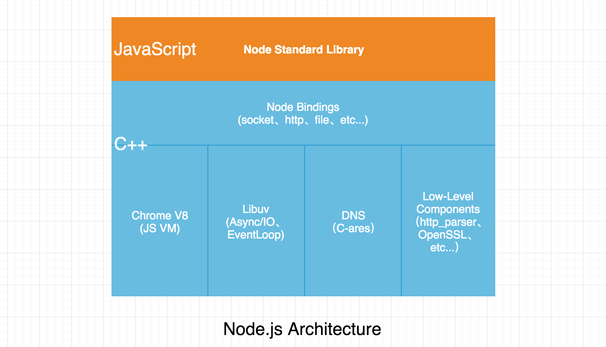

# Node.js 是什么？我为什么选择它？

> 时间是一切财富中最宝贵的财富。 —— 德奥弗拉斯多

当我们学习一项新的事物的时候，我们首先要知道它来自哪里？它是什么？能做什么或者换句话说，能解决什么问题？没有一样东西是最好的，是可以替代所有的，但在某一领域它是最适合的，正如 Node.js 它可能是某些程序员苦苦追寻的东西，也可能是某些程序员不会去关心的东西。本文主要为您介绍 Node.js 的背景及它能做什么，擅长什么，不会涉及到复杂的代码层面的知识讲解，如果你觉得自己很熟悉了，也可以忽略它。

**作者简介**：五月君，Nodejs Developer，热爱技术、喜欢分享的 90 后青年，公众号「Nodejs技术栈」，Github 开源项目 https://www.nodejs.red

文末附上笔者最近整理的 **Node.js 技术栈学习指南路线图** 供大家学习参考！

## 快速导航

- 背景介绍
- 为什么是 JavaScript？
- Node.js 架构
- Node.js 特点
- Node.js 适用于什么
- 为什么选择 Node.js
- Node.js 技术栈学习指南路线图

## 背景介绍

Node.js® is a JavaScript runtime built on Chrome's V8 JavaScript engine. 这是来自 Node.js 官网 [https://nodejs.org/en/](https://nodejs.org/en/) 的一段介绍，翻译成中文意为 Node.js 是一个基于 Chrome V8 引擎的 JavaScript 运行环境。这里重点几个关键词 **V8**、**JavaScript** 后续会讲解，从这里可以看出 Node.js 并不是一门新的编程语言，做为初学者这点先要弄清楚，它是 JavaScript 的运行环境，更进一步的说是在**服务端的运行环境**，因此这里的编程语言指的是 JavaScript。

时间回归到 2009 年，在当时 JavaScript 还是一个跑在浏览器环境里的一门脚本语言，当时的笔者还是一名高中生，接触的编程语言是 VB 并不知 JavaScript 为何物，但随后接触 JavaScript 之后了解到这之前用它可以写一些浏览器脚本，做一些动态特效，主要用于前端页面交互。在 2009 这一时间线之后 Javascript 不只运行于浏览器，还可以运行于服务端，简直打通了前端与后端的任督二脉，当然这要归功于 Node.js 之父 Ryan Dahl。一度认为这是很伟大的，在众多编程语言里，为什么会选择 JavaScript 呢？且看下面介绍。

## 为什么是 JavaScript？

Node.js 使用了一个事件驱动、非阻塞式 I/O 的模型，使其轻量又高效。这是来自于 Node.js 的另一个介绍，关键词 **事件驱动**、**非阻塞式 I/O** 因此，在基于这些条件之下 Node.js 作者 Ryan Dahl 在评估了 C、Lua、Haskell、Ruby、JavaScript 等语言之后，最终选择了 JavaScript，为什么呢？

JavaScript 是一个单线程的语言，单线程的优点是不会像 Java 这些多线程语言在编程时出现线程同步、线程锁问题同时也避免了上下文切换带来的性能开销问题，那么其实在浏览器环境也只能是单线程，可以想象一下多线程对同一个 DOM 进行操作是什么场景？不是乱套了吗？那么单线程可能你会想到的一个问题是，前面一个执行不完，后面不就卡住了吗？当然不能这样子的，JavaScript 是一种采用了事件驱动、异步回调的模式，另外 JavaScript 在服务端不存在什么历史包袱，在虚拟机上由于又有了 Chrome V8 的支持，使得 JavaScript 成为了 Node.js 的首选语言。

为什么选择 JavaScript 作者 Ryan Dahl 应该是最有发言权的，这里查了一些资料及参考了 深入浅出 Node.js 一书，供大家有个初步的认知。

## Node.js 架构

Node.js 由 Libuv、Chrome V8、一些核心 API 构成，如下图所示：

以上展示了 Node.js 的构成，下面做下简单说明：

* Node Standard Library：Node.js 标准库，对外提供的 JavaScript 接口，例如模块 http、buffer、fs、stream 等

* Node bindings：这里就是 JavaScript 与 C++ 连接的桥梁，对下层模块进行封装，向上层提供基础的 API 接口。

* V8：Google 开源的高性能 JavaScript 引擎，使用 C++ 开发，并且应用于谷歌浏览器。如果您感兴趣想学习更多的 V8 引擎知识，请访问 [What is V8?](https://v8.dev/)

* Libuv：是一个跨平台的支持事件驱动的 I/O 库。它是使用 C 和 C++ 语言为 Node.js 所开发的，同时也是 I/O 操作的核心部分，例如读取文件和 OS 交互。来自一份 [Libuv 的中文教程](https://github.com/luohaha/Chinese-uvbook)

* C-ares：C-ares 是一个异步 DNS 解析库

* Low-Level Components：提供了 http 解析、OpenSSL、数据压缩（zlib）等功能。

以上只是做一个初步的认知，如果你想深入了解 Node.js 那么多每个点都是值得你深入研究的。

来自 stack overflow 的一个参考：[which-is-correct-node-js-architecture](https://stackoverflow.com/questions/36766696/which-is-correct-node-js-architecture)

## Node.js 特点

在了解了 Node.js 的一些背景及架构模型之后，已经解决了它来自哪里？是什么？这个问题，现在我们来看看能解决什么问题？它适合做什么？

在这之前不知道您有没有听说过，Node.js 很擅长 I/O 密集型任务，应对一些 I/O 密集型的高并发场景还是很有优势的，事实也如此，这也是它的定位：**提供一种简单安全的方法在 JavaScript 中构建高性能和可扩展的网络应用程序**。

- **单线程**

Node.js 使用单线程来运行，而不是向 Apache HTTP 之类的其它服务器，每个请求将生产一个线程，这种方法避免了 CPU 上下文切换和内存中的大量执行堆栈，这也是 Nginx 和其它服务器为解决 “[上一个 10 年，著名的 C10K 并发连接问题](http://www.52im.net/thread-566-1-1.html)” 而采用的方法。

- **非阻塞 I/O**

Node.js 避免了由于需要等待输入或者输出（数据库、文件系统、Web服务器...）响应而造成的 CPU 时间损失，这得益于 Libuv 强大的异步 I/O。

- **事件驱动编程**

事件与回调在 JavaScript 中已是屡见不鲜，同时这种编程对于习惯同步思路的同学来说可能一时很难理解，但是这种编程模式，确是一种高性能的服务模型。Node.js 与 Nginx 均是基于事件驱动的方式实现，不同之处在于 Nginx 采用纯 C 进行编写，仅适用于 Web 服务器，在业务处理方面 Node.js 则是一个可扩展、高性能的平台。

- **跨平台**

起初 Node.js 只能运行于 Linux 平台，在 v0.6.0 版本后得益于  Libuv 的支持可以在 Windows 平台运行。

## Node.js 适用于什么

讲了这么多那么谈下 Node.js 适合什么场景？

- **I/O 密集型场景**

Node.js 的优势主要在于事件循环，非阻塞异步 I/O，只开一个线程，不会每个请求过来我都去创建一个线程，从而产生资源开销。

- **ResutFul API**

通常我们可以使用 Node.js 来做为中间层，负责组装数据提供 API 接口给到前端调用，这些数据源可能来自第三方接口或者数据库，例如，以前可能我们通过后端 Java、PHP 等其它语言来做，现在我们前端工程师通过 Node.js 即可完成，后端则可以更专注于业务开发。

既然提到了 ResultFul API，顺便推荐一个去哪儿开源的 API 管理工具 YAPI：[https://github.com/YMFE/yapi](https://github.com/YMFE/yapi) 使用的 Node.js 进行开发的（声明下这里不是打广告，只是这个用起来真的很赞！忍不住向给大家推荐！）。

- **RPC 服务**

RPC（Remote Procedure Call）中文名「远程过程调用」，也许你对它很陌生，但是在当今微服务模式下，我们可能是针对功能或者具体的业务形态进行服务化，那么服务之间的通信一种常见的模式我们都知道通过 HTTP 来实现，了解网络模型的同学可能知道，如果我们现在通过 TCP 的方式是不是会更高效呢？

当然是的，HTTP 属于应用层协议，在这之下就是传输层，显然以 TCP 形式是很有优势的，RPC 服务也就是采用的 TCP，现在出名的 RPC 服务例如，Google 的 gRPC、阿里的 Dubble。

- **基础工具**

可以做为基础工具，前端领域中的编译器、构建工具、搭建脚手架等。比较出名的例如 Webpack、Gulp 都是很成功的。

- **论坛社区**

Nodeclub 是使用 Node.js 和 MongoDB 开发的社区系统，界面优雅，功能丰富，小巧迅速，可以用它搭建自己的社区。Cnode 社区就是一个成功的例子，Cnode 地址：[https://cnodejs.org/](https://cnodejs.org/)

[https://github.com/cnodejs/nodeclub](https://github.com/cnodejs/nodeclub)

- **Backend For Frontend**

Backend For Frontend，简称 BFF，服务于前端的后端，并非是一种新技术只是一种逻辑上的分层，在这一层我们可以做一些资源的整合，例如：原先前端需要从三个不同的地方来获取资源，那么，有了这一层之后，我们是不是可以做个聚合，统一处理之后返回给前端，同时也不授后端系统的变迁，导致也要去更改。

- **Serverless**

这将是未来经常会听到的一个词，ServerLess 是一种 “无服务器架构”，它不需要开发者去关心运维、流量处理这些工作，开发者则可以更关注于业务本身。

函数即服务，那么写一个函数就可以实现一个 API 接口给到前端，显然对开发工作是减轻了很多，在 JavaScript 中函数则是一等一的公民，在 ServerLess 这一场景下 Node.js 本身也很轻量级，还是拥有着很大的优势。

- **Microservices**

微服务也是近两年一个很火热的词，这里提几个微服务主要的特点：小型服务、以独立进程运行、可以使用不同语言。那么这里则可以根据业务形态来选择不同的语言实现，Node.js 本身也是很轻量级的，实现起来也很快，在一些 I/O 密集场景还是很适用的。

**什么场景选择什么工具，没有最好的只有更合适的！**

## 为什么选择 Node.js

谈一些个人感受及经历，其实接触计算机行业说不晚也不早，在高中阶段开始接触的编程，在接触 Node.js 之前也学过很多编程语言，大致曲线是这样的 VB（这个是在高中时期）、C、C#(.Net)、Java、PHP 这些都是在学校的时候没事玩弄的，还有接触到前端，真的很杂，但没有一样精通的，这也是最可怕的，在大三暑假去了北京一家公司在那里实习了两个月 PHP，但是之间有遇见做 Node.js 的同学，当时很好奇，哇奥，这是什么东东，竟然可以让 JavaScript 做后端，就是没见过市面那种。后来简单的做了了解，回到学校之后开始学习 Node.js 网上找各种资料看，阴差阳错吧，就这样选择了 Node.js 直到现在，其实语言只是一种工具，例如在后端中，抛开语言这一层，还有很多东西是需要我们去不断学习的。

**最后一点建议**：不要给自己设定边界，例如：我一定要学习 Node.js 或者我一定要学习 Java 又或者 Python，其实在有条件的情况下可以多接触一些其它东西，一方面扩展了自己的边界，另一方面自己也可以从中获取收益。

## Node.js 技术栈学习指南路线图

这是最近画的一张 Node.js 技术栈学习指南路线图，从中可以看出抛开语言这一层面，剩下的（数据库、中间件、HTTP 等）都是我们要学习的。欢迎大家关注公众号「**Nodejs技术栈**」专注于 Node.js 相关技术栈研究分享，若有 Node.js 相关文章也欢迎大家投稿！共同成长！
