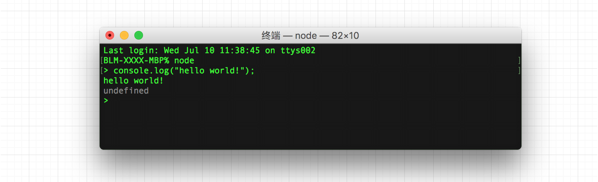
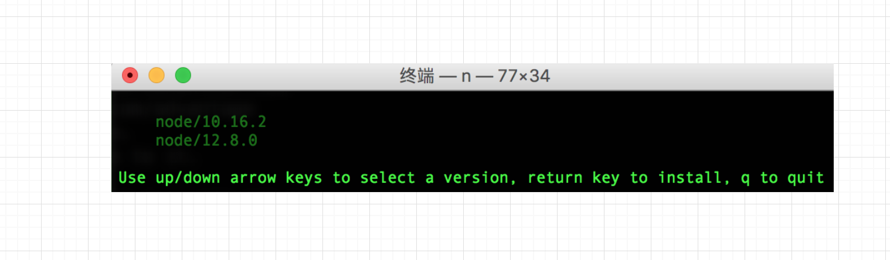

# “3N 兄弟” 助您完成 Node.js 环境搭建

> 锲而舍之，朽木不折；锲而不舍，金石可镂。——荀况

前面已经对 [Node.js 是什么](https://mp.weixin.qq.com/s/Evzp8RdmEw_ZPwYlzjRJTg) 做了介绍，在我们开始编码之前，第一步要做的是环境搭建，标题 **“3N 兄弟” 帮您构建 Node.js 运行环境**，之所以称为 3N 是因为在社区有 **n**、**nvm**、**nvs** 三种方法来对 Node.js 的版本进行管理，使用起来也很方便！因此这里简称 “3N 兄弟”，不管哪个兄弟都可助您完成 Node.js 环境搭建，且看下文介绍！

## 前言

Node.js 是支持跨平台的，Linux、MacOS、Windows 等主流操作系统都是支持的，但是推荐大家使用 Linux 或 MacOS 平台，一方面我们的代码将来投产到生产环境也都是基于 Linux 平台的，另一方面 Windows 有时总会产生一些奇怪的问题（可能不是重点，看自己喜好），Windows 环境的同学也可以搭建一个虚拟机环境进行学习，也很不错的！

在学习本节前，对于 Node.js 版本不了解的同学建议先去看下之前笔者写过的另篇内容 [Node.js 版本知多少？又该如何选择？](https://mp.weixin.qq.com/s/dFhTLVswwQqRaLybKuQ_XQ)，可对 Node.js 版本做一个大概的认知！想要了解 Node.js 更多内容也可去官方网站预览 [https://nodejs.org/en/](https://nodejs.org/en/)。

## 哪个工具更好

我想这也是你想问的问题，我能告诉的是 “三兄弟都很不错，各有千秋” 就像 “萝卜白菜各有所爱”，你可能觉得 nvm 用的顺，我可能觉得 n 用着好，他可能觉得 nvs 更方便，本文主要为您讲解各工具是如何完成 Node.js 环境的搭建。

## nvm

首先介绍第一种 nvm，Github 地址 [https://github.com/nvm-sh/nvm](https://github.com/nvm-sh/nvm)，文档写的也很详细，推荐去阅读，以下为安装步骤：

* 安装 nvm：wget -qO- https://raw.githubusercontent.com/creationix/nvm/v0.33.2/install.sh | bash
* 查看所有 Node.js 版本：nvm ls-remote
* 查看本地 Node.js 版本：nvm ls
* 安装 Node.js：nvm install v6.9.5
* 设置系统的默认 Node.js 版本：nvm alias default v6.9.5

**验证安装结果**

在 Node.js 安装成功之后，我们可以检查它是否正常工作。

打开命令终端，输入以下命令

```node
$ node
```

之后将出现 Node 提示符，我们写入以下命令，运行查看

```js
console.log("hello world!");   
```

按 Enter 键



NVM: [https://github.com/nvm-sh/nvm](https://github.com/nvm-sh/nvm)

## n

n 模块由 [TJ Holowaychuk](https://github.com/tj) 大神所编写，了得的都知道他是 Node.js 界一位很大的贡献者，其中最为知名的框架（Express、Koa）。n 模块正如它的名字一样，它是很简单的，其设计理念如下所示：

```
no subshells, no profile setup, no convoluted API, just simple.
```

以下为安装步骤：

```bash
$ curl -L https://git.io/n-install | bash 或者 npm install -g n # 安装模块 n
$ n 12 # 安装指定 Node.js 版本
```

控制台输入 n 列出所有版本，若还没有还安装任何版本，则提示一些帮助命令，我这里安装过因此列出了一些安装过的版本。

```bash
$ n
```



再进一步看些常用命令：

```bash
$ n latest # 安装最新版本
$ n lts # 安装最新稳定版本
$ n rm 8.16.0 12.8.0 # 删除一些版本
```

N: [https://github.com/tj/n](https://github.com/tj/n)

## nvs

nvs 是一个跨平台的 Node.js 版本管理工具，本身也是基于 JavaScript 进行开发的，以下为步骤介绍：

安装 nvs 直接在控制台粘贴以下命令即可，我是在 Linux 环境下安装的，在执行以下命令之前，需要先安装 git。

```bash
export NVS_HOME="$HOME/.nvs"
git clone https://github.com/jasongin/nvs "$NVS_HOME"
. "$NVS_HOME/nvs.sh" install
```

列举一些基础常用命令：

```bash
$ nvs ls # 列出本地所有版本
$ nvs ls-remote # 列出 Node.js 可供下载的版本
$ nvs add <version> # 下载一个指定版本
$ nvs add <version> # 下载一个指定版本
$ nvs use [version] # 在当前 shell 中指定版本
```

以下为 NVS 官方文档提供的命令参数列表，供大家参考

Command | Description
------- | -----------
`nvs help <command>`             | Get detailed help for a command
`nvs install`                    | Initialize your profile for using NVS
`nvs uninstall`                  | Remove NVS from profile and environment
`nvs --version`                  | Display the NVS tool version
`nvs add <version>`              | Download and extract a node version
`nvs rm <version>`               | Remove a node version
`nvs migrate <fromver> [tover]`  | Migrate global modules
`nvs upgrade [fromver]`          | Upgrade to latest patch of major version
`nvs use [version]`              | Use a node version in the current shell
`nvs auto [on/off]`              | Automatically switch based on cwd
`nvs run <ver> <js> [args...]`   | Run a script using a node version
`nvs exec <ver> <exe> [args...]` | Run an executable using a node version
`nvs which [version]`            | Show the path to a node version binary
`nvs ls [filter]`                | List local node versions
`nvs ls-remote [filter]`         | List node versions available to download
`nvs link [version]`             | Link a version as the default
`nvs unlink [version]`           | Remove links to a default version
`nvs alias [name] [value]`       | Set or recall aliases for versions
`nvs remote [name] [value]`      | Set or recall download base URIs

NVS：[https://github.com/jasongin/nvs](https://github.com/jasongin/nvs)

以上分别介绍了三种方法来管理 Node.js 的版本，也很简单，Windows 平台大家可以自行实践，有什么问题可以在评论区进行提问，另外 Node.js 在安装之后同时会伴随着一个另外的东西 NPM 也被安装了，至于 NPM 是什么？且看下篇文章介绍。