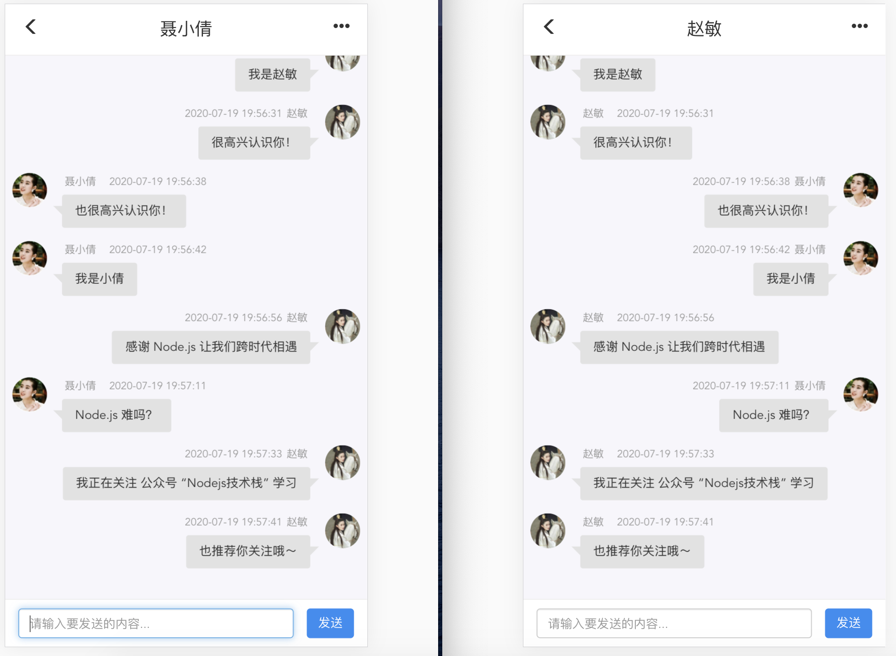

# Node.js + Socket.io 实现一对一即时聊天

实现一对一即时聊天应用，重要的一点就是消息能够实时的传递，一种方案就是熟知的使用 Websocket 协议，本文中我们使用 Node.js 中的一个框架 Socket.io 来实现。

## 效果预览

先看下，我们实现的最终效果，如下所示：



你也可以在浏览器分别输入以下两个 URL 地址进行体验：

- [http://120.27.239.212:30010/?sender=](http://120.27.239.212:30010/?sender=)赵敏&receiver=聂小倩
- [http://120.27.239.212:30010/?sender=](http://120.27.239.212:30010/?sender=)聂小倩&receiver=赵敏

## 技术选型

- 前端：HTML + CSS + JS 还用到了 Boostrap 来实现我们的页面布局和一些样式渲染。
- 后端：Node.js + Express + Socket.io。

## 前端实现

### HTML 页面布局
聊天页面的 HTML 布局是不复杂的，大体分为 3 层，如下所示：

- chat-header：聊天界面头部信息。
- chat-content：用来显示聊天的整体内容信息，现在看到的仅是一个空的 div 在发出或收到聊天信息之后会去操作 DOM 向聊天体内插入消息内容。
- chat-bottom：最下面展示了我们聊天窗口的内容输入窗口和发送按钮。

```html
 <div class="container">
   <div class="chat-header row">
    <span class="col-xs-2 chat-header-left glyphicon glyphicon-menu-left"></span>
   	<span class="col-xs-8 chat-header-center" id="chatHeaderCenter"></span>
    <span class="col-xs-2 chat-header-right glyphicon glyphicon-option-horizontal"></span>
  </div>
  <div class="chat-content" id="chatContent"></div>
  <div class="chat-bottom row">
    <span class="col-xs-10 col-md-11 input-text"><input type="text" class="form-control " id="inputText" placeholder="请输入要发送的内容..."></span>
  	<span class="col-xs-2 col-md-1 span-submit">
    	<input class="btn btn-default btn-primary input-submit" id="sendBtn" data-dismiss="alert" type="submit" value="发送">
    </span>
  </div>
</div>
<script src="/socket.io/socket.io.js"></script>
<script src="./js/chat.js"></script>
```

### Socket.io Client 
客户端首先创建一个 socket 对象，io() 的第一个参数是链接服务器的 URL，默认情况下是 window.location。<br />Socket 的客户端和服务端都有两个函数 on()、emit() 这也是核心，通过这两个函数可以轻松的实现客户端与服务端的双向通信。

- emit：触发一个事件，第一个参数是事件名称，第二个参数是要发送到另一端的数据，第三个参数是一个回调函数用来确认对方的接收信息，这个可以忽略。
- on：注册一个事件，用来监听 emit 触发的事件。

```javascript
// js/chat.js
const socket = io();
socket.on('connect', () => {
  socket.emit('online', query.sender);
});
socket.on('reply_private_chat', replyPrivateMessage);
...
```

在客户端发送消息，则是监听发送按钮的 onclick 事件或回车事件，对消息做一些处理通过 socket.emit 发送到服务端，由服务端转接到另一客户端。

前端部分更多细节代码，这里不再列举，可在 Github 上 Clone 下来自行查看，文末有代码示例地址。

```javascript
const chatHeaderCenter = document.getElementById('chatHeaderCenter');
const inputText = document.getElementById('inputText');
const sendBtn = document.getElementById('sendBtn');
chatHeaderCenter.innerText = query.receiver;
sendBtn.onclick = sendMsg;
inputText.onkeydown = sendMsgByEnter;

function sendMsg() {
  const value = inputText.value;
  if (!value) return alert('Message is required!');
  const message = { sender: query.sender, receiver: query.receiver, text: value };
  socket.emit('private_chat', message, data => {
    renderMessage(data, true);
  });
  inputText.value = '';
}
...
```

## 后端实现

### 使用 Express 搭建服务
使用 Express 搭建我们的后端服务，创建一个 app.js 里面监听 30010 端口，加载我们的客户端页面。

```javascript
// app.js
const express = require('express');
const app = express();
const path = require('path');
const server = require('http').createServer(app);
const PORT = 30010;

app.use(express.static(path.join(__dirname, '../', 'public')));

server.listen(PORT, () => console.log(`Server is listening on ${PORT}`));
```

### 引入 Socket.io
上面我们已经搭建了一个简单的 Express 服务，现在引入我们自定义的 io.js。

```javascript
// app.js
require('./io.js')(server);
```
创建 io.js 在加载 socket.io 时传入 server 对象，这时会拿到一个服务端的 io 对象，同步的注册 connection 事件，如果有新的客户端进来会被触发，connection 回调函数的 socket 是指当前客户端与服务端建立的链接。

还有 online、private_chat、disconnect 这些事件有些是系统提供的，有些是我们自定义的，下文还会在介绍。

```javascript
const _ = require('underscore');
const moment = require('moment');
const userData = require('./users.json');
const USER_STATUS = ['ONLINE', 'OFFLINE'];
const users = {};

module.exports = server => {
  const io = require('socket.io')(server);

  io.on('connection', socket => {
    socket.on('online', ...)
    socket.on('private_chat', ...);
    socket.on('disconnect', ...);
  });
}
```

### 上线通知
on('online') 是我们自定义的事件，由客户端上线后触发告诉我们当前客户端的用户信息，保存 socket.id 建立用户与 socket.id 的映射关系，用于后续私聊。这里的 socket.id 每一次客户端断开重链都是会变的。

```javascript
socket.on('online', username => {
  socket.username = username;
  users[username] = {
    socketId: socket.id,
    status: USER_STATUS[0]
  };
})
```

### 接收发送的私聊消息

on('private_chat') 也是我们自定义的事件，收到客户端发送的消息后对消息做处理，判断接收方是否在线，如果在线通过 socket.id 找到对应的 socket 向接收方推送消息，如果用户不在线，可以做些离线消息推送处理。这里私聊转发关键的一点是 socket.to().emit()。

```javascript
socket.on('private_chat', (params, fn) => {
  const receiver = users[params.receiver];
  params.createTime = moment().format('YYYY-MM-DD HH:mm:ss');
  const senderData = _.findWhere(userData, { username: params.sender });
  params.senderPhoto = (senderData || {}).photo;

  if (!params.senderPhoto) {
    const senderLen = params.sender.length;
    params.senderPhotoNickname = params.sender.substr(senderLen - 2)
  }
  fn(params);
  if (receiver && receiver.status === USER_STATUS[0]) {
    socket.to(users[params.receiver].socketId).emit('reply_private_chat', params);
  } else {
    console.log(`${params.receiver} 不在线`);
    // 可以在做些离线消息推送处理
  }
});
```

### disconnect

断开链接时触发，reason 表示客户端或服务端断开链接的原因。在这个事件里我们也会更改断开链接的原因。

```javascript
socket.on('disconnect', reason => {
  if (users[socket.username]) users[socket.username].status = USER_STATUS[1];
});
```

## 代码&部署
我将以上示例打包为了一个 Docker 镜像，感兴趣的可以执行以下命令拉取，自行部署运行。
```javascript
docker pull docker.io/qufei1993/private-chat-socketio
```
代码示例：

- Github: [https://github.com/qufei1993/Examples](https://github.com/qufei1993/Examples)

Demo 在线体验：

- [http://120.27.239.212:30010/?sender=](http://120.27.239.212:30010/?sender=)赵敏&receiver=聂小倩
- [http://120.27.239.212:30010/?sender=](http://120.27.239.212:30010/?sender=)聂小倩&receiver=赵敏

## 总结
Socket.io 已经封装的很好了，使用它开发一个即时聊天应用更多工作需要我们去接入自己的业务逻辑，本文也只是一个聊天系统的冰山一角，还有很多需要去做，感兴趣的朋友欢迎关注，后续会持续分享一些其它功能。