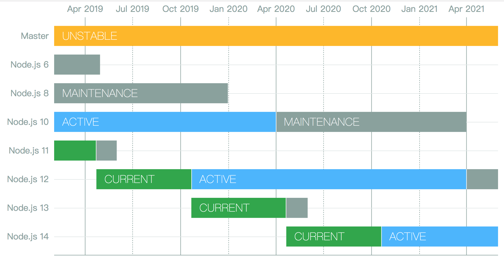

# Node.js 版本知多少？又该如何选择？

Node.js 曾出现过与 io.js 的分裂，自合并成立 Node.js 基金会以来，就开始使用 Long Term Support（LTS）来规划版本发布，其目的也是为了 Node.js 的版本发布能够有条不絮，这样开发者才能更好的选择。

## 为什么版本更迭这么快？

不知道你有没有过疑惑？为什么 Node.js 的版本更迭的这么快，其实它并不是 “我攒了一些功能，然后我就可以放大招了，这样子”，Node.js 的版本发布遵循了两条发布线，分别为每年 10 月发布奇数(9, 11...)版本，次年 4 月发布偶数(10, 12...)版本，因此它是以时间线的流逝为准，在保证兼容性的前提下进行发布，而不是以我增加了多少特性为准进行发布。除了 Node.js 之外，目前主流的浏览器、ECMAScript 标准、C++ 也是遵从这样的原则，以时间跨度为基准。

## 你需要先清楚的几个术语

* CURRENT：指代最新的 Node.js 版本系列（单数）。
* Active：指正在积极维护和升级的版本系列，包括向后移植非破坏性功能和改进，解决错误以及修补安全漏洞。
* Maintenance：这是一个维护的 LTS 版本系列，直到它的生命周期终止，只会在短时间内收到错误修复和安全补丁。
* LTS：是 Long-Term Support 的缩写，代表 Node.js 长期支持的版本（版本号为复数）。
* EOL：EOL 是 End of Life 的首字母缩写，进入到 EOL 时间线的版本，将不在维护。

## 版本的生命周期

让我们看下 Node.js 版本的生命周期是怎么样的？首先要知道每年的 4 月、10 月分别发布偶数、奇数版本，下面是过程说明：

* 最近的一个偶数版本在 4 月份发布之后会持续 6 个月。

* 待 10 月份会发布一个奇数版本，最近的偶数版本会进入 Active LTS 版本持续时间为 18 个月，这期间几乎不会有不兼容的大功能更新，开发者也可以放心升级到 Active LTS 版本。

* 18 个月的 Active LTS 版本到期后，会进入 Maintenance LTS 版本，也就是进入维护期，时间为 12 个月，在这期间仅进行安全、Bug 更新。

* 一旦 Maintenance LTS 版本 12 个月的时间已到就会进入 EOL 版本，正式退出历史舞台。

**生命周期图**

**发布时间表**

以下为 Node.js 的发布时间表，当前时间（2019-08-05）所支持的版本，由此可看出在今年（2019 年）退出舞台的是 8.x 版本。

不知道你没有注意到在 LTS 版本的后面有个 Codename 一列，这是一个 LTS 代号，来自于元素周期表（初中应该学过的）。可以看到 8.x 版本代号为 Carbon（碳）、10.x 版本代号为 Dubnium（𬭊）

**已退出历史舞台的版本**

以下展示了已经退出历史舞台的 Node.js 版本，可以看到第一个 LTS 版本为 4.x 发布于 2015 年。

## 开发者如何选择

读完以上内容，我们已经对 Node.js 的版本有了一定的认识，这里总结下，做为一个开发者我们如何去选择？

**测试环境**

测试环境我们可以去尝试一些新特性，做一些实验性的项目，比如可以体验下 ECMAScript 的最新规范、以及 V8 频繁更新带来的性能等，奇数版本会在每年的 10 月份进行发布，但是要注意，奇数版本的维护周期仅有 8 个月，在兼容性方面不会向 LTS 版本那样有所保证，引入生产项目要谨慎。

**生产环境**

生产环境最重要的是**稳定**，这是我们选择版本的前提条件，因此我们可以在每年发布 Active LTS 版本的时候进行跟进升级，LTS 总共的时间为 Active LTS 的 18 个月 + Maintenance LTS 的 12 个月，合计为 30 个月的时间，最迟也不要超过这个最大时间才更新。因为一个版本一旦退出历史舞台，后续出现什么安全问题或者 Bug 也是没人在修复的。

## Reference

* [https://github.com/nodejs/Release](https://github.com/nodejs/Release)
* [Understanding How Node.js Release Lines Work](https://nodesource.com/blog/understanding-how-node-js-release-lines-work/)
* [Node.js 版本选择和 LTS 计划](http://www.verycurious.top/2018/05/11/node-js%E7%89%88%E6%9C%AC%E9%80%89%E6%8B%A9%E5%92%8Clts%E8%AE%A1%E5%88%92/)