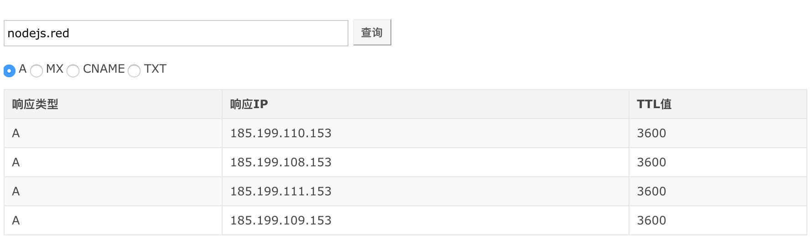

# Node.js DNS 模块

> 社会犹如一条船，每个人都要有掌舵的准备。——易卜生

## 本文主要讲解什么？

* 什么是 DNS 域名解析？
* Node.js DNS 模块两大类别
* dns.lookup() 与 dns.resolve() 区别
* 什么是DNS 解析过程？什么是 DNS 本地解析?

**作者简介**：五月君，Nodejs Developer，慕课网认证作者，热爱技术、喜欢分享的 90 后青年，欢迎关注 [Nodejs技术栈](https://nodejsred.oss-cn-shanghai.aliyuncs.com/node_roadmap_wx.jpg?x-oss-process=style/may) 和 Github 开源项目 [https://www.nodejs.red](https://www.nodejs.red)

## 什么是 DNS？

为了方便记忆，我们通常会通过域名的方式访问网站，例如直接在浏览器地址栏输入 [www.nodejs.red](www.nodejs.red) 就可得到一个请求响应，但是在计算机网络通信时是只能识别 IP（127.0.0.1） 地址的，为什么我直接输入一串字母就可以访问呢？这背后的功劳就要归功于我们的 “翻译官” DNS 也就是域名系统，它会将我们的域名转换为 IP 地址进行工作。

## Node.js DNS 模块两大类别

DNS 模块是基于 UDP 协议来实现的，在 Node.js 中我们可以通过 require('dns') 载入 DNS 实现域名的解析查询，Node.js DNS 模块分为两大类：一是使用底层操作系统工具进行域名解析，二是链接到一个 DNS 网络服务器执行域名解析

### 一：底层操作工具域名解析

Node.js DNS 模块的 dns.lookup() 方法使用底层操作系统进行域名解析，是不需要经过任何网络通信的。

```js
const dns = require('dns');

dns.lookup('nodejs.red', (err, address, family) => {
    console.log('地址: %j 地址族: IPv%s', address, family);
});
```

**注意**，如果本地 hosts 文件被修改过了，dns.lookup() 会拿本地 hosts 文件的域名映射，以下我在 hosts 文件里面修改了域名映射，最终输出的结果为 127.0.0.1 hosts 文件修改后的结果。

**/etc/hosts**
```hosts
127.0.0.1       www.nodejs.red
```

**输出结果**
```
地址: "127.0.0.1" 地址族: IPv4
```

### 二：链接到 DNS 服务器执行域名解析

dns 模块中除 dns.lookup() 之外的所有函数，都会连接到实际 DNS 服务器以执行名称解析并始终使用网络执行 DNS 查询，看以下 dns.resolve() 函数与 dns.lookup() 的不同。

```js
const dns = require('dns');

dns.resolve('www.nodejs.red', (err, records) => {
    console.log(records);
});
```

使用 dns.resolve 会发现即使我们修改了 hosts 文件，也不受影响还是从外部读取正常的地址。

```bash
# 以下为输出结果
[
  '185.199.108.153',
  '185.199.109.153',
  '185.199.110.153',
  '185.199.111.153'
]
```

通过上面的 API 可以实现一个类似下面的 DNS 域名解析功能也不是很难，感兴趣的可以亲自去实践下，更多 API 也可参考 nodejs 官网 dns 模块。



## dns.lookup() 与 dns.resolve() 不同

> dns.lookup() 是同步的还是异步的？

1. 尽管以异步 JavaScript 的角度来调用 dns.lookup()，但在内部 libuv 底层线程池中却是同步的调用 getaddrinfo(3)，所以可能会由于一些不确定因素造成 Node 进程阻塞。

2. 与 dns.lookup() 不同的是 dns.resolve() 这些方法没有使用 getaddrinfo(3)，是通过网络执行的 DNS 查询，始终是保持异步不会对其它进程产生负面影响。

注意事项参考：
[nodejs.cn/api/dns.html#dns_implementation_considerations](http://nodejs.cn/api/dns.html#dns_implementation_considerations)

## 什么是 DNS 解析过程？什么是 DNS 本地解析?

当我们访问一个域名 [www.nodejs.red](www.nodejs.red) 的时候会有一个 DNS 域名系统，会将我们的域名转换为相应的 IP，所经历的步骤大致为：浏览器 DNS 缓存 —> 系统（OS）缓存 -> 路由器缓存 -> ISP DNS 缓存，详细可参考 [github.com/Q-Angelo/http-protocol/blob/master/docs/dns-process.md](https://github.com/Q-Angelo/http-protocol/blob/master/docs/dns-process.md)

DNS 本地解析指的是 **系统（OS）缓存** 这一阶段，在浏览器 DNS 缓存未命中的情况下，会从本地系统的一个 hosts 文件寻找对应 IP。

## Reference

* [man7.org/linux/man-pages/man3/getaddrinfo.3.html](http://man7.org/linux/man-pages/man3/getaddrinfo.3.html)
* [nodejs.cn/api/dns.html](http://nodejs.cn/api/dns.html)