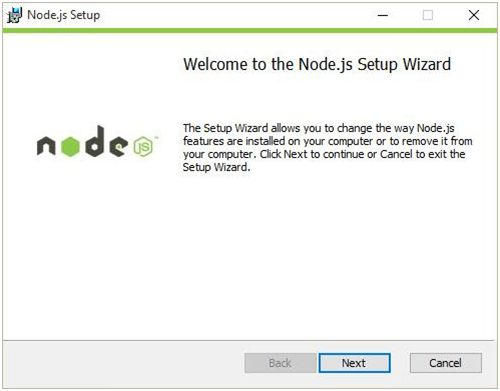
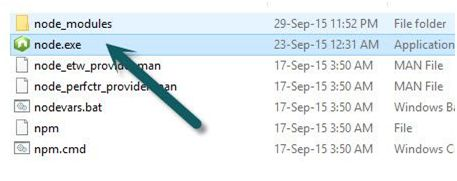
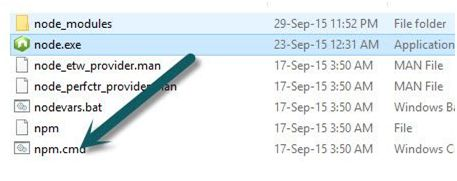
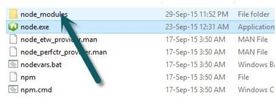
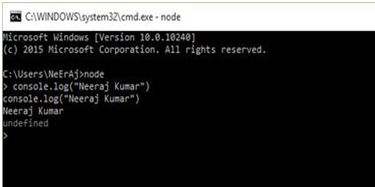

# Node.js 面试问题

Node.js 是 JavaScript 服务端框架之一，本文介绍一些在 Node.js 中最受欢迎的问题和答案。

本文翻译自 [node-js-interview-questions-and-answers](https://www.c-sharpcorner.com/article/node-js-interview-questions-and-answers/)

## Question 1: 如何安装 Node.js?

**Answer**

我们可以从网站 [https://nodejs.org/en/](https://nodejs.org/en/) 下载 Node.js 软件



在安装成功之后可以看到安装位置并且还能看到三个重要的部分：

1. node

> 该文件启动一个 Node.js 的 JavaScript 引擎。您可以使用此 node 文件执行任何 JavaScript 文件。



2. npm

> npm 是 Node.js 的包管理器



3. node_module

这个文件存放一些 Node.js 的依赖安install-node-modules.jpg装包



**验证 Node.js 安装结果**

在 Node.js 安装成功之后，我们可以检查它是否正常工作。

打开命令终端，输入以下命令

```node
$ node
```

之后将出现 Node 提示符，我们写入以下命令，运行查看

```js
console.log(“NeErAjKuMaR”);   
```

按 Enter 键



有关更多信息参考以下链接

* [Installation And Working Of Node.js 
](http://www.c-sharpcorner.com/UploadFile/bd6c67/installation-and-working-of-node-js/)

## Question 2: 什么是 Node.js?

**Answer**

Node.js 是一个基于 Chrome V8 引擎的 JavaScript 运行环境。它是一个开源和跨平台的服务端应用程序。任何人都可以编写 JavaScript 代码来开发 Node.js 应用程序。它可以运行于 Microsoft Windows,Linux, or OS 系统。

Node.js 不是一个新的语言，也不仅仅是一个基于 JavaScript 的框架，它基于 Chrome 的 JavaScript 运行时，因此代码的编写和执行与浏览器非常相似。

**Node.js 功能**

以下是 Node.js 的一些重要功能

* 高度可扩展

Node.js 使用的单线程模型且采用了事件循环架构，使得编写可扩展性高的服务器变得既容易又安全。一些传统的服务端语言会创建多线程来处理请求，通常创建线程都是有系统资源开销的，因此也会有一些限制，而 Node.js 只创建一个线程来处理更多的请求。

* 事件驱动和异步

Node.js 的所有 API 都是异步的。这意味着下一个请求来临时可以直接处理而不用等待上一次的请求结果先返回。

* No Buffering

Node.js 从不缓冲任何任何数据，参见[What is No-Buffering feature of Node.js](https://stackoverflow.com/questions/42596571/what-is-no-buffering-feature-of-node-js)

我们许多人可能会对 Node.js 感到困惑。它不是像 Apache 这样的 Web 服务器。Node.js 提供了一种新方法来执行我们的代码。它是 JavaScript 的运行时。Node.js 提供了创建 HTTP 服务器的方法，我们可以在这之上托管我们的应用程序。

## Question 3: Node.js 的主要功能是什么？

**Answer**

以下是 Node.js 的一些主要功能:

* Real time Data intensive.

例如：多人游戏、股票交易、聊天应用程序等。

* 高度可扩展的 Web 应用程序服务

例如：电子商务、社交媒体、REST API 等。

* 构建快速且可扩展的网络应用程序

例如：代理服务器、后端Web服务、HTTP Web 服务器等

**Node.js 主要功能**

* 事件驱动和异步。
* Node.js 正在成为 Web 应用程序、物联网、移动、企业应用程序开发和微服务架构的通用平台。
* 全栈 JavaScript 人员可以用它进行前端、后端、移动和物联网的项目开发。
* 单线程和高度可扩展性
* 构建于 Chrome's V8 引擎（一般伴随 V8 的优化 Node.js 性能也会有所提升）
* Event loop (Libev)


更多学习参考 [jump-start-node-js](jump-start-node-js)