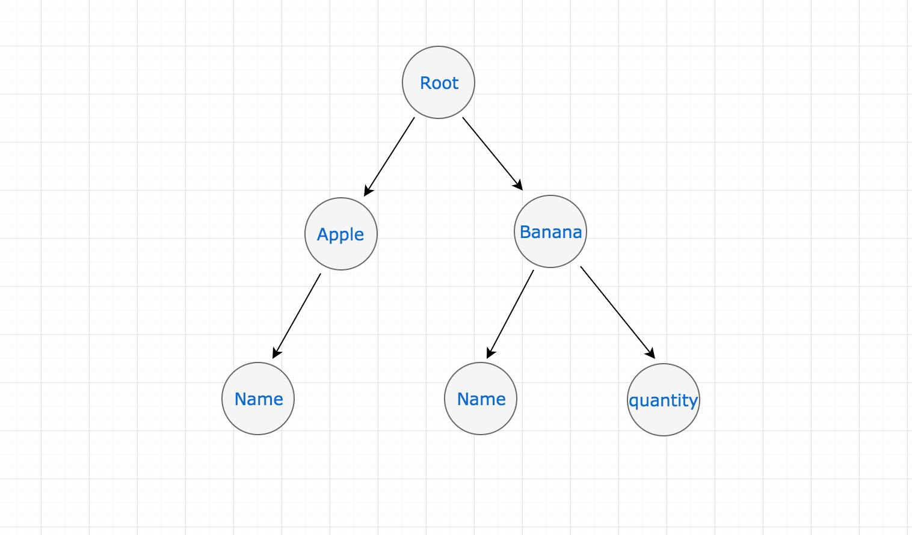
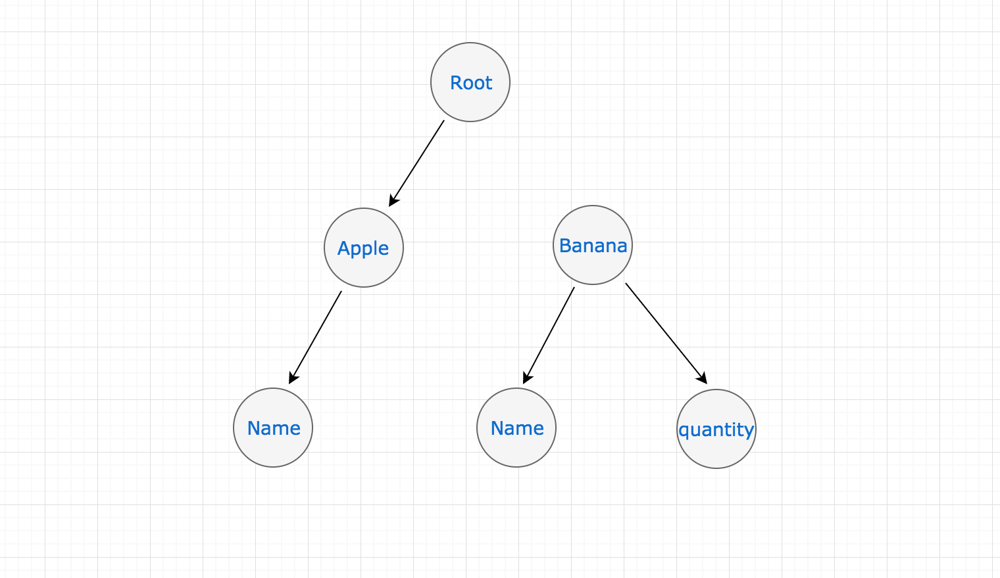
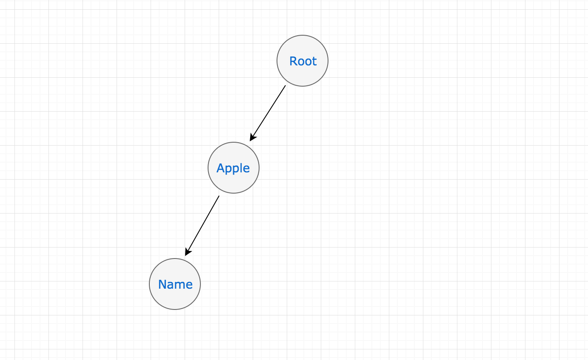
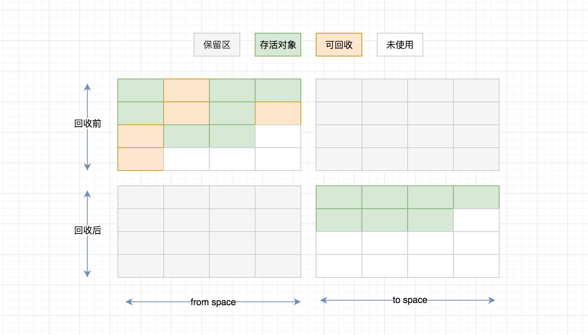
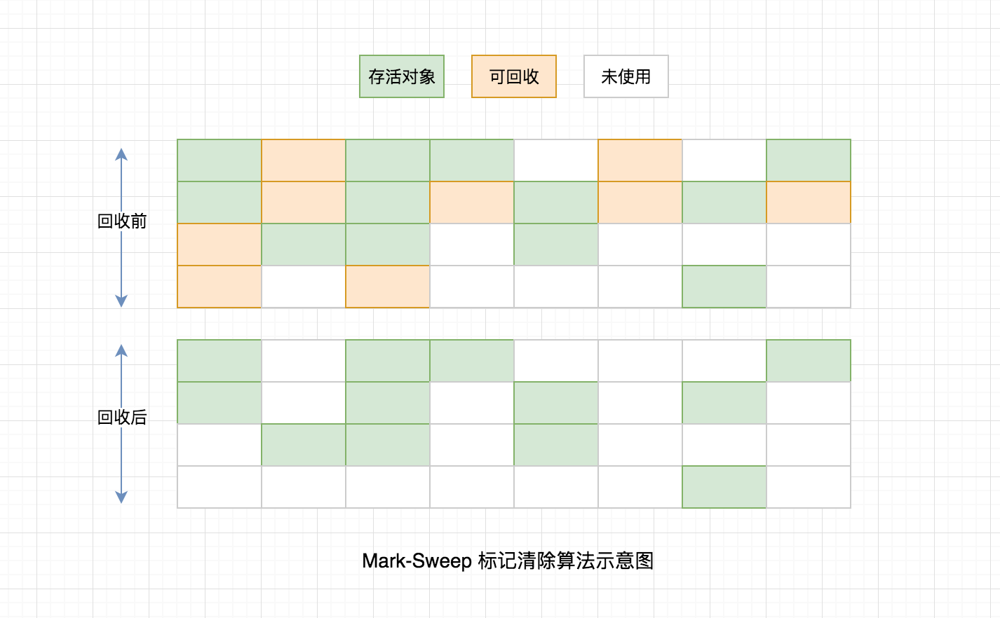
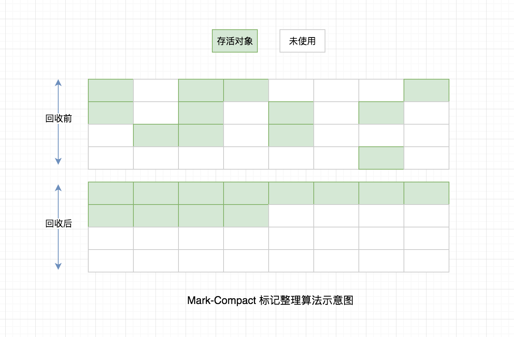

# Nodejs中的内存管理和V8垃圾回收机制

对于 Node.js 服务端研发的同学来说，关于垃圾回收、内存释放这块不需要向 C/C++ 的同学那样在创建一个对象之后还需要手动创建一个 delete/free 这样的一个操作进行 GC（垃圾回收）， Node.js 与 Java 一样，由虚拟机进行内存自动管理，但是这样并不表示就此可以高枕无忧了，在开发中可能由于疏忽或者程序错误导致的内存泄漏也是一个很严重的问题，所以做为一名合格的服务端研发工程师，还是有必要的去了解下虚拟机是怎样使用内存的，遇到问题才能从容应对。

## 快速导航
* [Nodejs中的GC](#Nodejs中的GC)
* [Nodejs垃圾回收内存管理实践](#Nodejs垃圾回收内存管理实践)
    * [内存泄漏识别](#内存泄漏识别)
    * [内存泄漏例子](#内存泄漏例子)
    * [手动执行垃圾回收内存释放](#手动执行垃圾回收内存释放)
* [V8垃圾回收机制](#V8垃圾回收机制)
    * [V8堆内存限制](#V8堆内存限制)
    * [新生代与老生代](#新生代与老生代)
    * [新生代空间 & Scavenge 算法](#新生代空间)
    * [老生代空间 & Mark-Sweep Mark-Compact 算法](#老生代空间)
    * [V8垃圾回收总结](#V8垃圾回收总结)
* [内存泄漏](#内存泄漏)
    * [全局变量](#全局变量)
    * [闭包](#闭包)
    * [慎将内存做为缓存](#慎将内存做为缓存)
    * [模块私有变量内存永驻](#模块私有变量内存永驻)
    * [事件重复监听](#事件重复监听)
    * [其它注意事项](#其它注意事项)
* [内存检测工具](#内存检测工具)

## Nodejs中的GC

Node.js 是一个基于 Chrome V8 引擎的 JavaScript 运行环境，这是来自 Node.js 官网的一段话，所以 V8 就是 Node.js 中使用的虚拟机，在之后讲解的 Node.js 中的 GC 其实就是在讲 V8 的 GC。

Node.js 与 V8 的关系也好比 Java 之于 JVM 的关系，另外 Node.js 之父 Ryan Dahl 在选择 V8 做为 Node.js 的虚拟机时 V8 的性能在当时已经领先了其它所有的 JavaScript 虚拟机，至今仍然是性能最好的，因此我们在做 Node.js 优化时，只要版本升级性能也会伴随着被提升。

## Nodejs垃圾回收内存管理实践

> 先通过一个 Demo 来看看在 Node.js 中进行垃圾回收的过程是怎样的？

### 内存泄漏识别

在 Node.js 环境里提供了 process.memoryUsage 方法用来查看当前进程内存使用情况，单位为字节

* rss（resident set size）：RAM 中保存的进程占用的内存部分，包括代码本身、栈、堆。
* heapTotal：堆中总共申请到的内存量。
* heapUsed：堆中目前用到的内存量，判断内存泄漏我们主要以这个字段为准。
* external： V8 引擎内部的 C++ 对象占用的内存。

```js
/**
 * 单位为字节格式为 MB 输出
 */
const format = function (bytes) {
    return (bytes / 1024 / 1024).toFixed(2) + ' MB';
};

/**
 * 封装 print 方法输出内存占用信息 
 */
const print = function() {
    const memoryUsage = process.memoryUsage();

    console.log(JSON.stringify({
        rss: format(memoryUsage.rss),
        heapTotal: format(memoryUsage.heapTotal),
        heapUsed: format(memoryUsage.heapUsed),
        external: format(memoryUsage.external),
    }));
}
```

### 内存泄漏例子

堆用来存放对象引用类型，例如字符串、对象。在以下代码中创建一个 Fruit 存放于堆中。

```js
// example.js
function Quantity(num) {
    if (num) {
        return new Array(num * 1024 * 1024);
    }

    return num;
}

function Fruit(name, quantity) {
    this.name = name
    this.quantity = new Quantity(quantity)
}

let apple = new Fruit('apple');
print();
let banana = new Fruit('banana', 20);
print();
```

执行以上代码，内存向下面所展示的，apple 对象 heapUsed 的使用仅有 4.21 MB，而 banana 我们对它的 quantity 属性创建了一个很大的数组空间导致 heapUsed 飙升到 164.24 MB。

```
$ node example.js

{"rss":"19.94 MB","heapTotal":"6.83 MB","heapUsed":"4.21 MB","external":"0.01 MB"}
{"rss":"180.04 MB","heapTotal":"166.84 MB","heapUsed":"164.24 MB","external":"0.01 MB"}
```

我们在来看下内存的使用情况，根节点对每个对象都持有引用，则无法释放任何内容导致无法 GC，正如下图所展示的



### 手动执行垃圾回收内存释放

假设 banana 对象我们不在使用了，对它重新赋予一些新的值，例如 banana = null，看下此刻会发生什么？



结果如上图所示，无法从根对象在到达到 Banana 对象，那么在下一个垃圾回收器运行时 Banana 将会被释放。

让我们模拟一下垃圾回收，看下实际情况是什么样的？

```js
// example.js
let apple = new Fruit('apple');
print();
let banana = new Fruit('banana', 20);
print();
banana = null;
global.gc();
print();
```

以下代码中 --expose-gc 参数表示允许手动执行垃圾回收机制，将 banana 对象赋为 null 后进行 GC，在第三个 print 打印出的结果可以看到 heapUsed 的使用已经从 164.24 MB 降到了 3.97 MB

```bash
$ node --expose-gc example.js
{"rss":"19.95 MB","heapTotal":"6.83 MB","heapUsed":"4.21 MB","external":"0.01 MB"}
{"rss":"180.05 MB","heapTotal":"166.84 MB","heapUsed":"164.24 MB","external":"0.01 MB"}
{"rss":"52.48 MB","heapTotal":"9.33 MB","heapUsed":"3.97 MB","external":"0.01 MB"}
```

下图所示，右侧的 banana 节点没有了任何内容，经过 GC 之后所占用的内存已经被释放了。



## V8垃圾回收机制

> 垃圾回收是指回收那些在应用程序中不在引用的对象，当一个对象无法从根节点访问这个对象就会做为垃圾回收的候选对象。这里的根对象可以为全局对象、局部变量，无法从根节点访问指的也就是不会在被任何其它活动对象所引用。

### V8堆内存限制

内存在服务端本来就是一个寸土寸金的东西，在 V8 中限制 64 位的机器大约 1.4GB，32 位机器大约为 0.7GB。因此，对于一些大内存的操作需谨慎否则超出 V8 内存限制将会造成进程退出。

**一个内存溢出超出边界限制的例子**

```js
// overflow.js
const format = function (bytes) {
    return (bytes / 1024 / 1024).toFixed(2) + ' MB';
};

const print = function() {
    const memoryUsage = process.memoryUsage();
    console.log(`heapTotal: ${format(memoryUsage.heapTotal)}, heapUsed: ${format(memoryUsage.heapUsed)}`);
}

const total = [];
setInterval(function() {
    total.push(new Array(20 * 1024 * 1024)); // 大内存占用
    print();
}, 1000)
```

以上例子中 total 为全局变量每次大约增长 160 MB 左右且不会被回收，在接近 V8 边界时无法在分配内存导致进程内存溢出。

```bash
$ node overflow.js
heapTotal: 166.84 MB, heapUsed: 164.23 MB
heapTotal: 326.85 MB, heapUsed: 324.26 MB
heapTotal: 487.36 MB, heapUsed: 484.27 MB
heapTotal: 649.38 MB, heapUsed: 643.98 MB
heapTotal: 809.39 MB, heapUsed: 803.98 MB
heapTotal: 969.40 MB, heapUsed: 963.98 MB
heapTotal: 1129.41 MB, heapUsed: 1123.96 MB
heapTotal: 1289.42 MB, heapUsed: 1283.96 MB

<--- Last few GCs --->

[87581:0x103800000]    11257 ms: Mark-sweep 1283.9 (1290.9) -> 1283.9 (1290.9) MB, 512.1 / 0.0 ms  allocation failure GC in old space requested
[87581:0x103800000]    11768 ms: Mark-sweep 1283.9 (1290.9) -> 1283.9 (1287.9) MB, 510.7 / 0.0 ms  last resort GC in old space requested
[87581:0x103800000]    12263 ms: Mark-sweep 1283.9 (1287.9) -> 1283.9 (1287.9) MB, 495.3 / 0.0 ms  last resort GC in old space requested


<--- JS stacktrace --->
```

**在 V8 中也提供了两个参数仅在启动阶段调整内存限制大小**

分别为调整老生代、新生代空间，关于老生代、新生代稍后会做介绍。

* --max-old-space-size=2048
* --max-new-space-size=2048

当然内存也并非越大越好，一方面**服务器资源**是昂贵的，另一方面据说 V8 以 **1.5GB 的堆内存**进行一次小的**垃圾回收大约需要 50 毫秒**以上时间，这将会导致 JavaScript 线程暂停，这也是最主要的一方面。

### 新生代与老生代

绝对大多数的应用程序对象的存活周期都会很短，而少数对象的存活周期将会很长为了利用这种情况，V8 将堆分为两类新生代和老生代，新空间中的对象都非常小大约为 1-8MB，这里的垃圾回收也很快。新生代空间中垃圾回收过程中幸存下来的对象会被提升到老生代空间。

#### 新生代空间

由于新空间中的垃圾回收很频繁，因此它的处理方式必须非常的快，采用的 Scavenge 算法，该算法由 C.J. Cheney 在 1970 年在论文 [A nonrecursive list compacting algorithm](https://dl.acm.org/citation.cfm?doid=362790.362798) 提出。

Scavenge 是一种复制算法，新生代空间会被一分为二划分成两个相等大小的 from-space 和 to-space。它的工作方式是将 from space 中存活的对象复制出来，然后移动它们到 to space 中或者被提升到老生代空间中，对于 from space 中没有存活的对象将会被释放。完成这些复制后在将 from space 和 to space 进行互换。




Scavenge 算法非常快适合少量内存的垃圾回收，但是它有很大的空间开销，对于新生代少量内存是可以接受的。

#### 老生代空间

新生代空间在垃圾回收满足一定条件（是否经历过 Scavenge 回收、to space 的内存占比）会被晋升到老生代空间中，在老生代空间中的对象都已经至少经历过一次或者多次的回收所以它们的存活概率会更大。在使用 Scavenge 算法则会有两大缺点一是将会重复的复制存活对象使得效率低下，二是对于空间资源的浪费，所以在老生代空间中采用了 Mark-Sweep（标记清除） 和 Mark-Compact（标记整理） 算法。

**Mark-Sweep**

Mark-Sweep 处理时分为标记、清除两个步骤，与 Scavenge 算法只复制活对象相反的是在老生代空间中由于活对象占多数 Mark-Sweep 在标记阶段遍历堆中的所有对象仅标记活对象把未标记的死对象清除，这时一次标记清除就已经完成了。



看似一切 perfect 但是还遗留一个问题，被清除的对象遍布于各内存地址，产生很多内存碎片。

**Mark-Compact**

在老生代空间中为了解决 Mark-Sweep 算法的内存碎片问题，引入了 Mark-Compact（标记整理算法），其在工作过程中将活着的对象往一端移动，这时内存空间是紧凑的，移动完成之后，直接清理边界之外的内存。



### V8垃圾回收总结

为何垃圾回收是昂贵的？V8 使用了不同的垃圾回收算法 Scavenge、Mark-Sweep、Mark-Compact。这三种垃圾回收算法都避免不了在进行垃圾回收时需要将应用程序暂停，待垃圾回收完成之后在恢复应用逻辑，对于新生代空间来说由于很快所以影响不大，但是对于老生代空间由于存活对象较多，停顿还是会造成影响的，因此，V8 又新增加了增量标记的方式减少停顿时间。

关于 V8 垃圾回收这块笔者讲的很浅只是自己在学习过程中做的总结，如果你想了解更多原理，深入浅出 Node.js 这本书是一个不错的选择，还可参考这两篇文章 [A tour of V8: Garbage Collection](http://jayconrod.com/posts/55/a-tour-of-v8-garbage-collection)、 [Memory Management Reference.](https://www.memorymanagement.org/)。

## 内存泄漏

> 内存泄漏（Memory Leak）是指程序中己动态分配的堆内存由于某种原因程序未释放或无法释放，造成系统内存的浪费，导致程序运行速度减慢甚至系统崩溃等严重后果。

### 全局变量

未声明的变量或挂在全局 global 下的变量不会自动回收，将会常驻内存直到进程退出才会被释放，除非通过 delete 或 重新赋值为 undefined/null 解决之间的引用关系，才会被回收。关于全局变量上面举的几个例子中也有说明。

### 闭包

这个也是一个常见的内存泄漏情况，闭包会引用父级函数中的变量，如果闭包得不到释放，闭包引用的父级变量也不会释放从而导致内存泄漏。

一个真实的案例 — The Meteor Case-Study，2013年，Meteor 的创建者宣布了他们遇到的内存泄漏的调查结果。有问题的代码段如下

```js
var theThing = null
var replaceThing = function () {
  var originalThing = theThing
  var unused = function () {
    if (originalThing)
      console.log("hi")
  }
  theThing = {
    longStr: new Array(1000000).join('*'),
    someMethod: function () {
      console.log(someMessage)
    }
  };
};
setInterval(replaceThing, 1000)
```

以上代码运行时每次执行 replaceThing 方法都会生成一个新的对象，但是之前的对象没有释放导致的内存泄漏。这块涉及到一个闭包的概念 **```“同一个作用域生成的闭包对象是被该作用域中所有下一级作用域共同持有的”```** 因为定义的 unused 使用了作用域的 originalThing 变量，因此 replaceThing 这一级的函数作用域中的闭包（someMethod）对象也持有了 originalThing 变量（**```重点：someMethod 的闭包作用域和 unused 的作用域是共享的```**），之间的引用关系就是 ```theThing 引用了 longStr 和 someMethod```、```someMethod 引用了 originalThing```、```originalThing 又引用了上次的 theThing```，因此形成了链式引用。

上述代码来自 Meteor blog [An interesting kind of JavaScript memory leak](https://blog.meteor.com/an-interesting-kind-of-javascript-memory-leak-8b47d2e7f156)，更多理解还可参考 [Node-Interview issues #7 讨论](https://github.com/ElemeFE/node-interview/issues/7)

### 慎将内存做为缓存

通过内存来做缓存这可能是我们想到的最快的实现方式，另外业务中缓存还是很常用的，但是了解了 Node.js 中的内存模型和垃圾回收机制之后在使用的时候就要谨慎了，为什么呢？缓存中存储的键越多，长期存活的对象也就越多,垃圾回收时将会对这些对对象做无用功。

以下举一个获取用户 Token 的例子，memoryStore 对象会随着用户数的增加而持续增长，以下代码还有一个问题，当你启动多个进程或部署在多台机器会造成每个进程都会保存一份，显然是资源的浪费，最好是通过 Redis 做共享。

```js
const memoryStore = new Map();

exports.getUserToken = function (key) {
    const token = memoryStore.get(key);

    if (token && Date.now() - token.now > 2 * 60) {
        return token;
    }

    const dbToken = db.get(key);
    memoryStore.set(key, {
        now: Date.now(),
        val: dbToken,
    });
    return token;
}
```

### 模块私有变量内存永驻

在加载一个模块代码之前，Node.js 会使用一个如下的函数封装器将其封装，保证了顶层的变量（var、const、let）在模块范围内，而不是全局对象。

这个时候就会形成一个闭包，在 require 时会被加载一次，将 exports 对象保存于内存中，直到进程退出才会回收，这个将会导致的是内存常驻，所以避免一些没必要的模块加载，否则也会造成内存增加。

```js
(function(exports, require, module, __filename, __dirname) {
    // 模块的代码实际上在这里
});
```

一个小的建议，对于一个模块的引用建议仅在头部初次加载之后使用 const 缓存起来，而不是在使用时每次都去加载一次（每次 require 都要进行路径分析、缓存判断的）

**例1**:

```js
const a = require('a.js') // 推荐

function test() { 
    a.run()
}
```

**例2**:

```js
function test(){ // 不推荐
  require('a.js').run()
}
```

### 事件重复监听

在 Node.js 中对一个事件重复监听则会报如下错误，实际上使用的 EventEmitter 类，该类包含一个 listeners 数组，默认为 10 个监听器超出这个数则会报警如下所示，用于发现内存泄漏，也可以通过 emitter.setMaxListeners() 方法为指定的 EventEmitter 实例修改限制。

```
(node:23992) MaxListenersExceededWarning: Possible EventEmitter memory leak detected. 11 connect listeners added. Use emitter.setMaxListeners() to increase limit
```

Cnode 论栏有篇文章分析了 Socket 重连导致的内存泄漏，参考 [原生Socket重连策略不恰当导致的泄漏](https://cnodejs.org/topic/58eb5d378cda07442731569f)，还有 Node.js HTTP 模块 Keep-Alive 产生的内存泄漏，参考 [Github Node Issues #714](https://github.com/nodejs/node/issues/9268)

### 其它注意事项

在使用定时器 setInterval 时记的使用对应的 clearInterval 进行清除，因为 setInterval 执行完之后会返回一个值且不会自动释放。另外还有 map、filter 等对数组进行操作，每次操作之后都会创建一个新的数组，将会占用内存，如果单纯的遍历例如 map 可以使用 forEach 代替，这些都是开发中的一些细节，但是往往细节决定成败，每一次的内存泄漏也都是一次次的不经意间造成的。因此，这些点也是需要我们注意的。

```js
console.log(setInterval(function(){}, 1000)) // 返回一个 id 值
[1, 2, 3].filter(item => item % 2 === 0) // [2]
[1, 2, 3].map(item => item % 2 === 0) // [false, true, false]
```

## 内存检测工具

**node-heapdump**

heapdump是一个dumpV8堆信息的工具，[node-heapdump](https://github.com/bnoordhuis/node-heapdump)

**node-profiler**

node-profiler 是 alinode 团队出品的一个 与node-heapdump 类似的抓取内存堆快照的工具，[node-profiler](https://github.com/ali-sdk/node-profiler/wiki/%E5%A6%82%E4%BD%95%E4%BD%BF%E7%94%A8Node-Profiler)

**Easy-Monitor**

轻量级的 Node.js 项目内核性能监控 + 分析工具，[https://github.com/hyj1991/easy-monitor](https://github.com/hyj1991/easy-monitor)

**Node.js-Troubleshooting-Guide**

Node.js 应用线上/线下故障、压测问题和性能调优指南手册，[Node.js-Troubleshooting-Guide](https://github.com/aliyun-node/Node.js-Troubleshooting-Guide)

**alinode**

Node.js 性能平台（Node.js Performance Platform）是面向中大型 Node.js 应用提供 性能监控、安全提醒、故障排查、性能优化等服务的整体性解决方案。[alinode](https://www.aliyun.com/product/nodejs)

## 阅读推荐

* [Node.js Garbage Collection Explained](https://blog.risingstack.com/node-js-at-scale-node-js-garbage-collection/?utm_source=nodeweekly&utm_medium=email)
* [A tour of V8: Garbage Collection](http://jayconrod.com/posts/55/a-tour-of-v8-garbage-collection) [中文版 V8 之旅： 垃圾回收器](http://newhtml.net/v8-garbage-collection/)
* [Memory Management Reference.](https://www.memorymanagement.org/)
* [深入浅出 Node.js](https://book.douban.com/subject/25768396/)
* [如何分析 Node.js 中的内存泄漏](https://zhuanlan.zhihu.com/p/25736931)
* 公众号 “Nodejs技术栈”，专注于 Node.js 技术栈的分享