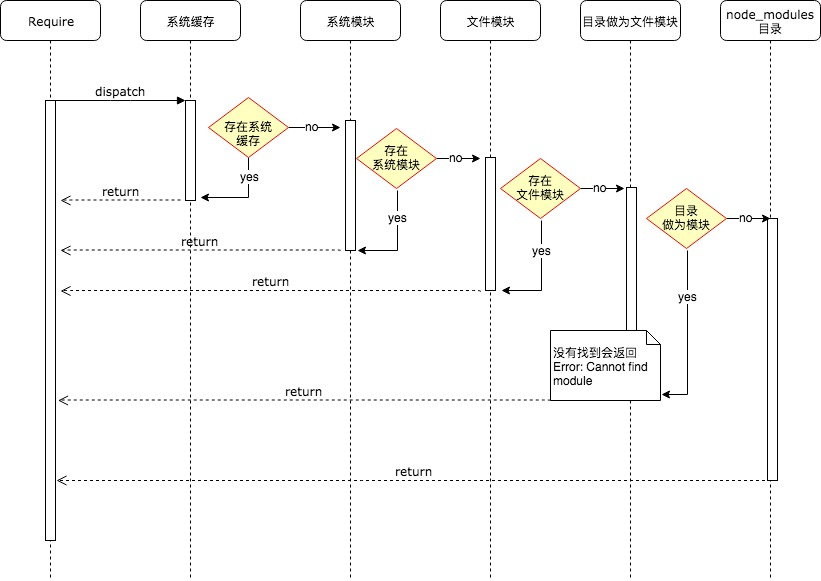

# 模块

> Node.js 模块机制采用了 Commonjs 规范，弥补了当前 JavaScript 开发大型没有标准的缺陷，类似于 Java 中的类文件，Python 中的 import 机制，NodeJs 中可以通过 module.exports、require 来导出和引入一个模块.

> 在模块加载机制中，NodeJs 采用了延迟加载的策略，只有在用到的情况下，系统模块才会被加载，加载完成后会放到 binding_cache 中。

## 快速导航

- [模块的分类](#模块的分类)
  - [系统模块](#系统模块)
  - [第三方模块](#第三方模块)
  - [目录结构](#目录结构)
- [模块加载机制](#模块加载机制)
- [模块循环引用](#模块循环引用)
- [exports 与 module.exports的区别](#exports与moduleexports的区别)
  
## 面试指南

* ```require 的加载机制？ ```，参考：[模块加载机制](#模块加载机制)
* ```module.exports 与 exports 的区别```，参考：[module.exports与exports的区别](#module.exports与exports的区别)
* ``` 假设有 a.js、b.js 两个模块相互引用，会有什么问题？是否为陷入死循环？```，参考：[#](#问题1)
* ``` a 模块中的 undeclaredVariable 变量在 b.js 中是否会被打印？```，参考：[#](#问题2)

## 模块的分类

#### 系统模块

* C/C++ 模块，也叫 built-in 内建模块，一般用于 native 模块调用，在 require 出去

* native 模块，在开发中使用的 Nodejs 的 http、buffer、fs 等，底层也是调用的内建模块 (C/C++)。

#### 第三方模块

> 非 Nodejs 自带的模块称为第三方模块，其实还分为路径形式的文件模块（以 ```.```、```..```、```/``` 开头的）和自定义的模块（比如 express、koa 框架、moment.js 等）

* javaScript 模块：例如 ```hello.js```

* json 模块：例如 ```hello.json```

* C/C++ 模块：编译之后扩展名为 .node 的模块，例如 ```hello.node```

#### 目录结构

<pre>
├── benchmark                         一些 nodejs 性能测试代码
├── deps                              nodejs 依赖
├── doc                               文档
├── lib                               nodejs 对外暴露的 js 模块源码
├── src                               nodejs 的 c/c++ 源码文件，内建模块
├── test                              单元测试
├── tools                             编译时用到的工具
├── doc                               api 文档
├── vcbuild.bat                       win 平台 makefile 文件
├── node.gyp                          node-gyp 构建编译任务的配置文件                           
...
</pre>

## 模块加载机制

> ``` 面试中可能会问到能说下 require 的加载机制吗? ```

在 Nodejs 中模块加载一般会经历 3 个步骤，```路径分析```、```文件定位```、```编译执行```。

按照模块的分类，按照以下顺序进行优先加载：

* 系统缓存：模块被执行之后会会进行缓存，首先是先进行缓存加载，判断缓存中是否有值。

* 系统模块：也就是原生模块，这个优先级仅次于缓存加载，部分核心模块已经被编译成二进制，省略了 ```路径分析```、```文件定位```，直接加载到了内存中，系统模块定义在 Node.js 源码的 lib 目录下，可以去查看。

* 文件模块：优先加载 ```.```、```..```、```/``` 开头的，如果文件没有加上扩展名，会依次按照 ```.js```、```.json```、```.node``` 进行扩展名补足尝试，那么在尝试的过程中也是以同步阻塞模式来判断文件是否存在，从性能优化的角度来看待，```.json```、```.node```最好还是加上文件的扩展名。

* 目录做为模块：这种情况发生在文件模块加载过程中，也没有找到，但是发现是一个目录的情况，这个时候会将这个目录当作一个 ```包``` 来处理，Node 这块采用了 Commonjs 规范，先会在项目根目录查找 package.json 文件，取出文件中定义的 main 属性 ```("main": "lib/hello.js")``` 描述的入口文件进行加载，也没加载到，则会抛出默认错误: Error: Cannot find module 'lib/hello.js'

* node_modules 目录加载：对于系统模块、路径文件模块都找不到，Node.js 会从当前模块的父目录进行查找，直到系统的根目录



<center>require 模块加载时序图</center>

## 模块循环引用

#### 问题1

> ```假设有 a.js、b.js 两个模块相互引用，会有什么问题？是否为陷入死循环？看以下例子： ```

```js
// a.js
console.log('a模块start');

exports.test = 1;

undeclaredVariable = 'a模块未声明变量'

const b = require('./b');

console.log('a模块加载完毕: b.test值：',b.test);
```

```js
// b.js
console.log('b模块start');

exports.test = 2;

const a = require('./a');

console.log('undeclaredVariable: ', undeclaredVariable);

console.log('b模块加载完毕: a.test值：', a.test);
```

#### 问题2

> ```问题2: a模块中的undeclaredVariable变量在b.js中是否会被打印？```

控制台执行```node a.js```，查看输出结果：

```
a模块start
b模块start
undeclaredVariable:  a模块未声明变量
b模块加载完毕: a.test值： 1
a模块加载完毕: b.test值： 2
```

启动 ```a.js``` 的时候，会加载 ```b.js```，那么在 ```b.js``` 中又加载了 ```a.js```，但是此时 ```a.js``` 模块还没有执行完，返回的是一个 ```a.js``` 模块的 ```exports``` 对象 ```未完成的副本``` 给到 ```b.js``` 模块。然后 ```b.js``` 完成加载之后将 ```exports``` 对象提供给了 ```a.js``` 模块

问题2，因为 ```undeclaredVariable``` 是一个未声明的变量，也就是一个挂在全局的变量，那么在其他地方当然是可以拿到的。

在执行代码之前，Node.js 会使用一个代码封装器进行封装，例如下面所示：

```js
(function(exports, require, module, __filename, __dirname) {
// 模块的代码
});
```

## exports与module.exports的区别

exports 相当于 module.exports 的快捷方式如下所示:

```js
const exports = modules.exports;
```

但是要注意不能改变 exports 的指向，我们可以通过 ``` exports.test = 'a' ``` 这样来导出一个对象, 但是不能向下面示例直接赋值，这样会改变 exports 的指向

```js
// 错误的写法 将会得到 undefined
exports = {
  'a': 1,
  'b': 2
}

// 正确的写法
modules.exports = {
  'a': 1,
  'b': 2
}
```

更好的理解之间的关系，可以参考 [JavaScript中的对象引用](/javascript/object.md#对象引用传递)

#### 参考文献

* [Node.js 中文网 modules](http://nodejs.cn/api/modules.html#modules_modules)
* [结合源码分析 Node.js 模块加载与运行原理](https://zhuanlan.zhihu.com/p/35238127)