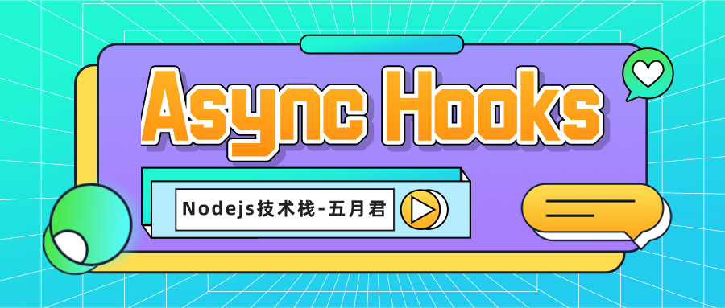

## 使用 Node.js 的 Async Hooks 模块追踪异步资源



**作者简介**：五月君，Software Designer，公众号「Nodejs技术栈」作者。

Async Hooks 功能是 Node.js v8.x 版本新增加的一个核心模块，它提供了 API 用来追踪 Node.js 程序中异步资源的声明周期，可在多个异步调用之间共享数据，本文从最基本入门篇开始学习，之后会有在某些场景下具体应用实践篇介绍。

## executionAsyncId 和 triggerAsyncId

async hooks 模块提供了 executionAsyncId() 函数标志当前执行上下文的异步资源 Id，下文使用 asyncId 表示。还有一个 triggerAsyncId() 函数来标志当前执行上下文被触发的异步资源 Id，也就是当前异步资源是由哪个异步资源创建的。
每个异步资源都会生成 asyncId，该 id 会呈递增的方式生成，且在 Node.js 当前实例里全局唯一。

```javascript
const asyncHooks = require('async_hooks');
const fs = require('fs');
const asyncId = () => asyncHooks.executionAsyncId();
const triggerAsyncId = () => asyncHooks.triggerAsyncId();

console.log(`Global asyncId: ${asyncHooks.executionAsyncId()}, Global triggerAsyncId: ${triggerAsyncId()}`);

fs.open('hello.txt', (err, res) => {
  console.log(`fs.open asyncId: ${asyncId()}, fs.open triggerAsyncId: ${triggerAsyncId()}`);
});
```

下面是我们运行的结果，全局的 asyncId 为 1，fs.open 回调里打印的 triggerAsyncId 为 1 由全局触发。

```javascript
Global asyncId: 1, Global triggerAsyncId: 0
fs.open asyncId: 5, fs.open triggerAsyncId: 1
```
## 默认未开启的 Promise 执行跟踪

默认情况下，由于 V8 提供的 [promise introspection API](https://docs.google.com/document/d/1rda3yKGHimKIhg5YeoAmCOtyURgsbTH_qaYR79FELlk) 相对消耗性能，Promise 的执行没有分配 asyncId。这意味着默认情况下，使用了 Promise 或 Async/Await 的程序将不能正确的执行和触发 Promise 回调上下文的 ID。
即得不到当前异步资源 asyncId 也得不到当前异步资源是由哪个异步资源创建的 triggerAsyncId，如下所示：

```javascript
Promise.resolve().then(() => {
  // Promise asyncId: 0. Promise triggerAsyncId: 0
  console.log(`Promise asyncId: ${asyncId()}. Promise triggerAsyncId: ${triggerAsyncId()}`);
})
```

通过 `asyncHooks.createHook` 创建一个 hooks 对象启用 Promise 异步跟踪。

```javascript
const hooks = asyncHooks.createHook({});
hooks.enable();

Promise.resolve().then(() => {
  // Promise asyncId: 7. Promise triggerAsyncId: 6
  console.log(`Promise asyncId: ${asyncId()}. Promise triggerAsyncId: ${triggerAsyncId()}`);
})
```

## 异步资源的生命周期

asyncHooks 的 createHook() 方法返回一个用于启用（enable）和禁用（disable）hooks 的实例，该方法接收 init/before/after/destory 四个回调来标志一个异步资源从初始化、回调调用之前、回调调用之后、销毁整个生命周期过程。

### init（初始化）

当构造一个可能发出异步事件的类时调用。

- async：异步资源唯一 id
- type：异步资源类型，对应于资源的构造函数名称，更多类型参考 [async_hooks_type](https://nodejs.org/api/async_hooks.html#async_hooks_type)
- triggerAsyncId：当前异步资源由哪个异步资源创建的异步资源 id
- resource：初始化的异步资源

```typescript
/**
 * Called when a class is constructed that has the possibility to emit an asynchronous event.
 * @param asyncId a unique ID for the async resource
 * @param type the type of the async resource
 * @param triggerAsyncId the unique ID of the async resource in whose execution context this async resource was created
 * @param resource reference to the resource representing the async operation, needs to be released during destroy
 */
init?(asyncId: number, type: string, triggerAsyncId: number, resource: object): void;
```

### before（回调函数调用前）

当启动异步操作（例如 TCP 服务器接收新链接）或完成异步操作（例如将数据写入磁盘）时，系统将调用回调来通知用户，也就是我们写的业务回调函数。在这之前会先触发 before 回调。

```typescript
/**
 * When an asynchronous operation is initiated or completes a callback is called to notify the user.
 * The before callback is called just before said callback is executed.
 * @param asyncId the unique identifier assigned to the resource about to execute the callback.
 */
before?(asyncId: number): void;
```

### after（回调函数调用后）

当回调处理完成之后触发 after 回调，如果回调出现未捕获异常，则在触发 uncaughtException 事件或域（domain）处理之后触发 after 回调。

```typescript
/**
 * Called immediately after the callback specified in before is completed.
 * @param asyncId the unique identifier assigned to the resource which has executed the callback.
 */
after?(asyncId: number): void;
```

### destory（销毁）

当 asyncId 对应的异步资源被销毁后调用 destroy 回调。
一些资源的销毁依赖于垃圾回收，因此如果对传递给 init 回调的资源对象有引用，则有可能永远不会调用 destory 从而导致应用程序中出现内存泄漏。如果资源不依赖垃圾回收，这将不会有问题。

```typescript
/**
 * Called after the resource corresponding to asyncId is destroyed
 * @param asyncId a unique ID for the async resource
 */
destroy?(asyncId: number): void;
```

### promiseResolve

当传递给 Promise 构造函数的 resolve() 函数执行时触发 promiseResolve 回调。

```typescript
/**
  * Called when a promise has resolve() called. This may not be in the same execution id
  * as the promise itself.
  * @param asyncId the unique id for the promise that was resolve()d.
  */
promiseResolve?(asyncId: number): void;
```

以下代码会触发两次 promiseResolve() 回调，第一次是我们直接调用的 resolve() 函数，第二次是在 .then() 里虽然我们没有显示的调用，但是它也会返回一个 Promise 所以还会被再次调用。

```typescript
const hooks = asyncHooks.createHook({
  promiseResolve(asyncId) {
    syncLog('promiseResolve: ', asyncId);
  }
});
new Promise((resolve) => resolve(true)).then((a) => {});

// 输出结果
promiseResolve:  2
promiseResolve:  3
```

## 注意 init 回调里写日志造成 “栈溢出” 问题

一个异步资源的生命周期中第一个阶段 init 回调是当构造一个可能发出异步事件的类时会调用，要注意由于使用 console.log() 输出日志到控制台是一个异步操作，在 AsyncHooks 回调函数中使用类似的异步操作将会再次触发 init 回调函数，进而导致无限递归出现 **```RangeError: Maximum call stack size exceeded```** 错误，也就是 “ **栈溢出**”。

调试时，一个简单的记录日志的方式是使用 fs.writeFileSync() 以同步的方式写入日志，这将不会触发 AsyncHooks 的 init 回调函数。

```javascript
const syncLog = (...args) => fs.writeFileSync('log.txt', `${util.format(...args)}\n`, { flag: 'a' });
const hooks = asyncHooks.createHook({
  init(asyncId, type, triggerAsyncId, resource) {
    syncLog('init: ', asyncId, type, triggerAsyncId)
  }
});
hooks.enable();

fs.open('hello.txt', (err, res) => {
  syncLog(`fs.open asyncId: ${asyncId()}, fs.open triggerAsyncId: ${triggerAsyncId()}`);
});
```

输出以下内容，init 回调只会被调用一次，因为 fs.writeFileSync 是同步的是不会触发 hooks 回调的。

```shell
init:  2 FSREQCALLBACK 1
fs.open asyncId: 2, fs.open triggerAsyncId: 1
```

## 异步之间共享上下文

Node.js v13.10.0 增加了 async_hooks 模块的 AsyncLocalStorage 类，可用于在一系列异步调用中共享数据。

如下例所示，asyncLocalStorage.run() 函数第一个参数是存储我们在异步调用中所需要访问的共享数据，第二个参数是一个异步函数，我们在 setTimeout() 的回调函数里又调用了 test2 函数，这一系列的异步操作都不影响我们在需要的地方去获取 asyncLocalStorage.run() 函数中存储的共享数据。

```javascript
const { AsyncLocalStorage } = require('async_hooks');
const asyncLocalStorage = new AsyncLocalStorage();
asyncLocalStorage.run({ traceId: 1 }, test1);
async function test1() {
  setTimeout(() => test2(), 2000);
}
async function test2() {
  console.log(asyncLocalStorage.getStore().traceId);
}
```

AsyncLocalStorage 用途很多，例如在服务端必不可少的日志分析，一个 HTTP 从请求到响应整个系统交互的日志输出如果能通过一个 traceId 来关联，在分析日志时也就能够清晰的看到整个调用链路。

下面是一个 HTTP 请求的简单示例，模拟了异步处理，并且在日志输出时去追踪存储的 id

```javascript
const http = require('http');
const { AsyncLocalStorage } = require('async_hooks');
const asyncLocalStorage = new AsyncLocalStorage();
function logWithId(msg) {
  const id = asyncLocalStorage.getStore();
  console.log(`${id !== undefined ? id : '-'}:`, msg);
}
let idSeq = 0;
http.createServer((req, res) => {
  asyncLocalStorage.run(idSeq++, () => {
    logWithId('start');
    setImmediate(() => {
      logWithId('processing...');
      setTimeout(() => {
        logWithId('finish');
        res.end();
      }, 2000)
    });
  });
}).listen(8080);
```

下面是运行结果，我在第一次调用之后直接调用了第二次，可以看到我们存储的 id 信息与我们的日志一起成功的打印了出来。


在下一节会详细介绍， **如何在 Node.js 中使用 async hooks 模块的 AsyncLocalStorage 类处理请求上下文, 也会详细讲解 AsyncLocalStorage 类是如何实现的本地存储**。

## Reference

- [https://nodejs.org/dist/latest-v14.x/docs/api/async_hooks.html](https://nodejs.org/dist/latest-v14.x/docs/api/async_hooks.html)
