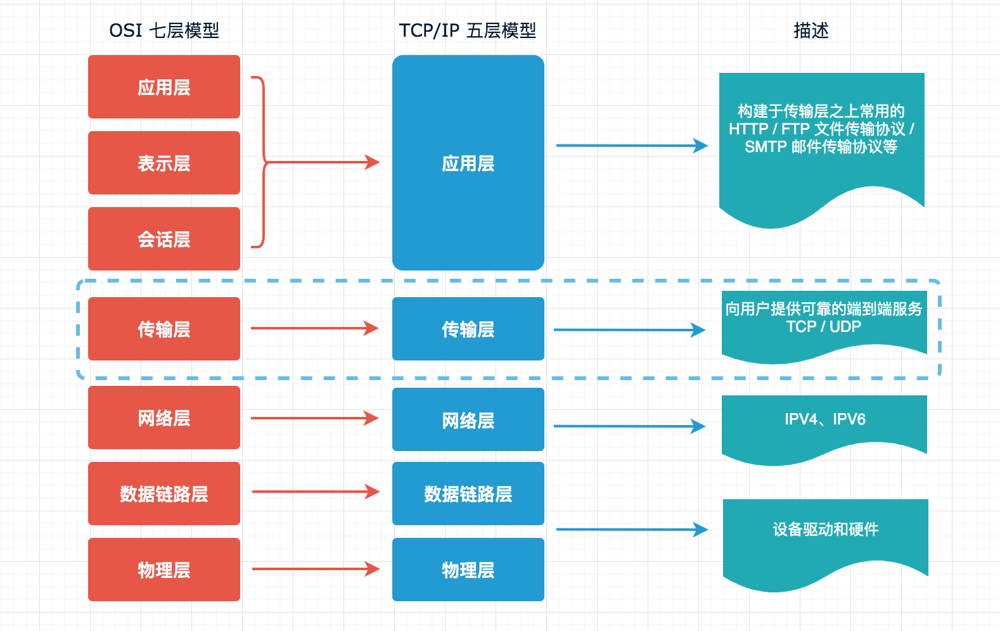
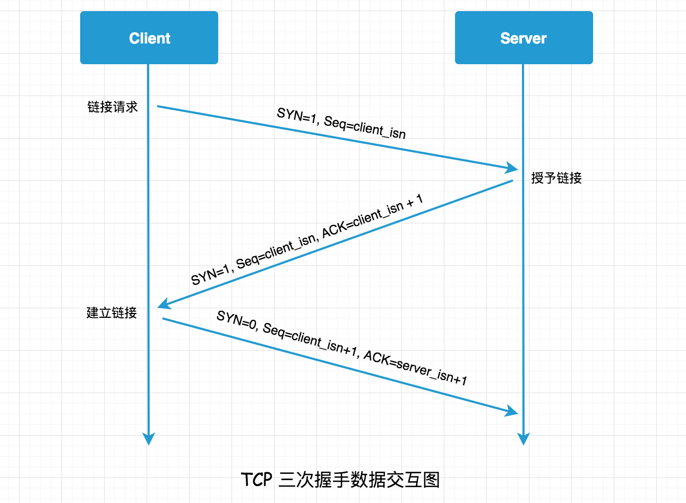

# 入门 Node.js Net 模块构建 TCP 网络服务

想做一个简单的 Web API，这个时候就需要搭建一个 Web 服务器，在 ASP.NET 中需要 IIS 来搭建服务器，PHP 中需要借助 Apache/Nginx 来实现，对于新手在还没开始之前看到这么多步骤，也许就要放弃了，但是在 Node.js 中开启一个 Web 服务器是 So Easy 的，我们利用 Net、Dgram、HTTP、HTTPS 等模块通过几行简单的代码就可实现。

## 快速导航

* [网络模型](#网络模型)
* [初识 TCP 协议](#初识-TCP-协议)
* [构建第一个 TCP 服务](#构建第一个-TCP-服务)
* [TCP 的粘包](#TCP-粘包问题)

## 面试指南

* 什么是 TCP 协议？什么情况下又会选择 TCP 协议呢？参考正文 Interview1
* TCP 粘包是什么？该怎么解决？参考正文 TCP 的粘包一节

## 网络模型

大多数同学对于 HTTP、HTTPS 会很熟悉，通常用于浏览器与服务端交互，或者服务端与服务端的交互，另外两个 Net 与 Dgram 也许会相对陌生，这两个是基于网络模型的传输层来实现的，分别对应于 TCP、UDP 协议，下面一图看明白 OSI 七层模型 与 TCP/IP 五层模型之间的关系，中间使用虚线标注了传输层，对于上层应用层（HTTP/HTTPS等）也都是基于这一层的 TCP 协议来实现的，所以想使用 Node.js 做服务端开发，Net 模块也是你必须要掌握的，这也是我们本篇要讲解的重点。



## 初识 TCP 协议

> Interview1: 有些概念还是要弄清楚的，什么是 TCP 协议？什么情况下又会选择 TCP 协议呢？

TCP 是传输控制协议，大多数情况下我们都会使用这个协议，因为它是一个更可靠的数据传输协议，具有如下三个特点：

* **面向链接**: 需要对方主机在线，并建立链接。
* **面向字节流**: 你给我一堆字节流的数据，我给你发送出去，但是每次发送多少是我说了算，每次选出一段字节发送的时候，都会带上一个序号，这个序号就是发送的这段字节中编号最小的字节的编号。
* **可靠**: 保证数据有序的到达对方主机，每发送一个数据就会期待收到对方的回复，如果在指定时间内收到了对方的回复，就确认为数据到达，如果超过一定时间没收到对方回复，就认为对方没收到，在重新发送一遍。

上面三个特点说到 TCP 是面向链接和可靠的，其一个显著特征是在传输之前会有一个 3 次握手，实现过程如下所示：



在一次 TCP 三次握手的过程中，客户端与服务端会分别提供一个套接字来形成一个链接。之后客户端与服务端通过这个链接来互相发送数据。

## 构建第一个 TCP 服务

以上了解了 TCP 的一些概念之后，我们开始创建一个 TCP 服务端与客户端实例，这里我们需要使用 Node.js 的 Net 模块，它提供了一些用于底层通信的接口，该模块可以用于创建基于流的 TCP 或 IPC 的服务器（net.createServer()）与客户端（net.createConnection()）。

### 创建 TCP 服务

可以使用 new net.Server 创建一个 TCP 服务端链接，也可以通过工厂函数 net.createServer() 的方式，createServer() 的内部实现也是内部调用了 Server 构造函数来创建一个 TCP 对象，和 new net.Server 是一样的，代码如下所示：

[https://github.com/nodejs/node/blob/v12.x/lib/net.js#L145](https://github.com/nodejs/node/blob/v12.x/lib/net.js#L145)
```js
function createServer(options, connectionListener) {
  return new Server(options, connectionListener);
}
```

[https://github.com/nodejs/node/blob/v12.x/lib/net.js#L1142](https://github.com/nodejs/node/blob/v12.x/lib/net.js#L1142)

```js
function Server(options, connectionListener) {
  if (!(this instanceof Server))
    return new Server(options, connectionListener);

  // Server 类内部还是继承了 EventEmitter，这个不在本节范围
  EventEmitter.call(this);

  ...
```

### TCP 服务事件

在开始代码之前，先了解下其相关事件，参考官网 [http://nodejs.cn/api/net.html](http://nodejs.cn/api/net.html)，这里也不会把所有的都介绍，下面介绍一些常用的，并且通过代码示例，进行讲解，可以在这个基础之上在去参考官网，实践一些其它的事件或方法。

**TCP 服务器事件**

* listening: ，也就是 server.listen();
* connection: 新链接建立时触发，也就是每次收到客户端回调，参数 socket 为 net.createServer 实例，也可以写在 net.createServer(function(socket) {}) 方法里
* close：当 server 关闭的时候触发（server.close()）。 如果有连接存在，直到所有的连接结束才会触发这个事件
* error：捕获错误，例如监听一个已经存在的端口就会报 Error: listen EADDRINUSE 错误

**TCP 链接事件方法**

* data: 一端调用 write() 方法发送数据时，另一端会通过 socket.on('data') 事件接收到，可以理解为读取数据
* end: 每次 socket 链接会出现一次，例如客户端发送消息之后执行 Ctrl + C 终端，就会收到
* error: 监听 socket 的错误信息
* write：write 是一个方法（socket.write()）上面的 data 事件是读数据，write 方法在这里就为写数据到另一端，


### TCP 服务端代码实现

```js
const net = require('net');
const HOST = '127.0.0.1';
const PORT = 3000;

// 创建一个 TCP 服务实例
const server = net.createServer();

// 监听端口
server.listen(PORT, HOST);

server.on('listening', () => {
    console.log(`服务已开启在 ${HOST}:${PORT}`);
});

server.on('connection', socket => {
    // data 事件就是读取数据
    socket.on('data', buffer => {
        const msg = buffer.toString();
        console.log(msg);

        // write 方法写入数据，发回给客户端
        socket.write(Buffer.from('你好 ' + msg));
    });
})

server.on('close', () => {
    console.log('Server Close!');
});

server.on('error', err => {
    if (err.code === 'EADDRINUSE') {
        console.log('地址正被使用，重试中...');

        setTimeout(() => {
            server.close();
            server.listen(PORT, HOST);
        }, 1000);
    } else {
        console.error('服务器异常：', err);
    }
});
```

### TCP 客户端代码实现

```js
const net = require('net');
const client = net.createConnection({
    host: '127.0.0.1',
    port: 3000
});

client.on('connect', () => {
    // 向服务器发送数据
    client.write('Nodejs 技术栈');

    setTimeout(() => {
        client.write('JavaScript ');
        client.write('TypeScript ');
        client.write('Python ');
        client.write('Java ');
        client.write('C ');
        client.write('PHP ');
        client.write('ASP.NET ');
    }, 1000);
})

client.on('data', buffer => {
    console.log(buffer.toString());
});

// 例如监听一个未开启的端口就会报 ECONNREFUSED 错误
client.on('error', err => {
    console.error('服务器异常：', err);
});

client.on('close', err => {
    console.log('客户端链接断开！', err);
});
```

**源码实现地址**

```
https://github.com/Q-Angelo/project-training/tree/master/nodejs/net/chapter-1-client-server 
```

### 客户端与服务端 Demo 测试

首先启动服务端，之后在启动客户端，客户端调用三次，打印结果如下所示：

**服务端**

```
$ node server.js
服务已开启在 127.0.0.1:3000
# 第一次
Nodejs 技术栈
JavaScript 
TypeScript Python Java C PHP ASP.NET 
# 第二次
Nodejs 技术栈
JavaScript TypeScript Python Java C PHP ASP.NET 
```

**客户端**

```
$ node client.js
# 第一次
你好 Nodejs 技术栈
你好 JavaScript 
你好 TypeScript Python Java C PHP ASP.NET 

# 第二次
你好 Nodejs 技术栈
你好 JavaScript TypeScript Python Java C PHP ASP.NET 
```

在客户端我使用 client.write() 发送了多次数据，但是只有 setTimeout 之外的是正常的，setTimeout 里面连续发送的似乎并不是每一次一返回，而是会随机合并返回了，为什么呢？且看下面 TCP 的粘包问题介绍。

## TCP 粘包问题

上面的例子最后抛出了一个问题，为什么客户端连续向服务端发送数据，会收到合并返回呢？这也是在 TCP 中常见的粘包问题，**客户端（发送的一端）在发送之前会将短时间有多个发送的数据块缓冲到一起（发送端缓冲区），形成一个大的数据块一并发送**，同样接收端也有一个**接收端缓冲区**，**收到的数据先存放接收端缓冲区，然后程序从这里读取部分数据进行消费**，这样做也是为了减少 I/O 消耗达到性能优化。

> **问题思考：数据到达缓冲区什么时间开始发送？**

这个取决于 **TCP 拥塞控制**，是任何时刻内确定能被发送出去的字节数的控制因素之一，是阻止发送方至接收方之间的链路变得拥塞的手段，参考维基百科：[https://zh.wikipedia.org/wiki/TCP拥塞控制](https://zh.wikipedia.org/wiki/TCP%E6%8B%A5%E5%A1%9E%E6%8E%A7%E5%88%B6)

> **TCP 粘包解决方案?**

* 方案一：延迟发送
* 方案二：关闭 Nagle 算法
* 方案三：封包/拆包

### 方案一：延迟发送

一种最简单的方案是设置延迟发送，sleep 休眠一段时间的方式，但是这个方案虽然简单，同时缺点也显而易见，传输效率大大降低，对于交互频繁的场景显然是不适用的，第一次改造如下：

```js
client.on('connect', () => {
    client.setNoDelay(true);
    // 向服务器发送数据
    client.write('Nodejs 技术栈');

    const arr = [
        'JavaScript ',
        'TypeScript ',
        'Python ',
        'Java ',
        'C ',
        'PHP ',
        'ASP.NET '
    ]
    
    for (let i=0; i<arr.length; i++) {
        (function(val, k){
            setTimeout(() => {
                client.write(val);
            }, 1000 * (k+1))
        }(arr[i], i));
    }
})
```

控制台执行 node client.js 命令，似乎一切 ok 了没有在出现粘包的情况，但是这种情况仅使用于交互频率很低的场景。

```
$ node client.js
你好 Nodejs 技术栈
你好 JavaScript 
你好 TypeScript 
你好 Python 
你好 Java 
你好 C 
你好 PHP 
你好 ASP.NET 
```

**源码实现地址**

```
https://github.com/Q-Angelo/project-training/tree/master/nodejs/net/chapter-1-delay
```

### 方案二：Nagle 算法

Nagle 算法是一种改善网络传输效率的算法，避免网络中充斥着大量小的数据块，它所期望的是尽可能发送大的数据块，因此在每次请求一个数据块给 TCP 发送时，TCP 并不会立即执行发送，而是等待一小段时间进行发送。

当网络中充斥着大量小数据块时，Nagle 算法能将小的数据块集合起来一起发送减少了网络拥堵，这个还是很有帮助的，但也并不是所有场景都需要这样，例如，REPL 终端交互，当用户输入单个字符以获取响应，所以在 Node.js 中可以设置 socket.setNoDelay() 方法来关闭 Nagle 算法。

```js
const server = net.createServer();

server.on('connection', socket => {
    socket.setNoDelay(true);
})
```

关闭 Nagle 算法并不总是有效的，因为其是在服务端完成合并，TCP 接收到数据会先存放于自己的缓冲区中，然后通知应用接收，应用层因为网络或其它的原因若不能及时从 TCP 缓冲区中取出数据，也会造成 TCP 缓冲区中存放多段数据块，就又会形成粘包。

### 方案三：封包/拆包

前面两种方案都不是特别理想的，这里介绍第三种**封包/拆包**，也是目前业界用的比较多的，这里使用长度编码的方式，通信双方约定好格式，**将消息分为定长的消息头（Header）和不定长的消息体（Body）**，在解析时读取消息头获取到内容占用的长度，之后读取到的消息体内容字节数等于字节头的字节数时，我们认为它是一个完整的包。

| 消息头序号 (Header) | 消息体长度 (Header)  | 消息体 (Body)  |
|:---:|:---:|:---:|
| SerialNumber   | bodyLength   | body   |
| 2（字节）   | 2（字节）   | N（字节）   |

#### 预先知识 Buffer

下面会通过编码实现，但是在开始之前希望你能了解一下 Buffer，可参考我之前写的 Buffer 文章 [Node.js 中的缓冲区（Buffer）究竟是什么？](https://mp.weixin.qq.com/s/UU-Gug_Dx-OmXVL-99rWRg)，下面我列出本次需要用到的 Buffer 做下说明，对于不了解 Buffer 的同学是有帮助的。

* **Buffer.alloc(size[, fill[, encoding]])**：初始化一个 size 大小的 Buffer 空间，默认填充 0，也可以指定 fill 进行自定义填充
* **buf.writeInt16BE(value[, offset])**：value 为要写入的 Buffer 值，offset 为偏移量从哪个位置开始写入
* **buf.writeInt32BE(value[, offset])**：参数同 writeInt16BE，不同的是 writeInt16BE 表示高位优先写入一个 16 位整型，而 writeInt32BE 表示高位优先写入一个 32 位整型 
* **buf.readInt16BE([offset])**：高位优先读取 16 位整型，offset 为读取之前要跳过的字节数
* **buf.readInt32BE([offset])**：高位优先读取 32 位整型，offset 为读取之前要跳过的字节数

#### 编码/解码实现

TCP 底层传输是基于二进制数据，但是我们应用层通常是易于表达的字符串、数字等，这里第一步在编码的实现中，就需要先将我们的数据通过 Buffer 转为二进制数据，取出的时候同样也需要解码操作，一切尽在代码里，实现如下：

```js
// transcoder.js

class Transcoder {
    constructor () {
        this.packageHeaderLen = 4; // 包头长度
        this.serialNumber = 0; // 定义包序号
        this.packageSerialNumberLen = 2; // 包序列号所占用的字节
    }

    /**
     * 编码
     * @param { Object } data Buffer 对象数据
     * @param { Int } serialNumber 包序号，客户端编码时自动生成，服务端解码之后在编码时需要传入解码的包序列号
     */
    encode(data, serialNumber) {
        const body = Buffer.from(data);

        const header = Buffer.alloc(this.packageHeaderLen);
        header.writeInt16BE(serialNumber || this.serialNumber);
        header.writeInt16BE(body.length, this.packageSerialNumberLen); // 跳过包序列号的前两位

        if (serialNumber === undefined) {
            this.serialNumber++;
        }
       
        return Buffer.concat([header, body]);
    }

    /**
     * 解码
     * @param { Object } buffer 
     */
    decode(buffer) {
        const header = buffer.slice(0, this.packageHeaderLen); // 获取包头
        const body = buffer.slice(this.packageHeaderLen); // 获取包尾部
    
        return {
            serialNumber: header.readInt16BE(),
            bodyLength: header.readInt16BE(this.packageSerialNumberLen), // 因为编码阶段写入时跳过了前两位，解码同样也要跳过
            body: body.toString(),
        }
    }

    /**
     * 获取包长度两种情况：
     * 1. 如果当前 buffer 长度数据小于包头，肯定不是一个完整的数据包，因此直接返回 0 不做处理（可能数据还未接收完等等）
     * 2. 否则返回这个完整的数据包长度
     * @param {*} buffer 
     */
    getPackageLength(buffer) {
        if (buffer.length < this.packageHeaderLen) {
            return 0;
        }
    
        return this.packageHeaderLen + buffer.readInt16BE(this.packageSerialNumberLen);
    }
}

module.exports = Transcoder;
```


#### 客户端改造

```js
const net = require('net');
const Transcoder = require('./transcoder');
const transcoder = new Transcoder();
const client = net.createConnection({
    host: '127.0.0.1',
    port: 3000
});

let overageBuffer=null; // 上一次 Buffer 剩余数据

client.on('data', buffer => {
    if (overageBuffer) {
        buffer = Buffer.concat([overageBuffer, buffer]);
    }

    let packageLength = 0;

    while (packageLength = transcoder.getPackageLength(buffer)) {
        const package = buffer.slice(0, packageLength); // 取出整个数据包
        buffer = buffer.slice(packageLength); // 删除已经取出的数据包，这里采用的方法是把缓冲区（buffer）已取出的包给截取掉

        const result = transcoder.decode(package); // 解码
        console.log(result);
    }

    overageBuffer=buffer; // 记录剩余不完整的包
}).on('error', err => { // 例如监听一个未开启的端口就会报 ECONNREFUSED 错误
    console.error('服务器异常：', err);
}).on('close', err => {
    console.log('客户端链接断开！', err);
});

client.write(transcoder.encode('0 Nodejs 技术栈'));

const arr = [
    '1 JavaScript ',
    '2 TypeScript ',
    '3 Python ',
    '4 Java ',
    '5 C ',
    '6 PHP ',
    '7 ASP.NET '
]

setTimeout(function() {
    for (let i=0; i<arr.length; i++) {
        console.log(arr[i]);

        client.write(transcoder.encode(arr[i]));
    }
}, 1000);
```

#### 服务端改造

```js
const net = require('net');
const Transcoder = require('./transcoder');
const transcoder = new Transcoder();
const HOST = '127.0.0.1';
const PORT = 3000;
let overageBuffer=null; // 上一次 Buffer 剩余数据

const server = net.createServer();

server.listen(PORT, HOST);

server.on('listening', () => {
    console.log(`服务已开启在 ${HOST}:${PORT}`);
}).on('connection', socket => {
    // data 事件就是读取数据
    socket
        .on('data', buffer => {
            if (overageBuffer) {
                buffer = Buffer.concat([overageBuffer, buffer]);
            }
        
            let packageLength = 0;
        
            while (packageLength = transcoder.getPackageLength(buffer)) {
                const package = buffer.slice(0, packageLength); // 取出整个数据包
                buffer = buffer.slice(packageLength); // 删除已经取出的数据包，这里采用的方法是把缓冲区（buffer）已取出的包给截取掉
        
                const result = transcoder.decode(package); // 解码
                console.log(result);
                socket.write(transcoder.encode(result.body, result.serialNumber));
            }
        
            overageBuffer=buffer; // 记录剩余不完整的包
        })
        .on('end', function(){
            console.log('socket end')
        })
        .on('error',function(error){
            console.log('socket error', error);
        });
}).on('close', () => {
    console.log('Server Close!');
}).on('error', err => {
    if (err.code === 'EADDRINUSE') {
        console.log('地址正被使用，重试中...');

        setTimeout(() => {
            server.close();
            server.listen(PORT, HOST);
        }, 1000);
    } else {
        console.error('服务器异常：', err);
    }
});
```

#### 运行测试

控制台执行 node server.js 开启服务端，之后执行 node client.js 开启客户端测试，输出结果如下所示：

```bash
$ node client.js
{ serialNumber: 0, bodyLength: 18, body: '0 Nodejs 技术栈' }
1 JavaScript 
2 TypeScript 
3 Python 
4 Java 
5 C 
6 PHP 
7 ASP.NET 
{ serialNumber: 1, bodyLength: 13, body: '1 JavaScript ' }
{ serialNumber: 2, bodyLength: 13, body: '2 TypeScript ' }
{ serialNumber: 3, bodyLength: 9, body: '3 Python ' }
{ serialNumber: 4, bodyLength: 7, body: '4 Java ' }
{ serialNumber: 5, bodyLength: 4, body: '5 C ' }
{ serialNumber: 6, bodyLength: 6, body: '6 PHP ' }
{ serialNumber: 7, bodyLength: 10, body: '7 ASP.NET ' }
```

以上结果中，setTimeout 函数里我们同一时间先发送多条数据，之后一一返回，同时打印了包消息头定义的包序列号、消息体长度和包消息体，且是一一对应的，上面提的粘包问题也得到了解决。封包/拆包这块是有点复杂的，以上代码也已经尽可能简单的介绍了实现思路，下面给出实现代码地址，可以做为参照自己也可以使用不同的方式去实现

```
https://github.com/Q-Angelo/project-training/tree/master/nodejs/net/chapter-3-package
```