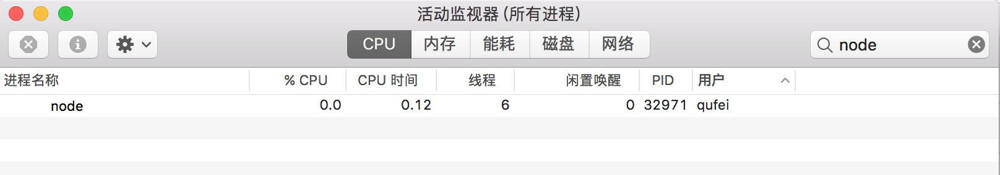
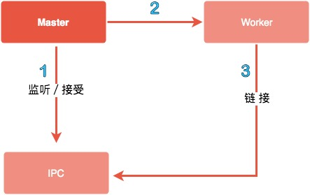

# 线程和进程

## 快速导航
- [进程](#进程)
- [线程](#线程)
- [Node.js 的线程与进程](#Nodejs的线程与进程)
- [Node.js 进程创建](#Nodejs进程创建)
- [Node.js 多进程架构模型](#Nodejs多进程架构模型)
- [守护进程编写](#守护进程)

## 面试指南

- 什么是孤儿进程？参考：[Interview1](#Interview1)
- 创建多进程时，代码里有 ```app.listen(port)``` 在进行 fork 时，为什么没有报端口被占用？参考：[Interview2](#Interview2)
- 什么是 IPC 通信，如何建立 IPC 通信？什么场景下需要用到 IPC 通信？参考：[Interview3](#Interview3)
- Node.js 是单线程还是多线程？进一步会提问为什么是单线程？参考：[Interview4](#Interview4)
- 关于守护进程，是什么、为什么、怎么编写？参考：[Interview5](#Interview5)
- 实现一个简单的命令行交互程序？参考：[Interview6](#Interview6)
- 如何让一个 js 文件在 Linux 下成为一个可执行命令程序？参考：[Interview7](#Interview7)

## 进程

进程（Process）是计算机中的程序关于某数据集合上的一次运行活动，是系统进行资源分配和调度的**基本单位**，是操作系统结构的基础，进程是线程的**容器**（来自百科）。我们启动一个服务、运行一个实例，就是开一个服务进程，例如 Java 里的 JVM 本身就是一个进程，Node.js 里通过 ```node app.js``` 开启一个服务进程，多进程就是进程的复制（fork），fork 出来的每个进程都拥有自己的独立空间地址、数据栈，一个进程无法访问另外一个进程里定义的变量、数据结构，只有建立了 IPC 通信，进程之间才可数据共享。

> 关于进程通过一个简单的 Node.js Demo 来验证下，执行以下代码 ```node process.js```，开启一个服务进程

```js
// process.js
const http = require('http');

http.createServer().listen(3000, () => {
    process.title = '测试进程 Node.js' // 进程进行命名
    console.log(`process.pid: `, process.pid); // process.pid: 20279
});
```

以下为 Mac 系统自带的监控工具 “活动监视器” 所展示的效果，可以看到我们刚开启的 Nodejs 进程 20279


## 线程

线程是操作系统能够进行运算调度的**最小单位**，首先我们要清楚线程是隶属于进程的，被包含于**进程**之中。一个线程只能隶属于一个进程，但是一个进程是可以拥有多个线程的。

同一块代码，可以根据系统CPU核心数启动多个进程，每个进程都有属于自己的独立运行空间，进程之间是不相互影响的。同一进程中的多条线程将共享该进程中的全部系统资源，如虚拟地址空间，文件描述符和信号处理等。但同一进程中的多个线程有各自的调用栈（call stack），自己的寄存器环境（register context），自己的线程本地存储（thread-local storage)，线程又有单线程和多线程之分，具有代表性的 JavaScript、Java 语言。

#### 单线程

单线程就是一个进程只开一个线程，想象一下一个痴情的少年，对一个妹子一心一意用情专一。

Javascript 就是属于单线程，程序顺序执行，可以想象一下队列，前面一个执行完之后，后面才可以执行，当你在使用单线程语言编码时切勿有过多耗时的同步操作，否则线程会造成阻塞，导致后续响应无法处理。你如果采用 Javascript 进行编码时候，请尽可能的使用异步操作。

**一个计算耗时造成线程阻塞的例子**

先看一段例子，运行下面程序，浏览器执行 http://127.0.0.1:3000/compute 大约每次需要 15657.310ms，也就意味下次用户请求需要等待 15657.310ms，[下文 Node.js 进程创建一节](#fork子进程充分利用CPU资源) 将采用 child_process.fork 实现多个进程来处理。

```js
// compute.js
const http = require('http');
const [url, port] = ['127.0.0.1', 3000];

const computation = () => {
    let sum = 0;
    console.info('计算开始');
    console.time('计算耗时');

    for (let i = 0; i < 1e10; i++) {
        sum += i
    };

    console.info('计算结束');
    console.timeEnd('计算耗时');
    return sum;
};

const server = http.createServer((req, res) => {
    if(req.url == '/compute'){
        const sum = computation();

        res.end(`Sum is ${sum}`);
    }

    res.end(`ok`);
});

server.listen(port, url, () => {
    console.log(`server started at http://${url}:${port}`);
});
```

**单线程使用总结**
* Node.js 虽然是单线程模型，但是其基于事件驱动、异步非阻塞模式，可以应用于高并发场景，避免了线程创建、线程之间上下文切换所产生的资源开销。
* 如果你有需要大量计算，CPU 耗时的操作，开发时候要注意。

#### 多线程

多线程就是没有一个进程只开一个线程的限制，好比一个风流少年除了爱慕自己班的某个妹子，还在想着隔壁班的漂亮妹子。Java 就是多线程编程语言的一种，可以有效避免代码阻塞导致的后续请求无法处理。

> 对于多线程的说明 Java 是一个很好的例子，看以下代码示例，我将 count 定义在全局变量，如果定义在 test 方法里，又会输出什么呢？

```java
public class TestApplication {
    Integer count = 0;

    @GetMapping("/test")
    public Integer Test() {
        count += 1;
        return count;
    }

    public static void main(String[] args) {
        SpringApplication.run(TestApplication.class, args);
    }
}
```

运行结果，每次执行都会修改count值，所以，多线程中任何一个变量都可以被任何一个线程所修改。

```shell
1 # 第一次执行
2 # 第二次执行
3 # 第三次执行
```

> 我现在对上述代码做下修改将 count 定义在 test 方法里

```java
public class TestApplication {
    @GetMapping("/test")
    public Integer Test() {
        Integer count = 0; // 改变定义位置
        count += 1;
        return count;
    }

    public static void main(String[] args) {
        SpringApplication.run(TestApplication.class, args);
    }
}
```

运行结果如下所示，每次都是 1，因为每个线程都拥有了自己的执行栈

```shell
1 # 第一次执行
1 # 第二次执行
1 # 第三次执行
```

**多线程使用总结**

多线程的代价还在于创建新的线程和执行期上下文线程的切换开销，由于每创建一个线程就会占用一定的内存，当应用程序并发大了之后，内存将会很快耗尽。类似于上面单线程模型中例举的例子，需要一定的计算会造成当前线程阻塞的，还是推荐使用多线程来处理，关于线程与进程的理解推荐阅读下 [阮一峰：进程与线程的一个简单解释](http://www.ruanyifeng.com/blog/2013/04/processes_and_threads.html)。


## Nodejs的线程与进程

Node.js 是 Javascript 在服务端的运行环境，构建在 chrome 的 V8 引擎之上，基于事件驱动、非阻塞I/O模型，充分利用操作系统提供的异步 I/O 进行多任务的执行，适合于 I/O 密集型的应用场景，因为异步，程序无需阻塞等待结果返回，而是基于回调通知的机制，原本同步模式等待的时间，则可以用来处理其它任务，在 Web 服务器方面，著名的 Nginx 也是采用此模式（事件驱动），Nginx 采用 C 语言进行编写，主要用来做高性能的 Web 服务器，不适合做业务。Web业务开发中，如果你有高并发应用场景那么 Node.js 会是你不错的选择。

在单核 CPU 系统之上我们采用 ```单进程 + 单线程``` 的模式来开发。在多核 CPU 系统之上，可以用过 child_process.fork 开启多个进程（Node.js 在  v0.8 版本之后新增了Cluster 来实现多进程架构） ，即 ```多进程 + 单线程``` 模式。注意：开启多进程不是为了解决高并发，主要是解决了单进程模式下 Node.js CPU 利用率不足的情况，充分利用多核 CPU 的性能。

#### Process

Node.js 中的进程 Process 是一个全局对象，无需 require 直接使用，给我们提供了当前进程中的相关信息。官方文档提供了详细的说明，感兴趣的可以亲自实践下 [Process 文档](http://nodejs.cn/api/process.html)。

* process.env：环境变量，例如通过 process.env.NODE_ENV 获取不同环境项目配置信息
* process.nextTick：这个在谈及 Event Loop 时经常为会提到
* process.pid：获取当前进程id
* process.ppid：当前进程对应的父进程
* process.cwd()：获取当前进程工作目录
* process.platform：获取当前进程运行的操作系统平台
* process.uptime()：当前进程已运行时间，例如：pm2 守护进程的 uptime 值
* 进程事件：process.on('uncaughtException', cb) 捕获异常信息、process.on('exit', cb）进程推出监听
* 三个标准流：process.stdout 标准输出、process.stdin 标准输入、process.stderr 标准错误输出

以上仅列举了部分常用到功能点，除了 Process 之外 Node.js 还提供了 child_process 模块用来对子进程进行操作，在下文 [Nodejs进程创建一节](#Nodejs进程创建) 会讲述。


**关于 Node.js 进程的几点总结**
* Javascript 是单线程，但是做为宿主环境的 Node.js 并非是单线程的。
* 由于单线程原故，一些复杂的、消耗 CPU 资源的任务建议不要交给 Node.js 来处理，当你的业务需要一些大量计算、视频编码解码等 CPU 密集型的任务，可以采用 C 语言。
* Node.js 和 Nginx 均采用事件驱动方式，避免了多线程的线程创建、线程上下文切换的开销。如果你的业务大多是基于 I/O 操作，那么你可以选择 Node.js 来开发。


## Nodejs进程创建

Node.js 提供了 child_process 内置模块，用于创建子进程，更多详细信息可参考 [Node.js 中文网 child_process](http://nodejs.cn/api/child_process.html#child_process_child_process)

#### 四种方式

* ```child_process.spawn()```：适用于返回大量数据，例如图像处理，二进制数据处理。
* ```child_process.exec()```：适用于小量数据，maxBuffer 默认值为 200 * 1024 超出这个默认值将会导致程序崩溃，数据量过大可采用 spawn。
* ```child_process.execFile()```：类似 child_process.exec()，区别是不能通过 shell 来执行，不支持像 I/O 重定向和文件查找这样的行为
* ```child_process.fork()```： 衍生新的进程，进程之间是相互独立的，每个进程都有自己的 V8 实例、内存，系统资源是有限的，不建议衍生太多的子进程出来，通长根据系统 CPU 核心数设置。

**方式一：spawn**

> child_process.spawn(command[, args][, options])

创建父子进程间通信的三种方式：

* 让子进程的stdio和当前进程的stdio之间建立管道链接 ```child.stdout.pipe(process.stdout);```
* 父进程子进程之间共用stdio
* 事件监听

```js
const spawn = require('child_process').spawn;
const child = spawn('ls', ['-l'], { cwd: '/usr' }) // cwd 指定子进程的工作目录，默认当前目录

child.stdout.pipe(process.stdout);
console.log(process.pid, child.pid); // 主进程id3243 子进程3244
```

**方式二：exec**

```js
const exec = require('child_process').exec;

exec(`node -v`, (error, stdout, stderr) => {
    console.log({ error, stdout, stderr })
    // { error: null, stdout: 'v8.5.0\n', stderr: '' }
})
```

**方式三：execFile**

```js
const execFile = require('child_process').execFile;

execFile(`node`, ['-v'], (error, stdout, stderr) => {
    console.log({ error, stdout, stderr })
    // { error: null, stdout: 'v8.5.0\n', stderr: '' }
})
```

**方式四：fork**

```js
const fork = require('child_process').fork;
fork('./worker.js'); // fork 一个新的子进程
```

#### fork子进程充分利用CPU资源

[上文单线程一节](#单线程) 例子中，当 CPU 计算密度大的情况程序会造成阻塞导致后续请求需要等待，下面采用 child_process.fork 方法，在进行 cpmpute 计算时创建子进程，子进程计算完成通过 send 方法将结果发送给主进程，主进程通过 message 监听到信息后处理并退出。

> fork_app.js

```js
const http = require('http');
const fork = require('child_process').fork;

const server = http.createServer((req, res) => {
    if(req.url == '/compute'){
        const compute = fork('./fork_compute.js');
        compute.send('开启一个新的子进程');

        // 当一个子进程使用 process.send() 发送消息时会触发 'message' 事件
        compute.on('message', sum => {
            res.end(`Sum is ${sum}`);
            compute.kill();
        });

        // 子进程监听到一些错误消息退出
        compute.on('close', (code, signal) => {
            console.log(`收到close事件，子进程收到信号 ${signal} 而终止，退出码 ${code}`);
            compute.kill();
        })
    }else{
        res.end(`ok`);
    }
});

server.listen(3000, 127.0.0.1, () => {
    console.log(`server started at http://${127.0.0.1}:${3000}`);
});
```

> fork_compute.js

针对 [上文单线程一节](#单线程) 的例子需要进行计算的部分拆分出来单独进行运算。

```js
const computation = () => {
    let sum = 0;
    console.info('计算开始');
    console.time('计算耗时');

    for (let i = 0; i < 1e10; i++) {
        sum += i
    };

    console.info('计算结束');
    console.timeEnd('计算耗时');
    return sum;
};

process.on('message', msg => {
    console.log(msg, 'process.pid', process.pid); // 子进程id
    const sum = computation();

    // 如果Node.js进程是通过进程间通信产生的，那么，process.send()方法可以用来给父进程发送消息
    process.send(sum);
})
```

## Nodejs多进程架构模型

多进程架构解决了单进程、单线程无法充分利用系统多核 CPU 的问题，通过上文对 Node.js 进程有了初步的了解，本节通过一个 Demo 来展示如何启动一批 Node.js 进程来提供服务。

**编写主进程**

master.js 主要处理以下逻辑：

* 创建一个 server 并监听 3000 端口。
* 根据系统 cpus 开启多个子进程
* 通过子进程对象的 send 方法发送消息到子进程进行通信
* 在主进程中监听了子进程的变化，如果是自杀信号重新启动一个工作进程。
* 主进程在监听到退出消息的时候，先退出子进程在退出主进程

```js
// master.js
const fork = require('child_process').fork;
const cpus = require('os').cpus();

const server = require('net').createServer();
server.listen(3000);
process.title = 'node-master'

const workers = {};
const createWorker = () => {
    const worker = fork('worker.js')
    worker.on('message', function (message) {
        if (message.act === 'suicide') {
            createWorker();
        }
    })
    worker.on('exit', function(code, signal) {
        console.log('worker process exited, code: %s signal: %s', code, signal);
        delete workers[worker.pid];
    });
    worker.send('server', server);
    workers[worker.pid] = worker;
    console.log('worker process created, pid: %s ppid: %s', worker.pid, process.pid);
}

for (let i=0; i<cpus.length; i++) {
    createWorker();
}

process.once('SIGINT', close.bind(this, 'SIGINT')); // kill(2) Ctrl-C
process.once('SIGQUIT', close.bind(this, 'SIGQUIT')); // kill(3) Ctrl-\
process.once('SIGTERM', close.bind(this, 'SIGTERM')); // kill(15) default
process.once('exit', close.bind(this));

function close (code) {
    console.log('进程退出！', code);

    if (code !== 0) {
        for (let pid in workers) {
            console.log('master process exited, kill worker pid: ', pid);
            workers[pid].kill('SIGINT');
        }
    }

    process.exit(0);
}
```

**工作进程**

worker.js 子进程处理逻辑如下：

* 创建一个 server 对象，注意这里最开始并没有监听 3000 端口
* 通过 message 事件接收主进程 send 方法发送的消息
* 监听 uncaughtException 事件，捕获未处理的异常，发送自杀信息由主进程重建进程，子进程在链接关闭之后退出

```js
// worker.js
const http = require('http');
const server = http.createServer((req, res) => {
	res.writeHead(200, {
		'Content-Type': 'text/plan'
	});
	res.end('I am worker, pid: ' + process.pid + ', ppid: ' + process.ppid);
	throw new Error('worker process exception!'); // 测试异常进程退出、重建
});

let worker;
process.title = 'node-worker'
process.on('message', function (message, sendHandle) {
	if (message === 'server') {
		worker = sendHandle;
		worker.on('connection', function(socket) {
			server.emit('connection', socket);
		});
	}
});

process.on('uncaughtException', function (err) {
	console.log(err);
	process.send({act: 'suicide'});
	worker.close(function () {
		process.exit(1);
	})
})
```

**测试**

控制台执行 node master.js 可以看到已成功创建了四个工作进程

```bash
$ node master
worker process created, pid: 19280 ppid: 19279
worker process created, pid: 19281 ppid: 19279
worker process created, pid: 19282 ppid: 19279
worker process created, pid: 19283 ppid: 19279
```

打开活动监视器查看我们的进程情况，由于在创建进程时对进程进行了命名，很清楚的看到一个主进程对应多个子进程。


以上 Demo 简单的介绍了多进程创建、异常监听、重启等，但是做为企业级应用程序我们还需要考虑的更完善，例如：进程的重启次数限制、与守护进程结合、多进程模式下定时任务处理等，感兴趣的同学推荐看下阿里 [Egg.js 多进程模式](https://eggjs.org/zh-cn/core/cluster-and-ipc.html)

## 守护进程

> 关于守护进程，是什么、为什么、怎么编写？本节将解密这些疑点

守护进程运行在后台不受终端的影响，什么意思呢？Node.js 开发的同学们可能熟悉，当我们打开终端执行 ```node app.js``` 开启一个服务进程之后，这个终端就会一直被占用，如果关掉终端，服务就会断掉，即前台运行模式。如果采用守护进程进程方式，这个终端我执行 ```node app.js``` 开启一个服务进程之后，我还可以在这个终端上做些别的事情，且不会相互影响。

**创建步骤**
1. 创建子进程
2. 在子进程中创建新会话（调用系统函数 setsid）
3. 改变子进程工作目录（如：“/” 或 “/usr/ 等）
4. 父进程终止

**Node.js 编写守护进程 Demo 展示**

index.js 文件里的处理逻辑使用 spawn 创建子进程完成了上面的第一步操作。设置 options.detached 为 true 可以使子进程在父进程退出后继续运行（系统层会调用 setsid 方法），参考 [options_detached](http://nodejs.cn/api/child_process.html#child_process_options_detached)，这是第二步操作。options.cwd 指定当前子进程工作目录若不做设置默认继承当前工作目录，这是第三步操作。运行 daemon.unref() 退出父进程，参考 [options.stdio](http://nodejs.cn/api/child_process.html#child_process_options_stdio)，这是第四步操作。

```js
// index.js
const spawn = require('child_process').spawn;

function startDaemon() {
    const daemon = spawn('node', ['daemon.js'], {
        cwd: '/usr',
        detached : true,
        stdio: 'ignore',
    });

    console.log('守护进程开启 父进程 pid: %s, 守护进程 pid: %s', process.pid, daemon.pid);
    daemon.unref();
}

startDaemon()
```

daemon.js 文件里处理逻辑开启一个定时器每 10 秒执行一次，使得这个资源不会退出，同时写入日志到子进程当前工作目录下

```js
// /usr/daemon.js
const fs = require('fs');
const { Console } = require('console');

// custom simple logger
const logger = new Console(fs.createWriteStream('./stdout.log'), fs.createWriteStream('./stderr.log'));

setInterval(function() {
	logger.log('daemon pid: ', process.pid, ', ppid: ', process.ppid);
}, 1000 * 10);
```

[守护进程实现 Node.js 版本 源码地址](https://github.com/Q-Angelo/project-training/tree/master/nodejs/simple-daemon)

**运行测试**

```bash
$ node index.js
守护进程开启 父进程 pid: 47608, 守护进程 pid: 47609
```

打开活动监视器查看，目前只有一个进程 47609，这就是我们需要进行守护的进程


**守护进程阅读推荐**

- [守护进程实现 (Node.js版本)](https://cnodejs.org/topic/57adfadf476898b472247eac)
- [守护进程实现 (C语言版本)](https://github.com/ElemeFE/node-interview/blob/master/sections/zh-cn/process.md#%E5%AE%88%E6%8A%A4%E8%BF%9B%E7%A8%8B)


**守护进程总结**

在实际工作中对于守护进程并不陌生，例如 PM2、Egg-Cluster 等，以上只是一个简单的 Demo 对守护进程做了一个说明，在实际工作中对守护进程的健壮性要求还是很高的，例如：进程的异常监听、工作进程管理调度、进程挂掉之后重启等等，这些还需要我们去不断思考。

## Interview1

> 什么是孤儿进程？

父进程创建子进程之后，父进程退出了，但是父进程对应的一个或多个子进程还在运行，这些子进程会被系统的 init 进程收养，对应的进程 ppid 为 1，这就是孤儿进程。通过以下代码示例说明。

```js
// master.js
const fork = require('child_process').fork;
const server = require('net').createServer();
server.listen(3000);
const worker = fork('worker.js');

worker.send('server', server);
console.log('worker process created, pid: %s ppid: %s', worker.pid, process.pid);
process.exit(0); // 创建子进程之后，主进程退出，此时创建的 worker 进程会成为孤儿进程
```

```js
// worker.js
const http = require('http');
const server = http.createServer((req, res) => {
	res.end('I am worker, pid: ' + process.pid + ', ppid: ' + process.ppid); // 记录当前工作进程 pid 及父进程 ppid
});

let worker;
process.on('message', function (message, sendHandle) {
	if (message === 'server') {
		worker = sendHandle;
		worker.on('connection', function(socket) {
			server.emit('connection', socket);
		});
	}
});
```

[孤儿进程 示例源码](https://github.com/Q-Angelo/project-training/tree/master/nodejs/orphan-process)

控制台进行测试，输出当前工作进程 pid 和 父进程 ppid

```bash
$ node master
worker process created, pid: 32971 ppid: 32970
```

由于在 master.js 里退出了父进程，活动监视器所显示的也就只有工作进程。



再次验证，打开控制台调用接口，可以看到工作进程 32971 对应的 ppid 为 1（为 init 进程），此时已经成为了孤儿进程

```bash
$ curl http://127.0.0.1:3000
I am worker, pid: 32971, ppid: 1
```

## Interview2

> 创建多进程时，代码里有 ```app.listen(port)``` 在进行 fork 时，为什么没有报端口被占用？

先看下端口被占用的情况

```js
// master.js
const fork = require('child_process').fork;
const cpus = require('os').cpus();

for (let i=0; i<cpus.length; i++) {
    const worker = fork('worker.js');
    console.log('worker process created, pid: %s ppid: %s', worker.pid, process.pid);
}
```

```js
//worker.js
const http = require('http');
http.createServer((req, res) => {
	res.end('I am worker, pid: ' + process.pid + ', ppid: ' + process.ppid);
}).listen(3000);
```

[多进程端口占用冲突 示例源码](https://github.com/Q-Angelo/project-training/tree/master/nodejs/port-conflict)

以上代码示例，控制台执行 ```node master.js``` 只有一个 worker 可以监听到 3000 端口，其余将会抛出 ``` Error: listen EADDRINUSE :::3000 ``` 错误

那么多进程模式下怎么实现多端口监听呢？答案还是有的，通过句柄传递 Node.js v0.5.9 版本之后支持进程间可发送句柄功能，怎么发送？如下所示：

```js
/**
 * http://nodejs.cn/api/child_process.html#child_process_subprocess_send_message_sendhandle_options_callback
 * message
 * sendHandle
 */
subprocess.send(message, sendHandle)
```

当父子进程之间建立 IPC 通道之后，通过子进程对象的 send 方法发送消息，第二个参数 sendHandle 就是句柄，可以是 TCP套接字、TCP服务器、UDP套接字等，为了解决上面多进程端口占用问题，我们将主进程的 socket 传递到子进程，修改代码，如下所示：

```js
//master.js
const fork = require('child_process').fork;
const cpus = require('os').cpus();
const server = require('net').createServer();
server.listen(3000);
process.title = 'node-master'

for (let i=0; i<cpus.length; i++) {
    const worker = fork('worker.js');
    worker.send('server', server);
    console.log('worker process created, pid: %s ppid: %s', worker.pid, process.pid);
}
```

```js
// worker.js
const http = require('http');
http.createServer((req, res) => {
	res.end('I am worker, pid: ' + process.pid + ', ppid: ' + process.ppid);
})

let worker;
process.title = 'node-worker'
process.on('message', function (message, sendHandle) {
	if (message === 'server') {
		worker = sendHandle;
		worker.on('connection', function(socket) {
			server.emit('connection', socket);
		});
	}
});
```

[句柄传递解决多进程端口占用冲突问题 示例源码](https://github.com/Q-Angelo/project-training/tree/master/nodejs/handle-pass)

验证一番，控制台执行 ```node master.js``` 以下结果是我们预期的，多进程端口占用问题已经被解决了。

```bash
$ node master.js
worker process created, pid: 34512 ppid: 34511
worker process created, pid: 34513 ppid: 34511
worker process created, pid: 34514 ppid: 34511
worker process created, pid: 34515 ppid: 34511
```

关于多进程端口占用问题，cnode 上有篇文章也可以看下 [通过源码解析 Node.js 中 cluster 模块的主要功能实现](https://cnodejs.org/topic/56e84480833b7c8a0492e20c)

## Interview3

> 什么是 IPC 通信，如何建立 IPC 通信？什么场景下需要用到 IPC 通信？

IPC (Inter-process communication) ，即进程间通信技术，由于每个进程创建之后都有自己的独立地址空间，实现 IPC 的目的就是为了进程之间资源共享访问，实现 IPC 的方式有多种：管道、消息队列、信号量、Domain Socket，Node.js 通过 pipe 来实现。

**看一下 Demo，未使用 IPC 的情况**

```js
// pipe.js
const spawn = require('child_process').spawn;
const child = spawn('node', ['worker.js'])
console.log(process.pid, child.pid); // 主进程id3243 子进程3244
```

```js
// worker.js
console.log('I am worker, PID: ', process.pid);
```

控制台执行 ```node pipe.js```，输出主进程id、子进程id，但是子进程 ```worker.js``` 的信息并没有在控制台打印，原因是新创建的子进程有自己的stdio 流。

```bash
$ node pipe.js
41948 41949
```

**创建一个父进程和子进程之间传递消息的 IPC 通道实现输出信息**

修改 pipe.js 让子进程的 stdio 和当前进程的 stdio 之间建立管道链接，还可以通过 spawn() 方法的 stdio 选项建立 IPC 机制，参考   [options.stdio](http://nodejs.cn/api/child_process.html#child_process_options_stdio)

```js
// pipe.js
const spawn = require('child_process').spawn;
const child = spawn('node', ['worker.js'])
child.stdout.pipe(process.stdout);
console.log(process.pid, child.pid);
```

[父子进程 IPC 通信 源码示例](https://github.com/Q-Angelo/project-training/tree/master/nodejs/master-worker-ipc)

再次验证，控制台执行 ```node pipe.js```，worker.js 的信息也打印了出来

```bash
$ 42473 42474
I am worker, PID:  42474
```

**关于父进程与子进程是如何通信的？**

参考了深入浅出 Node.js 一书，父进程在创建子进程之前会先去创建 IPC 通道并一直监听该通道，之后开始创建子进程并通过环境变量（NODE_CHANNEL_FD）的方式将 IPC 频道的文件描述符传递给子进程，子进程启动时根据传递的文件描述符去链接 IPC 通道，从而建立父子进程之间的通信机制。



<p style="text-align:center; padding: 10px;">父子进程 IPC 通信交互图</p>

## Interview4

> Node.js 是单线程还是多线程？进一步会提问为什么是单线程？

第一个问题，Node.js 是单线程还是多线程？这个问题是个基本的问题，在以往面试中偶尔提到还是有不知道的，Javascript 是单线程的，但是做为其在服务端运行环境的 Node.js 并非是单线程的。

第二个问题，Javascript 为什么是单线程？这个问题需要从浏览器说起，在浏览器环境中对于 DOM 的操作，试想如果多个线程来对同一个 DOM 操作是不是就乱了呢，那也就意味着对于DOM的操作只能是单线程，避免 DOM 渲染冲突。在浏览器环境中 UI 渲染线程和 JS 执行引擎是互斥的，一方在执行时都会导致另一方被挂起，这是由 JS 引擎所决定的。

## Interview5

> 关于守护进程，是什么、为什么、怎么编写？

参考守护进程一节 [守护进程编写](#守护进程)

## Interview6

采用子进程 child_process 的 spawn 方法，如下所示：

```js
const spawn = require('child_process').spawn;
const child = spawn('echo', ["简单的命令行交互"]);
child.stdout.pipe(process.stdout); // 将子进程的输出做为当前进程的输入，打印在控制台
```

```
$ node execfile
简单的命令行交互
```

## Interview7

> 如何让一个 js 文件在 Linux 下成为一个可执行命令程序?

1. 新建 hello.js 文件，头部须加上 ```#!/usr/bin/env node```，表示当前脚本使用 Node.js 进行解析
2. 赋予文件可执行权限 chmod +x chmod +x /${dir}/hello.js，目录自定义
3. 在 /usr/local/bin 目录下创建一个软链文件 ```sudo ln -s /${dir}/hello.js /usr/local/bin/hello```，文件名就是我们在终端使用的名字
4. 终端执行 hello 相当于输入 node hello.js

```js
#!/usr/bin/env node

console.log('hello world!');
```

终端测试

```bash
$ hello
hello world!
```

## Interview8

> 进程的当前工作目录是什么? 有什么作用?

进程的当前工作目录可以通过 process.cwd() 命令获取，默认为当前启动的目录，如果是创建子进程则继承于父进程的目录，可通过 process.chdir() 命令重置，例如通过 spawn 命令创建的子进程可以指定 cwd 选项设置子进程的工作目录。

有什么作用？例如，通过 fs 读取文件，如果设置为相对路径则相对于当前进程启动的目录进行查找，所以，启动目录设置有误的情况下将无法得到正确的结果。还有一种情况程序里引用第三方模块也是根据当前进程启动的目录来进行查找的。

```js
// 示例
process.chdir('/Users/may/Documents/test/') // 设置当前进程目录

console.log(process.cwd()); // 获取当前进程目录
```