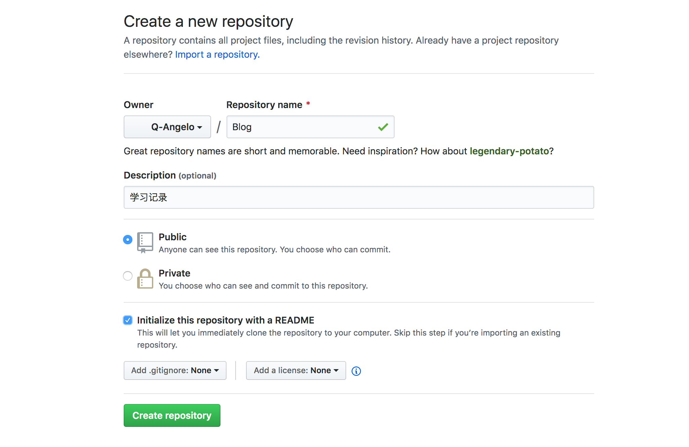
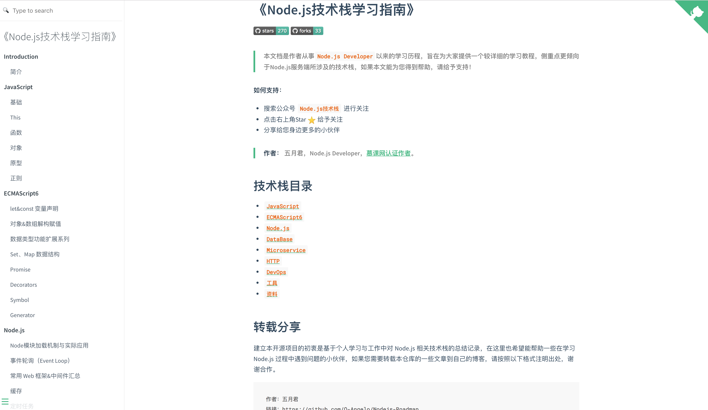
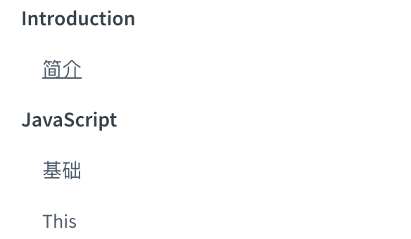
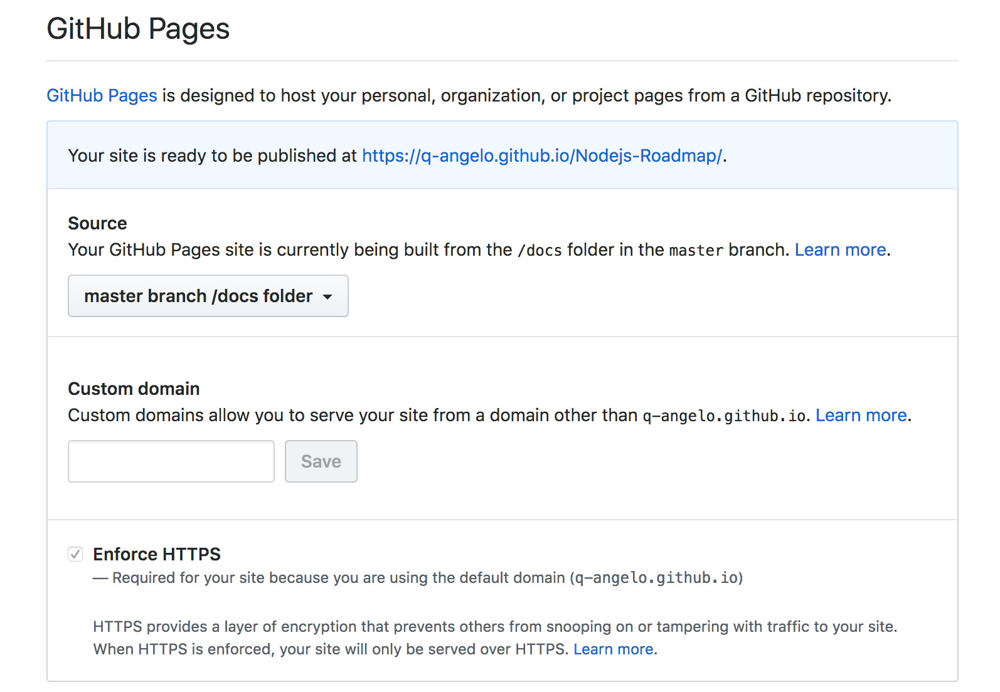

## Docsify 快速搭建个人博客

> 平常写一些文档或者个人笔记时，Markdown 是我的第一个选择，因为它用起来真的很方便、简洁。那么今天要讲的 Docsify 是什么呢？

## 快速导航

- [Docsify简介](#Docsify简介)
- [全局安装](#全局安装)
- [Github 创建你的 Blog 项目](#Github创建你的Blog项目)
- [初始化文档](#初始化文档)
- [启动本地服务预览](#启动本地服务预览)
- [搭建博客](#搭建博客)
- [GithubPages预览](#GithubPages预览)
- [增加评论功能](#增加评论功能)
- [总结](#总结)

## Docsify简介

Docsify 是一个动态生成文档网站的工具。不同于 GitBook、Hexo 的地方是它不会生成将 .md 转成 .html 文件，所有转换工作都是在运行时进行。 

这将非常实用，如果只是需要快速的搭建一个小型的文档网站，或者不想因为生成的一堆 .html 文件“污染” commit 记录，只需要创建一个 index.html 就可以开始写文档而且直接部署在 GitHub Pages。

[docsify 中文文档](https://docsify.js.org/#/zh-cn/)

## 全局安装

安装脚手架工具 docsify-cli，安装过程中较慢的可以切换 npm 源为 [cnpm](/devops/npm-deploy.md)

```
$ npm i docsify-cli -g
```

## Github创建你的Blog项目

如果你正在用 Markdown 写一些 Blog 项目，那么也可以用你现在的项目，如果你没有，那么建议你在 Github 新建一个属于你的 Blog 项目，开始我们接下来的学习



## 初始化文档

注意这里的文件名约定为 docs 也是官方推荐，请按照规则设置，否则发到 Github 可能会出现一些问题

```
$ docsify init docs

Initialization succeeded! Please run docsify serve docs
```

执行完以上命令 docs 文件目录下会生成以下 3 个文件：
* `index.html`：入口文件
* `README.md`：会做为主页内容渲染
* `.nojekyll`：用于阻止 GitHub Pages 会忽略掉下划线开头的文件

## **启动本地服务预览**

docs 同级目录下执行以下命令，打开本地服务器，默认地址为：http://localhost:3000
```
$ docsify serve docs

Serving /Users/may/Nodejs-Roadmap/docs now.
Listening at http://localhost:3000
```

这里我以 [Nodejs-Roadmap](https://github.com/Q-Angelo/Nodejs-Roadmap) 项目做为介绍，以下为最终的效果，你也可以点击 [https://www.nodejs.red/](https://www.nodejs.red/) 在线预览。




## 搭建博客

- **设置封面**

设置我们的封面图，需要两步，首先在 `docs/index.html` 文件中将设置 ```coverpage: true```，之后创建 ```docs/_coverpage.md```文件

docs/index.html

```html
<script>
  window.$docsify = {
    coverpage: true
  }
</script>
<script src="//unpkg.com/docsify"></script>
```

docs/_coverpage.md

```markdown


# Node.js技术栈指南

- 本文档是作者从事 ```Node.js Developer``` 以来的学习历程，旨在为大家提供一个较详细的学习教程，侧重点更倾向于 Node.js 服务端所涉及的技术栈，如果本文能为您得到帮助，请给予支持！

[](https://github.com/Q-Angelo/Nodejs-Roadmap) [](https://github.com/Q-Angelo/Nodejs-Roadmap)

[GitHub](<https://github.com/Q-Angelo/Nodejs-Roadmap>)
[开始阅读](README.md)
```

- **定制导航栏**

官方支持两种方式，可以在 HTML 里设置，但是链接要以 #/ 开头，另外一种通过 Markdown 配置导航，我们这里用的也是后者

首先配置 ```loadNavbar: true```，之后创建 ```docs/_navbar.md```文件.

docs/index.html

```html
<script>
  window.$docsify = {
    loadNavbar: true
  }
</script>
<script src="//unpkg.com/docsify"></script>
```

这里配置并不是很复杂，根据缩进生成对应的目录结构，注意目录的跳转链接是当前 (docs) 目录下的文件

docs/_navbar.md

```markdown
* Introduction
    * [简介](README.md)

* JavaScript
    * [基础](/javascript/base.md)
    * [This](/javascript/this.md)

...
```

以上示例生成效果，如下所示：



关于 docsify 定制化，可以看官方文档讲的也很详细 [docsify 中文版](https://docsify.js.org/#/zh-cn/)，下面开始介绍如何将我们的 blog 项目通过 Github Pages 进行在线预览

## GithubPages预览

将我们搭建的 Blog 托管到 Github，可以实时访问，在项目的 Settings 里开启 GitHub Pages 功能

选择 dcos 文件目录，如下所示：



浏览器输入 https://q-angelo.github.io/Nodejs-Roadmap/ 即可访问，q-angelo 为您的用户名，Nodejs-Roadmap 为您的项目名称。

## 增加评论功能

[Gitalk](https://github.com/gitalk/gitalk) 是一个基于 GitHub Issue 和 Preact 开发的评论插件。

- **gitalkConfig配置**
  * clientID：GitHub Application Client ID
  * clientSecret：GitHub Application Client Secret
  * repo：GitHub repository，例如：Nodejs-Roadmap
  * owner：仓库所有者
  * admin：管理员
  * id：页面唯一id，如果想要每个页面都有一个独立的评论，请保证这个页面id是唯一的

以上 clientID 和 clientSecret 需要在你的 [Github Applications](https://github.com/settings/applications/new) 申请。

修改 ```docs/index.html``` 文件

```html

<link rel="stylesheet" href="//unpkg.com/gitalk/dist/gitalk.css">

<script>
  var gitalkConfig = {
    clientID: 'XXXXXX',
    clientSecret: 'XXXXXXX',
    repo: 'Nodejs-Roadmap',
    owner: 'q-angelo',
    admin: ["q-angelo"],
    distractionFreeMode: false
  };

  window.$docsify = {
    plugins: [
      function (hook, vm) {
        hook.doneEach(function() {
          var label, domObj, main, divEle, gitalk;
          label = vm.route.path.split("/").pop();
          domObj = Docsify.dom;
          main = domObj.getNode("#main");

          Array.apply(
            null,
            document.querySelectorAll("div.gitalk-container")
          ).forEach(function(ele) {
            ele.remove();
          });

          divEle = domObj.create("div");
          divEle.id = "gitalk-container-" + label;
          divEle.className = "gitalk-container";
          divEle.style = "width: " + main.clientWidth + "px; margin: 0 auto 20px;";
          domObj.appendTo(domObj.find(".content"), divEle);
          gitalk = new Gitalk(
            Object.assign(gitalkConfig, { id: !label ? "home" : label })
          );
          gitalk.render("gitalk-container-" + label);
        });
      }
    ]
  }
</script>

<script src="//unpkg.com/docsify/lib/docsify.min.js"></script>
<script src="//unpkg.com/gitalk/dist/gitalk.min.js"></script>
```

## 总结

看完本篇文章，如果你还没有用过 Docsify，希望你能亲自实践下，可以用 Docsify 来建立自己的个人博客，我在写作[《Node.js 技术栈》](https://github.com/Q-Angelo/Nodejs-Roadmap)过程中，当内容多了之后，对于文档的在线预览功能最终也选择了 Docsify，因为它用起来给我的感觉真的很简洁，方便。