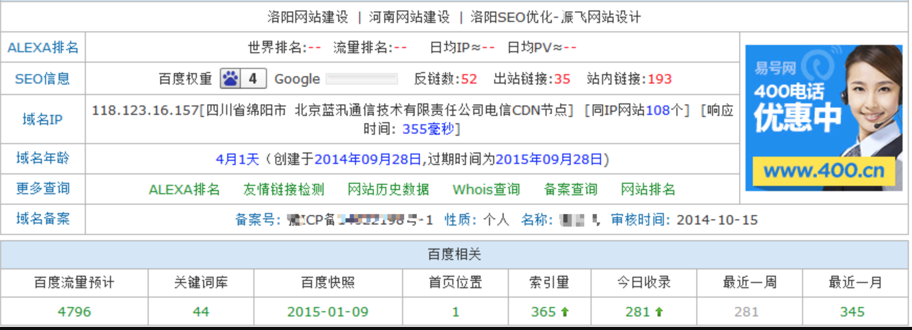

## SEO网站优化title设置与快速排名

#### 快速排名

> 关键字日点击数，网站的外链关系，网站的内容质量，关键字的竞争力，当时百度排名规则的重点侧向等等众多因素影响排名

1. 正常情况日点击关键字的量大于关键字指数效果比较好.(因为点击量只是排名规则的其中一个因素，如果在不清楚自己网站与竞争对手的差距的情况下，只有完全强化某个排名因素才会明显的影响排名，既为什么点击量要大于指数)

2. 如果想快速提升排名，建议把搜索引擎点爆，比如指数100的关键字，每天点击量大于1000，这样效果非常明显，比较适合暴力产品.(大家都知道第一页与第二页的流量是相差很多的，所有竞争力度也相差很多，这就是为什么要点爆才容易上首页一原因)

3. 提高搜索引擎用户体验来提高整站的权重，建议点击大量关键字，包括子页面关键字排名点击，并且配合外链，软文等优化，这样是非常不错的，适合长久发展的网站一般设置正常，需要等待百度对关键字的更新，正常情况百度1-7天会有更新,所以排名需要等待1-7天才能提升.

4. 搜索点击量越大关键字的指数也就越高，当指数提升之后随之网站的权重也会提升！站长工具一般1个月更新百度指数，当站长工具更新后，既可以查到网站的权重提升！如果无法在百度中查看指数，请登入软件--我的点击管理--开通百度指数就可以提升百度权重！

#### 网站title多少字利于优化

> 网页优化可以说是从 Title 开始的。在搜索结果中，每个抓取内容的第一行显示的文字就是该页的Title，同样在浏览器中打开一个页面，地址栏上方显示的也是该页的 Title。因此， Title 可谓一个页面的核心。对 Title 的书写要注意以下问题：

1. title 简短精炼，高度概括，含有关键词，而不是只有一个网站名称。但关键词不宜过多，不要超过 3 个词组。 

2. 前7个字对搜索引擎最重要，因此关键词位置尽量靠前，总字数不超过30 个汉字。 

3. 标题title文字长度多少字节最合适？ 每个搜索引擎是不同的，以下是各搜索引擎收录字节数，注意2个字节等于一个汉字。 更谨慎的说法是，title不要超过25个汉字

    * 百度：60个字节。 

    * 谷歌：66个字节。

    * 搜搜：66个字符。 

    * 雅虎：64个字节。 

    * 微软：46个字节。 

    * 114：45个字符。 

    * 搜狗：56个字符。 

    * 有道：56个字符。

关于网站优化，个人认为遵守一条原则 “内容为王，外链为后”，下面是之前优化过的一个案例:

